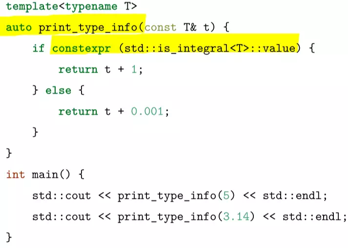
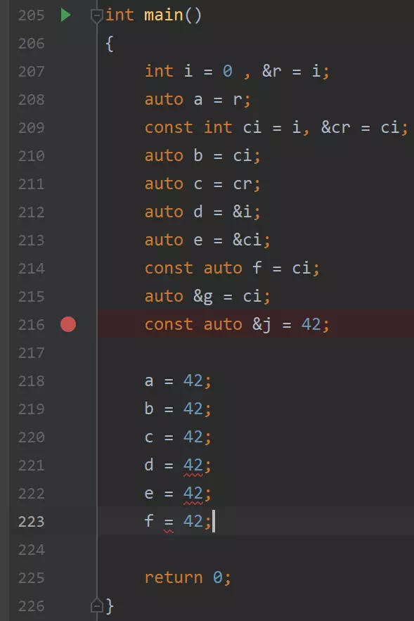
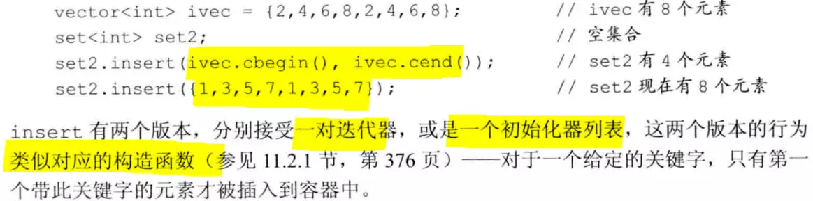
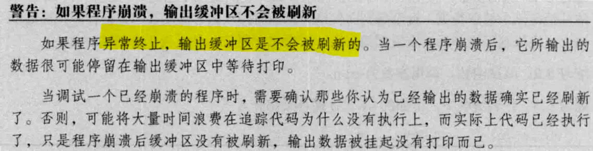
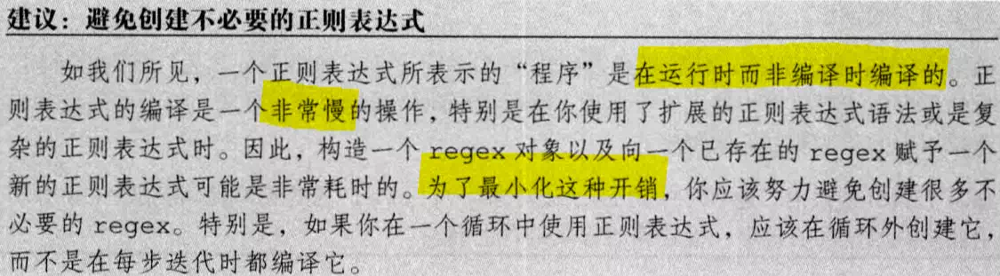
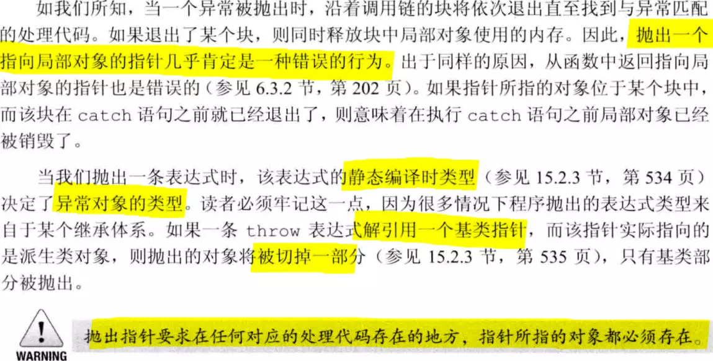
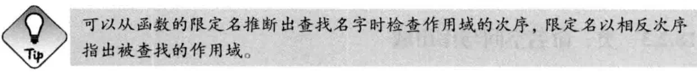

### 写在最前面：

#### 这份笔记包含什么内容

主要是为大创学习准备的，所以这里基本**只包括做大创项目用得到的知识**

鉴于北交个个都是技术高手，请各位 dalao 阅读时**酌情判断内容价值，以免浪费您的时间**

本文写作时间始于 *2021/04/30* ，内容可以看目录，对于~~越来越像高级程序语言的~~ C++ ，请注意本文的**时效**性

感谢西鹏飞、ZX两位神仙队友的指导和答疑，感谢指导的翟高寿老师给我这种菜鸡提供了一个学习的机会

~~因为翟老师把继承讲明白了，所以这笔记里对于 C++ 的继承机制一个字都没提，上别的地方补补吧~~


# Modern Effective C++

链接：[感谢 ZX 整理的静态页面](https://effectivemoderncppebook-pdsjtawv-zx-11.4everland.app/)

推荐先阅读以下内容再观看；

## C++11：使用 deleted 而非使用未定义的私有声明

任何函数都可以加 `deleted` （但只有成员函数可以 `private`；

`deleted` 让编译器报错更聪明；

```c++
template <class charT, class traits = char_traits<charT> >
class basic_ios : public ios_base {
public:
    …

    basic_ios(const basic_ios& ) = delete;
    basic_ios& operator=(const basic_ios&) = delete;
    …
};
```


- 如果函数不抛出异常请使用 `noexcept`
- 尽可能的用 `const_iterator` 而非 `iterator`
- 尽可能的使用 `constexpr` 


# 现代C++教程：高速上手C++11/14/17/20

> 这个部分放在这，是为了**快速查阅**有什么特性、语法糖的，详细学习还请看《C++ primer》
>
> 链接：<https://changkun.de/modern-cpp/> （这里笔记只写了1-6章）

不得不使用C时，应使用 extern "C" 的特性，将C语言代码和C++代码分离编译

```C++
// foo.h
#ifdef __cplusplus
extern "C" {
#endif

int add(int x, int y);

#ifdef __cplusplus
}
#endif

// foo.c
int add(int x, int y) {
    return x+y;
}

// 1.1.cpp
#include "foo.h"
#include <iostream>
#include <functional>

int main() {
    [out = std::ref(std::cout << "Result from C code: " << add(1, 2))](){
        out.get() << ".\n";
    }();
    return 0;
}
```

### C++11：用 `nullptr` 替代NULL

过去的标准将NULL定义成0，会导致C++中重载特性发生混乱，因此C++11引入了nullptr关键字，nullptr的类型是nullptr_t，这一类型可以隐式转换为任何指针、成员指针的类型，也能和那些类型进行相等或不等的比较；

### C++11：`constexpr` 把函数在编译阶段变成常量表达式

```C++
constexpr int fibonacci(const int n) {
    return n == 1 || n == 2 ? 1 : fibonacci(n-1)+fibonacci(n-2);
}
```

#### C++14：开始允许 `constexpr` 函数在内部使用局部变量、循环、分支等简单语句；

```C++
constexpr int fibonacci(const int n) {
    if(n == 1) return 1;
    if(n == 2) return 1;
    return fibonacci(n-1) + fibonacci(n-2);
}
```

### C++17：在 `if`/`switch` 中声明临时变量

```c++
for (std::vector<int>::iterator element = vec.begin(); 
     element != vec.end(); 
     ++element) {
    std::cout << *element << std::endl;
}
```

### C++17：结构化绑定

类似于其他语言中的多返回值；

提供了一种便捷方式可以直接从元组中拿到，并定义元组中的元素；

```C++
#include <iostream>
#include <tuple>

std::tuple<int, double, std::string> f() {
    return std::make_tuple(1, 2.3, "456");
}

int main() {
    auto [x, y, z] = f();
    std::cout << x << ", " << y << ", " << z << std::endl;
    return 0;
}
```

### C++：用 `auto` 推导变量类型

-   不能用于函数传参；

-   不能用于推导数组类型；

-   不能推导出引用信息；

```C++
MagicFoo magicFoo = {1, 2, 3, 4, 5};
std::cout << "magicFoo: ";
for (auto it = magicFoo.vec.begin(); it != magicFoo.vec.end(); ++it) {
    std::cout << *it << ", ";
}
```

### C++：用 `decltype` 推导类型

弥补auto**只能对变量进行类型推导**的缺陷；

类似于 typeof(x)，写法是 decltype(x);

```C++
if (std::is_same<decltype(x), int>::value)
    std::cout << "type x == int" << std::endl;
if (std::is_same<decltype(x), float>::value)
    std::cout << "type x == float" << std::endl;
if (std::is_same<decltype(x), decltype(z)>::value)
    std::cout << "type z == type x" << std::endl;
```

#### C++：用 `std::is_same` 比较两个类型是否相同

#### 注意：typename 和 class

typename 和 class 在模板参数列表中没有区别，在 typename 这个关键字出现之前，都是使用 class
来定义模板参数的。但在模板中定义有嵌套依赖类型的变量时，需要用 typename 消除歧义

### C++11：尾返回类型

利用 `auto` 关键字，将返回类型后置

#### C++14：普通函数也具备返回值推导

（markdown 好像是不能在表格里插代码块吗）

| C++11                                                        | C++14（新）                                                  |
| ------------------------------------------------------------ | ------------------------------------------------------------ |
| // C11 还需要手动 decltype 一下<br/>template<typename T, typename U> <br/>auto add2(T x, U y) -> decltype(x + y) {<br/>	return x+y; <br/>} | // C14 直接 auto 就可以了<br/>// 而且不只有成员函数能推导<br>template<typename T, typename U> <br/>auto add3(T x, U y) {<br/>	return x+y; <br/>} |

### C++14：`decltype(auto)` 推导转发函数或封装的返回类型

重点：decltype(auto) 用于对转发函数或封装的返回类型进行推导；

我们无需显式的指定 decltype 的参数表达式；

```C++
/* C++11中的封装实现 */
std::string look_up_a_string_1() {
    return lookup1();
}
std::string& look_up_a_string_2() {
    return lookup2();
}
/* 有了 decltype(auto)，我们可以让编译器完成烦人的参数转发 */
decltype(auto) look_up_a_string_1() {
    return lookup1();
}
decltype(auto) look_up_a_string_2() {
    return lookup2();
}
```

### C++17：允许在 `if` 前声明 `constexpr` 常量表达式

| | 编译时： |
|-------------------------------------------------|----------------------------------------------------------|

### C++11：基于范围的 `for` 迭代

```C++
if (auto itr = std::find(vec.begin(), vec.end(), 3); itr != vec.end()) 
    *itr = 4;
for (auto element : vec) { // 只读
    std::cout << element << std::endl;
}
for (auto &element : vec) { // 可以写入 element
    element += 1; 
}
```

### C++11：外部模板

显式要求编译器进行模板实例化的时机；


### C++11：类型别名模板 `using` 

由于 `using` 可以避免一些 `typedef` 的问题（不能被模板化），建议全改用 using 

```C++
/* 通常我们使用 typedef 定义别名的语法是：typedef 原名称 新名称;，但是对函数指针等别名的定义语法却不相同，这通常给直接阅读造成了一定程度的困难。*/

typedef int (*process)(void *);
using NewProcess = int(*)(void *);
template<typename T>
using TrueDarkMagic = MagicType<std::vector<T>, std::string>;

int main() {
    TrueDarkMagic<bool> you;
}
```

### C++11：指定模板的默认参数

C++11 中提供了一种便利，可以指定模板的默认参数：

```C++
template<typename T = int, typename U = int>
auto add(T x, U y) -> decltype(x+y) {
    return x+y;
}

// Call add function
auto ret = add(1,3);
```

### C++ 11：允许任意个数、类别的模板参数（变长参数模板）

```C++
template<typename... Ts> class Magic; 	// 任意个参数

template<typename Require, typename... Ts> class Magic;	 // 需要至少有一个参数时
```

### C++ 11：变长参数模板的解包方法

`sizeof...(argsName) `	// 可以计算参数的个数

```C++
template<typename... Ts>
void magic(Ts... args) {
    std::cout << sizeof...(args) << std::endl;
}
/* 可以传递任意个参数给 magic 函数： */

magic(); // 输出0
magic(1); // 输出1
magic(1, ""); // 输出2
```

#### 递归模板函数

```C++
#include <iostream>
template<typename T0>
void printf1(T0 value) {
    std::cout << value << std::endl;
}

template<typename T, typename... Ts>
void printf1(T value, Ts... args) {
    std::cout << value << std::endl;
    printf1(args...);
}

int main() {
    printf1(1, 2, "123", 1.1);
    return 0;
}
```

#### 变参模板展开

```c++
template<typename T0, typename... T>
void printf2(T0 t0, T... t) {
    std::cout << t0 << std::endl;
    if constexpr (sizeof...(t) > 0) 
    	printf2(t...);
}
```

#### 初始化列表展开（用到了 lambda 表达式）

额外使用了 C++11 中提供的`初始化列表`以及 `Lambda 表达式`的特性（下一节中将提到）。

```C++
template<typename T, typename... Ts>
auto printf3(T value, Ts... args) {
    std::cout << value << std::endl;
    (void) std::initializer_list<T>{([&args] {
        std::cout << args << std::endl;
    }(), value)...};
}
```

### C++17：变长参数折叠表达式

```C++
#include <iostream>
template<typename ... T>
auto sum(T ... t) {
    return (t + ...);
}

int main() {
    std::cout << sum(1, 2, 3, 4, 5, 6, 7, 8, 9, 10) << std::endl;
}
```

### C++17：`auto` 可推导模板参数的类型

```C++
template <auto value> void foo() {
    std::cout << value << std::endl;
    return;
}

int main() {
    foo<10>();  // value 被推导为 int 类型
}
```

### C++11：委托构造

使构造函数可以在同一个类中，用一个构造函数调用另一个构造函数；

```C++
class Base {
public:
    int value1;
    int value2;
    Base() {
        value1 = 1;
    }
    Base(int value) : Base() { // 委托 Base() 构造函数
        value2 = value;
    }
};
```

### C++11：继承构造

```C++
class Base {
public:
    int value1;
    int value2;
    Base() {
        value1 = 1;
    }
    Base(int value) : Base() { // 委托 Base() 构造函数
        value2 = value;
    }
};
class Subclass : public Base {
public:
    using Base::Base; // 继承Base类的构造
};
```

### C++11：`override` 和 `final` 关键字

当重载虚函数时，引入override
关键字将显式的告知编译器进行重载，编译器将检查基函数是否存在这样的虚函数，否则将无法通过编译:

```C++
struct Base {
    virtual void foo(int);
};
struct SubClass: Base {
    virtual void foo(int) override; // 合法
    virtual void foo(float) override; // 非法, 父类没有此虚函数
};
```

`final` 则是为了防止类被继续继承以及终止虚函数继续重载引入的。

```C++
struct Base {
    virtual void foo() final;
};
struct SubClass1 final: Base {
}; // 合法

struct SubClass2 : SubClass1 {
}; // 非法, SubClass1 已 final

struct SubClass3: Base {
    void foo(); // 非法, foo 已 final
};
```

### 重载 `<<` 运算符以输出 enum 类型的值

```c++
#include <iostream>
template<typename T>
std::ostream& operator << (typename std::enable _if<std::is_enum<T>::value,
std::ostream>::type& stream)
{
	return stream << static_cast<typename std::underlying_type<T>::type> (e);
}

/* 调用时：*/ 
std::cout << new_enum::value3 << std::endl
```

### C++：Lambda 表达式

基本语法：

```c++
[捕获列表](参数列表) /* 可选：mutable() */ 异常属性 -> 返回类型 {
    // 函数体
}
```

捕获列表有以下几种：

- 空捕获列表
- 值捕获 [name1, name2, ...]：拷贝一份变量，不改变原值
- 引用捕获 [&]：保存的是原值的引用，可以修改
- 隐式捕获 [=]：**捕获列表写一个=或者&**，让编译器自己推导；

#### C++14：表达式捕获

C++14 允许捕获的成员用任意的表达式进行初始化，这就允许了右值的捕获；

被声明的捕获变量类型会根据表达式进行判断，判断方式与使用 auto 本质上是相同的；

```C++
#include <iostream>
#include <utility>

int main() {
    auto important = std::make_unique<int>(1);
    auto add = [v1 = 1, v2 = std::move(important)](int x, int y) -> int {
        return x+y+v1+(*v2);
    };
    std::cout << add(3,4) << std::endl;
    return 0;
}
```

#### C++14：用 `auto` 关键字产生泛型 Lambda

```C++
auto add = [](auto x, auto y) {
    return x+y;
};

add(1, 2);
add(1.1, 2.2);
```

### C++11：可调用类型 `std::function`

`std::function` 是一种通用、多态的函数封装，它的实例可以对任何可以调用的目标实体进行存储、复制和调用操作，它也是对C+＋中现有的可调用实体的一种类型安全的包裹，相当于函数的容器。

有函数的容器之后，能够更加方便的将函数、函数指针作为对象进行处理。


```C++
#include <functional>
#include <iostream>

int foo(int para) {
    return para;
}

int main() {
    // std::function 包装了一个返回值为 int, 参数为 int 的函数
    std::function<int(int)> func = foo;

    int important = 10;
    std::function<int(int)> func2 = [&](int value) -> int {
        return 1+value+important;
    };
    std::cout << func(10) << std::endl;
    std::cout << func2(10) << std::endl;
}
```

### C++11：`std::bind` 和 `std::placeholder`

std::bind 用于绑定函数调用的参数；


### C++11：左值、右值、纯右值、将亡值


-   右值引用让临时的将亡值可以延续生存周期

-   可以用 `std::move` 将左值无条件的转换为右值的临时对象

```C++
#include <iostream>
#include <string>

void reference(std::string& str) {
    std::cout << "左值" << std::endl;
}
void reference(std::string&& str) {
    std::cout << "右值" << std::endl;
}

int main()
{
    std::string lv1 = "string,"; 	 	// lv1 是一个左值
    // std::string&& r1 = lv1;			// 非法, 右值引用不能引用左值
    std::string&& rv1 = std::move(lv1); // 合法, std::move可以将左值转移为右值
    std::cout << rv1 << std::endl; 		// string,

    const std::string& lv2 = lv1 + lv1; // 合法, 常量左值引用能够延长临时变量的生命周期
    // lv2 += "Test"; 					// 非法, 常量引用无法被修改
    std::cout << lv2 << std::endl; 		// string,string

    std::string&& rv2 = lv1 + lv2; 		// 合法, 右值引用延长临时对象生命周期
    rv2 += "Test"; 						// 合法, 非常量引用能够修改临时变量
    std::cout << rv2 << std::endl; 		// string,string,string,Test

    reference(rv2);						// 输出左值

    return 0;
}
```

### 用 `std::move` 减少不必要的拷贝

```C++
int main() {
	std::string str = "Hello world.";
	std::vector<std::string> v;

    // 将使用 push_back(const T&), 即产生拷贝行为
    v.push_back(str);
    // 将输出 "str: Hello world."
    std::cout << "str: " << str << std::endl;

    // 将使用 push_back(const T&&), 不会出现拷贝行为
    // 而整个字符串会被移动到 vector 中，所以有时候 std::move 会用来减少拷贝出现的开销
    // 这步操作后, str 中的值会变为空
    v.push_back(std::move(str));
    // 将输出 "str: "
    std::cout << "str: " << str << std::endl;

    return 0;
}
```

### C++11：引用坍缩规则

当且仅当实参类型为右引用，模板参数才能被推导为右引用类型；

结论：只有 std::forward 不造成任何多余拷贝，还能完美转发函数实参 auto &&的坍缩组合是完美转发

| 函数形参类型 | 实参参数类型 | 推导后函数形参类型 |
| :----------- | :----------- | :----------------- |
| T&           | 左引用       | T&                 |
| T&           | 右引用       | T&                 |
| T&&          | 左引用       | T&                 |
| T&&          | 右引用       | T&&                |

### `std::forward_list` 单向链表容器


```C++
#include <iostream>
#include <utility>
void reference(int& v) {
    std::cout << "左值引用" << std::endl;
}
void reference(int&& v) {
    std::cout << "右值引用" << std::endl;
}
template <typename T>
void pass(T&& v) {
    std::cout << "              普通传参: ";
    reference(v);
    std::cout << "       std::move 传参: ";
    reference(std::move(v));
    std::cout << "    std::forward 传参: ";
    reference(std::forward<T>(v));
    std::cout << "static_cast<T&&> 传参: ";
    reference(static_cast<T&&>(v));
}
int main() {
    std::cout << "传递右值:" << std::endl;
    pass(1);

    std::cout << "传递左值:" << std::endl;
    int v = 1;
    pass(v);

    return 0;
}
```

输出结果为：

```
传递右值:
              普通传参: 左值引用
       std::move 传参: 右值引用
    std::forward 传参: 右值引用
static_cast<T&&> 传参: 右值引用
传递左值:
              普通传参: 左值引用
       std::move 传参: 右值引用
    std::forward 传参: 左值引用
static_cast<T&&> 传参: 左值引用
```

### C++11：无序容器

基本和它们的有序版本用法类似，在不需要关心元素顺序时，能明显提升性能；

-   unordered_map

-   unordered_set

-   unordered_multimap

-   unordered_multiset

### C++11：`tuple`

1.  `pair` 只能放两个元素，元组用 `tuple` 保存

2.  `std::make_tuple` 可以构造元组

3.  `std::get` 获得元组某个位置的值

4.  `std::tie` 对元组拆包（操作如下）

```C++
#include <tuple>
#include <iostream>

auto get_student(int id) {
    // 返回类型被推断为 std::tuple<double, char, std::string>
    if (id == 0)
        return std::make_tuple(3.8, 'A', "张三");
    if (id == 1)
        return std::make_tuple(2.9, 'C', "李四");
    if (id == 2)
        return std::make_tuple(1.7, 'D', "王五");
    return std::make_tuple(0.0, 'D', "null");
    // 如果只写 0 会出现推断错误, 编译失败
}

int main() {
    auto student = get_student(0);
    std::cout << "ID: 0, "
    << "GPA: " << std::get<0>(student) << ", "
    << "成绩: " << std::get<1>(student) << ", "
    << "姓名: " << std::get<2>(student) << '\n';

    double gpa;
    char grade;
    std::string name;

    // 元组进行拆包
    std::tie(gpa, grade, name) = get_student(1);
    std::cout << "ID: 1, "
    << "GPA: " << gpa << ", "
    << "成绩: " << grade << ", "
    << "姓名: " << name << '\n';
}
```

### C++11：合并和遍历 `tuple`

常见的需求就是合并两个元组，这可以通过 `std::tuple_cat` 来实现：

```C++
auto new_tuple = std::tuple_cat(get_student(1), std::move(t));
```

马上就能够发现，应该如何快速遍历一个元组？但是我们刚才介绍了如何在运行期通过非常数索引一个 `tuple` 那么遍历就变得简单了， 首先我们需要知道一个元组的长度，可以：

```C++
template <typename T>
auto tuple_len(T &tpl) {
    return std::tuple_size<T>::value;
}
```

这样就能够对元组进行迭代了：

```C++
// 迭代
for(int i = 0; i != tuple_len(new_tuple); ++i)
    // 运行期索引
    std::cout << tuple_index(new_tuple, i) << std::endl;
```

### C++14：`std::get<T> t` 加使用类型获取元组中的对象

此处的 std::get\<T\> 必须依赖编译期就存在的常量；

```C++
std::tuple<std::string, double, double, int> t("123", 4.5, 6.7, 8);
std::cout << std::get<std::string>(t) << std::endl;
std::cout << std::get<double>(t) << std::endl; 
// 非法, 引发编译期错误
std::cout << std::get<3>(t) << std::endl;
```

### C++17：给 `std::variant<>` 提供类型模板参数

使用 std::variant<>，提供给 variant<> 的类型模板参数，可以让一个 variant<> 容纳**提供的几种类型**的变量

（相当于其他语言的动态类型）：

```C++
#include <variant>
template <size_t n, typename... T>
constexpr std::variant<T...> _tuple_index(const std::tuple<T...>& tpl, size_t i) {
    if constexpr (n >= sizeof...(T))
        throw std::out_of_range("越界.");
    if (i == n)
        return std::variant<T...>{ std::in_place_index<n>, std::get<n>(tpl) };
    return _tuple_index<(n < sizeof...(T)-1 ? n+1 : 0)>(tpl, i);
}
template <typename... T>
constexpr std::variant<T...> tuple_index(const std::tuple<T...>& tpl, size_t i) {
    return _tuple_index<0>(tpl, i);
}
template <typename T0, typename ... Ts>
std::ostream & operator<< (std::ostream & s, std::variant<T0, Ts...> const & v) { 
    std::visit([&](auto && x){ s << x;}, v); 
    return s;
}
```

```C++
int i = 1;
std::cout << tuple_index(t, i) << std::endl;
```

### C++11：智能指针和内存管理

#### `std::shared_ptr`：记录引用计数的智能指针

记得用make_shared\<T\> ();初始化；


#### `std::weak_ptr`，不会引起引用数增加的弱引用指针

用途就是它有 expired 方法检测 shared_ptr 是否存在；


#### （推荐）std::unique_ptr，独占的智能指针

C++14 才有 `make_unique<T>` 函数; （就是他们委员会忘了写，没啥深意）

虽然 C++11 没有提供 `std::make_unique`，但可以自行实现：

```C++
template<typename T, typename ...Args>
std::unique_ptr<T> make_unique( Args&& ...args ) {
	return std::unique_ptr<T>(new T( std::forward<Args>(args)... ));
}
```


# 《C++ primer》打卡笔记

> 这个直接搜书名，要盗版 PDF 资源的可以私下联系博客作者（老海盗党了）

## 2.4.4 constexpr和常量表达式

常量表达式在编译阶段就能得到运算结果

### C++11：constexpr类型

constexpr指针只能指向nullptr、0、或储存在固定地址的对象

>  

#### 顶层const：指针本身是常量

#### 底层const：指针所指对象是常量

## 2.5 处理类型

### C++11：别名声明


### C++11：auto类型

使编译器通过初始值自动推算变量类型，例如auto i = val1+val2;

分析习题：d是int \*类型的，e是const int \*类型的，f已经是const了不能再修改

注意：auto无法推导出const和引用；



#### 待补充的引用折叠：auto &&i

就一种万能的引用方式，剩下的都交给编译器处理了；


### C++11：`decltype` 类型


和引用一起使用的时候，注意括号


## 3.2、3.3 标准库类型 string 和 vector

### C++：一些初始化写法


### C：cctype头文件中的函数


### C++11：size_type 是无符号整型，避免和int混用


### 注意 C++ 引用 C 的头文件格式


### C++：初始化 vector 对象


### C++：vector适合动态添加元素


### C++：养成使用迭代器和 != （而不是\<）判断循环的习惯


理由是：只有部分的标准库类型有下标运算符，大多数类型没有定义\<运算符

**但所有标准库容器都定义过==和!=，**养成这一编程习惯可以提高对类型的适应。


### C++11：返回const_iterator类型的cbegin()和cend()函数

string 和 vector 类型都有，比起 begin() 和
end()，相同之处是都能指示第一个和最后一个元素，不同之处是返回值为 const_iterator
类型，无法修改其中元素。

## 4.11.3 显式转换

### C++：何时发生隐式转换


### C++：强制类型转换


这是用于代替C中强制类型转换的的(type)
expr的，还是要尽量避免强制类型转换。

- #### static_cast


适合把较大的算数类型赋值给较小的，不在乎其精度损失

- #### dynamic_cast


适合在有继承关系的类之间，从父类对象到子类对象的转换

- #### const_cast


适合需要改变表达式的常量属性的情况

- #### reinterpret_cast


适合指针/引用类型转换

## 5.6 try语句块和异常处理


三部分：throw表达式，try语句块，catch子句

需要一套异常类用于传递异常的具体信息。


### C++：标准库定义的标准异常


## 6.2.6 含有可变形参的函数

### C++11：initializer_list 形参


适合用于异常处理中，可以方便的逐个输出错误信息


### C++ ：省略符形参，访问一些特殊的 C 代码

此处特殊的C代码指使用了varargs的C标准库功能

~~我也不知道这是啥~~


## 6.5.2 内联函数和 constexpr 函数

内联函数：在编译时展开，能减少函数运行开销

constexpr函数的返回值可以不是常量，但返回值的常量与否需要和它的实参保持一致。

内联函数和constexpr函数通常都定义在头文件中。

### C++11：constexpr函数


constexpr函数最大的特性：调用该函数的语句，会在编译阶段就被替换成这个函数返回结果的常量。


## 7.5 构造函数再探

如果成员是const、引用类型、或者无默认构造函数的类类型，必须通过构造函数初始值列表才能为该对象赋初值。

### 注意：成员初始化的顺序


### C++11：委托构造函数

即，使用同一所属类下的其他构造函数执行自己的初始化过程。

无论如何，类必须包含一个默认构造函数，即使有其他形式的构造函数。


### 关键字 explicit：抑制构造函数定义的隐式转换


### 聚合类：显式初始化类的对象

### 字面值常量类：类的对象可以是字面常量


### C++11：constexpr 构造函数

constexpr构造函数必须初始化所有数据成员、初始值、或者使用一个constexpr构造函数、或者是一条常量表达式。


## 9 顺序容器

### STL顺序容器类型表和选择原则


占主导地位（访问/插入删除）的操作是什么，决定了容器类型的选择。

如果实在不确定用什么：只使用迭代器，不使用下标，避免随机访问，必要时在vector和list中选择。


### 标准库容器操作


### C++：标准库默认使用左闭合范围[begin, end)的好处


反向迭代器和类型别名：

反向迭代器++指上一个元素。


### C++：assign成员允许从相容的类型赋值

除array之外，顺序容器都有assign成员；


### C++11：emplace操作

三个新成员：emplace_front, emplace, emplace_back

调用emplace成员函数时，参数将被传递给元素类型的构造函数（而不是拷贝）。

要求是传参必须和构造函数的形参能匹配上。


### C++：resize改变容器大小

注意：进行任何容器操作前，一定提前想象迭代器、指针、引用失效的可能结果。

一种比较好的做法是每次改变容器后，都要重新定位迭代器。

使用失效的迭代器、指针、和引用都是严重的错误！


一个实际操作例子：


### C++：string和数值转换函数


### C++：顺序容器适配器

容器适配器：接受一种已有的容器类型，使其行为看起来像一种不同的类型；

适配器不能构造在array上；

例如：stack适配器可以接受一个顺序容器，并带来stack的操作


## 10.2 初识泛型算法

### C++标准库：只读算法

常用的有find，count等


### C++标准库：写容器元素算法


注意：算法并不检查写操作的安全性。

### C++标准库：传参规律

涉及到两个序列的算法，构成这两个序列的元素可以来自于不同的容器（比如vector和list），元素也可以不严格匹配，只要能够比较就行；

一些算法接受三个迭代器，它们用两个迭代器表示第一个序列的首位（左闭右开），再用第三个迭代器表示第二个序列的首元素；另一些算法接受四个迭代器，分别表示两个序列的首位。

### C++：一种插入迭代器back_inserter

最大的特点是能保证有足够空间容纳数据。


### C++：copy算法


### C++：replace算法


### C++标准库：重排容器元素的算法

操作实例：P396/864有一个删除重复单词的例子


## 10.3 定制操作

### C++：向算法传递谓词函数（以sort的比较函数为例）


### C++：stable_sort排序函数

使用stable_sort算法可以保持相等元素的原有顺序，可以配合自己定义的比较函数实现更多效果。

### C++：find_if算法查找第一个具有特定大小的元素


### C++11：lambda表达式


-   lambda表达式的类型是std::function，函数指针也可转化为std::function；

-   （自己编写时，int (\*)(double,double) 建议写成
    std::function\<int(double,double)\>）

-   lambda表达式是可调用对象，因此可代替一些简单函数，比如用作std::sort(std::begin(a),
    std::end(a), [](int a, int b) { return a \> b; });的比较函数；

   

-   lambda表达式的方括号内是捕获列表，不捕获就无法使用该变量，被捕获的变量只要不是const类型就可以被lambda表达式修改；

-   采用值俘获和引用俘获皆可，但应当尽可能的简单。


### C++11：lambda的隐式捕获

还可以让编译器根据lambda捕获列表里的**&**和**=**推断


### C++11：lambda尾置返回类型


### C++：for_each算法和lambda应用一例


### C++：placeholders名字


更建议的写法：


### C++11：标准库bind函数

1.  bind返回的是一个可调用对象

2.  bind调用一个可调用对象，并把自己后面的参数列表传入给该对象


### 标准库bind函数应用举例


## 11 关联容器

主要的是map和set

### C++：map容器

一种关联数组，其中元素是一些关键字-值（key-value）对，关键字是索引，值是数据；

定义时需要同时指定关键字类型和值类型；


### C++：set容器

一种元素的集合，其中元素是一个关键字，支持高效查询；

定义时只需要指定关键字类型；


### 应用举例：定义严格弱序的小于等于关键字


### C++标准库：pair类型

1.  定义在头文件utility中；

2.  保存两个数据成员，定义一个pair时，需要提供两个类型名；

3.  区别于其他标准库容器，pair的数据成员是public权限的；

4.  两个成员叫first和second；


### 关联容器的迭代器

set容器的迭代器，无论是iterator和const_iterator都是const的；

因此，通常不对关联容器使用泛型算法，首先大多数写入函数不可用，其次find算法对于泛型容器还没有他们本身的方法快；


### set容器：用insert成员插入元素



### insert操作表：


### C++11：map容器要创建pair元素再插入


### 关联容器：用erase删除元素


### 关联容器：查找元素的操作表


#### 11.3.6有一个使用关联容器转换文本的实例（P417/864）

### C++11：无序关联容器

unordered_map 和 unordered_set 都**没有比较运算**符，通常使用哈希函数和==运算符

## 8.1 IO库

### IO库类型和头文件

-   w开头的是为了支持宽字符语言的宽字符版本（p304/864）

-   由于这些类型都继承自标准库流，ifstream 和 istringstream
    都继承自istream，所以可以像使用istream一样使用它们，标准库流特性基本都可以应用于普通流、文件流、string流，char和宽字符版本

-   IO对象不能拷贝或赋值


### IO库条件状态表、状态恢复

用于访问和操作流的状态，控制修正错误；


### 刷新输出缓冲区

| endl            | 换行，并刷新缓冲区                            |
|-----------------|-----------------------------------------------|
| flush           | 刷新缓冲区，不输出任何额外的字符              |
| ends            | 输出一个空字符，并刷新缓冲区                  |
| unitbuf操作符   | 使此后所有输出操作后都会立即刷新缓冲区        |
| nounitbuf操作符 | 结束之前的unitbuf操作符设置，回到默认缓冲方式 |

##### 建议：在程序异常终止时清空一次缓冲区



### 流的关联


## 8.2 文件输入输出

文件名既可以是string，也可以是C风格字符串的指针；


### fstream可以代替iostream&


##### 养成检查open的习惯


### 文件模式表

| 附加的模式参数 | 功能                         |
| -------------- | ---------------------------- |
| in             | 以读模式打开                 |
| out            | 以写模式打开，默认清空文件   |
| app            | 每次写操作前均定位到文件末尾 |
| ate            | 打开文件后定位到文件末尾     |
| trunc          | 显式清空文件                 |
| binary         | 以二进制方式输入输出         |

### 文件模式的限制


## 12.1 动态内存和智能指针

### 建议在所有不需要引用计数的时候使用 unique_ptr

原因：

> 实际在90%的场景下都应当使用 `unique_ptr` 而不是 `shared_ptr` ，因为 `unique_ptr` 相比裸指针没有额外开销，但 `shared_ptr` 由于记录引用计数是有额外开销的 —— ZX

### C++11：智能指针


### C++11：shared_ptr


### C++11：返回shared_ptr指针的make_shared函数

-   make_shared 函数保存在头文件 memory 中；

-   shared_ptr 的引用计数：自动记录有多少个其他 shared_ptr 指向了相同的对象；


### C++11：shared_ptr 的自动销毁

shared_ptr 指针析构时，同时会释放相关联的内存


### 为什么要使用动态内存

1.  不知道自己需要使用多少对象（如容器）

2.  不知道所需对象的准确类型

3.  需要在多个对象直接共享数据

### 直接管理内存


### C++：可传额外参数的定位new


### 使用智能指针的好处

避免了：忘记delete，使用已经释放的对象，同一内存释放两次

### shared_ptr和new结合使用的格式


#### 智能指针注意事项：

1.  **不可以混用**普通指针和智能指针

2.  不使用相同的内置指针值初始化多个智能指针

3.  不能使用 get 初始化另一个智能指针，或用 get 为智能指针赋值

4.  不 delete get() 返回的指针

5.  如果智能指针管理的资源不是 new 分配的，记得传递给它一个删除器


### C++11：weak_ptr


## 13 拷贝控制


#### 小结


### 拷贝构造函数


### 拷贝初始化在什么时候发生

1.  用 `= `定义变量

2.  将一个对象作为实参，传递给一个非引用类型的形参

3.  从一个返回类型为非引用类型的函数返回一个对象

4.  用花括号列表初始化一个数组中的元素、或一个聚合类中的成员

### 拷贝赋值运算符


### 析构函数


### =default显式要求编译器生成函数


### =delete显示要求编译器删除成员

析构函数不能=delete，编译器将阻止不能被销毁的对象被创建


### 定义像值/像指针的类


### 引用计数详解


### 交换操作


### P486/864有一个Message类的应用实例

### C++11：右值移动


#### 右值引用指向将要被销毁的对象


#### 变量表达式都是左值，右值引用不能绑定到右值引用类型变量上


### C++11：标准库move函数

可以获得绑定到左值上的右值引用


### 移动构造函数

移动构造函数的第一个参数是该类类型的一个右值引用


### 移动、标准库容器、和异常的关系

-   写法是StrVec(StrVec &&) noexcept;

-   当一个类同时有拷贝构造函数和移动构造函数时，右值用移动，左值用拷贝

-   当一个类只有拷贝构造函数时，右值也使用拷贝，而且这一替代是安全的


### C++11：移动迭代器


### 右值引用版本的成员函数


### C++11：引用限定符


#### 引用限定符也可以区分重载版本


## 16.2 模板实参推断

### C++11：将模板类型参数声明为友元


### C++11：为类模板定义类型别名


### C++：显式提示编译器一个名字表示类型


### C++11：尾置返回类型


### C++11：标准类型转换模板


### C++：函数指针和模板实参


#### 显式模板实参：


### C++：模板实参推断和引用


### C++11：引用折叠


#### 万能引用：可以给T &&类型的参数传递左值或右值


#### 标准库定义的std::move

##### std::move如何定义


##### std::move如何工作


### C++11：允许用static_cast显式把左值转换为右值引用


### 将一个函数的实参转发给其他函数


#### 用引用折叠保持左值、右值属性


### C++11：用std::forward保持类型信息

- `std::move`执行到右值的无条件的转换，但就自身而言，它不移动任何东西；
- `std::forward`只有当它的参数被绑定到一个右值时，才将参数转换为右值；
- `std::move`和`std::forward`在运行期什么也不做；


## 17.1 tuple类型

### C++11：tuple类型的特点

-   是类似pair的模板，但可以有任意数量成员；

-   tuple类型必须直接初始化；

   

-   所有成员都是public的；

-   将多个不同类型成员捆绑成单一对象，比较快速、随意的一种结构；

-   使用 get\<i\>(item) 访问item的第i个成员；

-   tuple拥有 \<运算符和 =运算符；


#### tuple操作表


## 17.3 正则表达式

> 更好用的参考材料是：[正则表达式 – 语法 \| 菜鸟教程(runoob.com)](https://www.runoob.com/regexp/regexp-syntax.html)

### 小结

1.  正则表达式库提供了一组类和函数，

2.  ``regex``类管理用某种正则表达式语言编写的正则表达式。

3.  匹配类保存了某个特定匹配的相关信息。这些类被函数 `regex_search` 和 `regex_match` 所用。

4.  `regex_search` 和 `regex_match` 这两个函数接受一个 `regex` 对象和一个字符序列，检查 `regex` 中的正则表达式是否匹配给定的字符序列。

5.  `regex` 迭代器类型是迭代器适配器，它们使用 `regex_search` 遍历输入序列，返回每个匹配的子序列。

6.  regex_replace 函数允许我们用指定内容替换输入序列中与正则表达式匹配的部分。

### C++11：RE库

-   定义在头文件 `regex` 中；
-   `regex` 类表示一个正则表达式；
-   `regex` 使用的正则表达式语言是 ECMAScript；

#### 正则表达式库组件表


### 匹配函数的参数和返回值

`regex_match` 和 `regex_search` 函数确定一个给定的字符序列和给定的 `regex` 是否匹配，

若整个字符序列匹配，则 `regex_match` 函数返回true；

若有子串匹配，则 `regex_search` 函数返回true；


### 几个使用范例：正则表达式库


1. 后接 `?` 的组件是可选的；
2.  `\{d}{n}` 表示一个 n 个数字的序列；
3.  `[-. ]` 表示匹配这些字符中任意一个`.` `-` ` 这是空格`均可；
4. `$` 符号后跟子表达式的索引号；


#### `regex` 选项表


### 正则表达式语言中的转义字符


### RE库的异常处理

#### 注意：正则表达式在运行时才编译




### 正则表达式错误类型表


### RE库类型必须与输入序列类型匹配


### Regex迭代器sregex_iterator


### sregex_iterator使用示例


#### match操作表


#### 子匹配操作表


### regex_replace查找替换一个正则表达式

#### 匹配标志表


## 18.1 异常处理

异常处理机制的主要作用是，将问题的检测和解决过程分离，检测过程无需知道问题处理模块的细节；


### 抛出异常后的栈展开流程


若调用链上的语句块出现异常，而提前终止，则这一部分语句块的局部对象将被销毁（通过执行析构函数）；但其他释放资源的代码可能被跳过；




### 捕获异常的流程

#### 异常声明


注意：如果catch接受的异常与继承有关，则最好将该catch的参数定义为引用类型

#### 越专门的catch应该越靠前

派生类异常处理应该在基类前；

异常类型和catch的异常声明类型应当匹配（规则如图）


### throw; 重新抛出

一条catch语句可以通过重新抛出将异常传递给另外一个catch语句

### catch(...) 捕获所有异常 

如果catch(...)与其他几个catch语句一起出现，则 catch(.. .)必须在最后的位置。出现在捕获所有异常语句后面的catch语句将永远不会被匹配。

### C++11：noexcept说明和noexcept运算符


-   特别的，函数指针及该指针所指的函数必须具有一致的异常说明；

-   如果一个虚函数承诺了它不会抛出异常，则后续派生出来的虚函数也必须做出同样的承诺；

-   如果基类的虚函数允许抛出异常，则派生类的对应函数既可以允许抛出异常，也可以不允许抛出异常；

### 异常类的层次图

>  

#### 使用自己定义的异常类

## 18.2 命名空间

目的是避免名字之间相互冲突（命名空间污染）

```c++
namespace barbarbar {
	class foo { /\*...\*/ }
} // 不需要分号
```

-   位于命名空间内的代码，可以被该命名空间内的其他成员直接访问；

-   位于命名空间外的代码必须指出所用的名字属于哪个命名空间；

-   命名空间可以不连续（新开了一段namespace，可以是对之前同名命名空间的补充）


### 嵌套命名空间


### C++11：内联命名空间

关键词inline必须出现在命名空间第一次定义的地方，此后可写可不写；


#### 未命名的命名空间


#### 命名空间的别名


### using声明

-   一条using声明语句一次只引入命名空间的一个成员；

-   using namespace 指示和 using 声明的共同之处：可以用命名空间的简写形式；

-   不同之处：using namespace 指示使得某个特定命名空间里所有名字都将可见；


#### 避免使用 using namespace std


#### std::move和std::forward函数必须带限定语


### 命名空间内部名字的查找规则

由内向外，依次查找每个外层作用域，直到最外层的命名空间查找过程终止；

一个未声明的类或函数，第一次出现在友元声明中，会被认为是最近的外层命名空间的成员；

如果存在多个using
namespace指示，则来自每个命名空间的名字都会成为候选函数集的一部分；



## 19.3 枚举类型

不限定作用域的枚举类型：enum color {red, yellow, green};

### C++11：限定作用域的枚举类型

定义：

```C++
enum class open_modes {mode1, mode2, mode3};
/* 或者 */
enum struct open_modes {mode1, mode2, mode3};
```

#### 枚举类型的使用例子

默认枚举值从0开始，也可自己指定；

若不显式指定值，则枚举值为上一个枚举成员的值+1；

枚举成员是 const，所以必须用常量表达式赋初值；

可以将 enum 作为 switch 语句的表达式；


### C++11：指定enum大小


### C++11：提前声明enum


# (翻译) 学习正则表达式的简单方法

> 原文：<https://github.com/cdoco/learn--zh>

### 基本匹配


### 元字符

| 元字符 | 描述                                                                                     |
|--------|------------------------------------------------------------------------------------------|
| .      | 匹配除换行符以外的任意字符。                                                             |
| [ ]    | 字符类，匹配方括号中包含的任意字符。                                                     |
| [\^ ]  | 否定字符类。匹配方括号中不包含的任意字符                                                 |
| \*     | 匹配前面的子表达式零次或多次                                                             |
| +      | 匹配前面的子表达式一次或多次                                                             |
| ?      | 匹配前面的子表达式零次或一次，或指明一个非贪婪限定符。                                   |
| {n,m}  | 花括号，匹配前面字符至少 n 次，但是不超过 m 次。                                         |
| (xyz)  | 字符组，按照确切的顺序匹配字符 xyz。                                                     |
| \|     | 分支结构，匹配符号之前的字符或后面的字符。                                               |
| \\     | 转义符，它可以还原元字符原来的含义，允许你匹配保留字符  [ ] ( ) { } . \* + ? \^ \$ \\ \| |
| \^     | 匹配行的开始                                                                             |
| \$     | 匹配行的结束                                                                             |

#### 英文句号：任意单个字符


#### [字符集](https://github.com/cdoco/learn-`regex`-zh#22-%E5%AD%97%E7%AC%A6%E9%9B%86)：匹配集合中任意字符


#### [否定字符集](https://github.com/cdoco/learn-`regex`-zh#221-%E5%90%A6%E5%AE%9A%E5%AD%97%E7%AC%A6%E9%9B%86)：匹配除了字符集之外的任意字符


#### 重复

元字符 +, \* , ? 用于指定子模式可以出现多少次；

##### 星号：表示匹配上一个匹配规则零次或多次


##### [加号](https://github.com/cdoco/learn-`regex`-zh#232-%E5%8A%A0%E5%8F%B7)：表示匹配上一个字符一次或多次


##### 问号：表示匹配上一个字符一次或零次


##### 花括号：指定可以重复的次数


##### 字符组：一组写在圆括号内用垂直条分隔的子模式


#### 分支结构

##### 垂直条：用来定义分支结构


#### 反斜杠：转义特殊字符

注意：在**写代码时需要两个斜杠 \\\\\^** ，第一个斜杠转义下一个斜杠；


#### 定位符

##### 插入符号：检查匹配字符是否是输入字符串的第一个字符


##### 美元符号：检查匹配字符是否是输入字符串的最后一个字符


### 简写字符集

| 简写 | 描述                                   |
|------|----------------------------------------|
| .    | 匹配除换行符以外的任意字符             |
| \\w  | 匹配所有字母和数字的字符：[a-zA-Z0-9_] |
| \\W  | 匹配非字母和数字的字符：[\^\\w]        |
| \\d  | 匹配数字：[0-9]                        |
| \\D  | 匹配非数字：[\^\\d]                    |
| \\s  | 匹配空格符：[\\t\\n\\f\\r\\p{Z}]       |
| \\S  | 匹配非空格符：[\^\\s]                  |

### 断言


#### 正向先行断言


#### 负向先行断言


#### 正向后行断言


#### 负向后行断言


### 标记

| 标记 | 描述                                       |
|------|--------------------------------------------|
| i    | 不区分大小写：将匹配设置为不区分大小写。   |
| g    | 全局搜索：搜索整个输入字符串中的所有匹配。 |
| m    | 多行匹配：会匹配输入字符串每一行。         |

#### i修饰符：不区分大小写


#### g修饰符：全局搜索


#### m修饰符：多行匹配


### 常用正则表达式示例

```java
正整数：
^\d+$
    
负整数：
^-\d+$
    
电话号码：
^+?[\d\s]{3,}$
    
电话代码：
^+?[\d\s]+(?[\d\s]{10,}$
           
整数：
^-?\d+$
           
用户名：
^[\w\d_.]{4,16}$
           
字母数字字符：
^[a-zA-Z0-9]*$
           
带空格的字母数字字符：
^[a-zA-Z0-9 ]*$
           
密码：
^(?=^.{6,}$)((?=.*[A-Za-z0-9])(?=.*[A-Z])(?=.*[a-z]))^.*$
           
电子邮件：
^([a-zA-Z0-9._%-]+@[a-zA-Z0-9.-]+\.[a-zA-Z]{2,4})*$
           
IPv4 地址：
^((?:(?:25[0-5]|2[0-4][0-9]|[01]?[0-9][0-9]?)\.){3}(?:25[0-5]|2[0-4][0-9]|[01]?[0-9][0-9]?))*$
           
小写字母：
^([a-z])*$
           
大写字母：
^([A-Z])*$
           
网址：
^(((http|https|ftp):\/\/)?([[a-zA-Z0-9]\-\.])+(\.)([[a-zA-Z0-9]]){2,4}([[a-zA-Z0-9]\/+=%&_\.~?\-]*))*$
           
VISA 信用卡号码：
^(4[0-9]{12}(?:[0-9]{3})?)*$
           
日期（MM/DD/YYYY）：
^(0?[1-9]|1[012])[- /.](0?[1-9]|[12][0-9]|3[01])[- /.](19|20)?[0-9]{2}$
           
日期（YYYY/MM/DD）：
^(19|20)?[0-9]{2}[- /.](0?[1-9]|1[012])[- /.](0?[1-9]|[12][0-9]|3[01])$
           
万事达信用卡号码：
^(5[1-5][0-9]{14})*$    
```

## C++ 中的模块概述及其导入导出

> 链接：<https://docs.microsoft.com/zh-cn/cpp/cpp/import-export-module> 
>
> 这个部分我学的也不熟练，建议直接看原文，这里就是放了点截图……

### 使用C++20该功能的准备工作

/experimental： module[ - ] 为标准模板库命名模块启用实验编译器支持

/std:c++latest：启用当前最新的编译器和标准库功能

VS中的设置方法如下图

### 将C++标准库用作模块

告别头文件只需要这么一行：


### 自己实现模块

```c++
/* Foo.ixx的内容： */

export module Foo; 
// 指示此文件是模块的主要接口Foo

#define ANSWER 42 // 不可见

namespace Bar
{
   int f_internal() {
        return ANSWER;
      }

   export int f() { // 可见
      return f_internal();
   }
}

```

```C++
/* myprogram.exe的内容： */

import Foo;
// 导入声明访问由导出的名称 Foo
import std.core;

using namespace std;

int main()
{
   cout << "The result of f() is " << Bar::f() << endl; // 42
   // int i = Bar::f_internal(); // C2039
   // int j = ANSWER; //C2065
}

```

### 实现模块的注意事项

可以使用单个接口文件（拓展名 .ixx ）创建一个模块，该文件导出名称并包含所有函数和类型的实现

实现可以放在一个或多个单独的实现文件中，这与使用 .h 和 .cpp 文件的方式类似

export 关键字仅用于接口文件中

模块的实现文件可以导入其他模块，但不能导入 export 任何名称

实现文件的名称可以有任何扩展名。
返回的接口文件和实现文件集被视为一种特殊类型的翻译单元，称为 "模块单位"

在任何实现文件中声明的名称，将自动显示在同一模块单元中的所有其他文件中

模块中命名空间的规则与任何其他代码中的规则相同


## C++17：filesystem库（文件系统库）

> 摘自cppreference: [filesystem库](https://zh.cppreference.com/w/cpp/filesystem) 但这里中文翻译的不太好，用啥就现查啥吧

在头文件filesystem中，命名空间为std::filesystem

### 包含的类表

| 类名                             | 功能                                                         |
| -------------------------------- | ------------------------------------------------------------ |
| **path**                         | 表示一个路径（常用类）                                       |
| **filesystem_error**             | 文件系统错误时抛出的异常(类)                                 |
| **directory_entry**              | 文件目录（常用类）                                           |
| **directory_iterator**           | 获取文件系统目录中文件的迭代器容器，其元素为 directory_entry对象（用于遍历目录，常用类） |
| **recursive_directory_iterator** | 指向目录及其子目录的内容的迭代器(类)                         |
| **file_status**                  | 表示文件类型及权限(用于获取和修改文件（或目录）的属性，常用类) |
| **space_info**                   | 关于文件系统上自由及可用空间的信息(类)                       |
| **file_type**                    | 文件的类型(枚举)                                             |
| **perms**                        | 标识文件系统权限(枚举)                                       |
| **copy_options**                 | 指定复制操作的语义(枚举)                                     |
| **directory_options**            | 用于迭代目录内容的选项(枚举)                                 |
| **file_time_type**               | 表示文件时间值(typedef)                                      |

### 非成员函数表

（成员函数在上面那张表的类名页面找）

| 函数名                                      | 功能                                                         |
| ------------------------------------------- | ------------------------------------------------------------ |
| **absolute/system_complete**                | 组成一个绝对路径；转换路径为绝对路径，复现 OS 特定的行为(函数) |
| **canonical**                               | 组成一个规范路径(函数)                                       |
| **copy**                                    | 复制文件或目录(函数)                                         |
| **copy_file**                               | 复制文件内容(函数)                                           |
| **copy_symlink**                            | 复制一个符号链接(函数)                                       |
| **create_directory/create_directories**     | 创建新目录(函数)                                             |
| **create_hard_link**                        | 创建一个硬链接(函数)                                         |
| **create_symlink/create_directory_symlink** | 创建一个符号链接(函数)                                       |
| **current_path**                            | 返回当前工作目录(函数)                                       |
| **exists**                                  | 检查路径是否指代既存的文件系统对象(函数)                     |
| **equivalent**                              | 检查两个路径是否指代同一文件系统对象(函数)                   |
| **file_size**                               | 返回文件的大小(函数)                                         |
| **hard_link_count**                         | 返回指代特定文件的硬链接数(函数)                             |
| **last_write_time**                         | 获取或设置最近一次数据修改的时间(函数)                       |
| **permissions**                             | 修改文件访问权限(函数)                                       |
| **read_symlink**                            | 获得符号链接的目标(函数)                                     |
| **remove/remove_all**                       | 移除一个文件或空目录；移除一个文件或递归地移除一个目录与其全部内容(函数) |
| **rename**                                  | 移动或重命名一个文件或目录(函数)                             |
| **resize_file**                             | 以截断或填充零更改一个常规文件的大小 (函数)                  |
| **space**                                   | 确定文件系统上的可用空闲空间 (函数)                          |
| **status/symlink_status**                   | 确定文件属性；确定文件属性，检查符号链接目标(函数)           |
| **temp_directory_path**                     | 返回一个适用于临时文件的目录                                 |

### 使用方式

```C++
#include <iostream>
#include<filesystem>
using namespace std;
using namespace std::filesystem;
int main(){
	path str("C:\\Windows");
	if (!exists(str)) //必须先检测目录是否存在才能使用文件入口.
		return 1;
	directory_entry entry(str);		//文件入口
	if (entry.status().type() == file_type::directory)	//C++11的强枚举类型
		cout << "该路径是一个目录" << endl;
	directory_iterator list(str);	        //文件入口容器
	for (auto& it:list) 
		cout << it.path().filename()<< endl;	
//通过文件入口（it）获取path对象，再得到path对象的文件名并输出
	system("pause");
	return 0;
}

```

