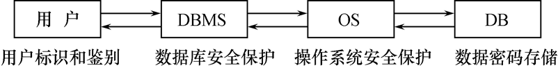

# 数据库系统原理笔记（已转型为 SQL 常用语句）


写在最前面：

- 基本是课件内容，还包括各种网络教程转载，整理自用；
- 若出现报错 `ERROR 1064` ，请首先注意关键字的字母 **拼写问题**；
- SQL 的关键字 **默认不区分大小写**；
- 还是老一套免责声明：我太菜了，没法保证内容不出错，欢迎各位神仙大佬拍砖；


## 数据定义语言（DDL）

| 操作对象 | 创建            | 删除          | 修改           |
| -------- | --------------- | ------------- | -------------- |
| 模式     | `CREATE SCHEMA` | `DROP SCHEMA` | SQL 标准不提供 |
| 表       | `CREATE TABLE`  | `DROP TABLE`  | `ALTER TABLE`  |
| 视图     | `CREATE VIEW`   | `DROP VIEW`   | SQL 标准不提供 |
| 索引     | `CREATE INDEX`  | `DROP INDEX`  | `ALTER INDEX`  |


### 模式（数据库）的定义和删除

在 MySQL 中，**SCHEMA 和 DATABASE 是等价的**；

其他产品中 SCHEMA 一般是被 DATABASE 包含；

#### 创建模式 `CREATE SCHEMA <模式名> AUTHORIZATION <用户名>` 

例：

```sql
CREATE SCHEMA "S-T" AUTHORIZATION WANG;	-- 授权给用户 WANG 
```

- 只有具有数据库管理员权限的用户才能创建模式
- 若不指定模式名，模式名隐含为用户名
- 定义模式是定义了一个命名空间
- 允许在定义模式的子句中创建基本表、视图、定义授权
  `CREATE SCHEMA <模式名> AUTHORIZATION  <用户名> [<表定义>|<视图定义>|<授权定义>]` 
  就是 <用户名> 后先不接分号，而是表定义、视图定义的语句；


可后接库选项：

```sql
CREATE DATABASE 
IF NOT EXISTS 数据库名 	-- 如果数据库不存在则创建，存在则不创建
DEFAULT CHARSET utf8 COLLATE utf8_general_ci;	-- 设定编码集为utf8
```


#### 删除模式 `DROP SCHEMA <模式名> <CASCADE|RESTRICT>`  

例：

```sql
DROP SCHEMA ZAHNG RESTRICT 
```

- CASCADE 和 RESTRICT 必选其一：
  - CASCADE（级联）表示删除模式时把该模式中所有数据库对象也全部删除；
  - RESTRICT（限制）表示如果该模式下已有数据库对象，则拒绝该删除语句的执行；


#### 查看所有的数据库 `SHOW DATABASES` 

注意查询这里的 `DATABASES` 是复数形式，SQL 关键字加不加 s 的规律和英语的自然语法一样：

```sql
SHOW DATABASES;
```


#### 通配符

```sql
SHOW DATABASES LIKE "pattern";
```

- `_` 表示匹配任意单个字符
- `%` 表示匹配多个字符，使用示例如下：

```sql
mysql> SHOW DATABASES;
+--------------------+
| Database           |
+--------------------+
| information_schema |
| mysql              |
| performance_schema |
| sakila             |
| sys                |
+--------------------+
5 rows in set (0.00 sec)

mysql> SHOW DATABASES LIKE "%schema%";
+---------------------+
| Database (%schema%) |
+---------------------+
| information_schema  |
| performance_schema  |
+---------------------+
2 rows in set (0.00 sec)

Select sname From s Where sno like ‘_1%’;  # 查询学号第二位是1的同学
```


### 基本表的定义、删除与修改

#### 创建基本表 `CREATE TABLE` 

基本格式：

```sql
CREATE TABLE <表名> (
    <列名><数据类型> [列级完整性约束条件], 
    <列名><数据类型> [列级完整性约束条件], 
    <列名><数据类型> [列级完整性约束条件], 
    ...
    [表级完整性约束条件]
); 
```

例：

```sql
CREATE TABLE Course (
    Cno CHAR(4) PRIMARY KEY, 	-- 列级完整性约束条件：Cno 是主码
    Cname CHAR(40) NOT NULL, 	-- 列级完整性约束条件：Cname 不能为空
    Cpno CHAR(4), 
    Ccredit SMALLINT, 
    FOREIGN KEY (Cpno) REFERENCES Course(Cno) 	-- 表级完整性约束条件：Cpno是外码，它参照表是自身
);
```

- 建立数据库的 **模式**
- 完整性约束条件被存在数据字典中
- 涉及多个属性列的完整性约束条件 **必须定义在表级**
- 保留字不能用作表名、列名
- 参照表和被参照表可以是同一个表
- 常用的完整性约束：
  - 主码约束 `PRIMARY KEY` 
  - 唯一性约束 `UNIQUE` 
  - 非空值约束 `NOT NULL` 
  - 参照完整性约束 `FOREIGN KEY REFERENCES` 
  - 检查子句 `CHECK` 
    - 例：`CHECK ((grade IS NULL) OR (grade BETWEEN 0 AND 100))` 


#### 定义基本表所属模式的三种方法

每一个基本表都属于某一个模式，一个模式包含多个基本表；

- 方法一：在表名中显式给出模式名 
- 方法二：在创建模式语句中同时创建表 
- 方法三：设置所属的模式 


#### SQL 通用数据类型表 

| 数据类型                                    | 描述                                                         |
| ------------------------------------------- | ------------------------------------------------------------ |
| CHARACTER(n)                                | 固定长度 n 的字符/字符串，                                   |
| **VARCHAR(n)** 或 <br/>CHARACTER VARYING(n) | 最大长度 n 的字符/字符串，可变长度                           |
| BINARY(n)                                   | 固定长度 n 的二进制串                                        |
| **BOOLEAN**                                 | 存储 TRUE 或 FALSE 值                                        |
| VARBINARY(n) 或 <br/>BINARY VARYING(n)      | 最大长度 n 的二进制串，可变长度                              |
| INTEGER(p)                                  | 精度 p 的整数值（没有小数点）                                |
| **SMALLINT**                                | 精度 5 的整数值（没有小数点）                                |
| **INTEGER**                                 | 精度 10 的整数值（没有小数点）                               |
| BIGINT                                      | 精度 19 的整数值（没有小数点）                               |
| DECIMAL(p,s)                                | 精度 p，小数点后位数 s 的精确数值<br>例如：decimal(5,2) 是一个小数点前有 3 位数，小数点后有 2 位数的数字 |
| NUMERIC(p,s)                                | 精度 p，小数点后位数 s 的精确数值（与 DECIMAL 相同）         |
| FLOAT(p)                                    | 尾数精度 p ，近似数值<br/>采用以 10 为基数的指数计数法的浮点数<br/>该类型的 size 参数由一个指定最小精度的单一数字组成 |
| REAL                                        | 尾数精度 7 的近似数值                                        |
| FLOAT                                       | 尾数精度 16 的近似数值                                       |
| DOUBLE PRECISION                            | 尾数精度 16 的近似数值                                       |
| DATE                                        | 日期类型，存储 **年、月、日** 的值，格式 `YYYY-MM-DD`        |
| TIME                                        | 时间类型，存储 **小时、分、秒** 的值，格式 `HH:MM:SS`        |
| TIMESTAMP                                   | 时间戳类型，存储 **年、月、日、小时、分、秒** 的值           |
| INTERVAL                                    | 时间间隔类型，由一些整数字段组成，代表一段时间，取决于区间的类型 |
| ARRAY                                       | 固定长度的有序集合                                           |
| MULTISET                                    | 可变长度的无序集合                                           |
| XML                                         | 存储 XML 数据                                                |


#### 删除基本表 `DROP TABLE <CASCADE|RESTRICT>` 

CASCADE 和 RESTRICT 必选其一：

- CASCADE（级联）表示删除该表时把相关的依赖对象（例如视图）同时删除；
- RESTRICT（限制）表示如果还有视图、触发器、存储过程、函数依赖该表时，则拒绝删除操作；

 

#### 修改基本表 `ALTER TABLE` 

基本格式：

```sql
ALTER TABLE <表名>
    [ADD [COLUMN] <新列名><数据类型> [完整性约束]]
    [ADD <新表级完整性约束>]
    [DROP [COLUMN] <要删除的列名> [CASCADE|RESTRICT]]
    [DROP CONSTRAINT <要删除的完整性约束名> [RESTRICT|CASCADE]]
    [ALTER COLUMN <要修改的列名><数据类型>];
```

例：
```sql
ALTER TABLE course ADD UNIQUE(course_name)
```


### 索引的建立、删除

#### 建立索引  `CREATE [UNIQUE] [CLUSTER] INDEX <索引名> ON <表名>(<列名>[<次序>], ... ); `

一般采用 B+ 树索引和 HASH 索引；

例：

```sql
CREATE UNIQUE INDEX SCno ON SC(Sno ASC, Cno DESC)
```

- 索引是关系数据库的内部实现，属于内模式
- 索引由数据库管理员或表的创建者按需建立，能加快数据库查询速度
  - 但索引需要占用存储空间，会降低数据库增加、修改数据的速度
  - 索引需要随着基本表更新而维护
  - 实际应用上，小表一般不需要建索引
- 有些 DBMS 会自动为 PRIMARY KEY 和 UNIQUE 创建索引
- 索引类型二选一：
  - UNIQUE 是唯一索引，要求**该列的值在表中不重复**
  - CLUSTER 是聚簇索引，**索引项的顺序与表中记录的物理顺序一致**
- 次序升降二选一：
  - ASC 为升序排序，是默认设置
  - DESC 为降序排序


#### 删除索引 `DROP INDEX <索引名>`

例：

```sql
DROP INDEX SC_INDDEX
```

*   删除索引时，系统会同时从数据字典中删除有关该索引的描述
*   索引建立后由系统维护，不需用户干预


> #### 补充知识：SQL Server 中的聚簇索引
>
> 数据结构的本质上是一个每个叶子结点都是数据的平衡树；
>
> - 聚集索引对于那些经常要搜索范围值的列特别有效。使用聚集索引找到包含第一个值的行后，便可以确保包含后续索引值的行在物理相邻。 
> - 如果对从表中检索的数据进行排序时经常要用到某一列，则可以将该表在该列上聚集（物理排序），避免每次查询该列时都进行排序，从而节省成本。 
>   - 在最经常查询的列上建立聚簇索引以提高查询效率 
>   - 一个基本表上最多只能建立一个聚簇索引 
>   - 经常更新的列不宜建立聚簇索引 


## 数据查询

### 查询语句的基本结构：`SELECT - FROM - WHERE`

完整语法结构：

```sql
SELECT 
[DISTINCT] -- 可选：用 DISTINCT 取消重复的值
<列表达式1, 列表达式2, ...>  -- 选择表中若干列
FROM <表名或视图名1, 更多表名或视图名 ... > -- 查询范围
[WHERE 条件表达式] -- 条件子句
[GROUP BY 列名1] -- 分组子句
[HAVING 组条件表达式] -- 组条件子句
[ORDER BY 列名2[ASC|DESC]..] -- 排序子句
```


#### 选择表中若干列 `SELECT` 

例：

```sql
select * from student；-- 查看学生全部信息
select sno, sname, 2021-age as year_of_birth from student;  -- 查询学生学号、姓名和出生年份(给新属性起名)
```


#### 选择表中若干元组 `WHERE` 

例：

```sql
select distinct sno from sc;  -- 查询有选修课程的学生学号，学号要去重
select sname,sno from student where age>18 and sex='F'；  -- 查询所有年龄大于 18 岁的女生的姓名和学号
```


### WHERE 语句的常用谓词表

选择往往不是唯一的；

|查询条件|谓词|
|------------|------------------------------------------------------------|
|比较|=、>、<、>=、<=、<>、!=、!>、!<|
|确定范围|BETWEENAND、NOTBETWEENAND|
|确定集合|IN、NOTIN|
|字符匹配|LIKE、NOTLIKE|
|空值|ISNULL、ISNOTNULL|
|多重条件|AND、OR、NOT|


#### 谓词 `LIKE` , `NOTLIKE` 

格式：`<列名> like/not like "字符串"`    　其中 **列必须为字符串**

例：

```sql
select sno,sname from student where sname like "赵%"    -- 查找姓赵的同学
select sname from s where sno like "_1%";   -- 查询学号第二位是1的同学
select cno from courses where cname like "DB\-DE" escape '\'    -- 查询课程名为“DB_DE”的课程号，escape 用了换码字符，这里的 '_' 不再是通配符
```


#### 谓词 `NULL` , `NOTNULL` 

格式： `where sno is NULL/not NULL` 

例：

```sql
select sno from sc where grade is null； -- 查询选修了课程但没参加考试的学生的学号
select sno,cno from sc where grade is not null;    -- 查询所有有成绩的学生学号和课程号
```


#### 谓词 `BETWEEN` , `NOTBETWEENAND`

- 格式：`<属性名> between b and  c  `
  - 等价于（属性名 >= b  AND  属性名 <= c)
- `<属性名> not between b and  c`
  - 等价于（属性名 > c  OR  属性名 < b)

例：

```sql
select sno,sname from student where age not between 17 and 18;   -- 查询所有年龄不在17到18岁之间的学生的学号和姓名
```


#### 谓词 `IN` , `NOTIN` 

用来查找属性值属于指定集合的元组

格式：`<元素> [not] in <结果集>`

```sql
sno in('95001','95002','95003')
select sno from sc where cno in ('1', '2');
```


### 对查询结果排序 `ORDER BY`  

例：

```sql
-- 查询学生学号、姓名和出生年份,并按出生年份的升序排列，出生年份相同时，按学号的降序排列
select sno,sname,2020-age as year_of_birth from S 
order by year_of_birth,sno desc
```

注意：含有空值的时候，若按升序排列，含空值的元组将最后显示；若按降序排列，含空值的元组将最先显示。           


### 集合函数

#### `count([distinct]<列名>)`

统计一列中值的个数,不计算空值

例：查看 table3 表中数据条数

```sql
select count(*) from table3;
```


#### `count([distinct] *)`

计算元组的个数，不管列值是否为空

- 在 count 函数中，默认不跳过空值，Distinct 可选，表示计算时要取消指定列中的重复值；
- 在其他几个函数中，都默认跳过空值，而只处理非空值


#### `sum([distinct]<列名>)`

计算一列的总和(此列必须是数值型) 


#### `avg([distinct]<列名>)`

计算一列的平均值(此列必须是数值型)


#### `max([distinct]<列名>)`

求一列值中的最大值 


#### `min([distinct]<列名>)`

求一列值中的最小值

例：求男同学的总人数和平均年龄

```sql
select count(*), avg(age) from student where sex='M' 
```


### 对查询结果分组

#### `GROUP BY` 子句

将查询结果按某一列或多列值分组，值相等的为一组。

分组的目的是细化集合函数的作用对象，如果未分组，集合函数作用于整个查询结果；分组后作用于每一组，即每一组有一个函数值；

例：求每个同学的平均分

```sql
select sno, avg(grade) from SC group by sno；
```


#### `HAVING` 子句

分组后还要求按一定条件对这些组进行选择，最终只输出满足条件的组；

例：查询选修课程在三门以上的同学学号

```sql
select sno from sc group by sno having count(cno)>3
```


#### 区分 `WHERE` 和 `HAVING` 子句

注意：若使用分组子句 `GROUP BY`，则查询结果列表中的每个列，要么是 **分组依据的列**，要么是 **集合函数**；

- `WHERE` 子句作用于 **基本表或视图**，从中选择满足条件的元组
  - `GROUP BY` 对 `WHERE` 的结果进行 **分组**
    - `HAVING` 子句作用于组，从中选择满足条件的组，即 **对分组数据进一步筛选**


### 多表查询（连接查询）

SQL **没有自然连接**，只有等值连接；

- 连接查询：同时涉及多个表的查询
- 连接条件或连接谓词：用来连接两个表的条件
- 一般格式：
  - `[<表名1>.]<列名1>  <比较运算符>  [<表名2>.]<列名2>`
  - `[<表名1>.]<列名1> BETWEEN [<表名2>.]<列名2> AND [<表名2>.]<列名3>`
- 连接字段：连接谓词中的列名称
- 连接条件中的各连接字段类型必须是可比的，但名字不必是相同的


#### 连接操作执行过程

- 嵌套循环法(NESTED-LOOP)
- 排序合并法(SORT-MERGE)
- 索引连接(INDEX-JOIN)


#### 连接的两种语法

- ANSI SQL-89 语法：`SELECT  Student.*，SC.* FROM Student，SC WHERE  Student.Sno = SC.Sno；`
- ANSI SQL-92 语法：`SELECT  Student.*，SC.* FROM Student JOIN SC ON Student.Sno = SC.Sno；`


#### 等值与非等值连接查询 

- 连接运算符 `=` 

例：查询每个学生及其选修课程的情况

```sql
SELECT  Student.*, SC.* FROM Student, SC WHERE  Student.Sno = SC.Sno;
```

例：查询选修 c2 或 c4 课程的学生学号和姓名

```sql
select s.sno,sname from s，sc where s.sno=sc.sno and (cno='c2' or cno='c4');
```

例：查询平均分90以上的女生

```sql
select sno,sname from s,sc  where s.sno=sc.sno and sex='女' group by sno,sname having avg(grade)>90;

-- 嵌套查询的版本：
select sname from s where sno in
    (select sno from s,sc where s.sno=sc.sno and sex='女' group by sno having avg(grade)>90); 
```


#### 自身连接

- 同一个表的不同元组之间的连接称为自身连接；
- 必须给表取别名，当作两个不同的表来处理；

例：查询每一门课的间接先修课（即先修课的先修课）

```sql
SELECT  FIRST.Cno,SECOND.Cpno  
FROM   Course FIRST,Course SECOND  
WHERE  FIRST.Cpno = SECOND.Cno; 
```

例：查询选修课程名为DB的学生学号和姓名

```sql
select s.sno,sname  from  s,sc,c  where  s.sno=sc.sno  and sc.cno=c.cno  and c.cname='DB'; 
```


#### 外连接

- 外连接与普通连接的区别
  - 普通连接操作只输出满足连接条件的元组
  - 外连接操作以指定表为连接主体，将主体表中不满足连接条件的元组一并输出
- 左外连接
  - 列出左边关系中所有的元组，右边关系中未有匹配的列用 NULL 作为占位符
- 右外连接
  - 列出右边关系中所有的元组，左边关系中未有匹配的列用 NULL 作为占位符
- 全外连接
  - 列出两边关系中所有的元组，未有匹配的列用 NULL 作为占位符

例：

```sql
SELECT Student.Sno,Sname,Ssex,Sage,Sdept,Cno,Grade
FROM  Student  LEFT OUTER JOIN SC ON (Student.Sno=SC.Sno); 
```

SQL 92 语法：在外连接中，可以在表名之间使用关键字 `LEFT OUTER JOIN` , `RIGHT OUTER JOIN` , `FULL OUTER JOIN` , `LEFT` 关键字表示左边表的行是保留的， `RIGHT` 关键字表示右边表的行是保留的， `FULL` 关键字表示左右两边表的行都是保留的


### 嵌套查询（子查询）

- 一个 `SELECT-FROM-WHERE` 语句称为一个查询块，将一个查询块嵌套在另一个查询块的 `WHERE` 子句的条件中的查询称为嵌套查询；
- 子查询可分成 **不相关子查询**（子查询的查询条件不依赖于父查询，子查询可以独立执行）和 **相关子查询**（子查询的查询条件依赖于外层父查询的某个属性值）；
- 不相关子查询一般用 `IN` ，相关子查询一般用 `EXISTS` 


例：查询选修c2课程的学生姓名

```sql
Select sname from s where sno in (select sno from sc where cno='C2');
```

例：查询有一门课程成绩等于95分的学生的学号和姓名（采用不相关子查询）

```sql
select sno,sname  from s  where sno in (select sno from sc where grade = 95);
```

例：查询有一门课程成绩等于95分的学生学号和姓名（采用相关子查询）

- 执行过程：首先取外层查询中表 s 的第1个元组，根据它与内层查询相关的属性值 sno 处理内层查询，若查询结果非空，则 WHERE 子句返回真，则取此元组放入结果表中，然后取外层查询中表的下一个元组，重复上述过程，直到外层查询中表全部检索完为止

```sql
select sno,sname from s where exists 
(select * from sc where s.sno=sc.sno and grade=95); 
```


#### `IN` 谓词

当子查询的结果是一个集合时，常用带 `IN` 谓词的子查询
<元素> in <子查询的结果集>


#### 比较运算符

当用户能确切知道内层子查询返回的是单值时，可以用比较运算符代替 `IN` 


#### `ANY` , `ALL` 谓词

- any ：<表达式> <比较运算符> any <子查询结果集> 
  - 表示子查询结果集的某个值
- all： <表达式> <比较运算符>　all <子查询结果集>
  - 表示子查询结果集的所有值
- 需要配合使用比较运算符

| 符号          | 功能                                         |
| ------------- | -------------------------------------------- |
| ANY           | 大于子查询结果中的某个值                     |
| ALL           | 大于子查询结果中的所有值                     |
| < ANY         | 小于子查询结果中的某个值                     |
| < ALL         | 小于子查询结果中的所有值                     |
| = ANY         | 大于等于子查询结果中的某个值                 |
| = ALL         | 大于等于子查询结果中的所有值                 |
| <= ANY        | 小于等于子查询结果中的某个值                 |
| <= ALL        | 小于等于子查询结果中的所有值                 |
| = ANY         | 等于子查询结果中的某个值                     |
| =ALL          | 等于子查询结果中的所有值（通常没有实际意义） |
| !=（或<>）ANY | 不等于子查询结果中的某个值                   |
| !=（或<>）ALL | 不等于子查询结果中的任何一个值               |


例：查询男同学中比某一女生年龄小的学生姓名和年龄

```sql
-- 用 any:
select sname,age  from s 
where sex='男' and 
      age< any(select age 
               from s 
               where sex='女');

-- 用 all:
select sname,age  from s 
where sex='男' and 
      age<(select max(age) 
           from s 
           where sex='女');
```


#### `EXISTS` , `NOT EXISTS` 谓词

- EXISTS代表存在量词；
- 带有EXISTS谓词的子查询不返回任何数据，只产生逻辑真值“true”或逻辑假值“false”；
- 若子查询结果为非空，则父查询的 WHERE 子句返回真值，否则，返回假值。


例：查询选修c2课程的学生学号和姓名

```sql
select sno,sname from s
where exists                         
    (select * from sc
     where s.sno=sc.sno
     and cno='c2');
```


例：查询**没**选修c2课程的学生学号和姓名

```sql
select sno,sname     
from s
where not exists                         
    (select * from sc
     where s.sno=sc.sno 
     and cno='c2');
```


SQL语言中没有提供全称量词，但可以把 **带有全称量词的谓词** 转换成等价的 **带有存在量词的谓词**。


例：检索选修全部课程的学生姓名（相当于查询这样的学生，没有一门课是他不选的）

```sql
select sname from s
where not exists
   (select * from c
       where not exists
       (select * from sc
            where s.sno=sc.sno and sc.cno=c.cno))；
```


说明：

- SQL语言中表名的顺序，条件顺序无关，SQL是非过程化语言
- 查询条件包括：连接条件+选择条件
- 不相关子查询不一定能转化为多表的连接查询，而连接查询一定能用不相关子查询实现


### 集合查询

- SELECT 语句的查询结果是元组的集合，可以将多个SELECT语句的结果进行集合操作
- 集合操作主要包括 `UNION`（并）、`INTERSECT`（交）、`MINUS` / `EXCEPT`（差）
- 注意：参加集合操作的各个结果表的列数必须相同，对应项的数据类型也必须相同


例：查询选修课程1或选修课程2的学生

（`UNION` 首先需要扫描两遍，其次还需要排序去重，效率较低，**不建议使用**）

```sql
(select sno from sc where cno='1')
union 
(select sno from sc Where cno='2');
```


### 基于派生表的查询

子查询不仅可以出现在Where子句中，还可以出现在From子句中，这时子查询生成的临时派生表成为主查询的查询对象

例：找出每个学生超过他选修课程平均成绩的课程号。

```sql
SELECT Sno,Cno
FROM SC x
WHERE Grade >=(SELECT AVG(Grade) FROM SC y WHERE y.Sno=x.Sno);
```


## 数据更新

### 数据插入

#### `VALUES` 子句

语法：insert into <基本表名>[(列名表)] values (元组值);

例：

```sql
insert into s(sno,sname,age) values ('s1', '李涛',19)
```

例：把不及格的学生的学号、姓名、课程号和成绩存入另一个已知基本表 NoPass(sno ,sname ,cno,grade) 中

```sql
insert into NoPass
select s.sno,sname,cno,grade
from s,sc 
where s.sno =sc.sno and grade <60;
```


### 数据删除

- 格式：DELETE FROM 基本表名 [WHERE 条件表达式];

- DELETE语句只能从一个基本表中删除满足WHERE子句中的条件的元组，即其后只能有一个基本表名；
- DELETE只删表中的数据，表的定义仍然在数据字典中；


例：在sc表中删除‘操作系统’课程成绩低于该课的平均成绩的所有元组。

```sql
DELETE FROM SC WHERE CNO=
   (SELECT CNO 
    FROM C
    WHERE CNAME='操作系统') 
AND GRADE<
   (SELECT 
    AVG(GRADE)
    FROM SC,C
    WHERE SC.CNO=C.CNO AND CNAME='操作系统')
```


### 数据修改

语法:
**UPDATE 基本表名**
**SET 列名=新值表达式**
**[,列名=新值表达式...]**
**[WHERE 条件表达式];** 

update 语句只能修改一个基本表中满足 where 条件的元组的某些列值，即其后只能有一个基本表名。

例：将c2课程的非空成绩提高10%。

```sql
UPDATE SC
SET GRADE=GRADE*(1+10%)
WHERE CNO='C2' AND GRADE IS NOT NULL
```


## 空值处理

空值出现的情况：

- 属性应该有值，但目前不知道具体的值
- 属性不应该有值，如缺考学生的成绩
- 由于某种原因不便填写，如一个人的电话号码不想让人知道


具有 `NOT NULL` 约束条件，`UNIQUE` 约束条件，`PRIMARY KEY` 约束条件中任一条件的属性是不能取空值的

查询时，只有使 `WHERE` 和 `HAVING` 子句中的选择条件为TRUE的元组才输出


算术运算：只要存在操作数为空值的情况，计算结果就是空值

比较运算：只要存在操作数为空值的情况，比较结果就是UNKNOWN

逻辑运算：三值逻辑 (TRUE, FALSE, UNKNOWN)


### 逻辑运算真值表

|X|Y|NOT X|X AND Y|X OR Y|
|----------|-------------|-------------|----------|---------|
|TRUE|TRUE|FALSE|TRUE|TRUE|
|TRUE|UNKNOWN|FALSE|UNKNOWN|TRUE|
|TRUE|FALSE|FALSE|FALSE|TRUE|
|UNKNOWN|TRUE|UNKNOWN|UNKNOWN|TRUE|
|UNKNOWN|UNKNOWN|UNKNOWN|UNKNOWN|UNKNOWN|
|UNKNOWN|FALSE|UNKNOWN|FALSE|UNKNOWN|
|FALSE|TRUE|TRUE|FALSE|TRUE|
|FALSE|UNKNOWN|TRUE|FALSE|UNKNOWN|
|FALSE|FALSE|TRUE|FALSE|FALSE|


## 视图

视图的特点：

- 虚表，是从一个或几个基本表（或视图）导出的表
- 只存放视图的定义，不存放视图对应的数据
- 基表中的数据发生变化，从视图中查询出的数据也随之改变


基于视图的操作

- 查询
- 删除
- 受限更新
- 定义基于该视图的新视图


### 创建视图

- 语法：`CREATE VIEW <视图名> [(<列名１>,<列名２>,…)] AS SELECT 查询语句 [WITH CHECK OPTION];`  
  - 其中 `WITH CHECK OPTION` 表示对视图进行 UPDATE , INSERT 和 DELETE 操作时要保证更新、插入和删除的行满足视图定义中的谓词条件

- 组成视图的属性列名或者全部省略，或者全部指定，没有第三种选择；
- 子查询不允许含有 `ORDER BY` 子句和 `DISTINCT` 短语
- 下列情况下必须明确指定组成视图的所有列名：
  - 某个目标列是聚集函数或列表达式
  - 多表连接时，选出了几个同名列作为视图的字段
- RDBMS 执行 CREATE VIEW 语句时只是把视图定义存入数据字典，并不执行其中的SELECT语句，引用视图的时候才会执行；
- 在对视图查询时，按视图的定义从基本表中将数据查出。


例：

```sql
CREATE VIEW S_G(sno,sname,cname,Grade)
        AS SELECT  s.sno, sname, cname, Grade 
               FROM   S,SC,C
        WHERE  S.SNO=SC.SNO
               AND SC.CNO=C.CNO；
```


视图的分类：

1. **行列子集视图**：若一个视图从单个基本表导出，并且只是去掉了基本表的某些行和某些列，但保留了主码，称这类视图为行列子集视图。
2. **带表达式视图**：在定义视图时根据需要设置一些派生列，这些派生列在基本表中并不实际存在，所以称为虚拟列，带虚拟列的视图称为带表达式视图。
3. **分组视图**：带有集合函数和GROUP BY子句的查询来定义视图，这种视图称为分组视图。


例：建立一个行列子集视图。建立一个男生的视图，并保证进行插入和修改操作时该视图只有男生。

```sql
Create view M_student
As  select sno,sname,age
       from s
       where sex='男'
       with check option;
```

由于在定义视图时加了with check option子句，以后对该视图进行更新操作，就会自动补充条件；

修改操作：自动加上sex='男'的条件
删除操作：自动加上sex='男'的条件
插入操作：自动检查sex属性值是否为'男'

如果不是，则拒绝该插入操作

如果没有提供sex属性值，则自动定义sex为'男'


例：建立一个分组视图，反映学生的学号和平均成绩。

```sql
Create view s_avg_g(sno,gavg)
As select sno,avg(g)
From sc
Group by sno;
```


### 删除视图

语法：DROP VIEW <视图名> [可选：CASCADE] 

`CASCADE` 语句会将某个视图及其导出的所有视图全部删除


### 查询视图

视图定义后，就可以像对基本表一样对视图进行查询，表名换视图名即可；


### 更新视图 

对视图的查询是和基本表相同的，但是更新操作则受到下列三条规则的限制：

- 如果视图是从多个基本表使用联接操作导出的，则不允许更新。 
- 如果导出的视图使用了分组和聚集操作，也不允许更新。 
- 如果视图是从单个基本表使用选择和投影操作导出的，并且包括了基本表的主键，即视图为 **行列子集视图**，则可以执行更新操作


## 数据库安全性





非法使用数据库的情况：

- 编写合法程序绕过DBMS及其授权机制
- 直接或编写应用程序执行非授权操作
- 通过多次合法查询数据库从中推导出一些保密数据


数据库安全性控制的常用方法：

- 用户标识和鉴定
- 存取控制
- 视图
- 审计
- 密码存储


### 用户标识与鉴别

系统提供的最外层安全保护措施，系统核对口令以鉴别用户身份 

- 用户标识
- 口令


### 存取控制

存取控制机制组成：

- 定义用户权限

- 合法权限检查 


用户权限定义和合法权检查机制一起组成了DBMS的安全子系统


### 常用存取控制方法

- 自主存取控制（Discretionary Access Control ，简称DAC）
  - C2级
  - 灵活

- 强制存取控制（Mandatory Access Control，简称 MAC）
  - B1级
  - 严格


#### 自主存取控制方法

- 通过 SQL 的 `GRANT` 语句和 `REVOKE` 语句实现
- 用户权限组成
  - 数据对象
  - 操作类型
- 定义用户存取权限：定义用户可以在哪些数据库对象上进行哪些类型的操作
- 定义存取权限称为授权 


|对象类型|对象|操作类型|
|--------------|----------------|------------------------------------------------------------|
|数据库模式|模式|CREATE SCHEMA|
||基本表|CREATE TABLE，ALTER TABLE|
||视图|CREATE VIEW|
||索引|CREATE INDEX|
|数据|基本表和视图|SELECT，INSERT，UPDATE，DELETE，REFERENCES，ALL PRIVILEGES|
||属性列|SELECT，INSERT，UPDATE，REFERENCES，ALL PRIVILEGES|


#### 授权语句 `GRANT` 

功能：将对指定操作对象的指定操作权限授予指定的用户 

格式：

```sql
GRANT <权限>[,<权限>]... 
[ON <对象类型> <对象名>]
TO <用户>[,<用户>]...
[WITH GRANT OPTION];
```

发出GRANT：

- DBA
- 数据库对象创建者（即属主Owner）
- 拥有该权限的用户

接受权限的用户：

- 一个或多个具体用户
- PUBLIC（全体用户）  


例：把查询Student表权限授给用户U1，U1不能转授

```sql
GRANT SELECT ON TABLE School.Student TO U1;
```


例：把对Student表和Course表的全部权限授予用户U2和U3

```sql
GRANT ALL PRIVILIGES ON TABLE School.Student,School.Course TO U2, U3;
```


#### `WITH GRANT OPTION` 子句

- 指定：被授权的用户可以再授权给别人
- 没有指定：不能传播
  - 不允许循环授权


#### 回收授权语句 `REVOKE`

- 授予的权限可以由DBA或其他授权者用REVOKE语句收回
- REVOKE语句的一般格式为：

```sql
REVOKE <权限>[,<权限>]... 
[ON <对象类型> <对象名>]
FROM <用户>[,<用户>]...
[CASCADE|RESTRICT];
```


例：把用户U4修改学生学号的权限收回

```sql
REVOKE UPDATE(Sno)
ON TABLE Student 
FROM U4;
```


例：把用户U5对SC表的INSERT权限收回

- 假设之前U5还授权给了 U6，U7，所以将用户 U5 的INSERT权限收回的时候必须级联（CASCADE）收回 
- 系统只收回直接或间接从 U5 处获得的权限 

```sql
REVOKE INSERT 
ON TABLE SC 
FROM U5 CASCADE ;
```


### SQL 授权机制小结

- DBA：拥有所有对象的所有权限
  - 不同的权限授予不同的用户
- 用户：拥有自己建立的对象的全部的操作权限
  - GRANT：授予其他用户
- 被授权的用户
  - “继续授权”许可：再授予
- 所有授予出去的权力在必要时又都可用REVOKE语句收回


#### DBA在创建用户时实现

CREATE USER语句格式：

```sql
CREATE USER <username> 
[WITH] [DBA | RESOURCE | CONNECT]
```

 

#### 拥有的权限 / 是否可以进行特定操作表


||CREATE USER| CREATE SCHEMA | CREATE TABLE |登录数据库执行数据查询和操纵|
|----------------|------------------|-----------------|----------------------------------|----------------------------|
|DBA|可以|可以|可以|可以|
|RESOURCE|不可以|不可以|可以|可以|
|CONNECT|不可以|不可以|不可以|可以，但必须拥有相应权限|


### 数据库角色

角色可以理解为权限的集合；


#### 创建角色

CREATE  ROLE  <角色名> 


#### 给角色授权 

GRANT  <权限>［，<权限>］…  
ON <对象类型>对象名  
TO <角色>［，<角色>］…


#### 将一个角色授予其他的角色或用户

GRANT  <角色1>［，<角色2>］…
TO  <角色3>［，<用户1>］… 
［WITH ADMIN OPTION］ 


#### 角色权限的收回 

REVOKE <权限>［，<权限>］…
ON <对象类型> <对象名>
FROM <角色>［，<角色>］…


例：通过角色来实现将一组权限授予一个用户。
步骤如下：

1. 首先创建一个角色 R1
    `CREATE ROLE R1;`
2. 然后使用GRANT语句，使角色R1拥有Student表的SELECT、UPDATE、INSERT权限
    `GRANT SELECT，UPDATE，INSERT ON TABLE Student TO R1;`
3. 将这个角色授予王平，张明，赵玲。使他们具有角色R1所包含的全部权限
    `GRANT  R1  TO 王平，张明，赵玲; `
4. 也可以一次性通过R1来回收王平的这3个权限
     `REVOKE  R1 FROM 王平;`
5. 还可以修改R1这个角色的权限：
     `GRANT DELETE ON TABLE Student TO R1;`


### 审计日志

审计分为

- 用户级审计
  - 针对自己创建的数据库表或视图进行审计 
  - 记录所有用户对这些表或视图的一切成功和（或）不成功的访问要求以及各种类型的 SQL 操作 
- 系统级审计 
  - DBA 设置 
  - 监测成功或失败的登录要求 
  - 监测 GRANT 和 REVOKE 操作以及其他数据库级权限下的操作


#### 设置审计 `AUDIT` 

例：对修改SC表结构或修改SC表数据的操作进行审计

`AUDIT ALTER,UPDATE  ON  SC;`


#### 取消审计功能 `NOAUDIT`

例：取消对SC表的一切审计

`NOAUDIT  ALTER,UPDATE  ON  SC;`


## 数据加密

- 数据加密：防止数据库中数据在存储和传输中失密的有效手段

- 
  加密的基本思想：根据一定的算法将原始数据（明文）变换为不可直接识别的格式（密文），从而使不知道解密算法的人无法获知数据的内容


### 加密方法

- 替换方法：使用密钥将明文中的每个字符转换为密文中的一个字符
- 置换方法：将明文中的字符按不同的顺序重新排列
- 混合方法：DBMS中的数据加密
   - 有些数据库产品提供了数据加密例行程序，可根据用户的要求自动对存储和传输的数据进行加密处理
   - 另一些数据库产品本身未提供加密程序，但提供了接口，允许用户用其他厂商的加密程序对数据加密


## 数据库完整性

“现实世界抽象出的约束条件”可以进一步分类：

- 关系模型要求的约束：实体完整性，参照完整性，数据类型等
- 用户定义的约束：可以按照约束影响的范围分为：单一属性上的，单一元组上的，单一表上的，多个表之间的；范围越小，维护的代价越小

在高效统一地处理各种不同的约束有困难的时候，分而治之、各个击破是好办法。


### 实体完整性

#### `PRIMARY KEY` 定义实体完整性

列级约束条件可以写在列属性，表级约束条件必须写在表级；

插入或对主码列进行更新操作时，RDBMS 按照实体完整性规则自动进行检查。包括：
1. 检查主码值是否唯一，如果不唯一则拒绝插入或修改
2. 检查主码的各个属性是否为空，只要有一个为空就拒绝插入或修改

```sql
CREATE TABLE Student(
    Sno  CHAR(9),
    Sname  CHAR(20) NOT NULL,
    Ssex  CHAR(2),
    Sage  SMALLINT,
    Sdept  CHAR(20),
    PRIMARY KEY (Sno)
);
```


### 参照完整性

#### `FOREIGN KEY` 定义外码

用 `REFERENCES` 短语指明这些外码参照哪些表的主码：

除了应该定义外码，还应定义外码列是否允许空值； 

例：关系SC中一个元组表示一个学生选修的某门课程的成绩，（Sno，Cno）是主码。Sno，Cno分别参照引用Student表的主码和Course表的主码 

```sql
CREATE TABLE SC (
    Sno    CHAR(9)  NOT NULL,
    Cno    CHAR(4)  NOT NULL,
    Grade  SMALLINT,
    PRIMARY KEY (Sno, Cno),                    -- 在表级定义实体完整性
    FOREIGN KEY (Sno) REFERENCES Student(Sno), -- 在表级定义参照完整性
    FOREIGN KEY (Cno) REFERENCES Course(Cno)   -- 在表级定义参照完整性
);
```


#### 参照完整性违约处理

- **拒绝执行（NO ACTION）**

  - 不允许该操作执行
  - 一般设置为默认策略

- **级联操作（CASCADE）**

  - 当删除或修改被参照表(Student)的一个元组造成了与参照表(SC)的不一致，则删除或修改参照表中的所有造成不一致的元组
  - 例如，删除Student表中的元组，Sno值为200215121，则从SC表中级连删除 SC.Sno='200215121'的所有元组

- **设置为空值（SET-NULL）**

  - 当删除或修改被参照表的一个元组时造成了不一致，则将参照表中的所有造成不一致的元组的对应属性设置为空值

  

一般默认操作是拒绝执行，如果想让系统采用其他的策略，则必须在创建表的时候显式地加以说明


### 用户定义的完整性

#### 属性上的约束条件

- 列值非空 `NOT NULL`
- 列值唯一 `UNIQUE`
- 检查列值是否满足一个布尔表达式 `CHECK`

插入元组或修改属性的值时，RDBMS 检查属性上的约束条件是否被满足，如果不满足则拒绝执行 


例：SC表，成绩Grade的值应该在0和100之间

```sql
CREATE TABLE SC(
    Sno    CHAR(9),
    Cno    CHAR(4),
    Grade  SMALLINT CHECK(Grade>=0 AND Grade<=100),
    PRIMARY KEY (Sno, Cno),
    FOREIGN KEY (Sno) REFERENCES Student(Sno),
    FOREIGN KEY (Cno) REFERENCES Course(Cno)
);
```


例：当学生的性别是男时，其名字不能以Ms.打头

```sql
CREATE TABLE Student(
    Sno    CHAR(9),
    Sname  CHAR(8) NOT NULL,
    Ssex   CHAR(2),
    Sage   SMALLINT,
    Sdept  CHAR(20),
    PRIMARY KEY (Sno),
    /*定义了元组中Sname和 Ssex两个属性值之间的约束条件*/
    CHECK (Ssex='女' OR Sname NOT LIKE 'Ms.%')
);
```


### `CONSTRAINT` 子句命名完整性约束条件

格式：

```sql
CONSTRAINT <完整性约束条件名> [PRIMARY KEY短语 | FOREIGN KEY短语 | CHECK短语]
```


例：修改表Student中的约束条件，要求学号改为在900000-999999之间，年龄由小于30改为小于40

```sql
ALTER TABLE Student DROP CONSTRAINT C1;
ALTER TABLE Student ADD CONSTRAINT C1 CHECK (Sno BETWEEN 900000 AND 999999);
ALTER TABLE Student DROP CONSTRAINT C3;
ALTER TABLE Student ADD CONSTRAINT C3 CHECK (Sage < 40);
```


# 整理分割线


## 对表的操作

### `CREATE` 创建

#### 通用语法

需要先 `use 数据库名` 进入一个数据库：

```sql
CREATE TABLE 表名 (字段名 字段类型);
```


也可以用 `.` 运算符将数据库表创建到指定的数据库下:

```sql
CREATE TABLE 数据库名.表名 (字段名 字段类型);
```


#### 设置更多属性

注意这里都不是单引号，是键盘上 1 左边那个 \` 反单引号（backquote），否则会报错 `ERROR 1064 (42000): You have an error in your SQL syntax；`

```sql
CREATE TABLE IF NOT EXISTS `runoob_tbl`(
   `runoob_id` INT UNSIGNED AUTO_INCREMENT,	-- 设置该列为自增，一般用于主键，数值会自动加 1 
   `runoob_title` VARCHAR(100) NOT NULL,	-- 设置字段的属性为 NOT NULL, 在操作数据库时如果输入该字段的数据为 NULL, 就会报错
   `runoob_author` VARCHAR(40) NOT NULL,
   `submission_date` DATE,
   PRIMARY KEY ( `runoob_id` )				-- 设置主键
)ENGINE=InnoDB DEFAULT CHARSET=utf8;		-- ENGINE 设置存储引擎，CHARSET 设置编码
```


### `DROP` 删除

可以一次性删除多张表:

```sql
drop table 表名1,表名2....;	
```


### `SHOW` 查询

需要先 `use 数据库名` 进入一个数据库；

#### 查看所有表

```sql
SHOW TABLES;
```

#### 模糊查询指定的表

pattern 模式写法和对数据库一样；

- `_` 表示匹配单个字符（暂时没发现这个怎么写才对？）
- `%` 表示匹配多个字符

```sql
SHOW TABLES LIKE "pattern";
```


### `DESC` 查看表中的字段信息 

`DESC` 、 `DESCRIBE` 、 `SHOW`  三个关键字均可，但写法有细微区别：

```sql
DESC 表名;

DESCRIBE 表名;

SHOW COLUMNS FROM 表名;
```


### `ALTER` 修改

需要先 `use 数据库名` 进入一个数据库，或把 `表名` 换成能指定操作的表在哪个数据库里的 `数据库名.表名` ：

#### 修改表名和选项

改名：

```sql
RENAME TABLE 旧表名 TO 新表名;
```

修改属性选项：

```sql
ALTER TABLE 表名 CHARSET=GBK;
```

#### 增加字段

```sql
ALTER TABLE 表名 ADD COLUMN [字段名] [数据类型] [列属性] [位置];
```


示例，增加名为 runoob_likes 的字段，位置默认是 `AFTER` 最后一个字段：

```sql
ALTER TABLE runoob_table ADD COLUMN runoob_likes int unsigned;
```

#### 修改字段

通常是修改属性或者修改数据类型：

```sql
ALTER TABLE 表名 MODIFY [字段名] [数据类型] [列属性];
```

#### 重命名字段

使用 `CHANGE` 关键字：

```sql
ALTER TABLE 表名 CHANGE [旧字段] [新字段名] [新数据类型(必选)] [属性];
```

#### 删除字段

使用 `DROP` 关键字：

```sql
ALTER TABLE 表名 DROP [字段名]
```


## 对表中信息的操作

### `INSERT` 插入数据

```sql
INSERT INTO 表名 (字段名1, 字段名2 ...) VALUES (值1, 值2, 值3 ..);
```

可以批量写入，也可以不给出所有值，示例：

```sql
INSERT INTO product (pname, price) VALUES
	('智能机器人',25999.22),
	('彩色电视',1250.36),
	('沙发',58899.02)

INSERT INTO runoob_table (runoob_title, runoob_author, submission_date) VALUES
    ("Hello MySQL!", "Alice", curtime());
```

### 删除表中数据

#### `DELETE` 关键字

`DELETE` 会一条一条删除指定的数据，而且不会清空自动自增的 `auto_increment` 记录数；

```sql
DELETE FROM 表名 [WHERE 条件];
```

#### `TRUNCATE` 关键字

`TRUNCATE` 会直接将表删除，重新建表：

```sql
TRUNCATE TABLE 表名;
```


### `SELECT` 查询数据

通用语法：

```sql
SELECT [字段名列表，或 * ] FROM 表名 [WHERE 条件] [LIMIT N] [OFFSET M]
```

#### `WHERE` 关键词指定查询条件

- 支持 "where 列名 = 值" 这种名等于值的查询形式；
- 支持一般的比较运算符，例如  =、>、<、>=、<、!= ，以及一些扩展运算符 is [not] null、in、like 等；
- 可以对查询条件使用 or 和 and 进行  **组合查询** ；

```sql
SELECT * FROM students WHERE name="张三";

SELECT * FROM students WHERE id<5 AND age>20; 　-- 查询id小于5且年龄大于20的所有人信息:
```


### `UPDATE` 更新数据

通用语法：

```sql
UPDATE 表名 SET 字段1=新值1, 字段2=新值2 [WHERE Clause];
```


