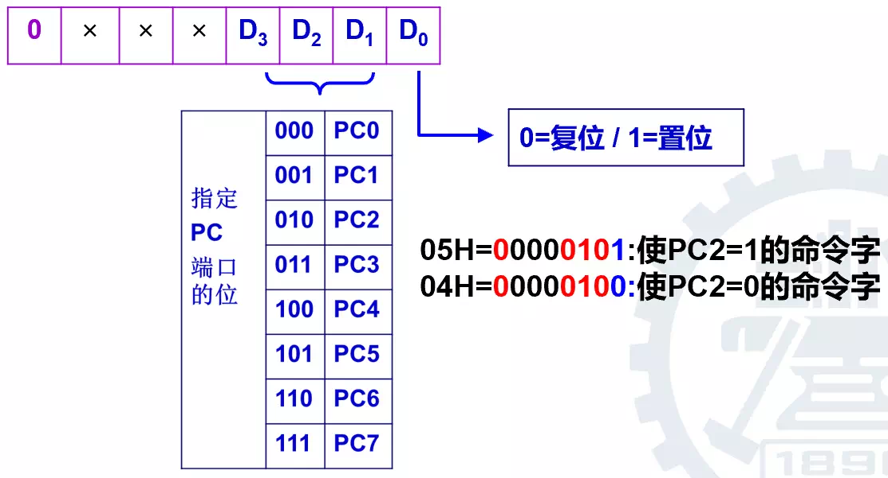
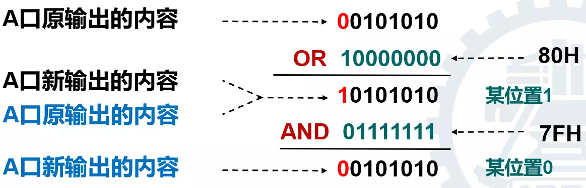

# 汇编与接口技术笔记

期末考试开卷、50% + 平时成绩20% + 常规实验15% + 研究性实验15%

地点：**YF312** 或九教 4 层实验室

- #### 这份笔记画 ※ 的都要背！

- #### 做实验 **<u>需要在上机前就编写完程序</u>** ！！


## 汇编网络参考资料

[8086汇编语言初学者教程](https://www.cnblogs.com/QuLory/archive/2012/11/07/2758048.html) （点击 [#补充资料8086-汇编语言初学者教程](https://github.com/Sayaka-4987/Notes_for_BJTU_Finals/blob/main/21-Fall-%E6%B1%87%E7%BC%96%E4%B8%8E%E6%8E%A5%E5%8F%A3%E6%8A%80%E6%9C%AF%E7%AC%94%E8%AE%B0.md#%E8%A1%A5%E5%85%85%E8%B5%84%E6%96%998086-%E6%B1%87%E7%BC%96%E8%AF%AD%E8%A8%80%E5%88%9D%E5%AD%A6%E8%80%85%E6%95%99%E7%A8%8B) 可以跳转到本笔记的这一部分）


## 1. 基础知识

### 1.2 硬件接口

~~（这段抄的 zll 的，后面还一段也是，不想打字惹）~~

CPU与接口交换数据的方式：

1. **查询方式**

信息交换的控制完全由主机执行程序实现，程序查询方式接口中设置一个数据缓冲寄存器（数据端口）和一个设备状态寄存器（状态顿口）；

主机进行 I/O 操作时，先发出询问信号，读取设备的状态，并根据设备状态决定下一步操作究竟是进行数据传送还是等待。在这种控制方式下，CPU 一旦启动 I/O，就必须停止现行程序的运行，并在现行程序中插入一段程序；

CPU 要花费很多时间来查询和等待，而且在一段时间内只能与一台外设交换信息，效率低；

2. **中断方式**

CPU在程序中安排好于某个时刻启动某台外设，然后CPU继续执行原来的程序，不需要像查询方式一样一直等待外设准备就绪；

一旦外设完成数据传送的准备工作，就主动向CPU发出中断请求，请求CPU为自己服务；在可以响应中断的条件下，CPU暂时中止正在执行的程序，转去执行中断服务程序为外设服务，在终端服务程序中完成一次主机与外设之间的数据传送，传送完成后，CPU返回原来的程序；

3. **DMA 方式**

主存和 DMA 接口之间有一条直接的数据通路；

DMA 方式传送数据不需要经过CPU，因此不必中断现行程序，I/O与主机并行工作，程序和传送并行工作。


## 2. 80x86 计算机组织

本课程以 16 位的 8086 作为教学对象；


### 2.1 计算机系统

微处理器就是把 **运算器、寄存器组、控制器** 集成在一个超大规模集成电路芯片上的功能部件；

存储器是微机存放和记忆程序、数据的部件，分为内存和外存；

外设可以分为两部分，一类是直接为计算机运行服务的，如键盘、鼠标；另外一类是暂时不影响计算机的外设，如打印机，显示器；

系统总线包括数据总线（传送数据）、地址总线（指出数据来源或目的地）、控制总线（传送 CPU 对存储器或 I/O 设备的控制命令，和 I/O 设备对 CPU 的请求服务信号），总线工作由系统总线控制模块指挥；


### 2.2 8086 微处理器

8086 的基本性能指标：

1. 16位微处理器；
2. 16根数据线、20根地址线，可寻址的地址空间达 1MB (220Byte＝1MB)；
3. 可以和浮点运算器、I/O 处理器或其他处理器组成多处理器系统，提高系统的数据吞吐能力、处理能力


通用寄存器包括 8 个 16 位寄存器：AX、BX、CX、DX、SP、BP、SI 和 DI；
标志寄存器为 FLAGS ，是一个 16 位的寄存器；

总线接口部件：负责管理与系统总线的接口，负责对存储器和外设访问；包括指令队列、指令指针、段寄存器、地址加法器和总线控制逻辑；

指令执行部件：包括 ALU 、通用寄存器、标志寄存器和控制电路；负责指令译码、数据运算和指令执行；

指令执行的两个主要阶段：取指和执行，其中取指：从主存取出指令代码进入指令队列，执行：译码指令、并发出有关控制信号实现指令功能；

8086 处理器的指令读取实质是 **指令预取**：8086 处理器维护着长度为 6 个字节的指令队列；EU 单元译码、执行指令，同时 BIU 单元读取后续指令，BIU 和 EU 两个单元相互独立，可以并行操作；


#### ※ 8086 CPU 寄存器分组表


以 [ BX+SI ] 为例：BX 为基址、SI 为变址；

##### 数据寄存器 AX,  BX, CX, DX

- 数据寄存器用来保存 **操作数或运算结果** 等；

  - AX 是累加器，用于算术、逻辑运算以及外设传送信息等；
  - BX 是基址寄存器，常用于存放存储器地址；
  - CX 是计数器，作为循环或串操作等指令中的隐含计数器；
  - DX 是数据寄存器，用来存放双字数据的高16位或存放外设端口地址；

- 以 AX 为例，它对应的 AH, AL 指的是 AX 的高位和低位；

  

##### 指针寄存器 SP, BP 

- 指针寄存器和变址寄存器用于存放 **某个存储单元的偏移地址**；

  - SP 用于存放当前堆栈中栈顶的偏移地址；

  - BP 用于存放堆栈段中某一存储单元的偏移地址；

    

##### 变址寄存器 SI, DI

- 在串操作中， SI 和 DI 都具有自动增量或减量的功能，它的目的操作数和源操作数都在连续空间；

  - SI 用于存源地址（操作完其值不改变）；
  - DI 用于存目的地址，操作完其值发生改变；


##### 控制寄存器 IP, FLAGS 

- 2 个控制寄存器

  - IP 指令指针寄存器保存下一次将要取出指令的偏移地址，IP 的内容由微处理器硬件自动设置，不能用指令直接修改，有一些指令可以改变 IP 的值，如转移指令、子程序调用指令等；
  - FLAGS 标志寄存器包含 9 个标志位，保存一条指令执行后，CPU 所处状态信息及运算结果的特征；

  

##### 段寄存器 CS, DS, SS, ES 

- 段寄存器用来确定 **该段在内存中的起始地址**，8086 有 4 个 16 位的段寄存器

  - 代码段 CS 主要存放运行的程序
  - 数据段 DS 存放运行程序所用的数据
  - 堆栈段 SS 定义了堆栈的所在区域
  - 附加段 ES 是附加的数据段，它是辅助数据区，在串操作指令中，用到的目的串必定存放在附加段中

  

#### 通用寄存器的专门用途


#### 堆栈的两种访问方式

1. 随机访问方式：用 BP 寄存器来指示随机访问地址；

2. 先进后出访问方式：用 SP 寄存器来表示栈顶；


#### ※ 标志寄存器的格式及各位的含义


##### 进位标志 CF（Carry Flag）

当 **无符号整数** 加减运算的最高有效位有进位（加法）或借位（减法）时，CF＝1，否则 CF＝0；


##### 零标志 ZF（Zero Flag）

若运算结果为 0，则 ZF＝1，否则 ZF＝0；


##### 奇偶标志 PF（Parity Flag）

当运算结果的 **最低字节**（注：就是看最后 8 位，1 个字节 Byte 是 8 位 bit，8 位的结果看全部 8 位，16 位的结果看后 8 位）中， 1 的个数为零或偶数时，PF＝1；否则 PF＝0；


##### 辅助进位标志 AF（Auxiliary Carry Flag）

当运算结果的 **最低字节** （同 PF）低位的一半向高位（看最后 8 位的低 4 位向高 4 位）有进位或借位时，AF = 1；

该标志与操作数长度无关，只看最低字节中间那两位就行；


##### 符号标志 SF（Sign Flag）

若运算结果最高位为 1，则 SF＝1，否则 SF＝0；


##### 溢出标志 OF（Overflow Flag）

当 **有符号整数** 加减结果有溢出，则 OF＝1，否则 OF＝0；

> 对于程序员，无符号数关心进位，有符号数关心溢出，相同符号数相加后符号相反（如正+正=负），则有溢出；
>
> 对于处理器硬件判断，最高位和次高位同时进位或不进位，则无溢出；反之则有溢出；


##### 方向标志 DF（Direction Flag）

仅用于串操作指令，控制地址的变化方向：

1. 设置 DF＝0，每次串操作后的存储器地址就自动增加，即从低地址向高地址处理数据串；
2. 设置 DF＝1，每次串操作后的存储器地址就自动减少，即从高地址向低地址处理数据串；
3. 可以执行 CLD 指令设置 DF＝0；执行 STD 指令设置 DF＝1 ；


##### 中断允许标志 IF（Interrupt-enable Flag）

主要针对外中断中可屏蔽中断的开放或禁止：

1. 当 IF=1 时，CPU 允许响应可屏蔽中断，中断当前程序，转去执行中断处理程序；
2. 当 IF＝0 时，则不允许响应可屏蔽中断；
3. 可以执行 STI 指令设置 IF = 1；执行 CLI 指令设置 IF = 0；


##### 追踪标志 TF（Trace Flag）

用于单步调试程序：

1. 当 TF=1 时，在执行完一条指令后，产生单步中断；这在DEBUG调试程序状态下，可以使指令单步运行，可逐一检查各寄存器内容，标志状态、存储器的检查或修改等等；
2. 追踪标志 TF=1 时为调试程序时所用，当程序调试成功后让 TF=0，CPU正常工作不产生单步中断；


### 2.3 存储器地址

#### 存储器的组织：8086 实模式

采用分段方式，20 位的物理地址 由 **16 位的段地址** 和 **16 位的偏移地址** 形成，每个段的最大寻址空间为 64KB；

段地址必须是 16 的倍数，即（二进制写法）末尾 4 位必须为 0；


#### 存储单元的内容

课件记为存储地址加括号”( )” ，编程时用 []；

X 单元中存放着 Y，而 Y 是另一个存储单元的地址，则 Y 单元的内容表示为 (Y) = ((X))；

字单元由**两个字节单元**组成，其地址采用它的低地址来表示；

字存入存储器：低位字节存入低地址单元，高位字节存入高地址单元；


#### 储存单元地址例题


#### 储存器的分段

8086 的内部寄存器是 16 位，地址是 20 位，地址宽度大于字长，显然不能用16位的寄存器仅一次操作实现对 2^20^＝1M 字节单元的寻址；

- 20 根地址线，地址范围 00000H ~ FFFFFH （1MB）
- 机器字长 16 位，仅能表示地址范围  0000H ~ FFFFH（64KB)
- 物理地址：每一个存储单元有一个唯一的 20 位地址


为此引入存储器“分段”的概念，即把 1M 字节内存空间，分成最大 64KB 的段，每段可用 16 位寄存器进行寻址；


段地址：表示一个段的开始，段地址一般存在段寄存器；

偏移地址：在段内相对于段起始地址的偏移值；

逻辑地址：**段地址：偏移地址**


物理地址：每一个存储单元有一个唯一的 20 位地址，表示范围：00000H～FFFFFH；

物理地址形成：**段地址左移 4 位，再加上偏移地址值**；


- 逻辑地址的形式：指令操作数，指令间的相对地址
- 物理地址：MEM 的绝对地址
- 逻辑地址到物理地址的转换过程因 CPU 架构的不同而不同


##### 例：8086 逻辑地址与物理地址的转换


> 这里左移的 4 位是二进制位；如果用十六进制表达地址就是左移一位；
>
> 左移 4 位还可以表达为乘以 16，即：**物理地址 = 段地址 × 16D + 偏移地址** （或 = 段地址 × 10H + 偏移地址）


例：设某操作数存放在数据段，DS = 250AH，数据所在单元的偏移地址 = 0204H；则该操作数所在单元的物理地址为（    ）；

解：此类题目会设坑，给出一堆寄存器，答题需要先找**哪个是段地址**，需要注意偏移地址和段基址对应关系；本题提示了操作数存放在数据段，所以 DS 就是段地址，得物理地址 = **252A4H**；


#### 偏移地址的组成

16 位有效地址：

- EA＝基址寄存器＋变址寄存器＋位移量
  - 基址寄存器：BX 或 BP，**一般由基址寄存器决定哪个段寄存器作为段指针**
  - 变址寄存器：SI 或 DI
  - 位移量：8 或 16 位有符号值（可正可负）


## ※ 8086 缺省 16 位段 + 偏移寻址组合表

注意：当 BX/BP 与 SI/DI 组合作为偏移地址时，默认的段寄存器是 BX/BP 所在段的寄存器，而不是 SI/DI 所在段的寄存器；

一般程序中 **只给出偏移地址**，因此需要背这张表的默认对应关系，记 **偏移寄存器 -> 段寄存器** 方向；

| 段寄存器  | 偏移寄存器            | 主要用途   |
| --------- | --------------------- | ---------- |
| CS 代码段 | IP                    | 指令寻址   |
| DS 数据段 | BX, DI, SI 或 16 位数 | 数据寻址   |
| SS 堆栈段 | SP 或 BP              | 堆栈寻址   |
| ES 附加段 | DI                    | 目标串寻址 |


## 3. 寻址方式

操作数寻址：获取操作数

指令寻址：控制指令跳转

### 3.1 操作数寻址

#### 8086 汇编指令格式

指令 = 操作码 + 操作数；


寻址方式：为取得操作数或指令地址所使用的方法

操作数寻址：与数据有关的寻址方式

指令寻址：与转移地址有关的寻址方式  

指令寻址分为顺序寻址（IP 一条指令接一条指令地顺序进行移动）和跳转寻址（下条指令的地址码不是由程序计数器给出，而是由本条指令给出）


#### 3 种数据寻址方式

这 3 种寻址方式没有 “物理地址” 的概念；

AX 中一定是 16 位数，AL 中一定是 8 位数；

##### 立即数寻址

例：**MOV AX, 1100H**


- 操作数直接存在 **指令** 中，即 **立即数**（Immediate），用常量形式直接表达；
- 因此操作数存储在 **代码段（CS）**中；
- 注意：
  - 源操作数和目的操作数的 **字长必须一致**；例如 **MOV  AH, 3064H** 就是非法的；
  - 只能用于源操作数；


##### 寄存器寻址

例：**MOV  AX,  BX**

- 操作数在 CPU 的 **内部寄存器** 中；
- 不需要访问存储器，速度快；
- 注意：
  - 源操作数和目的操作数的 **字长必须一致**；例如 **MOV  AH (16 位), BX (8 位)** 是非法的；
  - 代码段寄存器 CS 不能用 MOV 指令改变（其他段寄存器都允许重新分配）；


##### 存储器寻址

- 存储器寻址共有 5 种寻址方式（见后文）
- 操作数在 **存储器** 中，用存储单元的地址表示；
- 编程时使用包含 **段寄存器** 和 **偏移地址** 的逻辑地址（一般只给出偏移地址）；
- 段寄存器指示段的 **基地址**；
- 偏移地址由各种寻址方式计算，常被称为 **有效地址 EA**（Effective Address）；
- 一般情况下存储器地址由有效地址表示，段寄存器不用显式说明，数据在默认的段中；如果不使用默认段寄存器，则要用 **段超越指令前缀** 加以说明；


#### 段寄存器的默认和超越

| 访问存储器的方式   | 默认      | 偏移地址    | 可超越             |
| ------------------ | --------- | ----------- | ------------------ |
| 取指令             | 代码段 CS | IP          | 无                 |
| 堆栈操作           | 堆栈段 SS | SP          | 无                 |
| 一般数据访问       | 数据段 DS | 有效地址 EA | CS, ES, SS, FS, GS |
| BP 基址的寻址方式  | 堆栈段 SS | 有效地址 EA | CS, ES, SS, FS, GS |
| 串操作的源操作数   | 数据段 DS | SI          | CS, ES, SS, FS, GS |
| 串操作的目的操作数 | 附加段 ES | DI          | 无                 |


#### 5 种存储器寻址方式

做题注意一下哪边是高地址，哪边是低地址；

##### 直接寻址

例：**MOV CX，[2000H]**

- 指令中直接包含了操作数的有效地址 EA，在指令操作码之后；
- 默认段地址在DS寄存器中，即操作数的实际地址（物理地址）是 DS:EA ；
- 常用于存取变量；


##### 寄存器间接寻址

例： **MOV AX，[SI]**

- 操作数的有效地址 EA 存放在基址寄存器 BX 或变址寄存器 SI, DI 中，**不能放在 AX / CX / DX 中**；
- 操作数的段地址（数据处于哪个段）取决于 **选择哪一个间址寄存器**；
- 可以方便地对数组的元素或字符串的字符进行操作；
- 寄存器间接寻址没有说明存储单元类型；


##### 寄存器相对寻址

例： **MOV BX，NUM+[DI]** 

- 有效地址 EA 是 **寄存器内容与位移量之和**；
- 适用于数组、字符串、表格的操作；


例：计算寄存器相对寻址的有效地址


##### 基址变址寻址

例：**MOV AX，\[BX][SI]**

- 有效地址是基址寄存器和变址寄存器之和
- 适用于二维数组、字符串、表格的操作
- 必须是一个基址寄存器和一个变址寄存器的组合
  - **MOV  AX,  \[BX][BP]**    非法，这是两个基址寄存器
  - **MOV  AX,  \[SI][DI]**      非法，这是两个变址寄存器


##### 相对基址变址寻址

例：**MOV AX，MASK\[BX][SI]**

也可以写成 **MOV AX, [BX+SI+MASK]** 

或 **MOV AX, MASK[BX+SI]**

- 有效地址计算如下：


例：计算相对基址变址寻址的有效地址


#### 操作数寻址（共 7 种）总结

1. 立即数寻址                **MOV  AX , 3069H**
2. 寄存器寻址                **MOV  AL , BH**
3. 直接寻址                    **MOV  AX , [2000H]**
4. 寄存器间接寻址         **MOV  AX , [BX]** 
5. 寄存器相对寻址         **MOV  AX , NUM [ SI ]** 
6. 基址变址寻址             **MOV  AX , \[BP][DI]**
7. 相对基址变址寻址      **MOV  AX , MASK \[BX][SI]**


#### 未解决的疑问（更新解答）

2021/9/13：老师说下次课讲

2021/9/16：讲了，但没完全讲.jpg

作业题：假设（DS）= 2000H，（ES）= 2100H，（SS）= 1500H，（SI）= 00A0H，（BX）= 0100H，（BP）= 0010H，数据段中的变量名VAL的 **偏移地址值** 为 0050H；试指出下列源操作数的寻址方式是什么？其物理地址值是什么？（8）MOV  AX，VAL

（这里先放一下 lys 大佬和老师的说法：）


老师的解释：

MOV AX, VAL 等价于 MOV AX, [VAL]，是一个直接寻址，变量的名字就代表变量的偏移地址；


### 3.2 指令寻址

#### 段内直接寻址

例： 

**JMP  NEAR PTR  NEXT**    近转移    <u>-32768 ~ +32767</u>，汇编时，位移量为16位

**JMP  SHORT  NEXT**          短转移    <u>-128 ~ +127</u>，汇编时，位移量为8位

- 段内寻址 CS 不变，只改变 IP；
- 直接体现地址信息，需要进行一个转换；
- 转向的有效地址 = 当前 (IP) + 位移量 (8bit/16bit) ，其中位移量是 **转向的有效地址与当前 IP 值之差**；


#### 段内间接寻址


- 段内寻址 CS 不变，只改变 IP；
- PTR 是强制类型转换；
- 转向的有效地址是一个寄存器或存储单元的内容；
- 可用除立即数以外的任何一种数据寻址方式得到；


#### 段间寻址

例：

**JMP  1234H:5678H**                        ;  (CS) = 1234H ，(IP) = 5678H

**JMP dword ptr 内存地址单元**      ;  (CS) = (内存地址单元+2) ，(IP) = (内存地址单元) 

- 段间寻址，既改变 IP 也改变 CS 转向的有效地址是 XXXX:YYYY 形式

- 一般仅供操作系统（OS）使用

  

### 3.3 伪指令

汇编语言语句分为 **指令** 和 **伪指令** 两种类型：

| 指令性语句                                                   | 指示性语句（伪指令语句）                                     |
| ------------------------------------------------------------ | ------------------------------------------------------------ |
| 能够被直接翻译成机器码，并让CPU直接执行的语句；<br>每一条指令语句对应一条可执行的CPU机器指令，执行产生相应的CPU动作；<br>有操作码和操作数两个部分； | 指导汇编程序如何编译汇编语言源程序，并不翻译成机器代码，CPU也不执行；<br>通常完成储存模式定义、数据定义、存储器分配、指示程序开始结束等功能；<br>可以提高编程效率，指导编译器如何编译汇编程序； |


#### 汇编语言语句格式 

名字定义满足的规则：

1. 数字不能作为第一个字符；
2. 单独的问号（?）不能作为名字；
3. 最大有效长度为 31；
4. 保留字不能作为名字使用；


##### 操作码

- 含义：指明操作的性质或功能；
- 书写规则：操作码与操作数之间用空格分开；


##### 操作数

- 含义：指定参与操作的数据或者地址表达式；
- 个数：一般指令，1个或2个，也可以没有；伪指令和宏指令可以有多个；
- 书写规则：操作数多于1个时，操作数之间用逗号分开


#### 段定义伪操作 `SEGMENT`、`ENDS`

- 程序由4个逻辑段组成：数据段、堆栈段、附加段和代码段；

- 每个逻辑段以 `SEGMENT` 语句开始，以 `ENDS` 语句结束；

  

##### 段定义的格式

```assembly
段名  SEGMENT  [定位类型]  [组合类型]  [使用类型]  [‘类别’]	; 方括号这几项一般采取默认设置，缺省：
          ……
          ……            ; 语句序列
段名  ENDS
```

例：

```assembly
DATA   SEGMENT         ; 定义数据段
       …
DATA   ENDS
;----------------------------------------
EXTRA  SEGMENT         ; 定义附加段
       …
EXTRA  ENDS
;----------------------------------------
CODE   SEGMENT         ; 定义代码段
       ASSUME CS:CODE, DS:DATA, ES:EXTRA
START: 
       MOV   AX, DATA
       MOV   DS, AX    ; 段地址 -> 段寄存器
       …
CODE   ENDS
       END   START
```


#### 指定段地址伪指令 `ASSUME`

- 伪指令的格式：**ASSUME <段寄存器名>:<段名>[,<段寄存器名>:<段名>…]**
- 功能：建立段寄存器与段的缺省关系；
- 注意：ASSUME 伪指令 **是给程序员看的**，并不为段寄存器设定初值，没有真正建立关联；


**例： assume cs:code, ds:data, es:extra**

其中：code 是代码段的段名，data 是数据段的段名，extra 是扩展段的段名


#### 设置段地址值 

- 在代码段开始处进行 DS, SS, ES 的段地址装填；
- DS, SS, ES 默认指向 PSP（默认分 256 字节），CS 默认指向 PSP 完成段后的地址；


* 8086 **不支持将数据直接送入段寄存器** ，DATA 是地址常量，只能通过 AX 中继一下才能进入 DS 
* MOV 也不能在段寄存器之间直接赋值；


#### 程序结束伪操作 `END`

- 格式：**END  [ label ]**

例：

```assembly
code   segment           ; 定义代码段
       assume cs:code, ds:data, es:extra
start: 
       mov   ax, data
       mov   ds, ax      ; 段地址 -> 段寄存器
       …
code   ends
       end   start
```


#### 数据定义及存储器分配伪操作 `DB`、`DW`、`DD`、`DQ`、`DT`

- 格式：**[变量] 助记符 操作数 \[,操作数,…] \[;注释]** 

- 助记符：**DB, DW, DD, DQ (8字节), DT (10字节)** 

  - DB： 定义字节
  - DW：定义字
  - DD： 定义双字

  


例：

```assembly
DATA_BYTE  DB  10,4,10H,?            
DATA_WORD  DW  100,100H,-5,? 	; -5 按补码存储
```


这里 **DB 2 DUP (0,2 DUP(1,2),3) = 2 DUP（0, 1, 2, 1, 2, 3）= （0, 1, 2, 1, 2, 3, 0, 1, 2, 1, 2, 3）**


##### 操作数


**MOV AL, OPER2**  和 **MOV AL, [OPER2]** 是等价的；  


#### 表达式赋值伪操作 `EQU`

- 相当于给表达式起一个别名，碰到别名就替换成表达式；
- 格式：表达式名 EQU 表达式
- 同一个程序中 `=` 可以对一个符号重复定义，但 EQU 不能对同一个符号重复定义
- 注意：EQU 指令不占用内存空间；

```assembly
BUF1 DW 1,2,3
INTT EQU 5
BUF2 DW 4,5,6       ; 3和4的地址是连续的
```


#### 解除定义伪指令 `PURGE`

- 格式：PURGE <符号1，符号2，…，符号n>
- 功能：解除指定符号的定义


#### 地址计数器与对准伪操作 `$`

- 常用于确定数组中元素的个数

```assembly
BUF1 DB 1，2，3，4，5
CNT1 EQU $-BUF1              ;（常用）
BUF2 DW 1，2，3，4，5
CNT2 EQU ($-BUF2)/2          ;（/2后等于数组元素个数）
```

- 在代码段，\$ 表示当前正在汇编的指令的地址；

```assembly
ORG   $+8       ;  跳过8个字节的存储区
JNE   $+6       ;  转向地址是 JNE 的地址 +6
JMP   $+2       ;  转向下一条指令
```

- 在数据段，\$ 表示当前地址计数器的值；

```assembly
ARRAY DW 1, 2 , $+4 , 3 , 4 , $+4
```

结果如图：


#### 表达式操作符

在指令中出现，主要是对常量进行运算:

| 运算符类型 | 运算符及说明                                            |
| ---------- | ------------------------------------------------------- |
| 算术运算符 | + 、－、*、 /、MOD（取余数）                            |
| 逻辑运算符 | AND（与）、OR（或）、XOR（异或）、NOT（非）             |
| 位移运算符 | SHL（逻辑左移）、SHR（逻辑右移）                        |
| 关系运算符 | EQ（=）、NE（!=）、GT（>）、LT（<）、GE（>=）、LE（<=） |


##### 算术运算符：`+` 、`-`、`*`、 `/`、`MOD` 

```assembly
VIDEO_BUF  DB  25*80*2  DUP(?)
ARRAY   DW   1,2,3,4,5,6,7
ARYEND  DW   ?
MOV  CX, (ARYEND-ARRAY)/2	; 赋值
BLOCK DB  1，2，3

MOV  AL, BLOCK+2   ; 符号地址 ± 常数有意义，等价于  MOV  AL, [BLOCK+2] 
```


##### 逻辑和移位操作符： `AND`、`OR`、`XOR`、`NOT`、`SHL`、`SHR` 

```assembly
OPR1  EQU  25    ; 00011001B
OPR2  EQU  7     ; 00000111B

AND  AX, OPR1 AND OPR2     ; AND AX,1

MOV  AX,  0FFFFH SHL 2     ; MOV AX,0FFFCH
```


##### 关系操作符： `EQ`、`NE`、`GT`、`LT`、`GE`、`LE`

```assembly
MOV FID, (OFFSET Y - OFFSET X) LE 128
; 若 <= 128  (真)   汇编结果：  MOV  FID, -1
; 若 >  128  (假)   汇编结果：  MOV  FID, 0
```


##### 数值回送操作符： `OFFSET`、`SEG`、`LENGTH`、`SIZE`

- **OFFSET /  SEG**      变量 / 标号
  - 功能：回送变量或标号的偏址 / 段址
  - 如 **MOV DX, SEG FUNC** 或  **MOV AX, OFFSET LNAME**


- **LENGTH**   变量
  - 功能：回送由 **<u>DUP 定义的变量</u>** 的 **单元数**，其它情况 **回送 1**；


- **SIZE**   变量
  - 功能：返回配送给由 **<u>DUP 定义的变量</u>** 的 **字节数**，其它情况 **回送 1**；
  - **SIZE** 操作等价于 **LENGTH * TYPE        ;DB的TYPE值为1，DW的TYPE值为2**


例：

```assembly
ARRAY   DW   100 DUP (?)
TABLE   DB   ‘ABCD’

MOV  CX,  LENGTH  ARRAY   ;  MOV  CX, 100
MOV  CX,  LENGTH  TABLE   ;  MOV  CX, 1
MOV  CX,  SIZE    ARRAY   ;  MOV  CX, 200
MOV  CX,  SIZE    TABLE   ;  MOV  CX, 1
```


##### 属性修改的伪指令： `PTR`

- **BYTE PTR** 表示字节，**WORD PTR**  表示字（2个字节）
  - 例：**BYTE PTR [BX]       ; 按字节访问 BX**
  - ​        **WORD PTR [BX]    ; 按字访问 BX** 
- 格式： 新属性 PTR （旧属性的）表达式
- 功能：用于 **暂时改变** 内存变量或标号的原有属性，但 **不能修改寄存器的原有属性**（寄存器属性是固定的）；
- 方式：与其它汇编指令配合使用，不能独立使用

例：**MOV  AX, WORD PTR [BX]**

应用场合：

```assembly
; 1. 有一些指令中，操作数或表达式的属性是不明显的，需要加以明确。
CALL DWORD PTR [BX]    ; 远调用
CALL BYTE PTR  [BX]    ; 段内近调用

; 2. 需要修改操作数或表达式的属性的。
F1 DW 1234H
MOV AL，BYTE PTR F1   ; AL=34H
F2 DB 23H，56H，18H
MOV BX，WORD PTR F2   ; BX=5623H
```


##### 定位类型的伪指令： `PARA`

- `PARA` 是定位类型之一；
- 功能：PARA (Paragraph，节) 表明 **该段起始地址对齐到 para** ，供 OS 使用
- 一般各个逻辑段的首地址在“节”的整数边界上（每 16 个存储单元叫做一节, 1 para = 16 Bytes），即每个逻辑段的起始地址是 16 的整数倍，或地址的最低 4 位为 0

例： **code segment para 'code'**

（完全没看明白，但还是先记下了）


#### 汇编语言程序格式

- 一个汇编源程序一般应该由 3 个逻辑段组成，即数据段、堆栈段、代码段；
- 每个逻辑段以 **SEGMENT** 语句开始，以 **ENDS** 语句结束。整个源程序以 **END** 语句结束；
  - 数据段用来在内存中建立一个适当容量的工作区，以存放常数、变量等操作数据；
  - 堆栈段用来在内存中建立一个适当的堆栈区，以便在中断、子程序调用时使用；
  - 代码段包括了许多以符号表示的指令，其内容就是程序要执行的指令；

例：求字存储单元中两个数之差，存入下一个相邻字单元


#### 程序段前缀结构 FAR 

把整个程序定义成一个 FAR 型过程（或子程序），该过程能够让其它汇编文件中的段来调用，而 near 则不能。 

##### 过程定义伪指令：`PROC`、`ENDP`

格式：

```assembly
NAME  PROC  [TYPE]
; ... 
NAME  ENDP
```

例：


##### 代码段中程序结束的两种方式

```assembly
INT 21H ; DOS 中断调用

RET     ; 过程结束
```


#### 汇编语言程序的上机过程

汇编程序的主要功能：

- 检查源程序，给出出错信息
- 产生目标文件 (.obj) 和列表文件 (.lst) 
- 展开宏指令


## 4. 8086 的指令系统

（这部分为啥在伪指令后面？？？）

主要可以分为：

- 数据传送指令
- 算术指令
- 逻辑指令
- 串处理指令
- 控制转移指令
- 处理机控制指令
- 杂项操作指令

需要记忆：指令的基本功能、支持的寻址方式、执行前后标志位的影响、指令的特殊要求


### 传送指令：`MOV` 

**MOV DST, SRC**       ; 执行操作：**(DST)   ←  (SRC)**

- **寄存器 REG**：AX, BX, CX, DX, AH, AL, BL, BH, CH, CL, DH, DL, DI, SI, BP, SP；
- **段寄存器 SREG**：DS, ES, SS, 注意 **CS 只能作为操作源**（意思是 MOV CS, AX 会报错，MOV AX, CS 可以）；
- **存储器 memory**：[BX], [BX+SI+7], 变量等；
- **立即数 immediate**：5, -24, 3Fh, 10001101b 等；
- 注意事项：
  - 不允许使用 AX、CX、DX 存放 EA； 
  - CS 和 IP 寄存器的修改只能使用 JMP XX:YY 指令进行修改，不能用 MOV 指令修改。通常来说，CS 都是由 OS 分配的，应用程序不能对其进行修改；
  - DST、SRC 的类型要匹配，因此不能同时为存储器寻址。因为两者的位宽是否匹配不能确定；
  - MOV 只允许下方代码块中允许的移动：

```assembly
; MOV 支持的寄存器操作：
MOV REG, memory
MOV REG, REG
MOV REG, immediate
MOV memory, REG
MOV memory, immediate

; MOV 只支持如下段寄存器操作：
MOV SREG, memory
MOV memory, SREG
MOV REG, SREG
MOV SREG, REG
```

总结：


### 堆栈操作指令：`PUSH`、`POP` 

- 堆栈是 **后进先出**（LIFO）的存储区；
- 栈顶是低位地址，SP 指向栈顶；
- 段地址存放在 SS 中，堆栈指针 SP 在任何时候都指向栈顶，进出栈后自动修改 SP；   
- 堆栈用于 **保存子程序返回地址和断点地址** 以及 **主程序通用寄存器内容的保护和恢复** ；
- 因为 LIFO，所以在保存和恢复寄存器的内容时，要 **按照相反的顺序** 执行一组压入和弹出指令；
- 注意：
  - 堆栈操作必须以字为单位
  - 不影响标志位
  - 不能用立即寻址方式（不能压栈一个立即数），例：**PUSH  1234H      ; 非法**
  - DST 不能是 CS ，CS 只能用 JMP 指令间接修改，例：**POP  CS      ; 非法**
  - 没有明确的寄存器表示栈底，除非程序人为定义了 SS 段使用自定义的堆栈；
  - BP 可以寻址堆栈中任何一个位置；

指令格式：

```assembly
进栈指令：PUSH  SRC
执行操作：
(SP) ←  (SP) – 2        ; 栈顶指针 SP 上移，所以是 - ；堆栈以字（2个字节）为单位，所以 -2
((SP+1), (SP)) ←  (SRC)

出栈指令：POP  DST
执行操作：
(DST) ←  ((SP+1), (SP))
(SP) ←  (SP) + 2        ; 栈顶指针 SP 下移，
```


### 数据交换指令：`XCHG` 

- 格式：**XCHG  OPR1，OPR2**
- 功能： (OPR1)  <-->  (OPR2) 交换值
- 注意： 
  - 不影响标志位
  - 不允许使用段寄存器，两个操作数必须有一个在寄存器中（内存之间不能相互传送数据，因为不知位宽是否匹配）

 例：

```assembly
BX=6F30H，BP=0200H，SI=0046H，AX=2105H
SS=2F00H，(2F246H)=4154H 
XCHG  BX，[BP+SI]     ; (BX) = 4154H, [SS*10H +BP+SI] = 6F30H
XCHG  AL，BH          ; (AL) = 41H, BH = 05H 
```


### I/O数据传送指令：`IN`、`OUT`

- 功能：用于外部设备 I/O 端口与 CPU 之间的信息交换；
- IN/OUT 指令中 AX（AL）操作数的位置是不同的，一个是目标操作数位置，另一个是源操作数位置；
- IN/OUT 指令操作期间，端口地址处将产生一个负脉冲信号；
- 只能使用 AX 或 AL 来存放数据，只限 **8 位立即数** 或 **DX** 来存放端口号；
  - 该操作不影响标志位
  - 前 256 个端口号（00H~FFH）可直接在指令中指定（长格式）
  - 如果端口号大于等于 256，端口号就只能存在 DX 中（短格式）

输入指令：

```assembly
; I/O端口直接寻址方式(直接用 8 位的立即数)
; 长格式：
IN   AL, PORT         （字节）
IN   AX, PORT         （字）
; 执行操作：
(AL) ← (PORT)   	  （字节）
(AX) ← ((PORT+1),(PORT)) （字）

; I/O端口间接寻址方式(超过 256 位的时候只能间接寻址)
; 短格式：   
IN   AL, DX   	  （字节）
IN   AX, DX   	  （字）
; 执行操作：
(AL) ← (DX)     	  （字节）
(AX) ← ((DX+1),(DX)) （字）     
```


输出指令：

```assembly
; I/O端口直接寻址方式(直接用 8 位的立即数)
; 长格式： 
OUT   PORT, AL  （字节）
OUT   PORT, AX  （字）
; 执行操作：
(PORT) ← (AL)      （字节）
((PORT+1),(PORT)) ← (AX)（字）

; I/O端口间接寻址方式(超过 256 位的时候只能间接寻址)
; 短格式：   
OUT   DX, AL  	（字节）
OUT   DX, AX  	（字）
; 执行操作： 
(DX) ← (AL)    （字节）
((DX+1),(DX)) ← (AX)（字）
```


例：

```assembly
IN   AL, 28H    ; 将端口28H中的字节数据读出送AL
OUT  28H, AL    ; 将AL的数据写入28H中

MOV  DX, 03FCH  ; 将端口03FCH送DX
IN   AL, DX     ; 将端口03FCH中字节数读出送AL
OUT  DX, AL     ; 将AL中数据写入端口03FCH中

; TEST 指令测试某状态寄存器（端口号27H）的第2位是否为1
IN     AL, 27H
TEST   AL, 00000100B
JNZ    ERROR          ; 若第2位为1，转ERROR处理
```


### 换码/查表指令：`XLAT` 或 `XLAT  OPR`

这两个指令默认了操作数，执行操作：**(AL）←  ( BX + AL )**

功能：AL 给出偏移量，然后存储该偏移地址处的内容

注意：
*  不影响标志位
*  字节表格（长度不超过256）首地址存在 BX
*  需转换的位移量存在 AL

```assembly
; 例：
MOV BX, OFFSET TABLE   ; BX=0040H
MOV  AL, 3
XLAT  TABLE ; 指令执行后：(AL)=33H
```


### 地址传送指令：`LEA`、`LDS`、`LES`


- ##### 有效地址送寄存器指令：LEA  REG, SRC

  - 执行操作： **(REG) ← SRC**
  - 功能：将源操作数的有效地址 EA 传送到目标寄存器
  - 注意：
    - **SRC** 不能是立即寻址或寄存器寻址，**必须为存储器寻址方式**；
    - **REG 不能是段寄存器；**


- ##### 指针送寄存器和 DS 指令：LDS  REG, SRC

  - 执行操作：**(REG) ← (SRC) ,  (DS) ← (SRC+2)**
  - 功能：将源操作数中存放的地址指针 ”段基址: 偏移地址” 的低 16 位送入目标寄存器，高 16 位送入 DS 段寄存器


- ##### 指针送寄存器和 ES 指令：LES  REG, SRC

  - 执行操作：**(REG)  ←  (SRC)，(ES)  ←  (SRC+2)**
  - 功能：将源操作数中存放的地址指针”段基址: 偏移地址”的低 16 位送入目标寄存器，高 16 位送入 ES 段寄存器

例：


判断题：

① LEA    BX,  [2728H]      ; (BX)=2728H  

② MOV   BX,  [2728H]     ; (BX)=DS段内2728H处一个字的内容

③ MOV   BX,  2728H        ; (BX)=2728H

④ LDS    BX,  [2728H]      ; (BX)=DS段内2728H处一个字的内容

⑤ LEA    BX,  2728H         ×

⑥ LDS    BX,  2728H        ×

⑦ LES    BX,  2728H         ×

⑧ LEA    BX,  SI                 ×

⑨ LDS    BX,  SI                 ×

⑩ LES    BX,  SI                  ×


### 标志寄存器传送指令：`LAHF` 、`SAHF` 、`PUSHF`、`POPF` 

**FLAGS** 为 16 位标志寄存器，低字节指 FLAGS 的 **低 8 位**；

这里的操作都影响标志位；


- ##### 标志送 AH 指令：`LAHF`

  - 功能：读取标志位低字节，把标志寄存器中的 SF、ZF、AF、PF、CF 五个标志传至 AH 的第 7、6、4、2、0 位，第 5、3、1 位未定义；
  - 执行操作：(AH) ← (FLAGS 的低字节)

  

  

  

- ##### AH 送标志寄存器指令：`SAHF`

  - 功能：写入标志位低字节
  - 执行操作：**（FLAGS 的低字节） ←  (AH)**

  

- ##### 标志进栈指令：`PUSHF` （FLAGS 的高和低两字节） 

  - 功能：读取标志位的 2 个字节内容到堆栈中；
  - 执行操作：**(SP)  ←  (SP) – 2 ，((SP)+1，(SP))  ←  (FLAGS)**

  

- ##### 标志出栈指令：`POPF` （FLAGS 的高和低两字节） 

  - 功能：写入堆栈的 2 个字节内容到标志位中；
  - 执行操作：**(FLAGS)  ←  ((SP)+1, (SP))，(SP)  ←  (SP) + 2**


### 加法指令：`ADD`、`ADC`、`INC`


- ##### 加法指令：ADD  DST, SRC
  
  - 执行操作：**(DST) ← (SRC) + (DST)**
  


- ##### 带进位加法指令：ADC  DST, SRC
  
  - 执行操作：**(DST) ← (SRC) + (DST) + CF**
  


- ##### 加 1 指令：INC  OPR 
  
  - 执行操作：**(OPR) ← (OPR) + 1**


注意：  

   * `INC` 指令不影响 CF 标志（硬件结构决定的），对其它条件标志位都有影响；

   * 汇编器不会区分有符号数还是无符号数，它会统一当作有符号的，并全部编译成补码形式进行运算；

   * 如果要将一个加法解释成无符号数加法，那么就只使用 CF，否则就需要使用 OF；

   * OF = 1 说明运算结果已经错误，应该中止运算；

   * CF 与 OF 不在同一解释中同时使用；

     

> 8086 指令中专门提供了一条 **[溢出中断指令 `INTO`](https://github.com/Sayaka-4987/Notes_for_BJTU_Finals/blob/main/21-Fall-%E6%B1%87%E7%BC%96%E4%B8%8E%E6%8E%A5%E5%8F%A3%E6%8A%80%E6%9C%AF%E7%AC%94%E8%AE%B0.md#%E4%B8%AD%E6%96%AD%E4%B8%8E%E4%B8%AD%E6%96%AD%E8%BF%94%E5%9B%9E%E6%8C%87%E4%BB%A4intintoiret)**，用来判断有符号数加减运算是否有溢出；
>
> 该命令常用于算术运算中，若算术运算（它的上一条指令）的结果产生溢出，即 OF=1 ，则立即调用一个处理算术溢出的中断服务程序；否则不进行任何操作，接着执行下一条指令；


例：双精度数的加法，分别加低位和高位

DX = 0002H，AX = 0F365H （16 进制表示中，最高位是字母时，前面要补 0）

BX = 0005H，CX = 8100H

指令序列：

```assembly
ADD  AX, CX    ; (1) 执行后，(AX) = 7465H，CF=1，OF=1
ADC  DX, BX    ; (2) 执行后，(DX) = 0008H，CF=0，OF=0
```


### 减法指令：`SUB`、`SBB`、`DEC`、`NEG`

- ##### 减法指令：SUB  DST, SRC

  - 执行操作： **(DST) ←  (DST) – (SRC)**


- ##### 带借位减法指令：SBB  DST, SRC

  - 执行操作： **(DST) ←  (DST) – (SRC) – CF**


- ##### 减 1 指令：DEC  OPR 

  - 作： **(OPR)  ←  (OPR) – 1**


- ##### 求补指令：NEG  OPR 

  - 执行操作：**(OPR) ←  – (OPR)**
  - 功能：将操作数按位求反后末位加1，因而操作也可以表示为（OPR）←  0FFFFH（补码的 -1） –  (OPR) + 1（也可以写成 0 -  (OPR) 
  - 例：如果 (CL) = 100，执行 NEG CL 后 (CL)=1001 1100B，是 -100 的补码；如果(CL) = –8，执行 NEG CL 后 (CL)=0000 1000B，是 8 的补码
  - 

### 比较指令 `CMP`

- ##### 格式： CMP  OPR1, OPR2 

  - 执行操作： **(OPR1) – (OPR2)**
  - 功能：该指令与 SUB 指令一样执行减法操作，但它不保存结果，只根据结果 **设置条件标志位**；
  - CMP 指令后一般跟随条件转移指令，根据比较结果产生不同的程序分支；
  - 说明：OPRT1 和 OPRT2 可以是寄存器或存储器，但**不能同时为存储器**（否则位宽不能保证），OPRT2 还可以为立即数


注意：

* `DEC` 指令不影响 CF 标志（硬件结构决定的），对其它条件标志位都有影响；
* 有符号减法下 CF 没有意义，无符号数减法下 OF 没有意义；
* `CMP` 指令执行后对标志位的影响：
  * 对于有符号数，SF 异或 OF 等于 1 时是小于，


### 乘法指令：`MUL`、`IMUL`  


- ##### 无符号数乘法指令：**MUL    SRC**

- ##### 带符号数乘法指令：**IMUL   SRC**

- 执行操作：

  - 字节操作数      **(AX) ← (AL) * (SRC)**
  - 字操作数    **(DX,AX) ← (AX) * (SRC)**

- 注意：
  *  AL (AX) 为隐含的乘数寄存器；
  *  AX (DX,AX) 为隐含的乘积寄存器；
  *  SRC 不能为立即数，因为位宽不详；
  *  除 CF 和 OF 外，对条件标志位无定义；


### 除法指令：`DIV`、`IDIV`


### 十进制调整指令：`DAA`、`DAS`、`AAA`、`AAS`、`AAM`、`AAD`


### 逻辑运算指令：`AND`、`OR`、`NOT`、`XOR`、`TEST` 


- ##### 逻辑非指令：**NOT  OPR**  

- 执行操作： **(OPR) ←  ¬ (OPR)**    

  

- ##### 逻辑与指令：**AND  DST, SRC**

- 执行操作： **(DST) ← (DST) ∧ (SRC)**


- ##### 逻辑或指令：**OR  DST, SRC**

- 执行操作： **(DST) ← (DST) ∨ (SRC)**


- ##### 异或指令：  **XOR  DST, SRC**

- 执行操作： **(DST) ← (DST) ⊕ (SRC)**


- ##### 测试指令：  **TEST  OPR1, OPR2**

- 执行操作： **(OPR1) ∧ (OPR2)**

- 注意：

  - OPR 不能为立即数
  - 不影响标志位 


例：


### 移位指令：`SHL`、`SHR`、`SAL`、`SAR`、`ROL`、`ROR`、`RCL`、`RCR`

注意：

*  OPR 可用 **除立即数以外** 的任何寻址方式 
*  条件标志位：
     *  CF = 移入的数值
     *  OF=1：当 CNT=1 时，最高有效位的值发生变化
     *  OF=0：当 CNT=1 时，最高有效位的值不变
     *  CNT>1时，OF 无意义
     *  移位指令：SF、ZF、PF 根据移位结果设置，AF 无定义；
     *  循环移位指令可以改变操作数中所有位的位置，不影响 SF、ZF、PF、AF
*  算术/逻辑移位指令常用来乘以 2 或除以 2，以及 2 的整数幂，根据移位的位数，即移动 1、2、3…，分别为乘以或除以 21、 22、 23…
*  **算术 **移位适用于 **带符号数** 的运算；**逻辑 **移位指令用于 **无符号数** 的运算；


### 无条件转移指令：`JMP`

- ##### 段内直接短转移：JMP   SHORT  OPR 

- 执行操作：IP ←  IP + 8位位移量


- ##### 段内直接近转移：JMP   NEAR PTR  OPR

- 执行操作：IP ← IP + 16位位移量


- ##### 段内间接转移：JMP   WORD PTR  OPR

- 执行操作：IP ← (EA) ，其中 OPR 为存放在 16 位通用寄存器或字内存单元内的偏移量


### 条件转移指令：`JZ/JNZ` 、 `JE/JNE`、 `JS/JNS`、 `JO/JNO`、`JP/JNP`、 `JB/JNB`、 `JL/JNL`、 `JBE/JNBE`、`JLE/JNLE`、 `JCXZ` 

首先回忆标志位作用：


**条件转移指令** 将标志位的状态作为测试的条件，所以 **首先需要执行影响标志位的指令**（如 CMP 或 TEST 等），然后采用条件转移指令测试相应的标志，决定程序的转移

注意：

- 只能使用 **段内直接寻址** 的 8 位位移量；
- 条件转移指令均为段内短转移，即转移范围为：**-128 ~ +127** 


（还是 PPT 最靠后出现的这张表比较细……）

测试 CX 的值为 0 则转移：**JCXZ   OPR           (CX)=0**


条件转移指令可分为三种：

* ##### 根据单个条件标志的设置情况转移

  

  

* ##### 比较两个无符号数，并根据比较结果转移

  * 适用于地址（为无符号数）或双精度数低位字（为无符号数）的比较


* ##### 比较两个有符号数，并根据比较结果转移

  * 参考有符号数的 CMP 指令或减法指令对 SF/OF 的影响
  *  适用于有符号数的比较


### 循环指令：`LOOP`、`LOOPZ/LOOPE`、`LOOPNZ/LOOPNE`

- ##### 循环指令：**LOOP   OPR**

  测试条件：(CX) ≠ 0

  

- ##### 为零或相等时循环指令：**LOOPZ(LOOPE)   OPR**

  测试条件：ZF=1 且 (CX) ≠ 0

  

- ##### 不为零或不相等时循环指令：**LOOPNZ(LOOPNE)   OPR**

  测试条件：ZF=0 且 (CX) ≠ 0

  

- 执行步骤：

  - (CX) ← (CX) - 1   
  - 检查是否满足测试条件，如满足则 (IP) ← (IP) + 8 位位移量，实行循环；不满足则 IP 不变，退出循环；
    - **LOOP  AGAIN** 等价于 **DEC  CX；JNZ  AGAIN**，可以进行等价替换

- 注意：

  - CX 中存放循环次数；

  - 只能使用段内直接寻址的 8 位位移量；

  - LOOP 不影响 CF 和 ZF 位；

    

  #### 两种多重循环的方式：


### 子程序调用和返回指令：`CALL`、`RET`

##### 子程序调用和返回的执行过程
- 保护断点；
  - 将调用指令的下一条指令的地址（断点）压入堆栈
- 获取子过程的入口地址；
  - 子过程第1条指令的偏移地址
- 执行子过程，含相应参数的保存及恢复；
- 恢复断点，返回原程序；
  - 将断点偏移地址由堆栈弹出


段间调用需要同时保护 CS 和 IP：


#### `CALL` 调用指令：

- 段内直接近调用：**CALL  DST**（其中 DST 为子程序名）

  - 执行操作： **(SP) ← (SP) – 2              ; 断点压入堆栈**

  ​                           **( (SP)+1,(SP) ) ← (IP)     ; 主程序地址压栈**

  ​                           **(IP) ← (IP) + 16 位位移量**

  - 注意：IP为Call指令的下一条指令的地址，其与 DST 子程序的地址间的相对地址或位移量是固定的

    

- 段内间接近调用：**CALL  DST**，其中 DST 为寄存器（如 BX）或存储器地址（如 WORD PTR [BX]）

  - 执行操作： **(SP) ← (SP) – 2**

  ​                           **( (SP)+1, (SP) ) ← (IP)**

  ​                           **(IP) ← (EA)     ; (DST为内存地址)**


#### `RET` 返回指令

- 段内近返回：**RET**

- 功能：将堆栈中保存的2字节断点的偏移地址恢复IP中，CS不变

  - 执行操作： **(IP) ← ( (SP)+1, (SP) )** 

    ​                    **(SP) ← (SP) + 2**

- 段内带立即数近返回：**RET  EXP**

  - EXP 表示弹出断点之后，使 SP 内容再回退 EXP 个字节单元，作用是 **使断点之后的 EXP 个字节单元分数据失效**（区别于带参数返回，主要作用是回退堆栈，使之前入栈内容失效）


### 中断与中断返回指令：`INT`、`INTO`、`IRET`

8086 中断系统最大支持 256 个中断，每个中断具有唯一的中断号，且具有独立的中断服务程序；

发生中断时，CPU 当前程序被暂停，转而执行中断处理程序；


#### **中断向量**

- 中断向量是中断例行程序的入口地址，存放于中断向量区，指向中断服务程序的段值和偏移量（CS:IP）；
- CPU 在执行 `INT` 指令时，从中断向量表中取出相应的值赋值给 CS 和 IP，转去执行中断服务程序。这些操作是由硬件直接实现的，把它称为中断隐指令，其操作过程程序员不可见；程序员能够做的就是修改中断向量表中存储的值。
- 中断隐指令并不是指令系统中的一条真正的指令，它没有操作码，所以中断隐指令是一种特殊指令。


（在 8086 中，reset 不算是中断，不在中断向量表内）


#### 中断指令格式：`INT   TYPE` 或  `INT`（没有类型号就默认调用 3 号中断）

- 隐含的操作：**(SP) ← (SP) - 2**

  ​                       **( (SP)+1, (SP) ) ← (FLAGS)**

  ​                       **(SP) ← (SP) - 2**

  ​                       **( (SP)+1, (SP) ) ← (CS)**

  ​                       **(SP) ← (SP) - 2**

  ​                       **( (SP)+1, (SP) ) ← (IP)**

  ​                       **(IP) ← (TYPE\*4)**

  ​                       **(CS) ← (TYPE\*4+2)**

- 注意：

  - TYPE (0~255) 是中断类型号


#### 中断返回指令：**`IRET`**

- 执行操作： **(IP) ← ( (SP)+1,(SP) )** 

  ​                    **(SP) ← (SP) + 2**

  ​                    **(CS) ← ( (SP)+1,(SP) )** 

  ​                    **(SP) ← (SP) + 2**

  ​                    **(FLAGS) ← ( (SP)+1,(SP) )** 

  ​                    **(SP) ← (SP) + 2**

  - `INT` 指令还把 IF 和 TF 置0，但不影响其它标志位
  - `IRET` 指令执行完，标志位由堆栈中取出的值确定


#### 溢出中断指令：**`INTO`**

- 执行操作：**若 OF=1**，则 **(SP) ← (SP) - 2**

  ​                                          **( (SP)+1, (SP) ) ← (FLAGS)**

  ​                                          **(SP) ← (SP) - 2**

  ​                                          **( (SP)+1, (SP) ) ← (CS)**

  ​                                          **(SP) ← (SP) - 2**

  ​                                          **( (SP)+1, (SP) ) ← (IP)**

  (最后两步不一样)

  ​                                          **(IP) ← (10H)**

  ​                                          **(CS) ← (12H)**


### 处理机控制指令

#### 标识处理指令

- ##### `CLC`、 `STC`、 `CMC`：对CF位清零/置位/取反

- ##### `CLD`、`STD`：字符串移动方向增/减标志

- ##### `CLI`、`STI`：开/关中断  


#### 其他处理机控制与杂项操作指令

##### 空操作指令：`NOP`

该指令没有的显式操作数，主要起延迟下一条指令的执行，只是占用一条指令的时间，不影响任何标志位。


##### 等待指令：`WAIT`

该指令使CPU处于等待状态，直到协处理器(Coprocessor)完成运算，并用一个重启信号唤醒CPU为止。该指令的执行不影响任何标志位。 

*协处理器不算外设，而是另一个FPU（浮点运算器）


##### 暂停指令：`HLT`

在等待中断信号时，该指令使CPU处于暂停工作状态【低功耗模式】，CS:IP指向下一条待执行的指令，但不进行任何操作，保持先前操作中所有寄存器的状态不变 。当产生了中断信号，CPU把CS和IP压栈，并转入中断处理程序。在中断处理程序执行完后，中断返回指令IRET弹出IP和CS，并唤醒CPU执行下条指令。指令的执行不影响任何标志位。


##### 封锁数据指令：`LOCK` 

格式：**LOCK INSTRUCTION**

该指令是一个前缀指令形式，后面跟一个具体的操作指令；

LOCK指令可以保证是在其后指令执行过程中，禁止协处理器修改数据总线上的数据，起到独占总线的作用。

该指令的执行不影响任何标志位。


## 习题课（作业 1 ~ 作业 3）

- 寄存器和立即数寻址没有物理地址
- 汇编机器中数字一律以补码形式储存，**DB -12H** 记成 **0EEH**  
- 一个 Byte 只能放一个字母的 ascii 码值
- 定义字符串可以后加 `,’$’`，类似于 C 语言的 `\0`，代表显示字符串结束


课堂小测题：

1、指出下列指令的错误

(1)	**MOV	AH,BX**                                 错，位宽不匹配

(2)	**MOV	[BX],[SI]**                              错，不能在内存之间mov

(3)	**MOV	AX,\[DI][SI]**                          错，DI和SI都是变址寄存器

(4)	**MOV	MYDAT\[BX][SI],ES:AX**      错，1.两个内存不能mov，2.AX不能进行段超越，应该是ES:[BX]

(5)	**MOV	CS,AX**                                  错，CS不能用mov改变


2、下列哪些指令是非法的

(1)	**CMP	15,BX**                                  错，第一个不能是立即数

(2)	**CMP	BYTE PTR OP1,25**             对

(3)	**CMP	OP1,OP2**                            错，不能同时是存储器寻址

(4)	**CMP	AX,OP1**                               对


## 5. 汇编程序的结构设计


### 编写汇编代码的一般步骤

1. 分析题意，确定算法
2. 确定解决问题的思路和方法
3. 根据算法画出程序框图
4. 根据框图编写程序
5. 上机调试程序


#### 两个常用中断指令调用

参考 [中断功能表（全英文）](https://github.com/Sayaka-4987/Notes_for_BJTU_Finals/blob/main/21-Fall-%E6%B1%87%E7%BC%96%E4%B8%8E%E6%8E%A5%E5%8F%A3%E6%8A%80%E6%9C%AF%E7%AC%94%E8%AE%B0.md#%E4%B8%AD%E6%96%AD%E5%8A%9F%E8%83%BD%E8%A1%A8%E5%85%A8%E8%8B%B1%E6%96%87) 部分；

- ##### `INT 21H`，功能号 `02H`
  向显示屏幕上输出来自 DL 的单个字符；

```assembly
MOV  DL, 'A' 	; 调用参数: 输出字符 ‘A’ 
MOV	 AH, 02	    ; DOS功能号: 显示输出
INT	 21H		; DOS调用
```


- ##### `INT 21H`，功能号 `09H`
  向显示屏幕上输出来自 DX 的字符串；

```assembly
STR	DB ‘computer’, ‘$’	 ;在数据段定义

MOV	DX, OFFSET STR        ; 调用参数: 输出字符串 ‘computer’ 
MOV	AH, 09H               ; DOS功能号: 显示输出串
INT	21H 	              ; DOS调用
```


### 分支结构程序设计

首先需要理明白程序逻辑；

#### 分支程序涉及的条件转移指令

##### 无条件转移指令 `JMP`

功能：无条件地使程序转移到指定的目标地址


例：不同类型的 `JMP` 指令

```assembly
JMP  NEXT                ; 段内直接转移
JMP  SHORT LP1           ; 段内直接转移，LP1 为短距离标号
JMP  AX                  ; 段内间接转移，IP ← AX
JMP  [BX]                ; 段内间接转移，IP ← [BX+1][BX]
JMP  LABLE_NAME          ; 段间直接转移，LABEL_NAME 标号在其他代码段
JMP  DWORD PTR[BX][SI]   ; 段间间接转移，DWORD PTR 说明后面是双字数据
```


##### 条件转移指令 


例：字符比较程序，两个字符相同时，显示 YES ；否则显示 NO ；

```assembly
DATA SEGMENT
  D1   DB ‘A’
  D2   DB ‘B’
  RES1 DB ‘YES’, ’$’
  RES2 DB ‘NO’,  ’$’
DATA ENDS
CODE SEGMENT	
ASSUME CS:CODE,
	   DS:DATA
START: MOV AX,DATA
       MOV DS,AX
       MOV AL,D1
       MOV BL,D2    
       CMP AL,BL 
       JNE NEXT1
       LEA DX,RES1 
       JMP NEXT2         
NEXT1: LEA DX,RES2
NEXT2: MOV AH,09H
       INT 21H
       MOV AH,4CH
       INT 21H
CODE ENDS
     END START
```


例：设存储单元 A 和 B 各有一 **无符号字节数**，比较大小，将较大数送A单元

```assembly
DATA  SEGMENT
  A   DB 39H             
  B   DB 0B4H
DATA  ENDS

CODE  SEGMENT	
      ASSUME CS:CODE,DS:DATA
START:MOV AX,DATA
      MOV DS,AX
      MOV AL,A
      CMP AL,B
      JNB NEXT
      XCHG AL,B
      MOV A,AL
NEXT: MOV AH,4CH
      INT 21H	
CODE ENDS
     END START
```


#### 分支程序的 CASE 和 IF-THEN-ELSE 结构

实现方法：

1. 用多个双分支结构实现多分支结构
2. 利用地址表法实现多分支结构（存指令入口地址）
3. 利用转移表法实现多分支结构（存指令）
4. 利用逻辑分解法实现多分支结构


例：计算符号函数 SNG（X）的值

```assembly
DATA   SEGMENT
   X   DB 0B9H
   Y   DB ?
DATA   ENDS
CODE   SEGMENT	
       ASSUME CS:CODE,DS:DATA 
START: MOV AX,DATA
       MOV DS,AX
       MOV AL,X
       CMP AL,0
       JL NEXT1
       CMP AL,0
       JG NEXT2      	
       MOV Y,0 	   	; 0 送 Y
       JMP RES	  
NEXT1: MOV Y,0FFH	; -1 送 Y    
       JMP RES
NEXT2: MOV Y,1	   	; 1 送 Y
    RES: MOV AH,4CH
         INT 21H
CODE  ENDS
      END START
```


#### 地址表法

设计方法：把各分支程序段的入口地址依次存放在 **数据段用 `ADTAB` 定义的一个表中**，形成地址表，取各分支程序段的编号作为各分支入口地址的表地址的位移量；

某个分支程序入口地址的表地址为：**表地址 = 编号 * 2（IP 是 16 位，占两个字节）+ 入口地址首地址**


例：用地址表法编写程序实现从低到高逐位检测一个字节数据，找出第一个非0的位数；

检测时，为0则继续检测，为1则转移到对应的处理程序段显示相应的位数；

```assembly
DATA   SEGMENT
    NUM   DB 78H
    ADTAB DW AD0,AD1,AD2,AD3,AD4,AD5,AD6,AD7
DATA   ENDS

CODE   SEGMENT
       ASSUME CS:CODE,DS:DATA
       
START: MOV AX,DATA
       MOV DS,AX
       MOV AL,NUM
       MOV DL,'?'
       CMP AL,0
       JZ DISP
       MOV BX,0
       
AGAIN: SHR AL,1
       JC NEXT
       INC BX
       JMP AGAIN
       
 NEXT: SHL BX,1        
       JMP ADTAB[BX]
       
  AD0: MOV DL,’0’ 
       JMP DISP
  AD1: MOV DL,’1’
       JMP DISP
  AD2: MOV DL,’2’
       JMP DISP
  AD3: MOV DL,’3’
       JMP DISP
  AD4: MOV DL,’4’
       JMP DISP 
  AD5: MOV DL,’5’
       JMP DISP
  AD6: MOV DL,’6’
       JMP DISP
  AD7: MOV DL,’7’
  
 DISP: MOV AH,2
       INT 21H
       MOV AH,4CH
       INT 21H
CODE ENDS
     END START 
```


#### 转移表法

设计方法：把转移到各分支程序段的转移指令依次存放在一起，用 `TAB: ` 开头，作为转移表；

使用时，以各转移指令在表中的位置，即离表首地址的偏移量，作为转移条件，偏移量加上表首地址作为转移地址，转到表的相应位置，执行相应的无条件转移指令；

转移表中每条转移指令（段内短转移）占用2个字节，计算公式如下：**表地址 = 模式字 * 2 + 转移表首地址**


例：根据输入值（0~4）的不同，执行不同的操作，用转移表法编写程序

```assembly
CODE   SEGMENT
       ASSUME CS:CODE
START: LEA BX,TAB    ; 转移表首地址送BX
       MOV AH,1           
       INT 21H       ; 输入字符送AL  
       SUB AL,30H    ; 字符变数字
       MOV AH,0
       ADD AX,AX     ; 模式字*2送AX
       ADD BX,AX
       JMP BX
       
  TAB: JMP SHORT MODE0    ; 转移表
       JMP SHORT MODE1
       JMP SHORT MODE2
       JMP SHORT MODE3
       JMP SHORT MODE4 

MODE0: MOV DL,30H
       JMP EXIT
MODE1: MOV DL,31H
       JMP EXIT
MODE2: MOV DL,32H
       JMP EXIT
MODE3: MOV DL,33H
       JMP EXIT
MODE4: MOV DL,34H

     EXIT: MOV AH,2
           INT 21H
           MOV AH,4CH
           INT 21H
           
CODE  ENDS
      END START
```


#### 逻辑分解法

设计方法：将多分支结构采用逻辑等效的方法，按条件的先后，依次分解成一串双分支结构，然后再使用双分支的方法来进行程序设计；

例：根据AL中的值（0~4），执行不同的操作，但用逻辑分解法编写程序    

```assembly
DATA  SEGMENT
      NUM   DB 2
DATA  ENDS

CODE  SEGMENT
ASSUME CS:CODE,DS:DATA
START: MOV AX,DATA
       MOV DS,AX
       MOV AL,NUM
       CMP AL,0
       JZ NEXT0
       CMP AL,1       
       JZ NEXT1
       CMP AL,2
       JZ NEXT2
       CMP AL,3
       JZ NEXT3
       CMP AL,4
       JZ NEXT4
NEXT0: MOV DL,30H
       JMP EXIT
NEXT1: MOV DL,31H
       JMP EXIT
NEXT2: MOV DL,32H
       JMP EXIT
NEXT3: MOV DL,33H
       JMP EXIT
NEXT4: MOV DL,34H
    EXIT: MOV AH,2
          INT 21H
          MOV AH,4CH
          INT 21H
CODE ENDS
     END START
```


### 循环结构程序设计


循环结构包括这些部分：

- 初始化：设置循环的初始状态
- 循环体：循环的工作部分及修改部分
- 控制条件：
  - 计数控制
  - 特征值控制
  - 地址边界控制


可以用分支指令控制循环：

```assembly
DATA  SEGMENT
  STR  DB ’computer$’
  LEN  DB ?
DATA  ENDS

CODE  SEGMENT
      ASSUME CS:CODE,DS:DATA
START:
    MOV AX,DATA	
    MOV DS,AX
    LEA SI,STR		    ; 串首地址
    XOR BL,BL		    ; 计数器清0
    LOP:
        MOV AL,[SI]	    ; 取一个字节
        CMP AL,24H      ; 和’$’进行比较
        JZ STOP         ; 相等则结束
        INC BL          ; 否则计数器加1
        INC SI          ; 地址指针加1
        JMP LOP         ; 转回到LOP
    STOP:
        MOV LEN,BL  ; 存储字符个数
        MOV AH,4CH 
        INT 21H
CODE  ENDS	
      END START
```


#### 用专用的循环指令控制循环

循环指令执行步骤： 

1.  **(CX)  ←  (CX) - 1**

2.  检查是否满足测试条件，如满足则 (IP) ← (IP) + 8 位位移量，实行循环；不满足则 IP 不变，退出循环；


注意：`LOOP` 指令执行时，CX 是否为 0 不影响 ZF 和 CF 的变化，等价于 `DEC` 指令；所以 `LOOP` 指令和 `LOOPNZ` 指令才有区别；

| 指令                        | 转移条件                   | 说明                 |
| --------------------------- | -------------------------- | -------------------- |
| **`LOOP  OPR`**             | 测试条件：(CX) ≠ 0         |                      |
| **`LOOPZ (LOOPE)   OPR`**   | 测试条件：ZF=1 且 (CX) ≠ 0 | 为零或相等时循环     |
| **`LOOPNZ (LOOPNE)   OPR`** | 测试条件：ZF=0 且 (CX) ≠ 0 | 不为零或不相等时循环 |


例：求以 BUF 为首地址的10个内存单元的无符号数据和。已知其和小于等于 255，将结果存入第 11 个内存单元

```assembly
DATA  SEGMENT
  BUF  DB 12H,38H,46H,0BH,09H,41H,32H,56,02H,26H
  RES  DB ?
DATA  ENDS
CODE  SEGMENT
      ASSUME CS:CODE,DS:DATA
START: 
    MOV AX,DATA	
    MOV DS,AX
    MOV AL,0	; 存放累加之和
    MOV CX,0AH  ; 累加次数
    LEA BX,BUF  ; 数据表的首地址	
    LP: 
        ADD AL,[BX]          ; 累加
        INC BX          	 ; 地址增1     	
        LOOP LP              ; 若CX-1不为0，则继续循环
    MOV RES,AL 	         ; CX-1=0，则存累加和 
    MOV AH,4CH
    INT 21H
CODE  ENDS	
      END START
```


例：在字节数组中找出第一个非 0 的数据，并将其下标存入 RES 单元，假设其下标值小于 10 

```assembly
DATA  SEGMENT
  ARR  DB 0,0,38H,46H	
       DB 89H,67H,0H,92H
  CNT  EQU $–ARR
  RES  DW ?
DATA  ENDS
CODE  SEGMENT	
      ASSUME CS:CODE,DS:DATA
START: 
    MOV AX,DATA
    MOV DS,AX
    MOV CX,CNT   ; 循环次数为 CNT 数组长度
    MOV DI,-1    ; 数组下标从 0 开始
AGAIN: 
    INC DI                                       
    CMP ARR[DI],0       ; 和0比较
    LOOPZ AGAIN         ; 为0，且没比较完，则循环
    JZ EXIT             ; 比较完仍为0，转 EXIT
    MOV RES,DI          ; 找到了，送下标号到 RES
EXIT: 
    MOV AH,4CH
    INT 21H 
CODE  ENDS
      END START
```


#### 按问题的条件控制循环

含义：用转移指令来判断循环条件

应用场合：循环次数不确定


例：记录某个字节存储数据单元中1的个数，并把结果存入RES中

```assembly
DATA  SEGMENT
  NUM  DB  75H
  RES  DB  ?
DATA  ENDS   

CODE  SEGMENT
      ASSUME CS:CODE,DS:DATA
START:
    MOV AX,DATA        
    MOV DS,AX
    MOV BL,NUM    	
    XOR DL,DL    ; DL清零    
    AGAIN:
        TEST BL,0FFH
        JZ NEXT      ; 判断数据是否0
        SHR BL,1     ; 逻辑右移1位
        ADC DL,0     ; 带进位加法
        JMP AGAIN
NEXT:
    MOV RES,DL
    MOV AH,4CH
    INT 21H		
CODE  ENDS	       
      END START
```


#### 按逻辑变量控制循环

含义：用转移指令来判断循环条件

应用场合：控制转入不同的循环支路

方法：把逻辑变量送入寄存器中，以逻辑变量各位的状态作为执行某段程序的标志


例：在以 BUF 为起始地址的内存中放有若干个字节型无符号数，假定某逻辑变量的长度为一个字节（其值为10010101），它的 D0 \~ D7 位对应着 BUF \~ BUF + 7 单元内容的运算。即某位为 0，则将相应单元内容的最高位求反，其它位不变；而某位为 1，则将相应单元内容之高低四位互换

```assembly
DATA  SEGMENT
 BUF  DB 75H,12H,87H,98H
      DB 81H,56H,73H,51H
  B   EQU 8
  C   EQU 10010101B
DATA  ENDS	

CODE  SEGMENT	                          
      ASSUME CS:CODE,DS:DATA
START:
    MOV AX，DATA        
    MOV DS,AX            
    MOV AH,B       ; 指示数据个数
    MOV CH,C
    LEA BX,BUF
LP:
    MOV AL,[BX]      
    SHR CH,1
    JNC NEXT       ; CF=0跳转
    MOV CL,4
    ROL AL,CL      ; 高低位交换
    JMP RES
    
NEXT:
    XOR AL,80H     ; 高位取反
    
RES:
    MOV [BX],AL 
    INC BX
    DEC AH         ; 数据个数-1
    JNZ LP         ; 未读完则继续
    MOV AH,4CH
    INT 21H
    
CODE ENDS
     END START
```


#### 多重循环程序设计

含义：指循环体内还有循环，也就是嵌套循环

注意：(1) 不允许循环结构交叉；(2) 转移指令只能从循环结构内转出或可在同层循环内转移


例：设在以 EXST 为首址的存储区中依次存放着某考区 245 个理科生的七门成绩，现要统计每个考生的总成绩，并将其存放在该考生单科成绩之后的两个单元

```assembly
DATA  SEGMENT
    EXST  DB 01,75,82,84,92,78,49,85,00,00
          DB 02,83,92,63,76,82,58,69,00,00
    ……      
DATA  ENDS   

CODE  SEGMENT                                                            
    ASSUME CS:CODE,DS:DATA                               
    MOV AX,DATA                                                     
    MOV DS,AX
START:
    LEA SI,EXST		; 数据表首地址
    MOV BL,245  	; 245个学生，外循环次数
    LOP2: 
        MOV CX,7        ; 七门课成绩，内循环次数 
        XOR AX,AX		; 清0，存总成绩
        INC SI     		; 跳过准考证号
        LOP1: 
            ADD AL,[SI]	    ; 单科成绩累加
            ADC AH,0	    ; 加进位位
            INC SI 		    ; 修改地址指针
            LOOP LOP1       ; 没累加完单科成绩，则继续   
        MOV WORD PTR [SI],AX   ; 累加完，存总成绩
        INC SI 		           ; 跳过存总成绩的2个单元               
        INC SI                                     
        DEC BL 		           ; 外循环次数减1
        JNZ LOP2		       ; 不为0，则求下个学生总成绩              
    MOV AH,4CH             
    INT 21H
CODE  ENDS                                           
END  START
```


## 实验 1. Debug 调试

命令不区分大小写；


### DOS 命令

`dir` 显示目录下所有文件夹

`cd [相对路径]` 进入某文件夹

`[文件名].exe` 运行指定可执行文件


### DEBUG 命令

#### “ U ” 命令：将程序反汇编

格式：-`U` 

例：

-`U CS:0` ; 显示不再有伪指令的汇编指令

-`U [开始地址] [终止地址]` ; 显示开始地址到终止地址的指令


#### “ D ” 命令：显示内存单元的内容.

注意：十六进制是 DEBUG 唯一认识的数字系统,键入和输出时十六进制数不用后加 “H”，十进制数后要加 “D” 

D 命令 **默认显示 CS 段的内容**；

格式： -`D [存储单元地址]`    

例：

1. -`D 7A0:100`    ; 显示的信息是段地址是 7A0H 和偏移地址是 100H 开始的内存单元的内容，表示方式是一行 16 个数据，然后是对应的 ASCII 字符
2. -`D DS:0`          ; 显示数据段内容
3. -`D 100 120`    ; 显示从偏移地址100开始到偏移地址120的内存单元


#### “ E ” 命令：修改存储单元的内容

格式：

1.  -`E 存储单元地址 数据 数据 数据 ...`  ;（输入数据后按空格键可连续修改数据）此格式使键入的数据替代了指定范围的存储单元内容
2.  -`E 存储单元地址`       ; 此格式采用逐个存储单元相继修改的方法


#### “ F ” 命令：用一个指定的十六进制数填入一部分存储单元

格式：-`F 开始地址 终止地址 常量`        ;   “F”命令与“E”命令都可修改存储单元的内容,但“F”命令只能键入一串相同的数据。

例：-`F 100 120 4F`


#### “ R ” 命令：检查和修改寄存器的内容

格式：

1. -`R`                       ; 显示CPU内所有寄存器内容和标志位状态
2. -`R 寄存器名字`   ; 显示和修改某个寄存器的内容
3. -`RF`                    ; 显示和修改标志位状态


#### “ A ” 命令：输入汇编语句

格式：-`A [开始存放指令的地址]`    ; 可以键入汇编语言语句，并能把它汇编成机器代码，相继放入从指定地址开始的存储器中，回车键退出，回到 DEBUG 提示符下


#### “ T ” 命令：跟踪命令

格式：

1. -`T [=指令地址]`   ; 功能：从指定的地址起执行一条指令后停下来，显示所有寄存器内容及标志位的值；从当前的 CS:IP 开始单步执行
2. -`T [=指令地址][要执行的指令条数N]`   ; 功能：从指定地址开始执行 N 条指令后停下来显示

注意：要跳过 INT 中断指令正常运行


#### “ G ” 命令：运行命令

格式：-`G=<地址>,<断点>`       ; 从起始地址 0 开始运行，在断点地址 1C 处停止，并显示指令从 0 开始，到断点 1C 执行后，所有寄存器及标志位内容，以及下一条要执行的指令

例：-`G=0,1C`


#### “ Q ” 命令：退出 DEBUG 命令符模式

格式：-`Q` 

注意：Q 命令不存盘


## 6. 子程序结构

###  `CALL` 调用指令

- 段内直接近调用：`CALL  DST`（DST 为子程序名）
  - 执行操作：
                                        **(SP) ← (SP) – 2           ;断点压入堆栈**
                                        **( (SP)+1,(SP) ) ← (IP) ; 主程序地址压栈**
                                        **(IP) ← (IP) + 16位位移量**
  - 注意：IP 为 Call 指令的下一条指令的地址，其与 DST 子程序的地址间的相对地址或位移量是固定的


- 段内间接近调用：`CALL  DST`（DST 为寄存器如 BX，或存储器地址 WORD PTR [BX]）
  - 执行操作：
                           **(SP) ← (SP) – 2**
                           **( (SP)+1,(SP) ) ← (IP)**
                           **(IP) ← (EA) (DST为内存地址)**


### `RET` 返回指令

- 段内近返回：`RET`
  - 功能：将堆栈中保存的2字节断点的偏移地址恢复 IP 中，CS 不变
  - 执行操作：
                        **(IP) ← ( (SP)+1,(SP) )** 
                        **(SP) ← (SP) + 2**


- 段内带立即数近返回：`RET  EXP`
  - 功能：EXP 表示，弹出断点之后，使 SP 内容再回退 EXP 个字节单元，作用是使断点之后的 EXP 个字节单元分数据失效


### 过程定义伪操作

格式：

```assembly
[过程名] PROC (NEAR/FAR)

……

[过程名] ENDP
```


#### `NEAR` 段内调用

调用程序和子程序在同一代码段中


#### `FAR` 段间调用

调用程序和子程序不在同一代码段中              

 

#### 使用场合


### 子程序的调用与返回

子程序调用会隐含使用堆栈保存返回地址

- `call  near ptr  subp`
  - 保存返回地址：仅offset地址
  - 转子程序
- `call  far  ptr  subp`
  - 保存返回地址：seg + offset
  - 转子程序


#### 保存与恢复寄存器

```assembly
subt   proc    near（far）
        push    ax
        push    bx
        push    cx
        push    dx
        ……
        ……
        pop     dx
        pop     cx
        pop     bx
        pop     ax
        ret
subt   endp
```


### 子程序的参数传递方法


#### 通过寄存器传送参数

- 把参数存于 **约定的寄存器** 中，可以传值，也可以传址
- 子程序对带有出口参数的寄存器 **不能** 保护和恢复（主程序视具体情况进行保护）
- 子程序对带有入口参数的寄存器可以保护，也可以不保护，但最好一致
- 寄存器参数传递特点：
  - 简单方便，只需约定寄存器即可
  - 寄存器的个数和容量非常有限，适用于传递较少的参数信息


例：将给定的一组字数据X、Y代入Z=((X+Y)×2-X)×4 公式中，计算相应的Z值。假设Z的值不会超过16位。

```assembly
DATA SEGMENT
   X   DW 5,3,8,9,2,5,3,4,7,1
   Y   DW 1,5,7,0,4,3,1,4,8,1
   Z   DW 10 DUP (?) 
DATA ENDS 
CODE SEGMENT
    ASSUME CS:CODE, DS:DATA
START:
    MOV AX,DATA
    MOV DS,AX
    LEA SI,X
    LEA DI,Y
    LEA BX,Z
    MOV CX,Y-X   ; 字节数
    SHR CX,1     ; 字数/数组个数
REAPT:
    MOV AX,[SI]
    MOV DX,[DI]
    CALL SUBR
    MOV [BX],AX
    ADD SI,2
    ADD DI,2       
    ADD BX,2
    LOOP REAPT
EXIT:
    MOV AH,4CH
    INT 21H
    SUBR PROC NEAR
          PUSH BX 
          PUSH CX
          MOV BX,AX
          ADD AX,DX    ; AX=X+Y
          SAL AX,1     ; AX=(X+Y)×2
          SUB AX,BX    ; AX=(X+Y)×2-X
          MOV CL,2
          SAL AX,CL    ; AX=((X+Y)×2-X)×4 
          POP CX
          POP BX
          RET
    SUBR ENDP
CODE ENDS
     END START
```


#### 通过存储单元传送参数

- 约定存储单元交互信息，即主程序和子程序直接采用同一个变量名，共享同一个变量，实现参数的传递
- 可以在调用程序与子程序间传递大量数据


例：累加数组中的元素

```assembly
data  segment
    ary     dw   1,2,3,4,5,6,7,8,9,10
	count   dw   10
	sum     dw   ?

	ary1    dw   10,20,30,40,50,60,70,80,90,100
	count1  dw   10
	sum1    dw   ?
data  ends

code segment
    assume cs:code,ds:data
main:mov ax,data
    mov ds,ax

    lea si,ary
    mov cx,count
    call proadd
    mov sum,ax

    lea si,ary1
    mov cx,count1
    call proadd
    mov sum1,ax

    mov ax,4c00h
    int 21h
code ends
    end main

proadd proc near
	xor ax,ax
    next:  
        add ax,[si]
      	add si,2
      	loop next
	ret
proadd endp
```


#### 通过堆栈传送参数或参数地址

- 操作：
  - 主程序将子程序的入口参数压入堆栈，子程序从堆栈中取出参数；
  - 子程序将出口参数压入堆栈，主程序弹出堆栈取得它们；
- 适用于参数较多，子程序有多层嵌套、递归调用的情况
- 步骤：
  - 主程序把参数或参数地址压入堆栈；
  - 子程序使用堆栈中的参数或通过栈中参数地址取到参数（用 BP 访问堆栈段）；
  - 子程序返回时使用 RET n 指令，调整 SP 指针，以便删除堆栈中已用过的参数，保持堆栈平衡，保证程序的正确返回。


例：累加数组中的元素

```assembly
data  segment
      ary    dw 10,20,30,40,50,60,70,80,90,100
      count  dw 10
      sum    dw ?
data  ends

stack segment   
      dw   100    dup (?)    ; 首个字节地址为SS首地址；
      tos  label  word       ; 定义 tos 为栈底，其具体值相当于$
stack ends                   ; 因为使用到堆栈段来传递参数，所以要先定义STACK

code1 segment
main  proc far
      assume cs:code1,ds:data,ss:stack
start:
      mov ax,stack
      mov ss,ax    
      mov sp,offset tos  ; 初始时栈顶与栈底地址相同，为SS:SP
      mov ax,data
      mov ds,ax
      mov bx,offset ary  ; 通过堆栈传递参数时要先将参数地址压入栈中
      push bx
      mov bx,offset count
      push bx
      mov bx,offset sum
      push bx
      call far ptr proadd
      mov ax,4c00h
      int 21h
main  endp
code1 ends

code2    segment
  assume cs:code2

proadd   proc  far
  push  bp
  mov   bp, sp

  push  ax
  push  cx
  push  si
  push  di

  mov   si,[bp+0ah]
  mov   di,[bp+8]
  mov   cx,[di]
  mov   di,[bp+6]
  xor   ax, ax
next:
  add   ax, [si]
  add   si, 2
  loop  next
  mov   [di],ax

  pop   di
  pop   si
  pop   cx
  pop   ax

  pop   bp

  ret   6 ; (SP)<-(SP)+6,即废除压入栈中的ARY/COUNT/SUM,清空栈

proadd  endp

code2    ends
         end start
```


#### `LABEL` 伪指令

含义： 为本伪指令之后的标号/变量定义 **一个不同类型的别名**

用法： 变量/标号 LABEL 类型(byte, word, dword, near, far)

例：

```assembly
VAR LABEL WORD
X  DB  "AB"   ; 变量 VAR 和其后的 X 指向内存中的同一单元，但两者类型分别为 WORD 类型、BYTE 类型；

MOV AX, VAR   ; 等价于 MOV AX, 4241H
MOV AL,  X    ; 等价于 MOV AL, 41H
```


### 多模块之间的参数传递

在某一个模块中定义，而在另外一个模块中引用的符号称为外部符号；


#### `PUBLIC` 伪指令

- 格式：`PUBLIC 符号[,...]` 
- 说明：在一个模块中定义的符号（变量、标号、过程名）在提供给其他模块使用时，必须要用 PUBLIC 定义该符号为外部符号


#### `EXTRN` 伪指令

- 格式： `EXTRN 符号:类型[,...]` 
- 说明：在另一个模块中定义，而要在本模块中使用的符号，必须要用 EXTRN 说明
  - 若符号为标号或过程名，则类型near或far；
  - 若符号为变量，则类型为byte、word、dword等


例：

主程序（lie6d6.asm）

```assembly
public d1,d2,n1			；全局变量定义
extrn  Lie6d6a: far		；外部过程说明
extrn  Lie6d6b: far		；外部过程说明
dat   segment para ‘dat’	；数据段
	d1 db 98h,35h,54h,78h
	n1=$-d1
	d2 db 12h,34h,56h
dat   ends
stac  segment para ‘stack’	；堆栈段
	stal dw 100 dup(?)
stac  ends
code  segment para ‘code’	；代码段
	assume cs: code, ds: dat, ss: stac
sta   proc far
	…
	lea si,d1		      ；全局变量的引用
	lea di,d2
	mov cx,n1
	…
	call Lie6d6a	      ；外部过程的引用
      …
	call Lie6d6b	      ；外部过程的引用
      …
      ret
sta   endp
code  ends
	end sta
```


子程序1  lie6d6a.asm

```assembly
public  Lie6d6a		；全局过程
code    segment para ‘code’
	  assume cs: code
lie6d7a proc far
	  push ax
	  …
	  pop ax
	  ret
lie6d7a endp
   code ends
	  end
```


子程序2   lie6d6b.asm

```assembly
public  Lie6d6b		 ；全局过程
extrn   d1: byte, d2: byte
code    segment para ‘code’
	  assume cs: code
Lie6d7b proc far
	  …
	  lea si,d1		 ；全局变量
	  lea di,d2
	  …
	  ret
Lie6d7b endp
   code ends
	  end
```


## 7. BIOS 和 DOS 中断

### 预备知识

- BIOS（Basic Input/Output System 基本输入输出系统） 


- 存储系统中从地址 0FE000H～0FFFFFH 的 8KB ROM 中装入的基本输入输出的例行程序，主要包括系统加电自检、引导装入、I/O设备的处理程序以及接口控制功能模块(最接近硬件);

- 包括：
  - 主要的I/O设备处理和接口控制程序
  - I/O设备硬件中断处理程序
  - I/O设备软件中断调用处理程序
  - 许多常用的系统例行程序
  - 系统加电自检、引导装入等功能模块
- 一般以中断处理程序的形式存在、被调用
- 例如：软件中断调用
  - 显示输出：10H号中断处理程序
  - 打印输出：17H号中断处理程序
  - 键盘输入：16H号中断处理程序


- DOS （Disk Operating System 磁盘操作系统）两个功能模块：

  - IBMBIO.COM：I/O 设备处理程序，完成设备到内存或内存到外设数据传送
    - 例如：DOS 调用 BIOS 显示输出程序完成显示输出，调用 BIOS 打印输出程序完成打印输出，调用BIOS键盘输入程序完成键盘输入等
  - IBMDOS.COM：作业管理与监控、文件管理程序、设备处理程序
    - 设备管理与监控：通过 IBMBIO.COM 形成一个或多个 BIOS 调用

  

- DOS 的两个功能模块与 BIOS 之间的关系 ：
  说明：大多数情况下用户调用 DOS 功能调用，少数情况直接调用 BIOS 功能； 


### BIOS 和 DOS 基本调用

调用方法：

1. 将调用参数装入指定的寄存器中；
2. BIOS 或 DOS 功能号装入 AH；
3. 如需子功能号，把它装入 AL；
4. 按中断号调用DOS或BIOS中断 (INT) ;
5. 检查或取得返回参数；


例：DOS调用：键盘输入，显示输出

```assembly
MOV AH, 01   ; DOS功能号:键盘输入 
INT 21H      ; DOS调用
MOV CHAR, AL ; 返回参数: 键入字符的 ASCII码(在AL中)

MOV DL, ’A’  ;调用参数: 输出字符
MOV AH, 02   ;DOS功能号: 显示输出
INT 21H      ;DOS调用
```


#### BIOS键盘中断 `INT 16H`

| **AH** | **功   能**        | **返回参数**                                               |
| ------ | ------------------ | ---------------------------------------------------------- |
| 0      | 从键盘读一字符     | AL = 字符码，AH = 扫描码（对应键盘的物理按键情况）         |
| 1      | 读键盘缓冲区的字符 | 如ZF = 0，AL = 字符码，AH = 扫描码；<br>如ZF = 1，缓冲区空 |
| 2      | 取键盘状态字节     | AL = 键盘状态字节                                          |


例：读取键盘状态字节，并以十六进制打印出来

```assembly
again：
	mov	ah，02h
	int       16h     ；读取键盘状态字节
	mov  	bx,ax
	call    binihex ；该子程序实现二进制和16进制转换

	mov     dl,0dh
	mov     ah,02h
	int       21h      ；显示
	jmp      again
```


#### DOS键盘中断 `INT 21H`

|**AH**|**功能**|**调用参数**|**返回参数**|
|------|--------------------------------------------|------------------------------------------------|-----------------------------------------------------|
|1|从键盘输入一个字符并回显在屏幕上||AL=字符|
|6|读键盘字符，不回显|DL=0FFH|若有字符可取，AL=字符，ZF=0若无字符可取，AL=0，ZF=1|
|7|从键盘输入一个字符，不回显||AL=字符|
|8|从键盘输入一个字符，不回显，检测 Ctrl_Break||AL=字符|
|A|输入字符到缓冲区|DS:DX=缓冲区首址||
|B|读键盘状态||AL=0FFH有键入，AL=00无键入|
|C|清除键盘缓冲区并调用一种键盘功能|AL=键盘功能号(1,6,7,8或A)||


例：DOS调用从键盘输入字符

```assembly
MOV AH, 01    ; DOS功能号:键盘输入 
INT 21H 	  ; DOS调用
MOV CHAR, AL  ; 返回参数:键入字符的ASCII码(AL)
```


例: 输入字符串到缓冲区 STRING

```assembly
DATA   SEGMENT
   MAXLEN   DB   32         ; 定义缓冲区存放字符的字节数
   ACTLEN   DB   ?          ; 预留一个字节，由系统填写实际键入的字符个数
   STRING   DB   32 DUP(?)  ; 32个字节空间存放键入的字符数
DATA   ENDS

CODE	SEGMENT
   ASSUME CS:CODE,DS:DATA
START:	MOV	AX,DATA
	MOV	DS,AX
	LEA	DX,MAXLEN ; 把MAXLEN所在地址赋值给DX；并且21H的0A号 功能规定了缓冲区的长度设置、存放的内容和顺序，回车符（0DH）表示输入结束，见右上图
	MOV	AH,0AH    ; 屏幕出现光标，让用户输入字符串！
	INT	21H
CODE	ENDS
	END	START
```


#### DOS显示功能调用中断 `INT  21H`
|**AH**|**功能**|**调用参数**|
|------|--------------------------------|------------------------------------------------------------|
|2|显示一个字符(检验 Ctrl-Break)|DL=字符<br/>光标跟随字符移动|
|6|显示一个字符(不检验 Ctrl-Break)|DL=字符<br/>光标跟随字符移动|
|9|显示字符串|DS:DX=串地址，**串必须以 `$` 结束**<br>光标跟随串移动|


例：显示字符串

```assembly
MESSAGE DB "Thesortoperationisfinished.",13,10,'$'
    MOV AH, O9H ; 09H功能号送AH
    MOV DX, SEGMESSAGE
    MOV DS, DX ; 输出缓冲区的段基址装入DS
    MOV DX,OFFSETMESSAGE; 输出缓冲区的偏移地址装入DX
INT 21H
```


# 接口部分


## 8.  I/O 端口地址译码技术

###  I/O 地址空间

- 与存储器空间一样，I/O 地址空间也是一片连续的地址单元，可供各种外设作为与CPU交换信息时存放数据、状态和命令代码之用
- 一个 I/O 地址对应的是接口电路中的一个寄存器或控制器，称为“端口”
-  I/O 地址分配给某个外设后就成为该外设的固有端口地址，其它外设不能使用，否则会发生冲突
  - 为了缓解端口资源紧张，后面也会学到“端口复用”，罕见情况下也有多个外设共用一个端口 
-  I/O 端口与存储器单元一样，以 **字节** 组织数据
- 实模式下， I/O 端口地址线是16位的，范围是 0000H-0FFFFH，共 64K 个可单独寻址的8位端口，2 个相邻的 8 位端口可构成 1 个 16 位端口，4 个相邻的 8 位端口可构成 1 个 32 位端口；16 位端口对应于偶数地址， 32 位端口对应于被 4 整除的地址，8 位端口的地址可以从任意地址开始
- IBM公司在规划微机接口卡时采用非完全译码方式，只考虑低 10 位地址线 A0-A9，所以端口的地址范围是0000H-03FFH 


### I/O 端口

- I/O端口（port) 是接口电路中能被 CPU 直接访问的寄存器的地址；
- CPU 通过这些端口向接口中的寄存器发送命令、读取状态和传送数据。因此，一个接口可以有几个端口，如命令端口、状态端口和数据端口，分别对应于命令(控制)寄存器、状态寄存器和数据寄存器；
- I/O 操作是对 I/O 端口的操作，而不是对 I/O 设备的操作。（同一 I/O 端口可能对应不同的 I/O 设备（共享的情况下），中间有一个选择过程-译码电路）；


- 从CPU到接口电路中间有一个地址译码电路；
- 地址译码的结果就是产生一个片选信号/CS，/CS是一个低电平脉冲，不持续有效，只在脉冲期间CPU才可以读/写接口内的寄存器，其它时刻CPU并不控制接口电路；
- 另一方面，接口电路可以根据CPU之前写入的数值来独立工作，不依赖于/CS信号是否有效；


### I/O 端口地址编址方式

- 接口内部包含一个或多个CPU可进行读写的寄存器，这些寄存器称为 I/O 端口。数据端口、状态端口和控制端口。

- CPU对外设的各种操作，最终都归结为对接口中各端口的读/写操作，而不是直接对外设进行操作。

- 为了区分不同的端口，需为每个端口分配一个地址编号，称为 I/O 端口地址。

- 由于CPU地址总线既连接到存储器又连接到 I/O 端口，因此，需要一种机制来**区分和寻址**要操作的内存单元或 I/O 端口，这种机制称为编址方式。

- 常用的两种 I/O 编址方式：
  -  I/O 端口与内存独立编址
  -  I/O 端口与内存统一编址


#### 独立编址


- 端口地址单独编址，而不和存储空间合在一起，访问I/O端口使用专门的I/O指令
- IBM-PC系列采用该方式
- 优点：
  - I/O端口地址不占用存储器空间。
  - I/O指令短，执行速度快。
  - 由于专门I/O指令与存储器访问指令有明显的区别，使程序中I/O操作和存储器操作层次清晰，程序的可读性强。
- 缺点：需要专门访问I/O端口的指令。


#### 统一编址


- 从存储器空间中划出一部分地址空间给I/O设备，把I/O接口中的端口当作存储器单元一样进行访问，不设置专门的I/O指令。
- 优点：指令类型多，功能齐全。

- 缺点：
  - 端口占用了存储器的地址空间，使存储器容量减小；
  - 另外，指令长度比专门I/O指令要长，因而执行速度较慢


### 独立编址方式的I/O端口访问

#### I/O指令：`IN` 和 `OUT`

IN指令从I/O端口向AL(AX)输入字节(字）

OUT指令从AL(AX)向I/O端口输出字节(字）

指令格式为： 

```assembly
PORT EQU 0F4H
IN  AL,PORT	 ; 输入
IN  AX,PORT
OUT PORT,AL	 ; 输出
OUT PORT,AX
```

**只能用AX寄存器；**

通常所说的对端口的访问就是CPU对端口的读/写操作，即指I/O端口与CPU的累加器之间的数据传送，并不涉及数据是否传送到存储器的问题

```assembly
; 例如：输入时
      MOV  DX,300H    ; I/O端口
      IN  AL,DX       ; 从DX端口读数据到AL
      MOV  [DI],AL    ; 将数据从AL→存储器
; 例如：输出时   
      MOV  DX,301H    ; I/O端口
      MOV  AL,[SI]    ; 从内存取数到AL
      OUT  DX,AL      ; 数据从AL→端口
```


#### I/O端口寻址方式

- 直接寻址
  - I/O指令直接提供8位I/O地址
  - 只能寻址256个I/O地址（00～FFH）
  - 用i8表示I/O地址，表达形式上与立即数一样
- DX 寄存器间接寻址
  - 用DX寄存器保存访问的I/O地址
  - 可寻址全部I/O地址（0000～FFFFH）
  - 直接书写成DX，表示I/O地址


#### 独立编址方式的端口操作

- 端口地址范围：最多寻址多少个I/O端口
  - 直接寻址：端口地址8位，可寻址256个端口
  - 间接寻址：端口地址16位，可寻址216=64K个端口
  - 例如：MOV  DX, XXXXH      
                IN  AL, DX   ；间接寻址
                IN  AX, 60H ；直接寻址
- 传送数据的宽度：通过累加器所传输的数据位数
              IN AL, DX ；输入8位数据
              IN AX, DX ；输入16位数据

原则：传输字节数据时使用 AL，传输字数据时使用 AX

注意：与指令中的累加器有关，与端口地址范围无关


#### I/O指令与I/O读写控制信号的关系

程序执行IN指令时会在系统总线上产生有效的 $\overline{IOR}$ 信号（低电平有效），完成读(输入)操作； 

执行OUT指令时会在系统总线上产生有效的 $\overline{IOW}$ 信号（低电平有效），完成写(输出)操作

 

### I/O端口地址分配

I/O地址划分成两部分：

- 0000H-03FFH留给微机系统和ISA总线；
- 0400H-0FFFFH给用户应用、主板功能和PCI总线使用。

前者作为专用端口分配给相应的设备，后者由PNP即插即用机制和操作系统动态分配和管理。         


#### 实模式下I/O地址的分配

PC微机把I/O空间分成两部分：系统板上的可编程接口芯片端口地址和常规外设接口控制卡端口地址。

PC微机采用独立编址方式，I/O地址线有16根，对应的I/O端口编址可达64K。而IBM只用了低10位地址线（即A0-A9），所以I/O端口的地址范围是：0000H-03FFH，总共只有1024个端口。


现代微机I/O地址的分配：windows操作系统具有即插即用的资源配置机制，因此I/O端口地址的分配是动态的

#### I/O端口地址选用的原则

- 凡是被系统配置占用了的地址一律不能使用
- 未被占用的地址，用户可以使用，但对计算机厂家申明保留的地址，不要使用
- 用户可使用的地址为：300H-31FH


### I/O端口地址译码

#### 基本概念

当执行I/O指令时，CPU首先在总线上发出要访问的端口地址和必要的控制信号，然后通过一个转换电路将这些信号转换为相应的I/O端口选通信号。

这个转换过程就是I/O端口地址译码，完成这个过程的转换电路称为I/O端口地址译码电路。


#### 译码信号

- 译码的实质：对地址线和控制信号进行逻辑组合，产生相应的选通信号 $\overline{CS}$ ，低电平有效。
- 参与译码的主要信号：地址信号线 A9~A0，控制信号 $\overline{IOR}$、 $\overline{IOW}$ 、$AEN$
  - $AEN=1$ 代表使用DMA传送，$AEN=0$ 代表不采用DMA；


#### 原理

把地址线分为高低两部分，分别用于片间寻址和片内寻址。

片间寻址：高位地址线与CPU的控制信号相结合，经译码电路产生I/O接口芯片的片选信号 $\overline{CS}$ ，实现片间寻址。
通常都由接口芯片外部的译码电路来完成。

片内寻址：低位地址线不参加片间寻址译码，而是直接连接到I/O接口芯片，实现芯片内部的片内端口寻址。
通常由接口芯片内部的地址译码电路来完成。

用于片内寻址的低位地址线条数取决于接口内端口的数目N

一般低位地址线数 =  $log_2N$ 取 cell() 


#### I/O地址译码方法

- ##### 全译码方法

  - 地址线A0-A9全部参加译码，10根地址线的译码结果只是产生一个片选信号 $\overline{CS}$ 
  - 一般用在单端口的I/O设备上。


- ##### 部分译码方法

  - 只有高位地址线参加译码，产生片选信号 $\overline{CS}$ ；
  - 而低位地址线直接接芯片，作为片内寻址
  - 一般用于具有多个接口芯片的系统。


- ##### 地址开关译码方法

  - 在部分译码方法的基础上，加上地址开关（如PC主板上的超频开关）来改变端口地址


- ##### 译码电路的输入信号

- I/O地址译码电路不仅仅与地址信号有关，而且与控制信号有关。例如：

  - $AEN$ 信号：当 $AEN=1$ 时，为DMA方式
  -  $\overline{IOR}$、 $\overline{IOW}$ 信号：控制对端口的读/写等
  - 在32位机中，I/O读写信号是IORC和IOWC


- ##### 译码电路的输出信号

- 产生一个片选信号 $\overline{CS}$ ，$\overline{CS}=0$ 有效，产生唯一低电平信号，选中芯片内的寄存器端口；否则芯片未被选中


### I/O端口地址译码电路设计

- 
  遵循I/O端口地址的选用原则
  - 选用合适的地址段，避免发生冲突。
- 正确选用地址译码方法
  - 一般情况下，单端口地址译码采用全译码法，多端口译码采用部分译码法。
- 灵活设计I/O地址译码电路
  - 产生同样端口地址的译码电路不是唯一的，电路的组成可以采用不同的元器件，参加译码的地址信号和控制信号之间的逻辑组合也可以不同。


#### I/O端口地址的固定式译码

- 特点：
  - 接口中的端口地址固定，不能修改。一般接口卡中大多采用该形式。
- 单端口地址译码
  - 接口中只有一个端口地址。
  - 多采用与、或、非门等基本门电路来实现。
- 多端口地址译码
  - 系统中有多个接口芯片，或有多个端口（连续范围）
  - 多采用集成的译码器来实现，如74LS138，74LS154等


### 可用的元器件


### 课堂小测题

例1：

A0A1没有参与，部分地址线参与译码，所以是部分译码

留有2个地址线，可以片内寻址4个，地址范围 80H-83H 

| A9   | A8   | A7    | A6    | A5    | A4    | A3   | A2   | A1   | A0   |
| ---- | ---- | ----- | ----- | ----- | ----- | ---- | ---- | ---- | ---- |
| 0    | 0    | **1** | **0** | **0** | **0** | 0    | 0    | x    | x    |


例2：

留有2个地址线，可以片内寻址4个

使能端确定 A8-A5=1100，ABC=010

范围 188H-18BH

| A9   | A8   | A7    | A6    | A5    | A4    | A3   | A2   | A1   | A0   |
| ---- | ---- | ----- | ----- | ----- | ----- | ---- | ---- | ---- | ---- |
| 0    | 1    | **1** | **0** | **0** | **0** | 1    | 0    | x    | x    |


## 9. 并行接口

并行接口的特点

- 并行接口指接口电路与I/O设备之间采用多根数据线进行数据传输，一次可以传输多个二进制位的接口
- 在多根数据线上以数据字节（字）为单位与I/O设备或被控对象进行信息传送，因此传输速率快
- 除数据线外，还可设置握手联络信号线，以便进行异步互锁（即查询方式）通信，提高数据传输可靠性
- 并行传送不要求固定的格式，传送数据的格式、速率和工作时序由连接的I/O设备操作的要求决定，使用自由
- 并行传输一般不作差错检验和传输速率控制
- 并行接口通常用于近距离传送


并行接口电路结构形式

1. 一般的IC芯片：主要由三态缓冲器和锁存器组成
2. 可编程并行接口芯片：例如 82C55A 可编程器件
3. CPLD/FPGA器件：采用大规模或超大规模可编程逻辑阵列芯片


### 可编程并行接口芯片82C55A

外部特性：

|引脚名|方向|功能|
|-------|----|------------|
|D~0~ ~ D~7~|双向|数据线|
|$\overline{CS}$|入|片选|
|A~1~，A~0~|入|选寄存器|
|$\overline{RD}$|入|读|
|$\overline{WR}$|入|写|
|RESET|入|复位信号|
|PA~0~ ~ PA~7~|双向|A端口的I/O线|
|PB~0~ ~ PB~7~|双向|B端口的I/O线|
|PC~0~ ~ PC~7~|双向|C端口的I/O线|


#### 面向系统总线的信号线

- 面向数据总线DB的有：
  - D~0~ ~ D~7~：双向数据线，用于CPU向8255A发送命令、数据和8255A向CPU回送状态、数据等。
- 面向地址总线AB的有：
  - $\overline{CS}$：片选信号，低电平有效。
  - A~1~，A~0~：片内端口地址信号，可以形成4个端口地址。
- 面向控制总线CB的有：
  - $\overline{RD}$：读信号，低电平有效。
  - $\overline{WR}$：写信号，低电平有效。
  - RESET：复位信号，高电平有效。它清除控制寄存器，并将8255A的A、B、C三个8位端口均置为0方式输入，直到在初始化程序段中用方式命令才能改变，使其进入用户所选的状态。


#### 面向I/O设备的信号线

PA0～PA7：端口A的输入/输出线

PB0～PB7：端口B的输入/输出线

PC0～PC7：端口C的输入/输出线

- A口和B口只作输入/输出的数据口用；
- C口除了作数据口外，在1方式和2方式时，它的大部分引脚被分配用作专用联络信号；PC口可以进行按位控制；当读取8255A状态时，PC口又作1、2方式的状态口用，其功能如下：
  - 作数据口
  - 作状态口
  - 作专用（固定）联络（握手）信号
  - 作按位控制用


### 8255 的内部结构

- 数据总线缓冲器：是一个三态双向8位缓冲器，它是82C55A与CPU系统数据总线的接口。
- 读/写控制逻辑：读/写控制逻辑由读信号 $\overline{RD}$ 、写信号 $\overline{WR}$ 、选片信号 $\overline{CS}$ 以及端口选择信号A1，A0等组成。
- 输入/输出端口A、B和C：82C55A包括3个8位输入输出端口，提供给用户连接I/O设备使用。每个端口都有一个数据输入寄存器和一个数据输出寄存器。输入时端口有三态缓冲器的功能，输出时端口有数据锁存器的功能。
- A组和B组控制电路：控制A、B和C端口的工作方式。
- 三个端口均是I/O口，但结构和功能稍有不同：
  - A口：是一个独立的8位I/O口，具有对输出数据的锁存和输入数据缓存功能。
  - B口：是一个独立的8位I/O口，具有对输出数据的锁存和输入数据缓存功能。
  - C口：可以看作是一个独立的8位I/O口，也可以看作是两个独立的4位I/O口。具有对输出数据锁存和输入数据缓存功能。高4位与A端口统一由A组控制电路控制，低4位与B端口统一由B组控制电路控制


### 8255A 基本操作与端口地址

PC机中的端口地址：60H～63H

用户扩展的82C55A端口地址：300H～303H
|/CS|A1|A0|/RD|/WR|读操作|内容|PC系统|
|-------|----------|----------|-------|-------|---------------------------------------|----------|--------------|
|0|0|0|0|1|PA口→数据总线（→CPU）|数据|60H|
|0|0|1|0|1|PB口→数据总线（→CPU）|数据|61H|
|0|1|0|0|1|PC口→数据总线（→CPU）|数据|62H|
||||||**写操作**|||
|0|0|0|1|0|PA口←数据总线（←CPU）|数据|60H|
|0|0|1|1|0|PB口←数据总线（←CPU）|数据|61H|
|0|1|0|1|0|PC口←数据总线（←CPU）|数据|62H|
|0|1|1|1|0|控制寄存器←数据总线|**控制字**|63H|
||||||**无操作情况**|||
|**1**|×|×|×|×|总线悬浮（三态）|||
|0|×|×|**1**|**1**|总线悬浮|||
|0|1|1|0|1|控制口不能读||63H|


### 82C55A的工作方式

#### 方式0：基本输入/输出方式

- 单向I/O，一次初始化只能指定端口（PA、PB和PC）作输入或输出，不能指定端口同时即作输入又作输出
- 不要求固定的联络（应答）信号，无固定工作时序和工作状态字
- 适用于无条件或查询方式传送，**不能用中断方式交换数据**
- 功能：
  - A端口：数据端口，8位并行
  - B端口：数据端口，8位并行
  - C端口：数据端口，4位并行(分高4位和低4位)，或作位控，按位输出高/低电平


#### 方式1：选通输入/输出方式

- 一次初始化只能指定端口（PA、PB和PC）作输入或输出，即单向输入/输出
- 要求固定的联络（应答）信号，有固定工作时序和工作状态字
- 适用于查询或中断方式传送数据，不适用于无条件数据传送
- 功能：
  - A端口：数据端口，8位并行
  - B端口：数据端口，8位并行
  - C端口：
    - a.作A口和B口的固定联络信号线
    - b.剩余未分配的引脚做数据线
    - c.作状态口，读A口和B口的状态字
    - d.作按位，按位输出逻辑1或逻辑0


#### 方式2：双向选通输入/输出方式

- 一次初始化可将端口A置成既输入又输出，即双向输入/输出
- 要求固定的联络（应答）信号，有固定工作时序和工作状态字
- 适用于查询或中断方式传送数据，特别适用于与I/O设备进行双向数据传输
- 功能：
  - A端口：双向数据端口，8位并行
  - B端口：单向数据端口，8位并行
  - C端口：
    - a. 作A口的固定联络信号线
    - b. 剩余未分配的引脚做数据线
    - c. 作状态口，读A口和B口的状态字
    - d. 作按位，按位输出逻辑1或逻辑0


### ※ 82C55A的编程命令：方式命令

- 方式命令又称初始化命令，应出现在82C55A开始工作之前的初始化程序段中
- 作用：指定82C55A的工作方式及其方式下的三个并行端口的输入/输出功能；
- 82C55A的工作方式与端口有关：PA口有三种方式（0方式、1方式、2方式），PB口和PC口只有两种方式（0方式、1方式)
- 方式命令字的最高位（特征位）必须是1


#### 工作方式命令

命令字最高位为1：


例：要把A口指定为1方式，输入，C口上半部为输出；B口指定为0方式，输出，C口下半部定为输入，则工作方式命令代码是： 10110001B=B1H

初始化的程序段为：

```assembly
MOV  DX, 303H    ; 8255A 命令口地址(假设)
MOV  AL, 0B1H    ; 初始化命令
OUT  DX, AL      ; 送到命令口
```

难点一般在译码电路分析和方式命令字


#### C端口按位置位/复位命令

指定PC口的某一位（某一个引脚）输出高电平或低电平。

命令字最高位是0：




例：若要把C口的PC2引脚置成高电平输出，则命令字应该为：00000101B=05H

其程序段为：

```assembly
MOV  DX，303H    ; 8255A命令口地址(假设)
MOV  AL，05H     ; 使PC2=1的命令字
OUT  DX，AL      ; 送到命令口
```

如果要使引脚PC2输出低电位，则程序段为：

```assembly
MOV  DX，303H    ; 8255A命令口地址(假设)
MOV  AL，04H     ; 使PC2=0的命令字
OUT  DX，AL      ; 送到命令口
```


例：利用8255A的PC7产生负脉冲，作打印机接口电路的数据选通信号：


其程序段为：

```assembly
MOV  DX，303H           ; 8255A命令口
MOV  AL，00001110B      ; 置PC7=0
OUT  DX，AL
NOP  ; 延长机器周期，维持低电平
NOP    
MOV  AL，00001111B      ; 置PC7=1
OUT  DX，AL
```


#### 关于两个命令的使用

- 方式命令是对8255A的3个端口的工作方式及功能进行指定，即初始化，要在使用8255A之前进行；
- 按位置位/复位命令只是对PC口的输出进行控制，使用它不会破坏已经建立的3种工作方式，而是对它们实现动态控制的一种支持，它可放在初始化程序以后的任何地方；
- 两个命令的最高位（D7）都分配作了特征位，设置特征位是为了识别两个不同的命令（写到同一地址）；
- 按位置位/复位的命令代码只能写入命令口，而不能写到数据口（因为复位命令是命令）；


#### A口和B口另一个使用方法

- A口、B口也可以按位输出高低电平，但它与C口的按位置位/复位命令有本质的差别，并且实现的方法也不同：A口、B口按位输出是以 **送数据** 到A口、B口来实现的。
- 具体作法是：若要使某一位置高电平，则先对端口进行读操作，然后“或”上一个字节，此字节中的对应位为1，其它各位为0，最后再写回同一端口。
- 说明：对输出口先读再写的前提是8255的输出 **有锁存能力**。
  - 例：若定义A口为输出，而对其执行IN指令，那么读到的内容就是A口在上次输出时锁存的数据。 


例：若要使PA7位输出高/低电平，而其它位不变，则用下列程序段：

```assembly
; 使PA7输出高电平
MOV  DX，300H   ; PA数据口地址
IN  AL，DX      ; 读入A口原输出内容
OR  AL，80H     ; 使PA7=1
OUT  DX，AL     ; 输出PA7
```

```assembly
MOV DX，300H    ; PA数据口地址
IN  AL，DX      ; 读入A口原输出内容
AND AL，7FH     ; 使PA7=0
OUT DX，AL      ; 输出PA7
```




例：若要使PB0和PB1位同时输出高/低电平，则用下列程序段：

```assembly
MOV  DX，301H   ; PB数据口地址
IN  AL，DX      ; 读入B口原输出内容
OR  AL，03H     ; 使PB1PB0 =11
OUT  DX，AL     ; 输出PB1 PB0
AND AL, 0FCH    ; 使PB1PB0 =00
OUT DX, AL
```


### 0方式应用

特点：

- 0方式是一种基本输入/输出工作方式。通常不用联络信号，或不使用固定的联络信号。基本I/O方式是指查询方式传送，也包括无条件传送。
- 在0方式下，彼此独立的两个8位和两个4位并行口，都能被指定作为输入或者输出口用，共有16种不同的使用状态。
- 在0方式下不设置专用联络信号线，需要联络时，可由用户任意指定C口中的哪一根线完成某种联络功能
  - 这与1方式、2方式下设置固定的专用联络信号线不同。
- 0方式是单向I/O，一次初始化只能指定端口（PA、PB和PC）作输入或输出，不能指定端口同时即作输入又作输出。


#### 例：并行打印机接口设计

要求为某应用系统配置一个并行打印机接口，CPU采用查询方式把存放在BUF缓冲区的256个字（ASCII码）送去打印。

分析：由于打印接口直接面向的对象是打印机接口标准，而不是打印机本身，因此打印机接口要按照接口标准的要求进行设计。


采用查询方式时，打印机与CPU之间传送数据的过程是：

- 首先查询BUSY：
  - 若BUSY=1，打印机忙，则等待；
  - 若BUSY=0，打印机不忙，则送数据。
- 通过并行接口把数据送给标准插座的数据线DATA1~DATA8上，此时数据并未送入打印机。
- 再送出一个数据选通信号STROBE，把数据打入到打印机的内部缓冲器中。
- 打印机在收到数据后，发出“忙”（BUSY=1）信号，表明打印机正在处理输入的数据。


设计：接口包括硬件接口电路和软件驱动程序。

打印机硬件接口电路

- 按照Centronics标准，打印机接口信号应包括8根数据线（DATA1～8），1根控制线（ $\overline{STB}$ ），1根状态线（BUSY）和1根地线。
- 选用8255A的PA口作数据口输出8位打印数据（工作在0方式），PC7（C口上半区）作控制线（ $\overline{STB}$ ），PC2（C口下半区）作状态线（BUSY）


接口驱动程序：

```assembly
; …
BUF  DB  ? ;256个ASCII字符代码
; …

CODE SEGMENT
ASSUME  CS:CODE, DS:CODE
    ORG 100H
START: 
    MOV  AX, CODE
    MOV  DS, AX
    MOV  DX, 303H      	; 8255A命令口
    MOV  AL, 10000001B 	; 工作方式字
    OUT  DX, AL       	; A口0方式, 输出,  
                   	    ; PC4～PC7 输出, PC0～PC3输入
    MOV  AL, 00001111B 	; PC7位置高, 使STB=1, 低电平有效
    OUT  DX, AL
    MOV  SI, OFFSET BUF 	; 打印字符的内存首址
    MOV  CX, OFFH       	; 打印字符个数
    L:
       MOV  DX, 302H        ; PC口地址
       IN  AL, DX          	; 查BUSY=0？（PC2=0）
       AND  AL, 00000100B   ; 用 PC 口地址数据与一下0000 0100B 来确定 BUSY 口情况
       JNZ  L       		; 忙, 则等待; 不忙, 则向A口送数
       MOV  DX, 300H       	; PA口地址
       MOV  AL, [SI]       	; 从内存取数
       OUT  DX, AL         	; 送数据到A口
       MOV  DX, 303H       	; 8255A命令口
       MOV  AL, 00001110B  	; 置STB信号为低（PC7=0）
       OUT  DX, AL
       MOV  AL, 00001111B	; 置STB为高（PC7=1）
       OUT  DX, AL
       INC  SI           	; 内存地址加1
       DEC  CX              ; 字符数减1
       JNZ  L               ; 未完, 继续
    MOV  AX, 4C00H     ; 已完, 退出
    INT  21H  
CODE ENDS
     END  START
```


#### 例：声-光报警器接口设计

要求：

- 设计一个声-光报警器，要求按下SW开关开始报警，喇叭SPK发声，LED灯同时闪光。当拨通8位DIP的0位开关，结束报警，喇叭停止发声，LED熄灭。

分析：

- 该报警器包括4种外设：喇叭、8个LED、8位DIP开关、按钮SW；
- 它们通过接口电路与CPU连接，接受CPU的控制，实现相应功能；


设计：

- 4种I/O设备，其中按钮SW和8位DIP开关为输入设备，喇叭和LED灯为输出设备。
- 采用82C55A进行接口设计：

- 硬件设计：
  - 采用82C55A设计接口。使用3个端口：
  - A端口：输出，连接8个LED灯LED0-LED7
  - B端口：输入，连接8位DIP开关DIP0-DIP7
  - C端口PC6：输出，连接喇叭SPK控制74LS373的开关
  - C端口PC2：输入，连接开关SW


- 软件设计

```assembly
; 主要代码
MOV   DX, 303H  ; 初始化82C55A  命令口
MOV   AL, 83H   ; 0方式, A端口和PC4-7输出; 
                ; B端口和PC0-3输入
OUT   DX, AL
MOV   DX, 300H  ; PA数据口地址
MOV   AL, 00H   ; 熄灭LED灯, PA0-7全部置0
OUT   DX, AL
MOV   DX, 303H  ; 关闭喇叭, PC6=0
MOV   AL, 00001100B
OUT   DX, AL

WAIT1:  
    MOV  DX, 302H       ; 查SW按下？（PC2=0?) 	
	IN	 AL, DX
	AND  AL, 00000100H
    JNZ  WAIT1        ; SW未按下, 等待
    
BEGIN:   
    CALL  LED_FLASH       ; 调用LED发光子程序
	MOV	 BX, 200	     
	MOV	 T, 0FFFH	      ; 延时变量
    SPEAK_H: CALL OUTSPK  ; 调用喇叭发声（高频）子程序
	    DEC  BX
        JNZ	 SPEAK_H
	MOV	 DX, 300H	      ; LED全灭, PA0-7全部置0
	MOV	 AL, 00H
    OUT  DX, AL
	MOV  BX, 200
    MOV  T, 09FFFH
    
SPEAK_L: 
    CALL OUTSPK	    ; 调用喇叭发声（低频）子程序
    DEC	 BX
    JNZ	 SPEAK_L		
    CALL DELAY2
    MOV	 DX, 301H	; 查DIP0按下？（PB0=0?)
    IN	 AL, DX
    AND	 AL, 01H       	  
    JNZ	 BEGIN      ; DIP0未按下, 继续
    
    MOV	DX, 300H    ; DIP0已按下
    MOV	AL, 00H     ; LED全灭, PA0-7全部置0
    OUT  DX, AL
    MOV  DX, 303H   ; 关闭SPK, PC6置0
    MOV  AL, 00001100B
    OUT  DX, AL		
    MOV  AH,4CH
    INT  21H 

; 延时子程序2
DELAY2 PROC  
    PUSH  BX
    PUSH  CX
    MOV   CX，04FFFH
    DL2:     
        MOV  BX, 0FFFFH    
        DL3:	 
            DEC   BX
            JNZ    DL3    
	    DEC   CX
        JNZ    DL2
    POP   CX
    POP   BX
    RET
 DELAY2 ENDP 
 
; 喇叭发声子程序，PC6输出方波
OUTSPK  PROC
   MOV	 DX，303H
   MOV   AL, 00001101B  ; PC6置1，发出方波
   OUT   DX, AL
   CALL  DELAY1         ; 维持高电平
   MOV   DX, 303H
   MOV   AL, 00001100B  ; PC6置0
   OUT   DX, AL
   CALL  DELAY1         ; 维持低电平
   RET
 OUTSPK  ENDP 
 
; 延时子程序1 
DELAY1 PROC  
    PUSH BX
    MOV  BX，T	
    DL1: 
        DEC   BX
        JNZ   DL1    
    POP   BX
    RET
DELAY1  ENDP 

; LED发光子程序
LED_FLASH PROC
    MOV DX, 300H
    MOV AL, 0FFH   ; PA0-7全部置1
    OUT  DX, AL
    RET
 LED_FLASH ENDP 
```


并行接口82C55A自学内容：

1、82C55A的1方式及其应用

-  1方式下联络信号线的设置
  -  掌握输入和输出联络信号线的设置（每根信号线的含义）
-  1方式的工作时序
  -  掌握输入和输出的工作时序（接口与设备之间的握手方法）
-  1方式的状态字
  -  状态字的内容和含义（状态字与信号线、信号时序的关系）
-  1方式并行接口设计
  -  采用选通方式的并行接口设计（对打印机接口的控制方法）

2、82C55A的2方式及其应用

-  2方式下联络信号的设置及时序
-  2方式的应用实例

3、理解82C55A的3种工作方式的主要区别

4、掌握查询方式和中断方式的应用方法


### 8255 上机实验：LED流水

这脑瘫实验箱必须把 ASSUME 语句写开头……

数码管位码是1,2,4,8这样的（就是0000 0001,0000 0010

#### 数码管字型代表码


## 10. 定时/计数技术

定时与计数本质上都是计数，但它们所计的数来源是不同的

### 微机系统中的定时类型

- 内部定时
  - 内部定时产生运算器、控制器等CPU内部的控制时序，如取指周期、读/写周期、中断周期等，主要用于CPU内部指令执行过程的定时，计时单位一般是ns级。
- 外部定时
  - 外部定时是外设在实现某种功能时所需要的一种时序关系。例如，打印机接口标准Centronics，就规定了打印机与CPU之间传输信息应遵守的工作时序。    


外部定时和内部定时是相互独立的两个定时系统。内部定时固定不变，外部定时随外设而变。以内部定时为依据设计外部定时结构，即“时序配合”。


### 外部定时方法及硬件定时器

#### 定时方法

（1）软件定时：是利用CPU内部定时机构，运用软件编程去循环执行一段程序而产生的等待延时。

  例：       

```assembly
MOV BX, 0FFH
DELAY: 
   DEC BX      ; BX称为“延时常数”
   JNZ DELAY
```

（2）硬件定时：采用可编程的定时/计数器或单稳延时电路产生定时或延时。

优点：

- 不占用CPU的时间，定时时间长，使用灵活；
- 定时准确，定时时间不受主机频率影响，定时程序具有通用性，故得到广泛应用。
- 缺点：设置定时电路，增加额外硬件开销。


#### 外部硬件定时器

- 不可编程定时器
  - 不可编程定时器的定时间隔和定时范围固定，采用中小规模集成电路器件构成的定时电路。常见的定时器件有单稳触发器和555、556定时器等，利用其外接电阻、电容的组合，可实现一定范围的定时。	
- 可编程定时器
  - 可编程定时器的定时间隔和定时范围可由程序进行设定和改变，使用方便灵活。可编程定时电路一般都是采用可编程定时/计数器外围支持芯片，如Intel 82C54A（8254是8253的改进型）。


#### 计数器/定时器的工作原理


### 可编程定时/计数器 82C54A

#### 82C54的外部连接特性与内部结构


#### 外部特性

- 面向CPU的信号线

  - 数据线：D0-D7
  - 地址线：片选 $\overline{CS}$ ，片内地址A0、A1
  - 控制线： $\overline{WR}$ 、 $\overline{RD}$ 

- 面向I/O设备的信号线

  - 时钟信号：CLK0-CLK2
  - 门控信号：GATE0-GATE2
  - 输出信号：OUT0-OUT2

  

##### 面向CPU的信号线

- 数据总线 D0-D7：三态输出输入线。用于将8254与系统数据总线相连
- 片选线 $\overline{CS}$ ：输入信号，低电平有效
  - 当为低电平时，CPU选中82C54，并可以对82C54进行读/写操作；
  - 当为高电平时，CPU没有选中82C54；
  -  $\overline{CS}$ 由CPU输出的地址码经译码产生。
- 读信号 $\overline{RD}$ ：输入信号，低电平有效
- 写信号 $\overline{WR}$ ：输入信号，低电平有效
- 地址线 A1,A0  : 这两根线接到系统地址总线的 A1,A0 上，用于片内寻址
  -  8254有4个I/O端口地址，按从低到高地址的字节顺序为：通道0、1、2、方式字
  - 各占一个字节宽度的I/O地址
  - 如果要向方式字所在I/O地址传送两个字节，那么需要连续两次向该IO地址传输内容


##### 面向I/O设备的信号线

- 计数器时钟信号 CLK：输入的计时脉冲信号
- 计数器门控选通信号 GATE：输入的计时启动信号
- 计数器输出信号 OUT：定时结束时的输出信号 


#### 内部组成

完成CPU和8254之间命令、数据、地址和数据的交换


- 数据总线缓冲器：它是一个三态、双向8位寄存器，用于将8254与系统数据总线D0-D7 相连
  - 解决内设外设速率不一致的问题
- 读/写逻辑：用于读/写控制和片选。
- 控制命令寄存器：它接收CPU送来的控制字。
- 计数器：8254有3个独立的计数器，其内部结构完全相同，每个计数器由16位的计数初值寄存器、减法计数器和当前计数值锁存器组成。


##### 计数器通道的组成


- 计数初值寄存器（16位）
  - 用于存放计数初值（定时常数、分频系数），其长度为16位，故最大计数值为65536（64KB）
  - 在初始化时同减1计数器的初值一起装入
  - 计数初值寄存器的计数初值在计数过程中保持不变
    - **8254 的数据线是8位**，读和写都需要装2次，操作时**先送低位后送高位**
- 减1计数器（16位）
  - 用于进行减1计数操作，每来一个时钟脉冲，它就作减1运算，直至将计数初值减为零
- 当前计数值锁存器（16位）
  - 用于锁存减1计数器的内容，以供读出和查询


#### 8254读写操作及端口地址表
|/CS|/RD|/WR|A1|A0|操作|
|-------|-------|-------|----------|----------|------------------------------------------------------------|
|0|1|0|0|0|加载T/C0，即向计数器0写入计数初值|
|0|1|0|0|1|加载T/C1，即向计数器1写入计数初值|
|0|1|0|1|0|加载T/C2，即向计数器2写入计数初值|
|0|1|0|1|1|向**控制器寄存器**写方式控制字|
|0|0|1|0|0|读T/C0，即从计数器0读出当前计数值|
|0|0|1|0|1|读T/C1，即从计数器1读出当前计数值|
|0|0|1|1|0|读T/C2，即从计数器2读出当前计数值|
|0|0|1|1|1|无操作三态|
|1|×|×|×|×|禁止三态|
|0|1|1|×|×|无操作三态|


### ※ 82C54A 的方式命令字

82C54有3个命令字和1个状态字，3个命令字分别是方式命令、锁存命令和读回命令。

其中方式命令是必须的，其它两个命令根据需要使用。

注意：这3个命令字使用同一个端口，按方式命令在先，其它命令在后的顺序写入端口


方式命令：初始化82C54A，包括选定计数通道、设定工作方式、确定字节读写顺序以及计数值码制

方式命令的格式：


| 位数  | 功能       | 功能选择                                                     |
| ----- | ---------- | ------------------------------------------------------------ |
| D7-D6 | 计数器选择 | D7D6 = 00，选择0号计数器；<br/>D7D6 = 01，选择1号计数器；<br/>D7D6 = 10，选择2号计数器；<br/>D7D6 = 11，无效； |
| D5-D4 | 读写字节数 | D5D4 = 00，锁存命令，计数器值复制到锁存器，D3～0无效；<br/>D5D4 = 01，仅读/写一个低字节，高字节为0；<br/>D5D4 = 10，仅读/写一个高字节，低字节为0；<br/>D5D4 = 11，读/写2个字节，先低字节，后高字节<br/>                       影响对锁存器的读和对初值寄存器写操作； |
| D3-D1 | 工作方式   | D3D2D1 = 000，选择0方式；<br/>D3D2D1 = 001，选择1方式；<br/>D3D2D1 = X10，选择2方式；<br/>D3D2D1 = X11，选择3方式；<br/>D3D2D1 = 100，选择4方式；<br/>D3D2D1 = 101，选择5方式； |
| D0    | 码制       | D0 = 0，选择二进制计数；<br/>D0 = 1，选择十进制BCD计数；     |


#### 计数码制

- 若按二进制计数
  - 计数范围：16位二进制数
  - 最大计数值：216 = 65536，对应计数初值0000H
  - 注：需要将计算得到的十进制计数初值n转换成二进制，然后写入指定端口
- 若按BCD码计数
  - 计数范围：4位十进制数
  - 最大计数值：104 = 10000，对应计数初值0000
  - 注：BCD常用于用户输入，计数值应由16进制转换为BCD码才行


例：使用计数器T1工作在4方式，且时间常数为3F8H；

设307H是整个8254的命令寄存器的地址，305H是8254中定时器1的数据口地址，则初始化程序段为：

```assembly
MOV  DX，307H        ; 命令口地址
MOV  AL，01111000B   ; 方式字
OUT   DX，AL         ; 写入控制命令字寄存器

MOV  DX，305H        ; 倒退T1数据口是305H
MOV  AL，0F8H        ; 低8位计数值             
OUT   DX，AL         ; 送低字节到计数器1初值寄存器

MOV  AL，03H         ; 高8位计数值
OUT   DX，AL         ; 送高字节到计数器1初值寄存器
```


#### 锁存命令

将减1寄存器的内容锁存到输出寄存器中以供CPU读取。执行锁存命令指示把计数器的当前值锁存到暂存寄存器。

锁存命令的格式：


例：要求在计数器通道1的计数过程中读取当前的计数值，并把读取的计数值装入到AX寄存器中。设4个端口的地址为：304H（通道0），305H（通道1），306H（通道2），307H（命令寄存器）

```assembly
MOV  DX, 307H
MOV  AL, 0100XXXXB    ; 锁存计数器1, X处可以取任何数
OUT  DX, AL
MOV  DX, 305H
IN   AL, DX	          ; 读低字节
MOV  BL, AL
IN   AL, DX	          ; 读高字节
MOV  AH, AL
MOV  AL, BL
```


#### 读回命令（8253不具有这种功能）

读回命令与前面的锁存命令不同，它即能锁存计数值又能锁存状态信息，而且一条读回命令可以锁存3个计数通道的当前计数值与状态。

读回命令的格式：


D3-D1用于选择3个计数器，1：选中，0：未选中；

D5-D4用于选择读当前状态还是当前计数值，0：要读取，1：不读取

注意：读回命令只是一个锁存的功能，要读回计数值和状态还要发一条读命令。


例：

读取计数器2的当前计数值和状态，读回命令=11001000B

读取全部计数器的当前计数值和状态，读回命令=11001110B


#### 状态字（8253没有此状态字）


状态字中的低6位D0-D5与方式字中的低6位是相同的；

- D6 表示计数器的输出状态：
  - 1：输出引脚为逻辑1
  - 0：输出引脚为逻辑0
- D7 表示是否有空计数值：
  - 1：空计数值
  - 0：计数值有效


### 8254 编程流程

- 先写控制字，再写计数初值；
  - 计数初值必须遵循控制字设定的格式；
  - 如果初值是两个字节，那么在载入初值期间则不允许发送控制字命令，否则会载入错误的计数器。

- 当减1计数器为0时，OUT端上输出一个脉冲。
  - GATE=1时允许开始计数；
  - GATE=0时计数值保持不变。
- 只有当CPU向8254控制字寄存器中写入控制字后，8254才开始定时/计数过程；

- 写入控制字后，所有的控制逻辑电路将立即复位，输出端OUT立即进入初始状态
  - 不同的工作方式下OUT的初始状态是不同的
- GATE=1时，在写入计数初值后，需要经过一个时钟脉冲之后，计数器才开始在脉冲下降沿进行减1计数。


### 82C54的工作方式

82C54有6种工作方式，不同的工作方式主要体现在输出波形、启动方式、初值装入，以及GATE信号的控制作用的不同，由方式控制字确定

每种工作方式的过程类似：

1. 设定工作方式
2. 设定计数初值
3. （硬件启动）
4. 计数初值进入减1计数器
5. 每输入一个时钟计数器减1的计数过程
6. 计数过程结束


#### 定时器方式0：计数结束中断

0方式特点：

- 0方式的典型应用是做事件计数器，计数器的大小就是计数初值（初值+1）
- 改变计数初值就可以改变计数器的大小
- 0方式当写入计数初值后，启动计数器开始计数，OUT信号变为低电平，并维持低电平
- 至减法计数器的内容减到0时，停止工作，OUT信号变为高电平，并维持高电平到再次写入新的计数值
  - 可见，0方式输出单次波
- 0方式的计数过程由写信号软启动，写入计数初值后开始计数，不需外加启动信号；计数结束，自动停止，不需外加停止信号


注意：

- 当向计数器写完计数值后，开始计数，计数一旦开始，输出端OUT就变成低电平，并在计数过程中一直保持低电平，当计数器减到零时，OUT立即变成高电平。

- 门控信号GATE为高电平时，计数器工作；当GATE为低电平时，计数器停止了工作，其计数值保持不变。如果门控信号GATE再次变高时，计数器从中止处继续计数。

- 在计数器工作期间，如果重新写入新的计数值，计数器将按新写入的计数初值重新工作。
- 小细节：
  - 程序写完计数初值只是写入初值寄存器，之后到来的第一个CLK输入脉冲（先由低电平变为高电平，再由高电平变为低电平）才将初值送入减1计数器。
  - 从第二个CLK的下降沿才开始减1计数。


- ##### 方式0过程特点

|控制特征|OUT和计数值的变化|
|--------------------------------|------------------------------------------------------------|
|1控制字写入|当控制字写入后，OUT变为低电平，并在计数值为0前一直保持低电平|
|2计数值写入|OUT=0|
|3启动方式|写入非0计数值即可启动。在写入计数值N后的下一个时钟脉冲时开始减1计数（所以是N+1个CLK宽度）。|
|4计数期间|OUT=0|
|5计数为0时|OUT=1，一直保持到有新计数值或控制字为止|
|6计数期间写入新的计数值|如果计数值为1个字节，在其写入后的下一个时钟脉冲时开始减1计数；如果为2个字节，则写入第一个字节时中止计数，写入第2个字节后的下一个时钟脉冲时，按新的计数值开始减1计数；|
|7GATE的作用|GATE=0时，计数器暂停减1；GATE=1时，计数器继续减1；|
|8计数值有效期|一次有效|


#### 定时器方式1：可编程单稳脉冲

1方式特点：

- 1方式的典型应用是作可编程单稳态触发器，单稳延迟时间=计数初值×时钟脉宽，延时期间输出的是低电平，低电平的宽度可以由程序控制，即改变计数初值就可以改变延时时间。  
- 1方式在写入计数初值后，再由GATE门信号硬启动计数，OUT变为低电平，每来一个CLK，计数器减1直到计数值减到0时，停止工作，OUT输出高电平，并维持高电平到GATE门信号再次启动。
- 1方式由GATE门信号每触发1次仅输出一个波形，故1方式也是输出单次波。


情况一：

- 写入计数初值后，计数器并不立即开始工作；
- 门控信号GATE有效，才开始工作，使输出OUT变成低电平；
- 直到计数器值减到零后，输出才变高电平。


情况二：

- 在计数器工作期间，当GATE又出现一个上升沿时，计数器重新装入原计数初值并重新开始计数
- 如果工作期间对计数器写入新的计数初值，则要等到门控信号再次出现上升沿后，才按新写入的计数初值开始工作


- ##### 方式1过程特点

|控制特征|OUT和计数值的变化|
|--------------------------------|------------------------------------------------------------|
|1控制字写入|当控制字写入后，OUT=1|
|2计数值写入|OUT=1|
|3启动方式|GATE上升沿可启动。在GATE上升沿后的下一个时钟脉冲时OUT=0|
|4计数期间|OUT=0|
|5计数为0时|OUT=1，一直保持到有GATE上升沿为止|
|6计数期间写入新的计数值|不影响原计数过程，只有当下一个GATE上升沿时才使用新计数值|
|7GATE的作用|GATE=0或1期间，不影响计数器减1动作；但若出现GATE上升沿，则按新计数值重启计数器，无论原计数过程如何。|
|8计数值有效期|多次有效；未写入新计数值时，每次GATE上升沿都自动重载原计数值|


- 负脉冲宽度为计数初值N和GATE出现的时机共同决定。
- 不必重写同样的计数初值，只要GATE重新触发即可按上一次的计数初值重计数。
- 与方式0相比，方式1下的GATE不会暂停计数减1过程，只会重新启动计数过程【即硬件启动计数方式】，新启动的计数过程将按最新输入的计数初始值进行计数！
- 方式0和方式1的作用都是产生单个负脉冲，负脉冲宽度可编程，但一个是软件启动计数且脉冲宽度为N+1，另一个是硬件启动计数且脉冲宽度为N。 两种方式下计数值都有为0的时候。


# 附录

这里放一些外部资料笔记或者暂时没法归类的内容：


## 补充资料：MASM 宏指令

来自：[宏指令(MASM)](https://www.cnblogs.com/alwaysking/p/12261894.html)

### 结构

  说明：

　　　　是一堆数据的定义的集合

  基本格式：

　　　　结构名称    STRUC

　　　　　　字段的定义

　　　　结构名称    ENDS

​    

　　　　举例：

　　　　STUDENT  STRUC

　　　　　　ID　　　　　 DW     ?

　　　　　　SCORE　　　DB     1

　　　　　　NAME　　　 DB     'STUDENTNAME'

　　　　STUDENT  ENDS

​    

  定义变量：

　　　　变量名     结构类型  < 参数表 >

​    

　　　　举例：  

　　　　　　S1   STDUENT    <1，50，'zhao'>

　　　　　　S2   STDUENT    <1，60，'zhang'>

　　　　　　S3   STDUENT    <1，70，'wang'>

​    

  结构使用：

　　　　1. MOV AX, P1.ID

​    

　　　　2. MOV BX, OFFSET P1

​    　　　MOV AL, [BX].SCORE

  总结：

　　　　使用起来还是和C/C++ 的结构比较类似的，实际上 P1.ID 和 [BX].SCORE 的两种引用方式本质上是汇编器帮我们转换了地址。

​    

### 记录

  说明：

　　　　结构是将将一堆定义结合起来，方便管理，那么记录就是讲一个字或者一个字节拆分成各种按照位的定义

　　　　实际上记录就是一个字或者字节的按位定义，所以长度最长不超过16位，右对齐。

​    

  基本格式：

　　　　记录名称    RECORD      字段1:位宽=初始值，字段2:位宽=初始值，….

​    

　　　　举例：

　　　　　　ABCD  RECORD   AA:5=12, BB:3=6, CC:4=3

​      

　　　　内存结构：

​      

　　　　　　15 14 13 12 11 10 9  8  7  6  5  4  3  2  1  0

　　　　　　0  0  0  0  aa aa aa aa aa bb bb bb cc cc cc cc

​    

  定义变量：

　　　　变量名     结构类型  < 参数表 >

​    

　　　　举例：  

​      　　S2   ABCD    <1，2，3>

​      　　S1   ABCD    <1，2，3>

​      　 S3   ABCD    <3，2，1>

​    

  记录使用：

　　　　**WIDTH**

　　　　　　返回一个记录整体的位宽或者一个字段的位宽

　　　　　　MOV AX, WIDTH ABCD

　　　　　　MOV AX, WIDTH AA

​    

​    

　　　　**MASK**

　　　　　　返回对应字段的掩码

　　　　　　MOV BX, MASK AA;    BX = 0001111100000000B

  

  总结：

　　　　和结构的功能有点类似，相当于在字节尺度尺度上的结构定义，相当于定义 标志位， 而MASK 就是提取标志位的掩码。

​    


### 宏定义

  说明：

　　　　宏定义的本质和C/C++ 一样就是字符替换，用定义的内容替换掉宏标识符

​    

  基本格式：

　　　　宏名称   MACRO   参数1，参数2，………

　　　　　　　　local   标号1， 标号2 ……

　　　　　　　　标号1： xxxxx

　　　　　　　　　　　　xxxxx

　　　　　　　　　　　　xxxxx

　　　　　　　　ENDM

​    举例：

　　　　　　M1  MACRO   OPR, X, Y

　　　　　　　　 LOCAL     P1, P2

　　　　　　　　 P1:     OPR  AX, BX

　　　　　　　　　　　　 MOV AX, X

　　　　　　　　　　　　 MOV BX, Y

 　　　　　　　　　　　　TEST  AX, BX

　　　　　　　　　　　　 JNZ  P1

　　　　　　　　　　　　 JMP P2

　　　　　　　　 P2:     MOV AX, BX

​        　　　 ENDM

​    

  宏的使用：

　　　　M1   MOV, 5, 1

　　　　这条指令会被展开如下结果大致上就是字符替换

​    

　　　　??0001:  MOV  AX, BX

​                MOV  AX, 5

​        　　　　 MOV  BX, 1

​        　　　　TEST  AX, BX

​        　　　　JNZ  ??0001

​        　　　　JMP  ??0002

　　　　??0002:  MOV AX, BX

​    

　　　　其中值得注意的是标号被替换成了 ??0001 ??0002  这是因为 宏如果在同一段代码里多次展开，标号也会跟着被多次展开，那么就会出现一段代码里同一个标号被多次定义，就会报错，所以如果在宏定义里面有标号定义，那么在 开头要使用 LOCAL 指令声明本地标号，这样汇编器会自动累加数字来代替标号

　　　　另外，使用的时候参数多传少传都可以，多传了就舍弃，少传了就默认用空代替，之后介绍的命令 IFB 可以判断参数是否为空

​    

#### 参数传递的说明:

　　**&**  　连接参数用的，应该与C中的用法差不多，通常用于字符拼接以及字符串中

　　　　　  定义：

　　　　　　　　JUMP  MACRO  CON,LAB

　　　　　　　　　　　 J&CON   LAB      ;; 这里就是将 字符 J 和 CON 的传入的内容拼接起来

　　　　　　　　　　    ENDM

　　　　　　使用：

　　　　　　　　JUMP   NZ, EXIT

　　　　　　展开为

　　　　　　　　JNZ EXIT

　　　　　　同理如果是定义在'' 字符串中页需要用& 表明是参数

　　　　　　定义：

　　　　　　　　MSG MACRO A,B

　　　　　　　　　　A  DB 'MR.&B'

　　　　　　　　　　ENDM

　　　　　　使用

​        　　 MSG  A1,HELLO

　　　　　　展开为

​        　　　A1   DB 'MR.HELLO'

​    

​    **<>** 字符串原样传递，如果字符串中报个各种字符，比如空格 特殊字符等，就用 <> 包起来，

​         汇编就会把他们统统当成一个完整字符串而不会去解析含义了 

​         比如  < 包含各种内  容的字符，串--//123!@#$%^ > 中间有逗号，如果不用<> 汇编器会以为是两个参数

​    

​    **!**  转义符号在上面的, 相当于c在字符串中的 \ , 这里比如 有一段字符串  1>2  ，如果用<> 包起来 就变成  <1>2>, 那就不对了，

​       汇编器会以为到1后边的> 就结束了，所以要用 <1!>2>, 用！来个后面的 > 转义.

​    

​    **%** 在参数传递的时候是可以传入表达式的, 用%() 包起来，就是告诉汇编器闯入的是表达式的值而不是标的是本身。

​       比如

　　　　　　定义：

　　　　　　　　MSG MACRO A,B

​          　　　　　　A  DB 'MR.&B'

​          　　　　　ENDM

　　　　　　使用

　　　　　　　　MSG  A1, 1+2

　　　　　　展开为

　　　　　　　　A1   DB 'MR.1+2'

​        

　　　　　　使用 

​        　　　　MSG  A1, %(1+2)

​        　展开为

​        　　　 A1   DB 'MR.3'


#### 其他说明：

　　　　**PURGE**  消除宏定义

　　　　　　比如前面定义了 宏 MSG, 那么在使用 PURGE MSG 之后的代码里，MSG这个宏就不能使用了，但是之前还是能使用的。

　　　　**EXITM**  终止宏的展开

　　　　　　这个伪指令用在宏定义里面，当宏展开的时候遇到这个命令就停止展开了，相当于阶段宏的内容。


总结：

　　　　宏的功能有点像子过程调用，但是由于它是在汇编阶段就展开的，没有像CALL 一样的压栈转跳等的开销，所以实际上他比CALL高效，实际上就有点像C++ 中的 INLINE 函数。

　　　　宏中可以使用宏，宏定义中页可以嵌套定义宏，但是嵌套定义的宏，需要使用一次宏才会生效，比如

　　　　　　DEF   MACRO  A

　　　　　　　　A  MACRO  

​                  push  ax

​              　　ENDM

​        　　　 ENDM

​      

　　　　如果不使用DEF宏定义，那么DEF宏定义不会被展开，那么根本就没有 A的宏定义，如果顺序是这样的

​    

　　　　　　DEF  DEF2

　　　　　　被展开为

　　　　　　DEF2 MACRO

　　　　　　　　　　PUSH AX

　　　　　　　　　ENDM

　　　　这个使用宏定义中的宏定义才被真正定义

　　　　之后才可以使用DEF2的宏定义

​    


### 重复汇编

  说明：

　　　　用途就是相当于写了个循环

　　　　如下场景

　　　　　　db   0

　　　　　　db   0

　　　　　　.

　　　　　　20 个这样的内容，目的是定义20个byte变量，或者说就是定义  BYTE  LIST[20]

　　　　　　.

　　　　　　db   0

　　　　　　db   0

　　　　　　那就可以用 重复汇编 宏指令了

​    

  基本格式：

　　**RPET**

　　　　**格式** 

　　　　　　REPT  NUM

　　　　　　　　　　XXXXXX

​                 ENDM

　　　　**说明**  

　　　　　　功能就是将里面的内容直接复制粘贴多少遍

　　　　**比如**

　　　　　　　　rept  5

　　　　　　　　　　db 0

　　　　　　　　endm

　　　　　　展开为

​           　db 0

​           　db 0

​           　db 0

​           　db 0

​          　　 db 0

 

　　　　　 可以用来定义数据  比如 BYTE LIST[20], 直接就是

　　　　　　　　rept 20

　　　　　　　　db 0

　　　　　　　　endm

​        

​    **IRP**

　　　　**格式**

　　　　　　IRP  待替换参数<参数表1,参数表2,参数表3,参数表4,参数表5,参数表6>

　　　　　　　　xxxxxxx

　　　　　　　　endm

​      **说明**

　　　　　　本质还是一样的，但是功能丰富了一点，在复制的时候，会逐一使用参数表内容替换待替换参数

​      **比如**

　　　　　　IRP  P1<1,2,3,4,5,6>

　　　　　　　　DB  P1

　　　　　　　　ENDM

　　　　　　展开为

　　　　　　　　DB 1

​           　　DB 2

​           　 DB 3

​           　 DB 4

​           　 DB 5

​           　 DB 6

​      

​    **IRPC**

​      **格式**

　　　　　　IRPC  待替换参数,字符串

　　　　　　　　　　xxxxxxx

　　　　　　　　endm

​      **说明**

　　　　　　其实和IRP 是一样的，就是用参数表逐一替换，不同的是给出这里给出的参数是字符串，这个伪指令会用字符串的字符来逐一代替

​      **比如**

　　　　　　IRP  P1 abcdef

　　　　　　　　DB  P1

　　　　　　　　ENDM

　　　　　　展开为

​           　DB 'a'

​           　DB 'b'

​           　DB 'c'

​           　DB 'd'

​           　DB 'e'

​           　DB 'f'

　总结：

​    这三个伪指令只要是在定义数据的时候使用的

  

### 条件汇编

  说明：

　　　　和C/C++ 中的

　　　　#Ifxxx 

　　　　#else 

　　　　#endfi 

　　　　是一样的东西

  基本格式：

　　　　IFXXX

　　　　ELSE

　　　　ENDIF

  IF/IFE

　　　　判断标的是的值，用法和LINUX SHELL中的用法蛮相似的

　　　　IF  (表达式)

　　　　　　表达式 ！= 0 的时候内容有效

　　　　ELSE

　　　　　　表达式 == 0 的时候内容有效

　　　　ENDIF

​    

　　　　 表达式的计算使用 https://www.cnblogs.com/alwaysking/p/7623781.html 中介绍的内容

  IFDEF/IFNDEF

　　　　和C/C++ 中的#ifdef 与#ifndef 意义完全相同

  IFB

　　　　用在宏定义中的，用于判断某个参数 是否为空的

　　　　比如

　　　　MSG MACRO A,B

　　　　　　ifb  <B>

　　　　　　　　A  DB 'MR.&B'

　　　　　　else

　　　　　　　　A   DB 'MR.UNKNOW'

　　　　　　endif

　　　　　ENDM

 

### INCLUDE

  说明

　　　　没错与C/C++ 中的含义一致，就是在INCLIDE 的位置直接将INCLUDE的文件的拼接(复制粘贴)进来

  用法

　　　　INCLUDE A.ASM

  说明

　　　　include后面可以跟路径，和C/C++ 一样，汇编器会首先在当前目录找，之后会在编译参数指定的寻找路径查找文件


## 补充资料：8086 汇编语言初学者教程

- 这部分内容来自 [8086汇编语言初学者教程](https://www.cnblogs.com/QuLory/archive/2012/11/07/2758048.html)；
- 用于 **快速入门** 编写汇编语言；

（目前不太确定这部分放在哪，因为在教师课件那里 **8086的指令系统** 安排太靠后，但在课件介绍具体功能前，就已经出现了很多指令，暂时先放在这）


### `MOV` 指令

- 功能：将第二个操作数（源）拷贝到第一个操作数（目的）指定位置；
- 源操作数可以是立即数，通用寄存器或者内存单元；
- 目的寄存器可以是通用寄存器或者内存单元；
- 源和目的必须是同样大小，要么都是字节要么都是字；


#### `MOV` 指令的操作类型

- **REG**：AX, BX, CX, DX, AH, AL, BL, BH, CH, CL, DH, DL, DI, SI, BP, SP；
- **memory**：[BX], [BX+SI+7], 变量等；
- **immediate**：5, -24, 3Fh, 10001101b 等；
- **SREG**：DS, ES, SS, 注意 **CS 只能作为操作源**（意思是 MOV CS, AX 会报错，MOV AX, CS 可以）；

```assembly
MOV REG, memory
MOV memory, REG
MOV REG, REG
MOV memory, immediate
MOV REG, immediate

; MOV 只支持如下段寄存器：
MOV SREG, memory
MOV memory, SREG
MOV REG, SREG
MOV SREG, REG
```


### 声明变量

编译器支持两种变量： **BYTE**（字节） 和 **WORD**（字）；

- name 可以是任何字母与数字构成，但是必须由字母开头；
- 可以通过不命名来声明一个没有名称的的变量（这个变量只有地址，没有名称）；
- value 可以是任何数值，支持三种进制（十六进制、二进制、十进制），可以使用 `?` 符号表示初始值没有确定；

```assembly
name DB value ; 名称 DB 值, DB = stays for Define Byte.
name DW value ; 名称 DW 值, DW = stays for Define Word.
```

例：（COM 文件）

```assembly
#MAKE_COM#
ORG 100h

MOV AL, var1
MOV BX, var2

RET    ; stops the program.

VAR1 DB 7
var2 DW 1234h
```


### 声明常量

常量同变量很相似，但是它一直存在。定义一个变量之后，它的值不会改变；

使用 `EQU` 语句定义常量；

格式：**name equ <任意表达式>**

```assembly
k EQU 5
MOV AX, k    ; 等价于 MOV AX, 5
```


### `ORG` 伪指令

`ORG` 是一个编译指令，它告诉编译器如何处理源代码；

`ORG 100` 通知编译器，可执行程序将被调入偏移量是 100h（256 字节）的位置，从而可以计算出所有变量的正确地址，然后用这些地址（偏移量）来代替变量名称；

- 这些指令不会真正的编译为任何机器代码，本身也不占内存空间；

- 可执行程序总是被装入偏移量 **100h**；

- EXE文件调入在偏移量 0000 的位置，它使用特定的段保存变量

#### `ORG` 的使用

- `ORG 100` 用在 COM 文件的开头；
- 还可以用于指明下一条汇编语句的偏移地址 ：


```assembly
SEG1    SEGMENT
        ORG   10         ; 设置$为10，此段目标代码从偏移地址10开始
        VAR1  DW  1234H  ; VAR1的偏移地址为10
        ORG   20         ; 在10和20地址之间是没有指令的
        VAR2  DW  5678H
        ORG   $+8        ; $增加8，即在5678H之后空出8个字节
        VAR3  DW  1357H
SEG1    ENDS

        ORG  100H
START:  ……
```


### 数组

- 数组可以看作是变量链，一个字符串本质是一个字节数组；
- 对于字符串，字符串是 byte 的数组，byte 是最小单位；
- 对于双字节整数，word 是最小单位


#### 定义数组

```assembly
a DB 48h, 65h, 6Ch, 6Ch, 6Fh, 00h
b DB 'Hello', 0
```


### `DUP` 指令：重复

- 格式：**number DUP ( value(s) )** 
- 其中 number 为重复的数量（任意常数），value 为将要复制的表达式

```assembly
c DB 5 DUP(9)    ; 等价于 c DB 9, 9, 9, 9, 9 
d DB 5 DUP(1, 2) ; 等价于 d DB 1, 2, 1, 2, 1, 2, 1, 2, 1, 2 
```


### `LEA` 指令或 `OFFSET` 指令：取得变量地址

```assembly
#MAKE_COM#
ORG 100h
  
MOV AL, VAR1
LEA BX, VAR1  			; 等效于 MOV BX, OFFSET VAR1  

RET    ; stops the program.
   
VAR1 DB 12H
```


### `INT` 指令：软件中断

中断是一系列功能调用。比如，在打印机上输出一个字符，只需要简单的调用中断，它将完成所有的事情；

这些功能调用称作软件中断；

需要使用 INT 指令触发一个软件中断；

格式：**INT value**

其中 value 的取值范围是从 0 到 255 （或者 0 到 0FFH），通常使用十六进制写法；

每一个中断都有子功能，在调用一个中断的子功能之前，需要设置  AH 寄存器（通常使用 AH）；


每一个中断最多可以拥有 256 个子功能（因此，总共可以有 256*256＝65536 个功能调用）；


例：使用中断 **0Eh** 子功能输出字符串 ‘Hello!' 

```assembly
#MAKE_COM# ; 生成com文件的指令

ORG 100h

MOV AH, 0Eh ; 选择子功能 int 10h/0Eh，输出放在 AL 寄存器中的 ASCII 码对应的字符

MOV AL, 'H' ; ASCII码: 72
INT 10h ; 输出

MOV AL, 'e' ; ASCII 码: 101
INT 10h ; 输出

MOV AL, 'l' ; ASCII 码: 108
INT 10h ; 输出

MOV AL, 'l' ; ASCII 码: 108
INT 10h ; 输出

MOV AL, 'o' ; ASCII 码: 111
INT 10h ; 输出

MOV AL, '!' ; ASCII 码: 33
INT 10h ; 输出

RET ; 返回操作系统
```


#### 中断功能表（全英文）

有些可能是 emu8086 模拟器或者 DOSBOX 不支持的，没全部测试，请以运行结果为准；

| 指令及其功能                                                 | 输入                                                         | 输出                                                         |
| ------------------------------------------------------------ | ------------------------------------------------------------ | ------------------------------------------------------------ |
| **INT 10h** / **AH = 00h** \- set video mode.                | **AL** = desired video mode.<br>**00h** - Text mode 40x25, 16 colors, 8 pages. |                                                              |
| **INT 10h** / **AH = 01h** - set text-mode cursor shape.     | **CH** = cursor start line (bits 0-4) and options (bits 5-7). <br>**CL** = bottom cursor line (bits 0-4).<br>When bits 6-5 of CH are set to **00**, the cursor is visible, to hide a cursor set these bits to **01** |                                                              |
| **INT 10h** / **AH = 02h** - set cursor position.            | **DH** = row.<br/>**DL** = column.<br/>**BH** = page number (0..7). |                                                              |
| **INT 10h** / **AH = 03h** - get cursor position and size.   | **BH** = page number.                                        | **DH** = row.<br/>**DL** = column.<br/>**CH** = cursor start line.<br/>**CL** = cursor bottom line. |
| **INT 10h** / **AH = 05h** - select active video page.       | **AL** = new page number (0..7).                             |                                                              |
| **INT 10h** / **AH = 06h** - scroll up window.<br/>**INT 10h** / **AH = 07h** - scroll down window. | **AL** = number of lines by which to scroll (00h = clear entire window).<br/>**BH** = [attribute](https://www.cnblogs.com/QuLory/archive/2012/11/07/2758054.html#attrib) used to write blank lines at bottom of window.<br/>**CH, CL** = row, column of window's upper left corner.<br/>**DH, DL** = row, column of window's lower right corner. |                                                              |
| **INT 10h** / **AH = 08h** - read character and [attribute](https://www.cnblogs.com/QuLory/archive/2012/11/07/2758054.html#attrib) at cursor position. | **BH** = page number.                                        | **AH** = [attribute](https://www.cnblogs.com/QuLory/archive/2012/11/07/2758054.html#attrib).<br/>**AL** = character. |
| **INT 10h** / **AH = 09h** - write character and [attribute](https://www.cnblogs.com/QuLory/archive/2012/11/07/2758054.html#attrib) at cursor position. | **AL** = character to display.<br/>**BH** = page number.<br/>**BL** = [attribute](https://www.cnblogs.com/QuLory/archive/2012/11/07/2758054.html#attrib).<br/>**CX** = number of times to write character. |                                                              |
| **INT 10h** / **AH = 0Ah** - write character only at cursor position. | **AL** = character to display.<br/>**BH** = page number.<br/>**CX** = number of times to write character. |                                                              |
| **INT 10h** / **AH = 0Eh** - teletype output.                | **AL** = character to write.<br>This functions displays a character on the screen, advancing the  cursor and scrolling the screen as necessary. <br>The printing is always  done to current active page. |                                                              |
| **INT 10h** / **AH = 13h** - write string.                   | **AL** = write mode:<br/>  **bit 0**: update cursor after writing;<br/>  **bit 1**: string contains [attributes](https://www.cnblogs.com/QuLory/archive/2012/11/07/2758054.html#attrib).<br/>**BH** = page number.<br/>**BL** = [attribute](https://www.cnblogs.com/QuLory/archive/2012/11/07/2758054.html#attrib) if string contains only characters (bit 1 of AL is zero).<br/>**CX** = number of characters in string (attributes are not counted).<br/>**DL,DH** = column, row at which to start writing.<br/>**ES:BP** points to string to be printed. |                                                              |
| **INT 10h** / **AX = 1003h** - toggle intensity/blinking.    | **BL** = write mode:<br/>  **0**: enable intensive colors.<br/>  **1**: enable blinking (not supported by emulator!).<br/>**BH** = 0 (to avoid problems on some adapters). |                                                              |
| **INT 11h** - get BIOS equipment list.                       | **AX** = BIOS equipment list word, actually this call returns the contents of the word at 0040h:0010h. |                                                              |
| **INT 12h** - get memory size.                               | **AX** = kilobytes of contiguous memory starting at  absolute address 00000h,	this call returns the contents of the word at  0040h:0013h. |                                                              |
| **INT 13h** / **AH = 00h** - reset disk system               | (currently this call doesn't do anything).                   |                                                              |
| **INT 13h** / **AH = 02h** - read disk sectors into memory.<br/>**INT 13h** / **AH = 03h** - write disk sectors. | **AL** = number of sectors to read/write (must be nonzero)<br/>**CH** = cylinder number (0..79).<br/>**CL** = sector number (1..18).<br/>**DH** = head number (0..1).<br/>**DL** = drive number (0..3 , depends on quantity of FLOPPY_? files).<br/>**ES:BX** points to data buffer. | **CF** set on error.<br/>**CF** clear if successful.<br/>**AH** = status (0 - if successful).<br/>**AL** = number of sectors transferred. |
| **INT 15h** / **AH = 86h** - BIOS wait function.             | **CX:DX** = interval in microseconds                         | **CF** clear if successful (wait interval elapsed),<br/>**CF** set on error or when wait function is already in progress. |
| **INT 16h** / **AH = 00h** - get keystroke from keyboard (no echo). |                                                              | **AH** = BIOS scan code.<br/>**AL** = ASCII character.<br>(if a keystroke is present, it is removed from the keyboard buffer). |
| **INT 16h** / **AH = 01h** - check for keystroke in keyboard buffer. |                                                              | **ZF = 1** if keystroke is not available.<br/>**ZF = 0** if keystroke available.<br/>**AH** = BIOS scan code.<br/>**AL** = ASCII character.<br/>(if a keystroke is present, it is not removed from the keyboard buffer). |
| **INT 19h** - system reboot.                                 |                                                              |                                                              |
| **INT 1Ah** / **AH = 00h** - get system time.                |                                                              | **CX:DX** = number of clock ticks since midnight.<br/>**AL** = midnight counter, advanced each time midnight passes. |
| **INT 20h** - exit to operating system.                      |                                                              |                                                              |
| **INT 21h** / **AH=09h** - output of a string at DS:DX.      | **DS:DX** = 要输出的字符串<br>例：MOV DX, OFFSET MSG<br/>MOV AH, 09H<br/>INT 21H<br/>RET<br/>MSG DB "HELLO$" |                                                              |
| **INT 21h** / **AH=0Ah** - input of a string to DS:DX, fist byte is buffer size, second byte is number of chars actually read. | （待补充，使用时能弹出输入框，但没观测到 DS:DX 和其他寄存器有什么变化，可能是调用方式不对……） |                                                              |
| **INT 21h** / **AH=4Ch** - exit to operating system.         |                                                              |                                                              |
| **INT 21h** / **AH=01h** - read character from standard input, with echo, result is stored in AL. |                                                              | **AL** = 读入字母的 ascii 值                                 |
| **INT 21h** / **AH=02h** - write character to standard output. | **DL** = 要输出的字符                                        | 运行后 **AL** = DL                                           |


#### 颜色表

字符属性为 8 位值，低 4 位设置前景色，高 4 位设置背景色；

但是，不支持背景色闪烁；

```assembly
HEX    BIN       COLOR
-----------------------
0      0000      black
1      0001      blue
2      0010      green
3      0011      cyan
4      0100      red
5      0101      magenta
6      0110      brown
7      0111      light gray
8      1000      dark gray
9      1001      light blue
A      1010      light green
B      1011      light cyan
C      1100      light red
D      1101      light magenta
E      1110      yellow
F      1111      white
```


例：emu8086 中 1_sample.asm 的闪烁 Hello World!

```assembly
; color all characters:
mov cx, 12  ; number of characters.
mov di, 03h ; start from byte after 'h'

c:  mov [di], 11101100b   ; light red(1100) on yellow(1110)
    add di, 2 ; skip over next ascii code in vga memory.
    loop c
```


### 常用函数库 `emu8086.inc`

编译器会自动在你源程序所在的文件夹中查找你引用的文件，如果没有找到，它将搜索 `Inc` 文件夹；

使用 **emu8086.inc** 头文件需要在程序开头加上：

```assembly
include 'emu8086.inc'
```

**emu8086.inc** 定义了一些方便的输入输出宏：

```assembly
PUTC char ; 将一个ascii字符输出到光标当前位值，只有一个参数的宏

GOTOXY col, row ; 设置当前光标位置，有两个参数

PRINT string ; 输出字符串，一个参数

PRINTN string ; 输出字符串，一个参数。与 PRINT 功能相同，不同在于输出之后自动回车

CURSOROFF ; 关闭文本光标

CURSORON ; 打开文本光标

PRINT_STRING ; 在当前光标位置输出一个字符串字符串地址；由DS:SI 寄存器给出；使用时，需要在 END 前面声明 DEFINE_PRINT_STRING

PTHIS ; 在当前光标位置输出一个字符串（同 PRINT_STRING一样，不同之处在于它是从堆栈接收字符串。字符串终止符应在 call 之后定义；例如:
CALL PTHIS;  
db 'Hello World!', 0
; 使用时，需要在 END 前面声明 DEFINE_PTHIS  

GET_STRING ; 从用户输入得到一个字符串，输入的字符串写入 DS:DI 指出的缓冲，缓冲区的大小由 DX 设置；回车作为输入结束；使用时，需要在 END 前面声明 DEFINE_GET_STRING 

CLEAR_SCREEN ; 清屏过程(滚过整个屏幕)，然后将光标设置在左上角。使用时，需要在 END 前面声明DEFINE_CLEAR_SCREEN
　
SCAN_NUM ; 取得用户从键盘输入的多位有符号数，并将输入存放在 CX 寄存器；使用时，需要在 END 前面声明 DEFINE_SCAN_NUM

PRINT_NUM ; 输出 AX 寄存器中的有符号数；使用时，需要在 END 前面声明 DEFINE_PRINT_NUM以及 DEFINE_PRINT_NUM_UNS.

PRINT_NUM_UNS ; 输出 AX 寄存器中的无符号数；使用时，需要在 END 前面声明 DEFINE_PRINT_NUM_UNS.
```

使用例：

```assembly
include 'emu8086.inc'

ORG 100h

LEA SI, msg1 ; 要求输入数字
CALL print_string ;
CALL scan_num ; 读取数字放入 cx

MOV AX, CX ; CX 存放数值拷贝到 AX

; 输入如下字符
CALL pthis
DB 13, 10, 'You have entered: ', 0

CALL print_num ; 输出 AX 中的字符

RET ; 返回操作系统

msg1 DB 'Enter the number: ', 0

DEFINE_SCAN_NUM      ; 使用这些宏需要添加的
DEFINE_PRINT_STRING
DEFINE_PRINT_NUM
DEFINE_PRINT_NUM_UNS 
DEFINE_PTHIS

END ; 结束
```


### MASM debug 常用命令

- #### r 命令：查看或者改变CPU寄存器的内容

  - 查看寄存器：r
  - 改变某个寄存器内容：`r 寄存器`（如：ax），之后按下 Enter 出现 `:` ，再输入值


- #### d 命令：查看某段内存内容

  - 查看内存内容：`d 段地址:偏移地址` （结束的偏移地址，可忽略）
  - 注意：直接使用 d 命令，显示的是 debug 预设地址处的内容


- #### e 命令：改变内存内容

  - 改变内存内容：`e 段地址:偏移地址` 写入的数据
  - 也可以通过 `e 段地址:偏移地址 "字符串"`    这种方式向内存中写入字符串的 16 进制值


- #### u 命令：将机器指令翻译成汇编指令

  - 机器指令翻译成汇编指令：`u 段地址:偏移地址`
  - 注意：如果直接使用命令 u，debug 会把 CPU 中 CS:IP 指向的内存内容翻译成汇编指令


- #### t 命令：让 cpu 执行 CS:IP 指向的指令


- #### a 命令：以汇编指令的格式在内存中写入机器指令

  - 写入汇编指令：`a 段地址:偏移地址`，按下 enter 键后，输入汇编指令，当不想输入时直接按 enter 退出输入

  

- #### q 命令：退出 debug 

  

