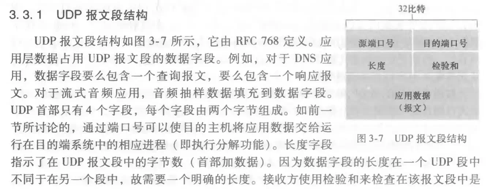
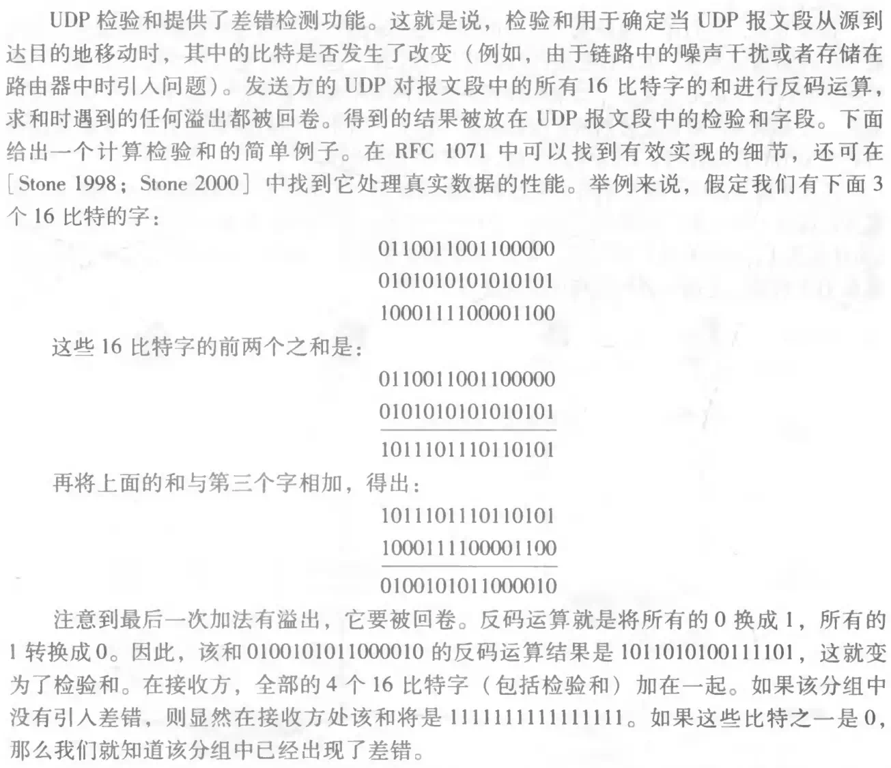

# 计算机网络原理笔记

考勤 5%、作业 15%、实验 20%、期末（英文试卷、半开卷**只能带教材**、中英文答题均可） 60%

## 网络参考资料

- [中科大郑烇、杨坚全套《计算机网络（自顶向下方法 第7版）》](https://www.bilibili.com/video/BV1JV411t7ow) 
- [书籍配套资源网站](https://media.pearsoncmg.com/aw/ecs_kurose_compnetwork_7/cw/)

## 上机时间

地点：北 401 外，上机安排都在星期一的第二节；

| 周数     | 时间                   |
| -------- | ---------------------- |
| 第 6 周  | 10月18日 10:10 - 12:00 |
| 第 10 周 | 11月15日 10:10 - 12:00 |
| 第 12 周 | 11月29日 10:10 - 12:00 |
| 第 14 周 | 12月13日 10:10 - 12:00 |
| 第 16 周 | 12月27日 10:10 - 12:00 |

## 实验指南

| 序号  | 内容                                    |
| ----- | --------------------------------------- |
| 实验1 | windows 环境下用 Java 实现 web 服务器   |
| 实验2 | windows 环境下用 SMTP 实现 email 客户端 |
| 实验3 | 编程实现可靠数据传输原理 go-back-n      |
| 实验4 | 编程实现路由算法                        |
| 实验5 | 交换机 VLAN 实验                        |
| 实验6 | RIP 配置实验                            |

## 第一章 Computer Network and the Internet

### 中英对照名词表

#### 1.1, 1.2 网络边缘

| 中英对照                                            | 概念（待编辑补充）                                           | 备注 |
| --------------------------------------------------- | ------------------------------------------------------------ | ---- |
| 网络边缘（The Network Edge）                        | 主机系统及其运行的应用程序；                                 |      |
| 主机（hosts） 终端系统（end systems）            | 在计算机网络术语中，手机、笔记本电脑、汽车这些设备都被称为主机或终端系统； |      |
| 分组交换机（packet switches）                       | 终端之间由通信链路和分组交换机连接，分组交换机由交换单元、接口单元和控制单元三部分组成； |      |
| 路由器（router）                                    | 负责将包转发到它们的最终目的地； 路由器一般用于网络核心； |      |
| 链路层交换机（link-layer switches）                 | 负责将包转发到它们的最终目的地； 链路层交换机一般用于接入网络（access networks）； |      |
| 带宽（bandwidth）                                   | 单位 bps，每秒传输多少比特；1K bps = 1024 bps； 上下行带宽不对称，一般下行的更宽； |      |
| 协议（protocol）                                    | 网络协议的简称，是通信计算机双方必须共同遵守的约定，怎样建立连接、怎样互相识别； |      |
| 互联网服务供应商（ISP，Internet Service Providers） | 终端系统需要通过互联网服务提供商接入互联网；                 |      |
| 传输控制协议（TCP，Transmission Control Protocol）  | 两个最重要的互联网协议之一； 因特网的主要协议通称为 TCP/IP 协议； |      |
| 互联网协议（IP，Internet Protocol）                 | 两个最重要的互联网协议之一； IP协议指定路由器和终端系统之间发送和接收报文的格式； |      |
| 分布式应用程序（distributed applications）          | 涉及多个相互交换数据的端系统的互联网应用程序；               |      |
| 套接字接口（socket interface）                      | TCP/IP 网络的应用程序编程接口（API，Application Programming Interface） |      |
| 客户端（clients）                                   | 两类主机之一，**为客户提供本地服务的程序**； 一般是桌面和移动 pc 、智能手机等； |      |
| 服务器（servers）                                   | 两类主机之一，**对客户端提供服务的程序**； 一般是存储 Web 页面、流媒体、转发电子邮件的、更大的机器； |      |
| 数字用户线（DSL，Digital Subscriber Line）          | 基于普通电话线的宽带接入技术，可以在一对铜质双绞线上同时传送数据和话音信号； |      |
| 光纤入户（FTTH，fiber to the home）                 | 指接入线路全部采用光纤，光纤直接接入到用户家中；             |      |
| 长期演进技术（LTE，Long-Term Evolution）            | 通用移动通信技术的长期演进（翻译比较怪）； 还有一个别名是 3G 演进型系统； |      |
| 以太网（Ethernet）                                  | 现在使用最广泛的局域网技术标准；需要经由路由器才能接入外网； |      |
| 双绞线（TP，twisted pair）                          | 由两根具有绝缘保护层的铜导线组成的传输介质；                 |      |
| 同轴电缆（coaxial cable）                           | 由四层材料组成的电缆，分别是内导体、介电绝缘层、另一个导电层、和绝缘层； |      |
| 光缆（fiber optic cable）                           | 由玻璃或塑料制成的纤维，可作为光传导工具；                   |      |

#### 1.3 网络核心

| 中英对照                                             | 概念（待编辑补充）                                           | 备注 |
| ---------------------------------------------------- | ------------------------------------------------------------ | ---- |
| 网络核心（The Network Core）                         | 路由器的网状网络； 网络 = 网络边缘 + 网络核心 + 接入网络和通信链路； |      |
| 呼叫（call）                                         | 端到端的资源被分配给从源端到目标端的呼叫；                   |      |
| 分组交换（Packet Switching）                         | 两种通过链路和交换机传输数据的基本方法之一； 将报文拆分成多个分组（packet），在链路的输入端对每个分组进行 **存储转发传输**，接受端接受完重新组装报文； 用排队等待的方式处理数据冲突，如果路由器的缓存已满（等待队列满）就会发生丢包，类似不需要预订的餐厅； |      |
| 电路交换（Circuit Switching）                        | 两种通过链路和交换机传输数据的基本方法之一； 发送端会预留端到端资源（即使该呼叫不进行数据传递），会保障在网络链路中分配一个恒定速率用于传输数据，资源在会话期间被保留，类似有预约制的餐厅； 建立连接耗时较长，不适合有突发性的计算机通信，正在逐步被取代； |      |
| 频分多路复用（FDM，Frequency-Division Multiplexing） | 将用于传输信道的总带宽划分成若干个子频道，每个频道传输一路信号； |      |
| 时分多路复用（TDM，Time-Division Multiplexing）      | 将时间分成周期循环的一些小段，每段时间长度是固定的，每个时段用来传输一个子信道，传输时间不重合； 一般用于数字信号传输； |      |
| 统计多路复用（statistical multiplexing）             | 数据包序列没有固定的模式，带宽资源按需共享；                 |      |
| 网络服务提供商（ISPs，Internet Service Providers）   | 能提供为接入互联网而进行的一系列配套服务； 现实世界中同级别 ISP 层次连接不付费； |      |

#### 1.4 网络延迟、损失和吞吐量

| 中英对照                               | 概念（待编辑补充）                                           | 备注 |
| -------------------------------------- | ------------------------------------------------------------ | ---- |
| 节点处理时延（nodal processing delay） | 一般是微秒级别；                                             |      |
| 排队时延（queuing delay）              | 取决于路由器的拥塞程度，La/R 是曲线，每组包各不相同； 一般是微秒到毫秒之间； |      |
| 传输时延（transmission delay）         | 也叫发送时延，一般是时延的主要来源； 数据从 **开始发送** 到 **发送端发送完成** 需要的时间； 是关于该分组长度和该链路传输速率的函数； L = 包长度（packet length） ，单位 bits R = 链路的带宽（link bandwidth）， 单位 bps 传输时延（transmission delay） = L/R |      |
| 传播时延（propagation delay）          | 发送端 **开始发送** 到 **接收端收到数据** 所需要的全部时间； 是关于发送方和接收方之间的距离的函数； d = 物理链路长度（length of physical link） s = 信号传播速度（propagation speed） (~2x108 m/sec) 传播时延（propagation delay）= d/s |      |
| 总节点延迟（total nodal delay）        |  上述四项延迟之和； |      |
| 丢包率（Packet loss）                  | 缓存满时再遇到新数据就会丢包；此时可以视（可靠性）需求重发或不重发该包； |      |
| 吞吐量（Throughput）                   | 是速率，单位 bits/time unit（bps）； 区分瞬时（instantaneous）吞吐量和平均吞吐量（average）； |      |

#### 1.5 层次结构

| 中英对照                  | 概念（待编辑补充）                                           | 备注 |
| ------------------------- | ------------------------------------------------------------ | ---- |
| 层次（layers）            | 网络协议分层，每一层向它上面的层提供相同的服务，并使用来自它下面的层的相同的服务； |      |
| 服务模型（service model） | /                                                            |      |
| 协议栈（protocol stack）  | 不同层的协议放在一起；                                       |      |
| 消息（message）           | 指应用层的数据包；                                           |      |
| 段（segment）             | 指传输层拆分的包（transport-layer packet）；                 |      |
| 数据报文（datagrams）     | 指网络层的数据包；                                           |      |
| 帧（frames）              | 指链路层的包                                                 |      |
| 封装（encapsulation）     | 接收消息，并附加额外的信息（报头信息）再传递给下一个接收者； |      |

#### 1.6 网络攻击

| 中英对照                                       | 概念（待编辑补充）                                           | 备注 |
| ---------------------------------------------- | ------------------------------------------------------------ | ---- |
| 恶意软件（malware）                            | /                                                            |      |
| 僵尸网络（botnet）                             | 由数千个类似被攻击的设备组成的网络，被坏人控制和利用来散布垃圾邮件或进行 DDoS 攻击； |      |
| 木马（spyware）                                | /                                                            |      |
| 病毒（virus）                                  | 需要某种形式的用户交互才能感染设备的恶意软件；               |      |
| 蠕虫（worm）                                   | 可以在没有任何明确的用户交互的情况下感染设备的恶意软件；     |      |
| 自我复制（self-replicating）                   | 一旦感染了一台主机，它就会从那台主机进入互联网上的其他主机； |      |
| 拒绝服务攻击（DoS，denial-of-service attacks） | 使网络、主机无法被合法使用的攻击； 主要包括三种方式：漏洞攻击、瘫痪带宽、瘫痪连接； |      |
| 分布式拒绝服务攻击（DDoS，distributed DoS）    | 攻击者控制多个源并让每个源向目标发送大量流量；               |      |
| 数据包嗅探（packet sniffer）                   | 记录每一个经过的信息包副本的被动接收器；                     |      |
| IP 欺骗（IP spoofing）                         | 将带有虚假源地址的信息包注入互联网；                         |      |

### TCP/IP 五层模型

TCP/IP 是先有实物后有模型；

每一层的功能依赖于下一层，同时向上一层提供服务：

| 协议栈                | 功能                                                         |
| --------------------- | ------------------------------------------------------------ |
| 应用层（Application） | 为人类用户或者其他应用进程提供网络应用服务； TCP/IP 模型在应用层进行 OSI 模型表示层和会话层的工作； 应用层协议数量最多，举例：FTP、SMTP、HTTP、DNS |
| 传输层（Transport）   | 向两个主机中进程之间的数据传输提供服务； 在网络层提供的端到端通信基础上，细分为进程到进程， 将不可靠的通信变成可靠的通信；协议举例：TCP、UDP |
| 网络层（Network）     | 为数据选择路由以完成主机和主机之间的通信，端到端通信，不可靠； 协议举例：IP、路由协议 |
| 链路层（Link）        | 相邻两个网络节点间的数据传输、点到点通信，可靠或不可靠； 协议举例：PPP、（WLAN 的）IEEE 802.11、以太网（Ethernet） |
| 物理层（Physical）    | 提供二进制比特流传输；                                       |

### OSI ISO 七层模型

| 层次栈 | 功能                                                       |
| ------ | ---------------------------------------------------------- |
| 应用层 | /                                                          |
| 表示层 | 允许应用解释传输的数据，例如加密、压缩、机器相关的表示转换 |
| 会话层 | 进行数据交换的同步、检查点、恢复                           |
| 传输层 | /                                                          |
| 网络层 | /                                                          |
| 链路层 | /                                                          |
| 物理层 | /                                                          |

### TCP/IP 模型与 OSI 模型的对比

### 练习题目

#### Circuit Switching, TDM 用时定量计算例题

来自课件 Chapter1_final.ppt P29

> How long does it take to send a file of 640,000 bits from host A to host B over a circuit-switched network?
>
> • All links are 1.536 Mbps
>
> • Each link uses TDM with 24 slots/sec
>
> • 500 msec to establish end-to-end circuit

解：1.536 M / 24 = 64,000；640,000 / 64000 + 500 ms = 10s + 0.5s = 10.5s；

#### Packet Switching 定量计算例题

来自课件 Chapter1_final.ppt P34

> packet switching: 
>
> • with 35 users, probability > 10 active at same time is less than .0004 *

解：概率计算过程见下图（不会用内联公式是这样的）

## 第二章 Application Layer

2021/9/18：目前进度 2.2

### 中英对照名词表

#### 2.1 应用层协议原理 

| 中英对照                                          | 概念（待编辑补充）                                           | 备注 |
| ------------------------------------------------- | ------------------------------------------------------------ | ---- |
| 客户/服务器体系结构（client-server architecture） | 客户向服务器发出服务请求，由服务器完成所请求的服务，并把处理结果回送给客户；服务器必须固定地址；客户端可以是动态地址； |      |
| P2P 架构（Peer-to-Peer architecture）             | 两个或多个端系统不经过服务器而直接通信； 没有永久在线的服务端； 每一个节点都既是服务端又是客户端，新的对等方会带来更大的服务能力，即 P2P 架构的可拓展性（self-scalability）； |      |
| 进程（processes）                                 | 在主机上运行的应用程序； 对于每一对通信进程，通常将一个标记为客户端，另一个进程标记为服务器； |      |
| 报文（messages）                                  | 网络中交换与传输的数据单元，即站点一次性要发送的数据块；     |      |
| IP 地址（IP address）                             | 互联网协议提供的一种统一的地址格式，它为互联网上的每一个网络和每一台主机分配一个逻辑地址； |      |
| 端口号（port number）                             | 表示一台计算机中的特定进程所提供的服务； 客户端可以通过 IP 地址找到对应的服务器端，但服务器端每个应用程序对应一个端口号； |      |
| 套接字（socket）                                  | 网络中不同主机上的应用进程之间进行双向通信的端点； 教材比喻：“一个进程类似于一座房子，它的套接字类似于它的门” |      |
| UDP 协议                                          | 互联网（及更普遍的 TCP/IP 网络）向应用程序提供的两种传输协议之一； 两个进程之间采用 UDP 服务通信无需握手，每个报文传输都是独立的； 接受报文时，传输层需要上传对方的 IP 和 port； |      |
| UDP socket                                        | 只有本应用实体的标识，由一个2元组构成，包括（本IP，本port）； |      |
| 握手协议（handshaking protocol）                  | 两个通信实体在相互发送数据之前，先交换控制数据包；           |      |
| TCP 协议                                          | 互联网（及更普遍的 TCP/IP 网络）向应用程序提供的两种传输协议之一； 两个进程之间的通信需要握手，即之前就建立连接，通信会持续一段时间，通信关系稳定； |      |
| TCP socket                                        | 用于指明应用进程会话的本地标识； 由一个4元组（源IP，源port，目标IP，目标port）组成； 不必在每个报文都指定这 4 元组； |      |
| 安全套接字层（SSL，Secure Sockets Layer）         | SSL 不是与 TCP 和 UDP 同级的第三种互联网传输协议，而是对 TCP 的增强； SSL 在应用层，在 TCP 之上； 带有 SSL 的 TCP 可以提供关键的进程对进程的安全服务，包括加密、数据完整性和端点认证； |      |

#### 2.2 WEB 和 HTTP 和 FTP 

| 中英对照                                                 | 概念（待编辑补充）                                           | 备注 |
| -------------------------------------------------------- | ------------------------------------------------------------ | ---- |
| 超文本传输协议（HTTP 协议，HyperText Transfer Protocol） | 因特网上应用最为广泛的应用层协议； HTTP 是无状态的，意思是服务器不维护关于客户的任何信息； 默认端口号 80，使用客户端/服务器模式； |      |
| Web 页面（Web page）                                     | 由一些对象组成，对象可以是 HTML 文件，JPEG 图像，Java 小程序，音频文件等； Web 页面含有一个基本的 HTML 文件（base HTML file），该文件通过 URL 实现若干个对象的引用； |      |
| 统一资源定位器（URL，Uniform Resource Locator）          | 包括协议名、用户名、口令字、主机名、路径名、端口；           |      |
| 往返时延（RTT，Round-Trip Time）                         | 数据从网络一端传到另一端所需的时间；                         |      |
| 非持久 HTTP 连接（non-persistent connections）           | 每个对象需要两个 RTT； 操作系统必须为每个 TCP 连接都分配资源，但浏览器通常会打开并行 TCP 连接； |      |
| 持久 HTTP 连接（persistent connections）                 | 服务器在发送响应后仍保持 TCP 连接； 用相同的连接传送同一客户端和服务器之间的后续请求和响应报文； 客户端遇引用对象可以尽快发送请求； |      |
| Cookies                                                  | 由于 HTTP 不维护用户状态，所以诞生了 cookies； 四个组成部分：HTTP 响应报文中有一个 cookie 的首部行、HTTP 请求报文中有一个 cookie 的首部行、用户端系统中保留一个 cookie 文件、Web 后台有一个后端数据库； 当最初的 HTTP 请求到达服务器时，该 Web 站点产生一个唯一的ID，以此作为索引在后端数据库中产生一项； |      |
| Web 缓存（Web Caching）                                  | 也叫代理服务器（proxy server），代表源 Web 服务器满足 HTTP 请求的网络实体；通常由 ISP 购买安装； |      |
| 条件 GET（conditional GET）                              | 允许缓存器证实它缓存的对象是否为最新的机制；                 |      |
| 内容分发网络（CDNs，Content Distribution Networks ）     | 减少网络中冗余数据的重复传输，使之最小化，将广域传输转为本地或就近访问； |      |
| FTP 协议（FTP，the file transfer protocol）              | 向远程主机上传输或接收文件； FTP 使用两个并行 TCP 连接，一个 TCP 连接用于发送控制信息进行用户认证，另一个 TCP 连接用于实际传输文件；默认端口号 21，使用客户端/服务器模式； |      |

#### 2.3 因特网中的电子邮件

| 中英对照                                         | 概念（待编辑补充）                                           | 备注 |
| ------------------------------------------------ | ------------------------------------------------------------ | ---- |
| SMTP 协议（SMTP，simple mail transfer protocol） | 建立在 FTP 文件传输服务上的一种邮件服务，主要用于系统之间的邮件信息传递，并提供有关来信的通知； 消息必须是7位的 ASCII 码（可以直接打印出来）； 默认端口号 25，使用客户端/服务器模式，是异步通信，持久连接； |      |
| 邮件报文（Mail message format）                  | /                                                            |      |
| POP 协议（Post Office Protocol ）                | 进行用户身份确认，并允许电子邮件客户端下载服务器上的邮件，但是在客户端的操作不会反馈到服务器上；默认使用 TCP 的 110 端口； |      |
| IMAP 协议（Internet Mail Access Protocol ）      | 可以通过浏览信件头来决定是否收取、删除和检索邮件的特定部分，还可以在服务器上创建或更改文件夹或邮箱； 支持联机操作和断连接操作； 可以获得更快的响应时间； 默认使用 143 端口； |      |

#### 2.4 DNS 

| 中英对照                            | 概念（待编辑补充）                                           | 备注 |
| ----------------------------------- | ------------------------------------------------------------ | ---- |
| 域名系统（DNS，Domain name system） | 负责将有意义的字符串网址转换为二进制的网络地址； 是将域名（主机名）和 IP 地址相互映射的一个分布式数据库，能够使人更方便地访问互联网； 使用 UDP 端口 53； |      |
| 顶级域（top lever domains）         | 域名由两组或两组以上的ASCII或各国语言字符构成，各组字符间由点号分隔开，最右边的字符组称为顶级域名或一级域名、倒数第二组称为二级域名、倒数第三组称为三级域名、以此类推； 顶级域名又分为三类：一是国家和地区顶级域名，二是通用顶级域名，三是新顶级域名； |      |
| 子域（subdomains）                  | /                                                            |      |

#### 2.4 P2P 应用

| 中英对照                      | 概念（待编辑补充）                                           | 备注 |
| ----------------------------- | ------------------------------------------------------------ | ---- |
| P2P 架构                      | 没有一直运行的服务器，任意端系统都可以直接通信； 充分利用每个对等体（peer）的服务能力； |      |
| BitTorrent 协议               | 一种流行 P2P 协议，用于文件分发；                            |      |
| 洪流（Torrent）               | 节点的组，之间交换文件块，每一个块 256KB；                   |      |
| 分发时间（distribution time） | 所有 N 个对等方得到一个文件副本所需要的时间；                |      |

#### 2.5 视频流与内容分发网

| 中英对照                                                     | 概念（待编辑补充）                                           | 备注 |
| ------------------------------------------------------------ | ------------------------------------------------------------ | ---- |
| 经 HTTP 的动态适应性流（DASH，Dynamic Adaptive Streaming over HTTP） | 将视频编码为几个不同的版本，每个版本具有不同的比特率，允许用户动态的请求不同版本的视频段数据块； |      |
| 内容分发网络（CDN，Content Distribution Network）            | 管理分布在多个地理位置的服务器，这些服务器存储视频，并且将每个用户请求都定向到一个提供最好体验的 CDN 位置； |      |
| 集群选择策略（cluster selection strategy）                   | 动态地将客户定向到 CDN 中的某个服务器集群或数据中心的机制；  |      |

### 常见应用的协议使用表

### HTTP 报文格式

有两种类型的 HTTP 报文：请求报文、响应报文

#### 请求报文

包括请求行、首部行、换行回车符

#### 响应报文

包括状态行、首部行、数据

### 练习题目

#### Web 缓存优化访问速度例题

方法1：增加带宽，使用更快的接入链路

方法2：安装本地缓存

#### 作业 2.7，2.8节后 15题

**1.**   Consider Figure2.12, for which there is an institutional network connected to the Internet. Suppose that the average object size is 900,000 bits and that the average request rate from the institution’s browsers to the origin servers is 10 requests per second. Also suppose that the amount of time it takes from when the routers on the Internet side of the access link forwards an HTTP request until it receives the response is two seconds on average (see Section 2.2.5). Model the total average response time as the sum of the average access delay (that is, the delay from Internet router to institution router) and the average Internet delay. For the average access delay, use△/(1-△β), where △ is the average time required to send an object over the access link andβis the arrival rate of objects to the access link.**（改成 15Mbps）**

a.   Find the total average response time.

b.   Now suppose a cache is installed in institution LAN. Suppose the hit rate is 0.6. Find the total response time.

#### P2P 和 CS 模式的下载速度

## 第三章 Transport Layer

运输层提供不同主机的进程上的通信；

| 中英对照                  | 概念（待编辑补充）                                           | 备注 |
| ------------------------- | ------------------------------------------------------------ | ---- |
| IP 协议                   | 尽最大的努力在通信主机之间交付报文，但不做任何确保，是不可靠服务； |      |
| UDP 协议                  | 将两个端系统间 IP 的主机间交付服务拓展到进程间交付服务（这个行为称为多路复用和多路分解）； UDP 协议仅提供进程间数据交付，和错误检查； |      |
| TCP 协议                  | 将两个端系统间 IP 的主机间交付服务拓展到进程间交付服务 TCP 协议提供可靠数据传输，拥塞控制，连接管理； |      |
| 反码（one's complement ） |                                                              |      |
| 补码（two's complement ） |                                                              |      |

### 3.2 多路复用和多路分解

| 中英对照                   | 概念（待编辑补充）                                           | 备注 |
| -------------------------- | ------------------------------------------------------------ | ---- |
| 多路分解（demultiplexing） | 将运输层报文段中的数据交付到正确的套接字                     |      |
| 多路复用（multiplexing）   | 在源主机从不同套接字中收集数据块，并为每个数据块都封装上首部信息（这将在以后用于分解）从而生成报文段，然后将报文段传递到网络层 |      |

### 3.4 可靠数据传输原理

| 中英对照                                                     | 概念（待编辑补充）                                           | 备注 |
| ------------------------------------------------------------ | ------------------------------------------------------------ | ---- |
| 可靠数据传输协议（reliable data transfer protocol）          | 能够使数据通过一条可靠信道传输的服务模型，借助可靠信道，传输数据比特不会损坏或丢失，且所有数据都是按照发送顺序进行交付； |      |
| 自动重传请求协议（ARQ，Automatic Repeat  reQuest）           | 包括三种协议功能：差错检测，接受方反馈（表明接受方正确接收了内容还是没有），重新传输（接受方有误时，发送方重新传输该分组） |      |
| 有限状态机（FSM，Finite-State Machine）                      | \                                                            |      |
| 肯定确认（positibe acknowledgment）                          | \                                                            |      |
| 否定确认（negative acknowledgment）                          | \                                                            |      |
| 停止等待协议（stop-and-wait）                                | 发送方确信已正确接收当前分组后，才发送下一块新数据；         |      |
| 冗余数据分组（duplicate data packet）                        | \                                                            |      |
| 倒计数定时器（countdown timer）                              | \                                                            |      |
| 回退 N 步（GBN，Go-Back-N）或滑动窗口协议（Sliding-window protocol） | 这里放个 [演示动画](https://media.pearsoncmg.com/ph/esm/ecs_kurose_compnetwork_8/cw/content/interactiveanimations/go-back-n-protocol/index.html) |      |
| 选择重传（SR，Selective Repeat）                             | \                                                            |      |
| 累积确认（cumulative acknowledgment）                        | \                                                            |      |

### 3.5 TCP 连接

| 中英对照 | 概念（待编辑补充） | 备注 |
| -------- | ------------------ | ---- |
|          |                    |      |

### UDP 的报文段结构和差错检测

| 机制         | 用途和说明                                                   |
| ------------ | ------------------------------------------------------------ |
| 检验和       | 用于检测在一个传输分组中的比特错误                           |
| 定时器       | 用于在一个分组或其 ACK 丢失超时时重传该分组                  |
| 序号         | 用于为从发送方流向接收方的数据分组按顺序编号； 所接收分组的序号间的空隙可使接收方检测出丢失的分组； 具有相同序号的分组可使接收方检测出一个分组的冗余副本； |
| 确认         | 接收方用于告诉发送方一个分组或一组分组已被正确地接收到了； 确认报文通常携带着被确认的分组或多个分组的序号； 确认可以是逐个的或累积的，这取决于协议； |
| 否定确认     | 接收方用于告诉发送方某个分组未被正确地接收； 否定确认报文通常携带着未被正确接收的分组的序号； |
| 窗口、流水线 | 发送方也许被限制仅发送那些序号落在一个指定范围内的分组； 通过允许一次发送多个分组但未被确认，发送方利用率可在"停等"操作模式的基础上增加； 窗口的长度可根据接收方接收和缓存报文的能力、网络中的拥塞程度或两者情况来进行设置； |

