# 操作系统笔记

### 成绩构成

平时40% + 期末60% 

加分项：挑战性作业、研究性项目、各种随堂测试
扣分项：迟到早退一次扣1分，缺勤一次扣2分，3次缺勤取消考试资格，请假、免听除外（提前一天通知老师）

作业和实验迟交一天扣1分/40分，抄袭一次平时成绩扣10分/40分，发现两次取消考试资格

## 1. 绪论

### 课程参考资料

- [教务处教学平台](http://jwc.bjtu.edu.cn)
  - 操作系统电子教材
  - 操作系统参考书
  - 最简操作系统 linux 0.11 相关资料
- 国外教学网站
  - http://www.scs.stanford.edu/11wi-cs140/
  - http://www.cs.cmu.edu/~410/
  - http://www.cs.berkeley.edu/~kubitron/courses/cs162-F10/

### 操作系统的作用

- 用作扩充机器（或虚拟机）
  - 在裸机上提供一个虚拟机抽象层，处理复杂多样的硬件，使计算机系统功能显著增强、使用更为方便
- 用户与计算机硬件系统之间的接口
  - 命令方式（操作系统外壳）：面向一般用户
    - 命令行/菜单式/命令脚本式/图形用户接口
  - 系统调用方式（操作系统内核）：面向程序开发人员
    - 形式上类似于过程调用，编制程序中使用
- 计算机系统资源的管理者
  - 管理对象：处理器、存储器、外围设备以及信息
  - 管理内容：资源的分配、回收和访问操作，共享、保护

### 操作系统的发展过程

#### 单道批处理系统

OS的前身，脱机输入/输出技术，解决人机矛盾、CPU和I/O速度不匹配问题，特征如下：

- 自动性。在顺利情况下，在磁带上的一批作业能自动地逐个地依次运行，而无需人工干预。
  顺序性。磁带上的各道作业是顺序地进入内存，各道作业的完成顺序与它们进入内存的顺序，在正常情况下应完全相同，亦即先调入内存的作业先完成。
  单道性。内存中仅有一道程序运行，即监督程序每次从磁带上只调入一道程序进入内存运行，当该程序完成或发生异常情况时，才换入其后继程序进入内存运行。

#### 多道批处理系统


中断技术的引入为多道批处理提供了技术基础，主要优缺点如下：

- 资源利用率高。由于在内存中驻留了多道程序，它们共享资源，可保持资源处于忙碌状态，从而使各种资源得以充分利用。
- 系统吞吐量大。系统吞吐量是指系统在单位时间内所完成的总工作量。能提高吞吐量的主要原因可归结为：第一，CPU 和其它资源保持“忙碌”状态； 第二，仅当作业完成时或运行不下去时才进行切换，系统开销小。
- 平均周转时间长。作业的周转时间是指从作业进入系统开始，直至其完成并退出系统为止所经历的时间。在批处理系统中，由于作业要排队，依次进行处理，因而作业的周转时间较长，通常需几个小时，甚至几天。
- 无交互能力。用户一旦把作业提交给系统后，直至作业完成，用户都不能与自己的作业进行交互，这对修改和调试程序是极不方便的

#### 分时系统

分时系统与多道批处理系统相比，具有非常明显的不同特征，可以归纳成以下四个特点：

1. 多路性。允许在一台主机上同时联接多台联机终端，系统按分时原则为每个用户服务。宏观上，是多个用户同时工作，共享系统资源；而微观上，则是每个用户作业轮流运行一个时间片。多路性即同时性，它提高了资源利用率，降低了使用费用，从而促进了计算机更广泛的应用。
2. 独立性。每个用户各占一个终端，彼此独立操作，互不干扰。用户感觉是一人独占主机。
3. 及时性。用户的请求能在很短的时间内获得响应。此时间间隔是以人们所能接受的等待时间来确定的，通常仅为 1～3 秒钟。
4. 交互性。用户可通过终端与系统进行广泛的人机对话。其广泛性表现在：用户可以请求系统提供多方面的服务，如文件编辑、数据处理和资源共享等

#### 实时系统

实时系统有着与分时系统相似但并不完全相同的特点，下面从五个方面对这两种系统加以比较。

1. 多路性。实时信息处理系统也按分时原则为多个终端用户服务。实时控制系统的多路性则主要表现在系统周期性地对多路现场信息进行采集，以及对多个对象或多个执行机构进行控制。而分时系统中的多路性则与用户情况有关，时多时少。
2. 独立性。实时信息处理系统中的每个终端用户在向实时系统提出服务请求时，是彼此独立地操作，互不干扰；而实时控制系统中，对信息的采集和对对象的控制也都是彼此互不干扰。
3. 及时性。实时信息处理系统对实时性的要求与分时系统类似，都是以人所能接受的等待时间来确定的；而实时控制系统的及时性，则是以控制对象所要求的开始截止时间或完成截止时间来确定的，一般为秒级到毫秒级，甚至有的要低于 100 微秒。
4. 交互性。实时信息处理系统虽然也具有交互性，但这里人与系统的交互仅限于访问系统中某些特定的专用服务程序。它不像分时系统那样能向终端用户提供数据处理和资源共享等服务。
5. 可靠性。分时系统虽然也要求系统可靠，但相比之下，实时系统则要求系统具有高度的可靠性。因为任何差错都可能带来巨大的经济损失，甚至是无法预料的灾难性后果，所以在实时系统中，往往都采取了多级容错措施来保障系统的安全性及数据的安全性。

### 操作系统的基本特性

并发性和共享性

#### 并发 VS 并行

并行：在同一时刻发生

并发：在同一时间间隔内发生

#### 进程、线程

进程：

- 引入进程是为了使多个程序能**并发**执行；
- 进程是在系统中能独立运行并作为资源分配的基本单位，由一组机器指令、数据和堆栈等组成，多个进程之间可以并发执行和交换信息；
- 一个进程在运行时需要一定的资源，如 CPU、存储空间及 I/O 设备等；

线程：

- 通常在一个进程中可以包含若干个线程，它们可以利用进程所拥有的资源；
- 通常都是把进程作为**分配资源的基本单位**，而把线程作为**独立运行和独立调度的基本单位**；
- 由于线程比进程更小，基本上不拥有系统资源，调度开销小，能提高系统内多个程序间并发执行的程度；

实现资源共享的方式主要有两种：互斥共享方式、同时访问方式

### 微内核操作系统结构

微内核操作系统结构 (Micro Kernel) 即将操作系统中最基本的部分放入内核中，而把操作系统的绝大部分功能都放在微内核外面的一组服务器(进程)中实现

特征描述：

1. 足够小的内核，只实现与硬件紧密相关的处理，只实现一些较基本的功能，只为构建通用 OS 提供基础

2. 客户/服务器模式

3. 应用“机制与策略分离”原理

4. 采用面向对象技术，利用“对象”、“封装”和“继承”等概念

### 中断

中断可分为外部中断和内部中断

外部中断包括不可屏蔽中断和可屏蔽中断，内部中断包括陷入，故障，中止

## 2.  进程管理

进程是进程实体的运行过程，是系统进行资源分配和调度的一个独立单位，操作系统把CPU资源分配给进程的过程就是调度，引入进程的目的，就是为了能并发执行多个程序。

程序并发执行出现的问题：

1. 交替间断回来执行还能保持上次的状态

2. 失去封闭性

3. 计算结果不可再现

4. ……

### 进程控制块PCB

程序的仅仅是代码和数据组成的，而并发执行要求CPU需要保存指令指针寄存器，寄存器，堆栈等信息，因此切换时需要先保存 $CPU_i$ 的信息，然后加载 $CPU_j$ 的信息，再开始执行新的进程 $j$ ，这些数据就通过进程控制块PCB来存储

PCB是进程实体的一部分，拥有描述进程情况及控制进程运行所需的全部信息的记录性数据结构，常驻内存并存放于操作系统专门开辟的PCB区

#### 进程的组成


#### 进程的特征

* 结构特征：程序段、数据段及进程控制块

* 动态性：生命周期及“执行” 本质

* 并发性：共存于内存、宏观同时运行

* 异步性：推进相互独立、速度不可预知

* 独立性：调度、资源分配、运行

### 进程的状态模型

#### 进程的三状态模型

* 就绪

* 执行

* 等待

#### 进程的五状态模型

* 新状态

* 终止状态

* 就绪

* 执行

* 等待

#### 引入挂起状态


* 新状态

* 就绪挂起状态

* 就绪状态

* 阻塞挂起状态

* 阻塞状态

* 运行状态

* 终止状态

#### 进程图

描述进程家族关系的有向树，包括结点/有向边，用来描述父/子进程关系

### 创建和终止进程

需要创建进程的场景：用户登录、作业调度、提供服务、应用请求……

需要终止进程的场景：正常结束、异常结束、特权指令错、非法指令错、运行超时、等待超时、算术运算错、I/O故障、外界干预、父进程请求/终止……

##### Create()

1. 申请Pid,空白PCB
2. 为新进程的程序和数据及用户栈分配必要的内存空间
   所需内存大小问题
3. 初始化进程控制块
   自身/父进程标识符
   处理机状态/调度信息
4. 将新进程插入到就绪进程队列

##### Terminate()

1. 读取进程状态，若其正处于执行状态，应立即中止执行并设置调度标志为真
2. 终止其子进程
3. 资源归还
4. 释放PCB

### 阻塞和唤醒进程

需要阻塞进程的场景：请求系统服务但不能立即满足、启动某种操作且必须等操作完成之后才能继续执行、新数据尚未到达、无新工作可做

需要唤醒进程的场景：系统服务满足、操作完成、数据到达、新任务出现

##### Block()

1. 先立即停止执行，把进程控制块中的现行状态由“执行”改为阻塞，并将它插入到对应的阻塞队列中
2. 转调度程序进行重新调度，将处理机分配给另一就绪进程，并进行切换

##### Wakeup()

首先把被阻塞进程从等待该事件的阻塞进程队列中移出，将其PCB中的现行状态由阻塞改为就绪，然后再将该进程插入到就绪队列中

### 挂起和激活进程

##### Suspend()

1. 检查被挂进程现行状态并修改和插队
2. 复制PCB到指定区域
3. 若被挂进程正在执行则转向调度程序重新调度

##### Activate()

1. 检查进程现行状态并修改和插队
2. 若有新进程进入就绪队列且采用了抢占式调度策略，则检查和决定是否重新调度

### 系统调用中的进程控制

##### fork 系统调用（克隆）

* 创建子进程，父子进程代码共享。子进程复制父进程当前的所有其他上下文信息
  然后都从同一地方开始运行

* 0号（对换）进程 => 1号（始祖）进程

* 以1号进程为根创建其他进程，形成进程树。

##### exec 系统调用（变异）

* 改变进程原有代码（更新用户级上下文）

* 没有新的进程产生

##### exit 系统调用

* 实现进程自我终止

### 进程同步

临界资源：一段时间内只允许一个进程访问的资源

临界区：每个进程中访问临界资源的那段代码称为临界区

如果共享该临界资源的每个进程能互斥的进入自己的临界区，就能保证对临界资源的互斥访问。
所有的（进程间）共享变量一般都应看做临界资源

#### 临界资源的互斥访问

加锁 → 关键代码执行 → 解锁

#### 软件互斥peterson算法


#### 进程同步机制基本准则

1. 空闲让进（效率）：当无进程处于临界区时，可允许一个请求进入临界区的进程立即进入自己的临界区

2. 忙则等待（正确性）：当已有进程进入自己的临界区时，所有企图进入临界区的进程必须等待

3. 有限等待（公平性）：对要求访问临界资源的进程，应保证该进程能在有限时间内进入自己的临界区

4. 让权等待（效率）：当进程不能进入自己的临界区时，应释放处理机

### 信号量机制

用于实现进程互斥和前驱关系

#### 整型信号量

Dijkstra 把整型信号量定义为一个用于**表示资源数目的整型量** S，它与一般整型量不同，除初始化外，仅能通过两个标准的**原子操作**（**原语**，英文Atomic Operation）wait(S)和 signal(S)访问

> 原语是指**完成某种功能且不被分割不被中断执行的操作序列**；

**进程处于“忙等”的状态**

Wait(S)和 signal(S)操作可描述为：（也有些材料写的是P操作和V操作）

```go
wait(S):      
    while S<=0 
        do no-op;
    S := S-1;

signal(S):    
    S := S+1;
```

S值为正数：有S个临界资源可用

S值为0：临界资源全部已经被占用

S为负数：S的绝对值为等待使用该资源而被阻塞的进程数

用法伪代码：

```go
func:
    begin
        repeat
            wait(S);
            do_something();
            signal(S);
        until false;
    end
```


#### 记录型信号量

增加一个进程链表指针 L，用于链接上述所有等待进程

```go
type semaphore=record
    value: integer;
    L:     list of process;
    end

procedure wait(S)
    var S：semaphore;
    begin
        S.value:=S.value-1;
        if S.value<0 then block(S.L);
    end

procedure signal(S)
    var S: semaphore;
    begin
        S.value:=S.value+1;
        if S.value<=0 then wakeup(S.L);
    end
```

#### AND型信号量

对于多个进程要共享两个以上的资源的情况，普通信号量机制则可能导致发生死锁，例如哲学家进餐问题；

解决方案：

1. 若干个临界资源的分配采取原子方式。
2. 一次申请多种不同资源，若所有资源都有空闲资源，则分配；
2. 否则，一个资源都不分配。

例：假定现有两个进程 A 和 B，他们都要求访问共享数据 D 和 E，可为这两个数据分别设置用于互斥的信号量 Dmutex 和 Emutex，并令它们的初值都是 1，相应地，在两个进程中都要包含两个对 Dmutex 和 Emutex 的操作，即

```go
process A: 
    wait(Dmutex); 
    wait(Emutex); 

process B:
    wait(Emutex); 
    wait(Dmutex);
```

若进程 A 和 B 按下述次序交替执行 wait 操作：

```go
process A: wait(Dmutex);    // 于是 Dmutex=0
process B: wait(Emutex);    // 于是 Emutex=0
process A: wait(Emutex);    // 于是 Emutex=-1 A 阻塞
process B: wait(Dmutex);    // 于是 Dmutex=-1 B 阻塞
```

### 三类经典进程同步问题和解法

解题思路：

1. 分析临界资源以及对应的临界区
2. 分析资源和同步要求（互斥、先后、共享）
3. 一步一步加约束条件实现：

注意事项：

1. 信号量的合法操作只有初始化赋值，wait()，signal()，**不可以对信号量进行算术操作和逻辑判断**
2. 互斥关系靠进程内临界区前后成对 wait, signal 实现，先后关系靠 signal, wait 分别出现实现；
3. 注意不能颠倒 wait 和 signal 序列的操作顺序

#### 生产者-消费者问题

对资源设一个mutex互斥信号量，和一个记录资源数量的信号量；

生产者：等拿到互斥锁再放资源

消费者：等有资源，再加互斥锁取走；

------

随堂练习题的坑：图书馆占座的读者是一个进程，所以不是生产者消费者问题，~~不要学了之后看啥都是生产者和消费者问题~~

#### 哲学家进餐问题

~~为了预防幽门螺旋杆菌，请不要模仿这些哲学家的行为~~

重点在于防止死锁：

1. 只允许最多n-1个哲学家同时进餐，保证至少有一个哲学家可以同时拿到两支筷子
2. 仅当哲学家左右两支筷子均可使用时，才允许他拿筷进餐
3. 规定奇数号哲学家先拿左筷后拿右筷，而偶数号哲学家则相反
4. 筷子统一交给一个服务员分配，要吃饭向服务员申请……

作业2.10题有1.的实现，来自南京大学网课《操作系统：设计与实现》的这段代码是2.的情况

```c++
// 拿筷子
mutex_lock(&mutex);
while(!(avail[lhs] && avail[rhs]) ) {
	wait(&cv, &mutex);
}
avail[lhs] = avail[rhs] = false;
mutex_unlock(&mutex);

// 放筷子
mutex_lock(&mutex);
avail[lhs] = avail[rhs] = true;
broadcast(&cv)
mutex_unlock(&mutex);
```

#### 读者-写者问题

保证任何写者进程必须与其它进程互斥地访问共享数据对象（数据文件或记录）的问题

- 多个进程共享一个数据对象
- 只要求读操作的进程称为读者
- 包括写操作的进程称为写者

总结：读读可共存，读写和写写互斥；

##### 读者-写者问题的变量设计

- 写者进程与其它进程的互斥执行：写互斥信号量wmutex，初始值为1
- 读者进程之间的并发执行：读者进程计数变量readercount，表示正在执行的读者进程数量，初始值为0
- 读者进程计数变量的互斥访问：readercount对于多个读者进程而言是临界资源，应为之设置读互斥信号量rmutex，其初始值为1

```go
writer:
   begin
      repeat
         wait(wmutex);
         Perform write operation; 
         signal(wmutex);
      until false;
   end

reader:
   begin
      repeat
         wait(rmutex);
         if readercount=0 
		    then wait(wmutex);
		 readercount := readercount +1;
         signal(rmutex);
         Perform read operation;
         wait(rmutex);
         readercount := readercount -1;
         if readercount=0 then signal(wmutex);
         signal(rmutex);
      until false;
   end
```

### 管程

基于信号量的进程同步机制的弊端

- 访问临界资源的各进程均须自备同步操作
- 大量同步操作分散不利于系统管理
- 同步操作使用不当可能导致系统死锁

**对策：引入管程**

- 软硬件资源及操作抽象描述为管程
- 并发进程间的同步操作，分别集中于相应的管程中，由管程专职负责同步方案

```go
producer:
Var nextp: item;
   begin
      repeat
         produce an item in nextp;
         wait(empty);   wait(mutex);
         buffer[in] := nextp;   in := (in+1) mod n;
         signal(mutex);   signal(full);
      until false;
   end

consumer:
Var nextc: item;
   begin
      repeat
         wait(full);   wait(mutex);
         nextc := buffer[out];   out := (out+1) mod n;
         signal(mutex);   signal(empty); 
         consume the item in nextc;
      until false;
   end
```

### 进程间通信

- 共享存储器系统
  - 申请一块物理空间，不同进程虚拟空间映射到这块物理空间

- 管道通信系统
  - 利用一个文件通信，对文件按队列处理
  - 生产者-消费者模型
- 消息传递系统
  - 利用共享的内核空间中的消息列表通信

### 线程

- 一个进程中有一个或者多个线程

- 每个线程是进程中可独立调度执行代码段的一次执行过程。
- 同一个程序中的全局变量在各个线程中是共享的，但是线程之间的局部变量是完全独立的
- 资源是共享的：打开文件；信号量；进程空间
- 进程是资源分配的基本单位，线程是调度的基本单位

进程：程序级别的并发。一个程序和另一个程序是独立的并发执行体。
线程：函数级别的并发。在一个程序中有多个线程函数，这些函数可以独立并发执行。提高了并发度。

进程间隔离，线程可以共享所属进程下的资源

#### 同步机制总结

||信号量|线程锁<br>条件变量|管程|
|--------|----------------------|----------------------------------------|------------------------|
|互斥命令|wait(sem)<br/>signal(sem)|lock(mutex)<br>unlock(mutex)|monitor(object)|
|要求|先wait再signal|先lock再unlock|无|
|同步命令|wait(sem)<br/>signal(sem)|cond_wait(cond,mutex)<br/>cond_signal(cond)|mon_wait()<br/>mon_signal()|
|要求|无|无|无|

## 3. 处理机调度

### 多级调度


#### 高级调度（作业/长程/宏观调度）

- 概念：用于决定把外存上处于后备队列中的哪些作业接纳进入可执行的进程池，并为它们创建进程和分配必要资源；然后，再将新创建进程插入到就绪队列上准备执行
- 作业调度机制要领
  - 作业量确定：多道程序度(Degree of Multiprogramming)
  - 作业选择：调度算法

#### 中级调度（中程调度）

- 概念：为提高内存利用率和系统吞吐量，应使那些暂时不能运行的进程放弃占用内存资源，即调至外存上去等待；当内存稍有空闲时，可将外存中那些重又具备运行条件的就绪进程重新调入内存，修改其状态和挂到就绪进程队列等待进程调度
- 实质：存储器管理中的对换功能

#### 低级调度（进程/短程调度）

- 概念：用来决定就绪队列中的哪个进程将获得处理机，然后再由分派程序（Dispatcher）执行把处理机分配给该进程的具体操作
- 操作系统配置进程调度机制：基本调度，所有类型操作系统均需配置
- 调度方式分类
  - 非抢占方式（仅适用于批处理系统）
  - 抢占方式（分时、实时及批处理系统均可）

#### 非抢占与抢占调度方式比较

- 非抢占调度方式(Non-preemptive Mode)
  - 处理机分配给进程直至完成或阻塞
  - 引起进程调度的因素：当前进程执行完毕或因发生事件、提出I/O请求、执行原语操作而阻塞
  - 实现简单、系统开销小，但难以满足紧急任务要求，故不宜在实时系统中采用
- 抢占调度方式(Preemptive Mode)
  - 允许暂停正在执行进程和重新分配处理机
  - 抢占原则（优先权/短作业优先/时间片原则）

### 调度算法

- 先来先服务调度算法：等待时间长的优先
- 短进程优先调度算法：
  - （剩余）服务时间短的优先
  - 本教材默认的短进程优先算法为 **非抢占式调度**

- 高优先权优先调度算法：紧迫型作业优先
- 高响应比优先调度算法：
  - $响应比=1+ (\frac{等待时间}{要求服务时间})$
  - 每次选响应比最大的执行

- 时间片轮转调度算法：
  - 按先来先服务原则排队，**抢占式调度**
  - 时间片大小的确定：根据系统对响应时间的要求、就绪队列中进程的数目、系统的处理能力
- 多级队列调度算法（待补充）
- 多级反馈队列调度算法（待补充）

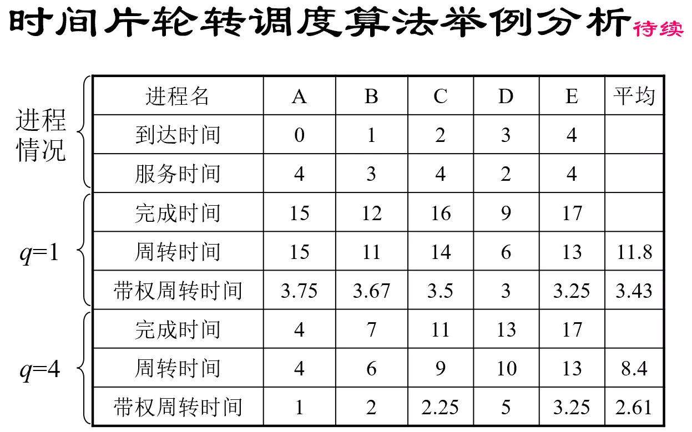

#### 选择和评价算法

- 算法时间/空间复杂度
- 面向用户的准则
  - 周转时间短
    - 平均周转时间 $T=\frac{1}{n}[\sum_{i=1}^n T_i]$ 
    - 平均带权周转时间 $W=\frac{1}{n}[\sum_{i=1}^n \frac{T_i}{T_{S_i}}]$ （$\frac{T_i}{T_{S_i}}$ 即周转时间/服务时间）
  - 响应时间快
  - 截止时间的保证
  - 优先权准则
- 面向系统的准则
  - 系统吞吐量高
  - 处理机利用率好
  - 各类资源的平衡利用

### 死锁产生和处理

#### 概念

##### 死锁（Deadlock）

- 在多道程序系统中，并发执行的多个进程(线程)因争夺资源而造成的一种若无外力作用有关进程都将永远不能向前推进的僵持状态或僵局
- 在多道程序系统中，一组进程（线程）中的每一个进程都无限等待被同组的另外一个进程所占有且永远不会释放的资源的状态。

##### 饿死（Starvation）

- 资源不被一个进程永久占用的情况下，系统不能保证某个进程等待该资源的时间上界，从而使得该进程长时间等待该资源而无法在规定的时间完成
- 例如：短进程优先调度算法，不断有更短的进程到达时，长进程将永久等待而饿死。

##### 活锁（Livelock）

- 除了进程状态可能在不断改变外，与死锁类似没有一个进程能向前执行。
- 例如：哲学家都拿起左手的筷子，试图拿起右手的筷子不成，等待一段时间后都放下筷子又同时拿起左手的筷子。

#### 资源分配图 RAG

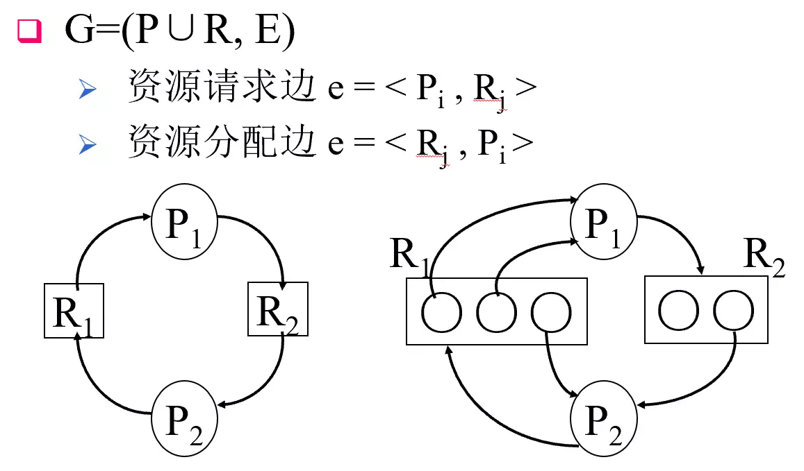

#### 死锁产生的 4 个必要条件

1. 互斥条件：资源排它性使用，其他进程必须等待
2. 请求和保持条件：请求资源未果，进程虽阻塞但保持占有资源不放
3. 不剥夺条件：进程已获资源未使用完之前不能被剥夺
4. 环路等待条件：进程-资源环形链

#### 预防死锁

设置对程序代码在**申请资源环节**的限制，互斥条件是资源本身固有的，只要可以破坏产生死锁的其他3个必要条件之一，就可防止死锁的发生。

##### 一次性申请全部资源

- 优点：简单、安全且易于实现
- 缺点：全部资源一次申请，可能部分资源在很晚才会用到，资源浪费；
  如果一个将来才用的资源被其他进程占有，本进程也无法执行，进程延迟

##### 申请失败则释放所有资源：破坏“不剥夺”条件

- 优点：资源利用率提高
- 缺点：实现复杂，代价很大；
  要额外保证已经完成的部分工作不失效；
  反复地申请与释放资源、进程周转时间延长、系统吞吐量降低、系统开销增加，性能下降；

##### 按升序申请资源

- 优点：资源不是一次申请好，也不需要放弃已有资源，因此比前两种方法的资源利用率、系统吞吐量更好
- 缺点：编号小的后使用，资源浪费；
  编号排序有开销；
  编程者负担重，给程序员增加了过多限制；

#### 检测死锁

系统状态 S 为死锁状态的**充要条件**是，当且仅当该状态下的资源分配图 RAG 是**不可完全化简**的。

> 图的化简（图的归约）：代表所有进程存在按照化简次序的顺序执行的可能性，表明当前没有死锁。
> 不同的RAG化简的次序最后必定得到相同的最简图。
> 如果可以先化简P1也可以先化简P2，任意选择一个先化简不会导致是否“可完全化简”结论改变。

#### 避免死锁

**操作系统**在进程提出资源申请后、进行**资源分配**之前，验证是否能满足本次请求，当系统不会进入死锁状态时，才可分配，否则予以拒绝。

##### 死锁与安全状态的关系

在安全状态下，一定没有死锁；

如果死锁，则一定不是安全状态；

##### 银行家算法

- 检查初始状态是否安全状态：每个进程的资源申请最大数都不超过系统资源数。
- 每次进程申请资源，操作系统收到申请后分配资源前都进行检查；
  - 假设分配后进入安全状态，就分配。
  - 假设分配后进入不安全状态，就不予分配。

#### 解除死锁

- 基本方法：抢夺其它进程的的资源给死锁进程，撤消死锁进程（逐个撤销直到N-1个撤销）
- 死锁解除策略评价指标：为解除死锁所需撤消的进程数目最小，撤消死锁进程所付出的代价最小

## 4. 存储器管理

需要在本课程管理的存储器主要是主存；

|          现代存储器层次结构          |
| :----------------------------------: |
|              CPU寄存器               |
|          Cache（高速缓存）           |
|   主存储器（内存、主存、磁盘缓冲）   |
| 辅助存储器（固定硬盘，移动存储介质） |

### 内存管理概述

#### 内存的相关硬件知识

##### 处理机字长

字长是计算机内部一次可以处理的二进制数的位数。一般计算机的字长取决于它的通用寄存器、内存储器、ALU的位数和数据总线的宽度。微型计算机字长有4位、8位、16位，高档微机字长为32位或64位
数据线一般等于字长：32位，64位
地址线小于等于字长：20,32,36,40,44位
最小可寻址存储单元为一个字节

一维线性编址0000,0001,0002,…，每个地址对应一个字节。
每次同时读写的数据大小=<CPU字长>，32位CPU只能4*K地址读写
读写不同地址的内存时间相同

##### 内存对齐

有些CPU只能按照字长整数倍寻址。变量存储地址按照字长对齐，还可以提高内存访问速度(指令不需要对齐)
例如：0x00ff42c3 有一个32位的int变量short 2个字节对齐

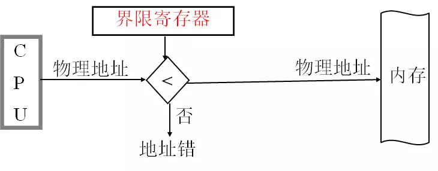

一个程序独占内存运行时，使用单一连续分配方式

- 内存划分为操作系统区和用户区
- 整个用户区为一个用户独占，仅驻留一道程序
- 实地址方式，绝对装入
- 仅适用于单用户、单任务操作系统中

#### 多道程序内存管理要求 

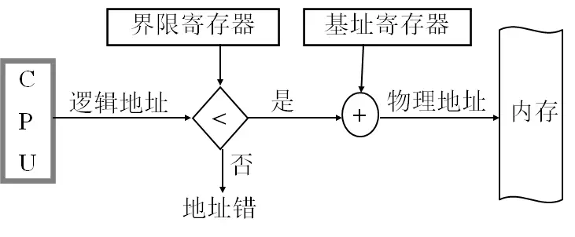

- 地址映射：程序地址或者逻辑地址转换为物理地址，与分配方式相关
- 内存分配：使各得其所、提高利用率及适应动态增长要求
- 内存保护：不同进程地址空间的隔离保护
  进程和操作系统内核的隔离保护
- 内存扩充：将暂时不运行的进程全部或者部分置换到外存空间

### 内存管理技术

|技术|简要说明|优点|缺点|
|------------|------------------------------------------------------------|------------------------------------------------------|------------------------------------------|
|固定分区|主存被分为很多大小固定的分区，进程可以装载到大于等于自身大小的分区。|实现简单|1.有内部碎片2.活动进程的数目是固定的|
|动态分区|分区是被动态创建的，进程可以装载到正好等于自身大小的分区。|没有内部碎片，内存使用更完全|有外部碎片，需要压缩外部碎片|
|简单分页|主存被分为很多大小相同的帧，进程被分为很多与帧大小相同的页。要装入一个进程，需要将进程所有的页装入主存，可以是不连续的帧中。|没有外部碎片|有很少的内部碎片（仅出现在进程的最后一页）|
|简单分段|进程被分为很多的段，要装入一个进程，需要将进程所有的段装入主存中不一定连续的动态分区。|没有内部碎片，比较与动态分区，内存利用率更高，开销小|有外部碎片，需要压缩外部碎片|
|虚拟内存分页|与简单分页相比，不需要将进程的所有页装入主存|没有外部碎片巨大的虚拟内存空间更高程度的多到程序设计|复杂的内存管理开销|
|虚拟内存分段|与简单分段相比，不需要将进程所有的段都装入主存|具有虚拟内存分页的三个优点，并且支持保护和共享|复杂的内存管理开销|

### 连续分配存储管理方式

#### 固定分区分配方式

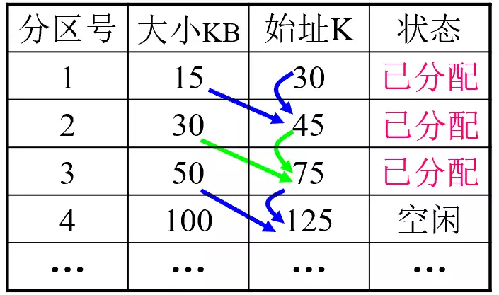

- 用户区分为若干固定区域
- 每个分区可装入一道作业
- 分区划分方法(等分/不等分)
- 分区说明表与内存分配算法
- 可用于多道程序存储管理

#### 动态分区分配存储管理

##### **首次适应算法FF**

- 在满足需要的空闲内存分区中找**最靠前**的
- 要求空闲分区链以地址递增次序链接
- 查找开销大，但有利于大作业分配

**循环首次适应算法**

- **从上次分配的地方往后**找到第一个满足需要的空闲内存分区
- 首次适应 + 起始查寻指针 + 循环查找
- 减少查找开销，但不利于大作业分配

##### **最佳适应算法**

- 找到能满足要求且又**最小的**空闲内存分区 
- 要求空闲分区按大小递增次序链接
- 微观意义上的最佳与宏观上的零头问题

#### 动态可重定位分区分配

之前的动态分区的缺陷：算法时间复杂度大，外部碎片导致内存利用率低

动态重定位分区分配算法的改进：动态分配分区算法 + 紧凑功能

紧凑技术：通过移动把多个分散拼接成大分区，解决分区分配产生的零头/碎片问题

#### 对换技术

对换技术：把内存中暂时不能运行的进程或暂时不用的程序或数据，调出到外存上，以便腾出足够的内存空间，再把具备运行条件的进程或进程所需要的程序和数据调入内存

意义：提高内存利用率

策略：属于中级调度

实现：进程整体对换

##### 进程的换出

被换出进程的选择依据：

- 进程状态
- 优先级
- 内存驻留时间

换出过程

1. 换出非共享或不再共享的程序及数据段
2. 对换空间申请
3. 换出
4. 内存释放
5. 内存分配数据结构
6. PCB修改

##### 进程的换入

被换入进程的选择依据：

- 进程状态
- 换出时间

换入过程

1. 内存申请
2. 换入
3. PCB修改

#### 用户程序处理过程

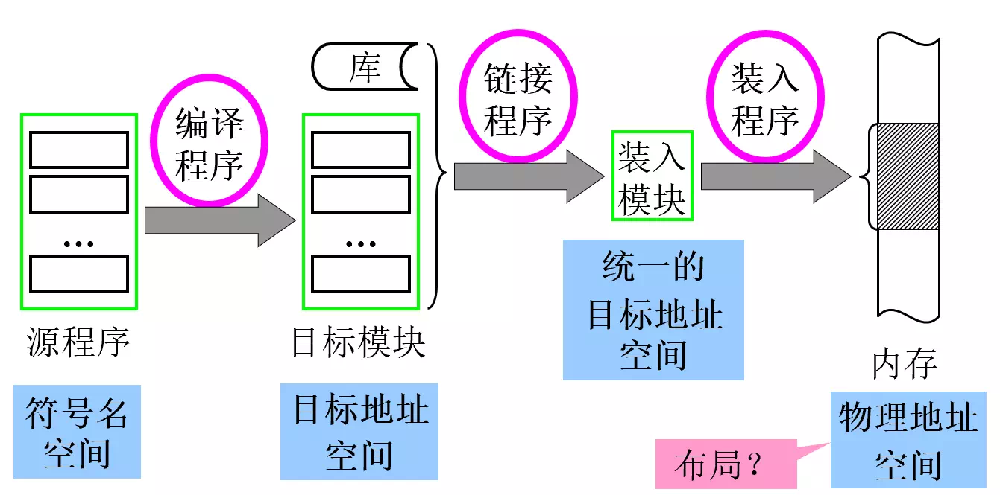

##### 链接过程

根据外部访问符号名表，将经过编译或汇编得到的一组目标模块以及它们所需要的库函数，装配成一个完整的装入模块

##### 需要解决的关键问题

修改相对地址
变换外部调用符号

##### 链接方式

- **静态链接方式**：
  可执行文件、难以实现“内存” 模块共享
- **装入时动态链接方式**：
  便于软件版本的修改和更新
  便于实现目标模块为多个应用程序共享
- **运行时动态链接方式**：
  将某些目标模块的链接推迟到执行时根据是否需要再完成，更加有利于内存的有效利用

### 基本分页存储管理方式

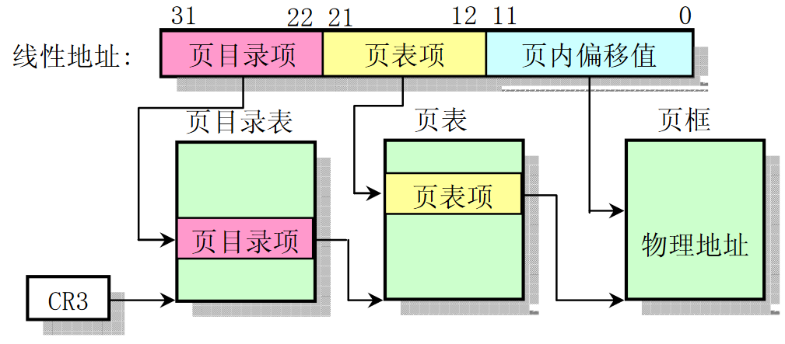

#### 离散存储管理方式

把一个程序的代码分配到内存不连续的多个空闲空间，克服多道程序内存管理的问题

离散存储管理方式的核心问题：如何正确有效进行地址变换

#### 页面与页表

- 页号 = 相对地址 / 物理块大小
- 页内地址 = 相对地址 mod 页大小
- 物理地址 = 块号 × 块大小 + 页相对地址

#### 地址变换机构

如何根据逻辑地址求物理地址
1. 分解计算（页号，页内偏址）
$PageNo = Addr / PageLength$ 
$PageOffset = Addr \% PageLength$ 
举例：对于 1KB 页面，若给定逻辑地址 2170B，则 PageNo = 2，PageOffset = 170B
2. 根据页号查页表，找到物理块号
物理块号 = 页表地址 + 页号 × 页号大小
3. 合成物理地址
物理地址 = 物理块号 * PageLength + 页内偏址

#### 具有快表的地址变换机构

引入快表后：$Average Access time = (Hit Rate × Hit Time) + (Miss Rate × Miss Time)$

假定快表检索时间为20ns，内存访问时间为100ns，则若能在快表中找到CPU给出的页号，CPU为存取一个数据将需要(100+20)= 120ns；

而若不能在快表中找到CPU给出的页号，CPU为存取一个数据将需要(100+100+20) =220ns

若假定快表查找命中率为80%，则其有效访问时间为120×80%＋220 ×(1－80%) =140ns

#### 两级和多级页表

##### 引入二级页表

页表项大小：

- 为了方便查找，页表项采用相同大小。
  - 页表项主要存放的是物理块号（以及其他控制信息）
- 为了使用任意的物理内存，必须存放得下最大物理块号
  - 最大物理块号 = 物理内存大小 / 每块大小
- 物理内存最大值 <= 2^CPU地址宽度^
- 考虑内存对齐，页表项一般取整数字节数，如1个字节，2个字节，4个字节等。

页表空间 = 页表项大小 × 页表项数量

- 32位计算机，1KB页面大小
  物理块号最大值=2^32^/2^10^-1=2^22^-1
  页表项至少采用22位表示。对齐后可采用32位=4B
- 64位计算机，8KB页面大小
  物理块号最大值=2^64^/2^13^-1=2^51^-1
  页表项至少采用51位表示。对齐后可采用64位=8B

页表项数 = 进程大小 / 页面大小

- 页表空间可能会非常大
- 进程大小 2^32^ B，页面大小 2KB，则页表项数 =2^32^/2^11^=2^21^ 个
- 对于具有32位逻辑地址空间的分页系统，规定页面大小为 4KB 即 2^12^B，则每个进程页表的页表项可达 2^20^=1M 个；若同时设定页表项大小规定为 4B，则每个进程页表便需占用  4M 内存空间，相当于 4M/4K=1K 个物理块

##### 二级页表构造方法

32位计算机，4K页面大小，4B页表项，8M进程

1. 进程分页：8M/4K=2K个页面
2. 每个页面存放页表项数：4K/4=1K个页表项
3. 进程一级页表：2K/1K=2个
4. 页表索引表：一个共2项

### 基本分段存储管理方式

按程序逻辑划分进程地址空间为若干段：

- 每个段包含一段具有独立逻辑功能的代码或者数据，如主程序 MAIN、子程序段 X、数据段 D 及栈段 S，各段均有自己的名字（段号）；
- 每个段内部都从 0 开始编址，并采用一段连续的地址空间，且段的长度取决于相应的逻辑信息组的长度，因而各段长度可不等；
- 整个进程的地址空间是二维的，由段号 (名)和段内地址所组成；

段表示意图：

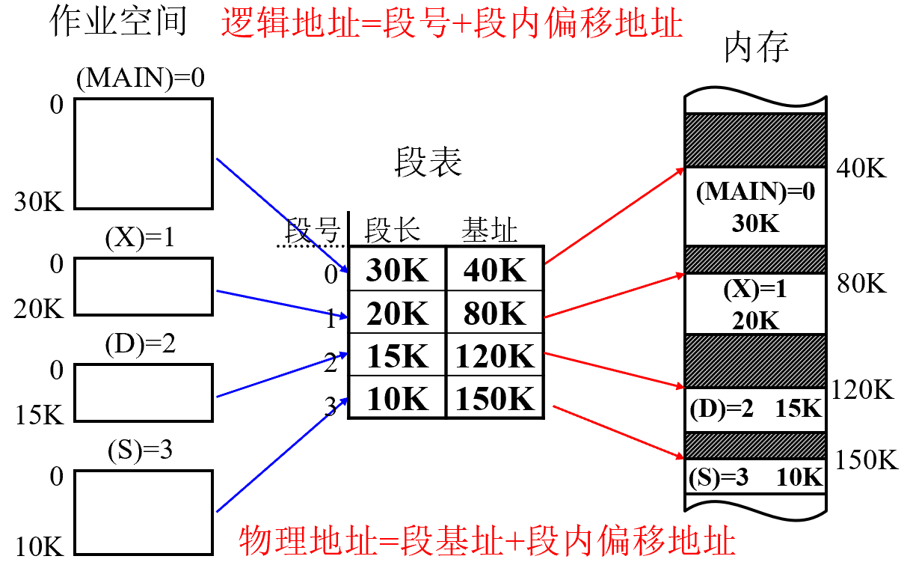

#### 例：分页/分段实现多个用户对文本编辑程序的共享

某多用户系统，可同时接纳40个用户，假设均在执行Editor进行文本编辑。若该文本编辑程序含有160KB的代码区和40KB的数据区，则总共需有8000KB的内存空间来支持40个用户。由于执行相同的文本编辑程序相同，内存中只需保留一份文本编辑程序的副本，因而所需内存空间仅为40×40+160=1760KB

解：

| 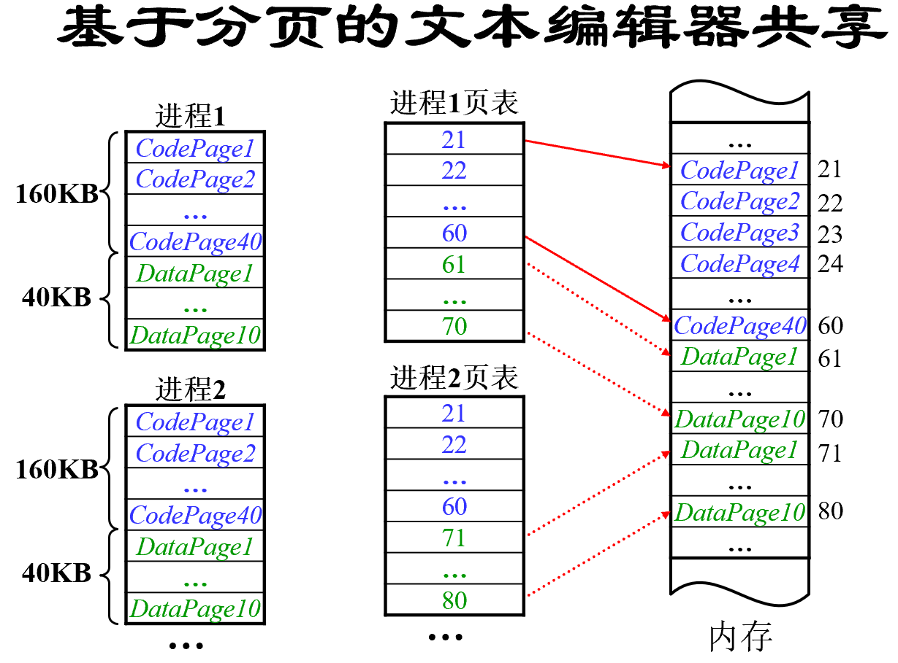 | 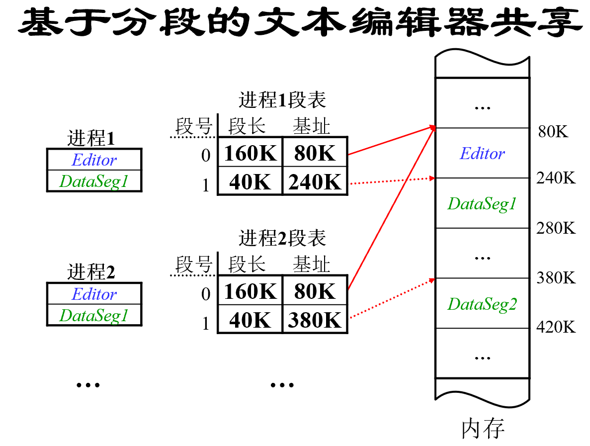 |
| ------------------------------------------------------------ | ------------------------------------------------------------ |

#### 代码段共享

可重入码：不允许任何进程对其进行修改的代码

实现：在每个进程中都必须配备局部数据区，并把在执行中可能改变的部分都拷贝到该数据区。这样，在程序执行时，只去对属于特定进程私有的数据区中的内容进行修改，而不去改变共享的代码，这时的可共享代码即成为可重入代码

#### 段页式存储管理方式

从分段和分页中各取所长，既具有分段系统便于实现、分段可共享、易于保护、可动态链接等一系列优点；又能像分页系统那样很好地解决内存的外部碎片问题以及为各个分段离散地分配内存等问题

| **段号** | **段内页号** | **页内地址** |
| -------- | ------------ | ------------ |

先将用户程序按信息性质分为若干段，再把每个段划分为若干页

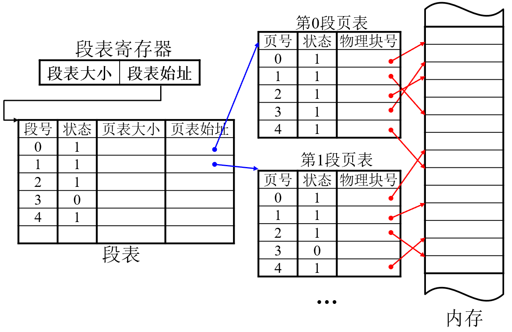

### 虚拟存储器概念及关键技术

#### 提高存储利用率方法

- 全部装入
  创建一个进程时，必须把进程全部装入内存
  计算机架构：基于内存存储的程序执行
- 整体对换
  进程执行过程中，进程整体在内存和外存之间进行对换，提高了内存支持的并发进程数量。
  利用进程在一段时间暂停执行的特点。
- **基于虚拟存储器的内存扩充方法**
  部分装入：创建进程时只要把开始的一段时间需要的部分代码装入内存
  部分对换：进程执行过程中把将来一段时间不要的进程部分（页或者段）对换到外存，把将来一段时间内需要的进程部分（页或者段）对换进入内存

#### 虚拟存储器的特性

- 作业部分装入内存即可启动运行，其余部分暂留磁盘，程序执行过程以页或段为单位的部分对换
  - 已调入内存则直接访问
  - 尚未调入内存则缺页(段)中断及请求调入再访问
- 调入时如果内存已满，执行页(段)置换功能，选择一个页（段）换出。
  - 如果修改过，需要写回磁盘保存。否则不必写回，直接丢弃。
  - 新的页面调入内存后，需要更新页表、快表。
- 目标：大用户程序在小内存空间的运行、多道程序度的提高
- 容量 = 可以并发执行的所有进程大小之和

- 虚拟内存容量 = 物理内存和外存容量之和

- 单价 = (DRAM价格+磁盘价格)/(DRAM容量+磁盘容量)
  - 同样价格的内存和磁盘，后者的容量大的多
- 速度 $Average Access time = (Hit Rate × Hit Time) + (Miss Rate × Miss Time)$

### 请求分页存储管理方式

- 内存中仅包含部分页面
  - 访问的页面在内存：`访问->地址变换->访问完成`
  - 访问的页面不在内存中：`访问->地址变换->不在内存->调入内存->地址变换->访问完成`
- 硬件支持：页表机制、地址变换机构、缺页中断机构

| 页号 | 物理块号 | **状态位** | **访问字段** | **修改位** | **外存地址** |
| ---- | -------- | ---------- | ------------ | ---------- | ------------ |

#### 页表项的扩充

1. 状态位：在/不在内存(1/0)
2. 修改位：是/否修改(1/0)
3. 访问字段：访问权限(RWX)

#### 缺页中断处理

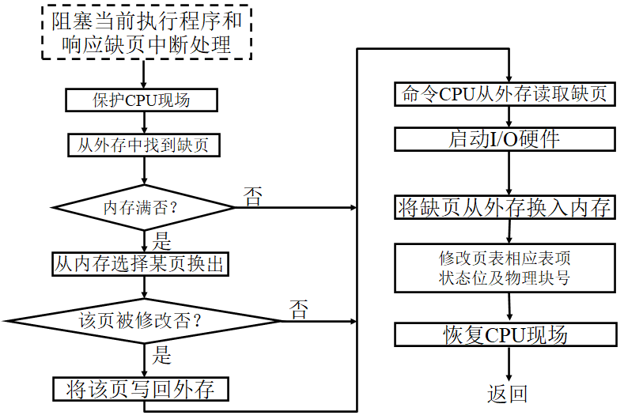

#### 内存分配策略

虚拟存储器的理论基础是程序执行的局部性特征

1. 空间局部性：如果一个内存地址被访问，那么一段时间内与该地址相临近地址也会被访问。
   典型原因：程序顺序执行，访问数组。
2. 时间局部性：如果最近访问过一个地址，那么近期也会访问同一个地址空间。
   典型原因：循环执行相同指令和循环访问同一个数据

驻留集：请求分页存储管理中系统给进程分配的物理内存的页面集合

工作集：某一个时刻进程在最近一段时间访问的页面集合

缺页率：缺页次数/访问总次数抖动

抖动：装入内存的页面集合（驻留集）没有包含最近常访问的页面集合（工作集），缺页导致用于进程请求调页的时间开销极大增加，进程执行效率大为下降的现象。

#### 物理块分配算法

平均分配算法：将系统可供分配的物理块平均分配

按比例分配算法：`BlockOfPk = max{minBlocks, Blocks×PagesOfPk/ Σ PagesOfPi}`

考虑优先权的分配算法：照顾重要或紧迫的作业能尽快完成

#### 置换技术

固定分配局部置换：为每个进程分配一固定页数的内存空间，在整个运行期间都不再改变

可变分配全局置换：系统设立一个空闲物理块队列

可变分配局部置换：依据缺页率酌情增加或减少物理块

#### 调页策略

预调页策略：调入预计在不久之后便会被访问的程序或数据所在的页面

请求调页策略：发现需要用到的数据所在页面不在内存时再调入

#### 页面调入过程概括

缺页中断发生，产生缺页中断并转入缺页中断处理程序，根据页表外存地址（物理盘块号）调入所缺页面，内存不足置换（页面淘汰算法、是否重写磁盘）

### 页面置换算法

置换算法与缺页率：如果置换算法选择淘汰的页面不恰当，会很快再次访问导致缺页，严重时会造成抖动

#### 最佳置换算法

基本思想：选择永不使用或是在最长时间内不再被访问（即距现在最长时间才会被访问）的页面淘汰出内存

评价：理想化算法，具有最好性能（对于固定分配页面方式，本法可保证获得最低的缺页率），但实际上却难于实现，故主要用于算法评价参照

#### 先进先出置换算法

基本思想：选择最先进入内存即内存驻留时间最久的页面换出到外存，进程已调入内存的页面按进入先后次序链接成一个队列，并设置替换指针以指向最老页面

评价：简单直观，但不符合进程实际运行规律，性能较差，故实际应用极少

#### 最近最久未使用置换（LRU）算法

Least Recently Used

基本思想：局部性原理，以“最近的过去”作为“最近的将来”的近似，选择最近一段时间最长时间未被访问的页面淘汰出内存

评价：适用于各种类型的程序，性能较好

##### LRU 算法实现：

1. **基于计数器的实现**
   每个页面有一个计数器
   每次访问一个页面时候就把全局计数器加1然后存放到被访问页面的计数器中
   置换时，选择计数器最小的页淘汰。
2. **基于栈的实现**
   把页号形成一个双向链接指针的栈。
   访问时，找到该页号，并把它移动到栈顶。
   置换时，淘汰栈底页。

#### Clock置换（NRU）算法

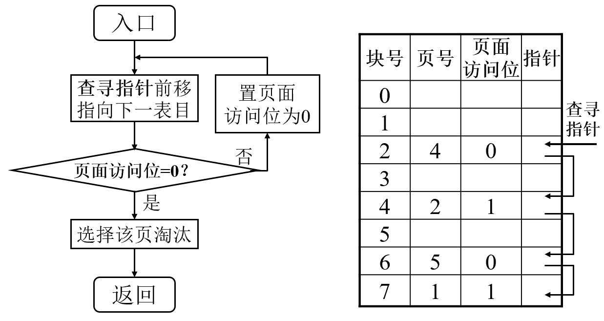

基本思想：
1. 从查寻指针当前位置起扫描内存分页循环队列，选择A=0且M=0的第一个页面淘汰；若未找到，转 2.
2. 开始第二轮扫描，选择A=0且M=1的第一个页面淘汰，同时将经过的所有页面访问位置0；若不能找到，转 1.

评价：与简单Clock算法相比，可减少磁盘的I/O操作次数，但淘汰页的选择可能经历多次扫描，故实现算法自身的开销增大

#### 最少使用置换（LFU）算法

基本思想：选择在最近时期使用次数最少的页面淘汰

评价：鉴于仅用移位寄存器有限各位来记录页面使用会导致访问一次与访问多次的等效性（寄存器在100ms右移一位，那么在这段时间内，多次访问与一次访问的效果一样）。本算法并不能真实全面地反映页面使用情况

#### 页面缓冲算法（PBA ）

完全正确的预测页面将来的使用情况是困难的，错误在所难免。

基本思想：在基本FIFO算法基础上改进。

策略：全局置换，动态分配（大部分操作系统采用：高效，易于实现），系统中保持一定数量的空闲页面队列。

### 请求分段存储管理方式

技术构成：分段 + 请求调段 + 分段置换

硬件支持：请求分段的段表机制、缺段中断机构、地址变换机构

软件支持：请求调段、分段置换


