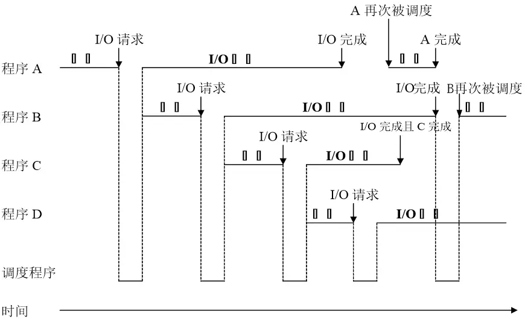
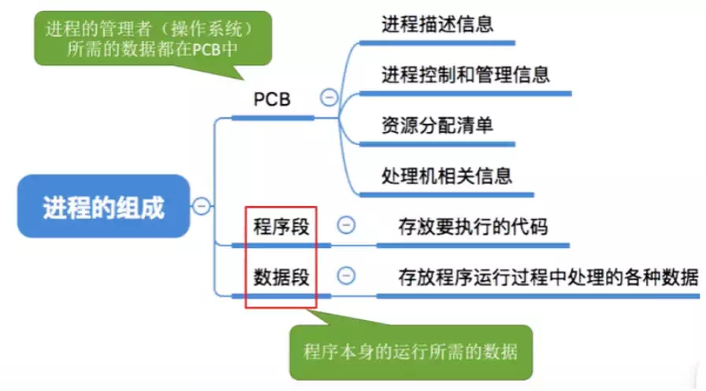
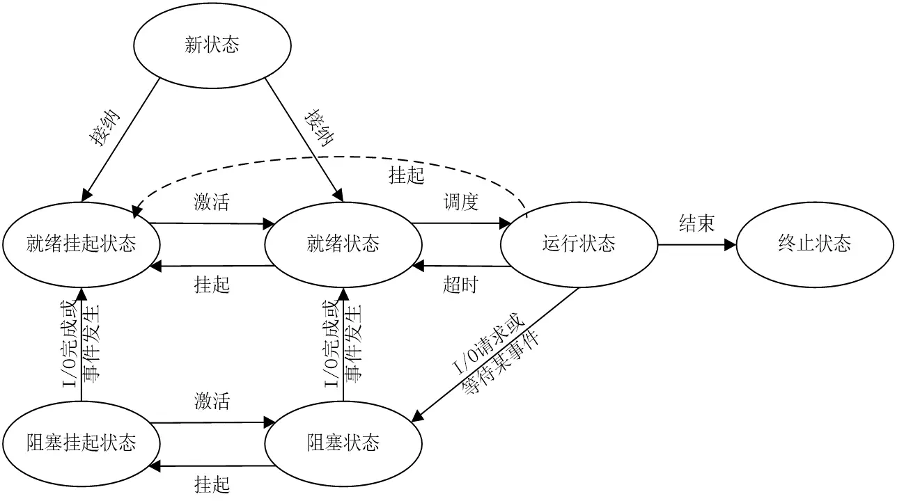
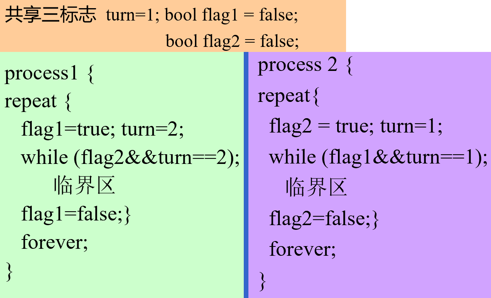

# 操作系统笔记

### 成绩构成

平时40% + 期末60% 

加分项：挑战性作业、研究性项目、各种随堂测试
扣分项：迟到早退一次扣1分，缺勤一次扣2分，3次缺勤取消考试资格，请假、免听除外（提前一天通知老师）

作业和实验迟交一天扣1分/40分，抄袭一次平时成绩扣10分/40分，发现两次取消考试资格

## 1. 绪论

### 课程参考资料

- [教务处教学平台](http://jwc.bjtu.edu.cn)
  - 操作系统电子教材
  - 操作系统参考书
  - 最简操作系统 linux 0.11 相关资料
- 国外教学网站
  - http://www.scs.stanford.edu/11wi-cs140/
  - http://www.cs.cmu.edu/~410/
  - http://www.cs.berkeley.edu/~kubitron/courses/cs162-F10/

### 操作系统的作用

- 用作扩充机器（或虚拟机）
  - 在裸机上提供一个虚拟机抽象层，处理复杂多样的硬件，使计算机系统功能显著增强、使用更为方便
- 用户与计算机硬件系统之间的接口
  - 命令方式（操作系统外壳）：面向一般用户
    - 命令行/菜单式/命令脚本式/图形用户接口
  - 系统调用方式（操作系统内核）：面向程序开发人员
    - 形式上类似于过程调用，编制程序中使用
- 计算机系统资源的管理者
  - 管理对象：处理器、存储器、外围设备以及信息
  - 管理内容：资源的分配、回收和访问操作，共享、保护

### 操作系统的发展过程

#### 单道批处理系统

OS的前身，脱机输入/输出技术，解决人机矛盾、CPU和I/O速度不匹配问题，特征如下：

- 自动性。在顺利情况下，在磁带上的一批作业能自动地逐个地依次运行，而无需人工干预。
  顺序性。磁带上的各道作业是顺序地进入内存，各道作业的完成顺序与它们进入内存的顺序，在正常情况下应完全相同，亦即先调入内存的作业先完成。
  单道性。内存中仅有一道程序运行，即监督程序每次从磁带上只调入一道程序进入内存运行，当该程序完成或发生异常情况时，才换入其后继程序进入内存运行。

#### 多道批处理系统



中断技术的引入为多道批处理提供了技术基础，主要优缺点如下：

- 资源利用率高。由于在内存中驻留了多道程序，它们共享资源，可保持资源处于忙碌状态，从而使各种资源得以充分利用。
- 系统吞吐量大。系统吞吐量是指系统在单位时间内所完成的总工作量。能提高吞吐量的主要原因可归结为：第一，CPU 和其它资源保持“忙碌”状态； 第二，仅当作业完成时或运行不下去时才进行切换，系统开销小。
- 平均周转时间长。作业的周转时间是指从作业进入系统开始，直至其完成并退出系统为止所经历的时间。在批处理系统中，由于作业要排队，依次进行处理，因而作业的周转时间较长，通常需几个小时，甚至几天。
- 无交互能力。用户一旦把作业提交给系统后，直至作业完成，用户都不能与自己的作业进行交互，这对修改和调试程序是极不方便的

#### 分时系统

分时系统与多道批处理系统相比，具有非常明显的不同特征，可以归纳成以下四个特点：

1. 多路性。允许在一台主机上同时联接多台联机终端，系统按分时原则为每个用户服务。宏观上，是多个用户同时工作，共享系统资源；而微观上，则是每个用户作业轮流运行一个时间片。多路性即同时性，它提高了资源利用率，降低了使用费用，从而促进了计算机更广泛的应用。
2. 独立性。每个用户各占一个终端，彼此独立操作，互不干扰。用户感觉是一人独占主机。
3. 及时性。用户的请求能在很短的时间内获得响应。此时间间隔是以人们所能接受的等待时间来确定的，通常仅为 1～3 秒钟。
4. 交互性。用户可通过终端与系统进行广泛的人机对话。其广泛性表现在：用户可以请求系统提供多方面的服务，如文件编辑、数据处理和资源共享等

#### 实时系统

实时系统有着与分时系统相似但并不完全相同的特点，下面从五个方面对这两种系统加以比较。

1. 多路性。实时信息处理系统也按分时原则为多个终端用户服务。实时控制系统的多路性则主要表现在系统周期性地对多路现场信息进行采集，以及对多个对象或多个执行机构进行控制。而分时系统中的多路性则与用户情况有关，时多时少。
2. 独立性。实时信息处理系统中的每个终端用户在向实时系统提出服务请求时，是彼此独立地操作，互不干扰；而实时控制系统中，对信息的采集和对对象的控制也都是彼此互不干扰。
3. 及时性。实时信息处理系统对实时性的要求与分时系统类似，都是以人所能接受的等待时间来确定的；而实时控制系统的及时性，则是以控制对象所要求的开始截止时间或完成截止时间来确定的，一般为秒级到毫秒级，甚至有的要低于 100 微秒。
4. 交互性。实时信息处理系统虽然也具有交互性，但这里人与系统的交互仅限于访问系统中某些特定的专用服务程序。它不像分时系统那样能向终端用户提供数据处理和资源共享等服务。
5. 可靠性。分时系统虽然也要求系统可靠，但相比之下，实时系统则要求系统具有高度的可靠性。因为任何差错都可能带来巨大的经济损失，甚至是无法预料的灾难性后果，所以在实时系统中，往往都采取了多级容错措施来保障系统的安全性及数据的安全性。

### 操作系统的基本特性

并发性和共享性

#### 并发 VS 并行

并行：在同一时刻发生

并发：在同一时间间隔内发生

#### 进程、线程

进程：

- 引入进程是为了使多个程序能**并发**执行；
- 进程是在系统中能独立运行并作为资源分配的基本单位，由一组机器指令、数据和堆栈等组成，多个进程之间可以并发执行和交换信息；
- 一个进程在运行时需要一定的资源，如 CPU、存储空间及 I/O 设备等；

线程：

- 通常在一个进程中可以包含若干个线程，它们可以利用进程所拥有的资源；
- 通常都是把进程作为**分配资源的基本单位**，而把线程作为**独立运行和独立调度的基本单位**；
- 由于线程比进程更小，基本上不拥有系统资源，调度开销小，能提高系统内多个程序间并发执行的程度；

实现资源共享的方式主要有两种：互斥共享方式、同时访问方式

### 微内核操作系统结构

微内核操作系统结构 (Micro Kernel) 即将操作系统中最基本的部分放入内核中，而把操作系统的绝大部分功能都放在微内核外面的一组服务器(进程)中实现

特征描述：

1. 足够小的内核，只实现与硬件紧密相关的处理，只实现一些较基本的功能，只为构建通用 OS 提供基础

2. 客户/服务器模式

3. 应用“机制与策略分离”原理

4. 采用面向对象技术，利用“对象”、“封装”和“继承”等概念

### 中断

中断可分为外部中断和内部中断

外部中断包括不可屏蔽中断和可屏蔽中断，内部中断包括陷入，故障，中止

## 2.  进程管理

进程是进程实体的运行过程，是系统进行资源分配和调度的一个独立单位，操作系统把CPU资源分配给进程的过程就是调度，引入进程的目的，就是为了能并发执行多个程序。

程序并发执行出现的问题：

1. 交替间断回来执行还能保持上次的状态

2. 失去封闭性

3. 计算结果不可再现

4. ……

### 进程控制块PCB

程序的仅仅是代码和数据组成的，而并发执行要求CPU需要保存指令指针寄存器，寄存器，堆栈等信息，因此切换时需要先保存 $CPU_i$ 的信息，然后加载 $CPU_j$ 的信息，再开始执行新的进程 $j$ ，这些数据就通过进程控制块PCB来存储

PCB是进程实体的一部分，拥有描述进程情况及控制进程运行所需的全部信息的记录性数据结构，常驻内存并存放于操作系统专门开辟的PCB区

#### 进程的组成



#### 进程的特征

* 结构特征：程序段、数据段及进程控制块

* 动态性：生命周期及“执行” 本质

* 并发性：共存于内存、宏观同时运行

* 异步性：推进相互独立、速度不可预知

* 独立性：调度、资源分配、运行

### 进程的状态模型

#### 进程的三状态模型

* 就绪

* 执行

* 等待

#### 进程的五状态模型

* 新状态

* 终止状态

* 就绪

* 执行

* 等待

#### 引入挂起状态



* 新状态

* 就绪挂起状态

* 就绪状态

* 阻塞挂起状态

* 阻塞状态

* 运行状态

* 终止状态

#### 进程图

描述进程家族关系的有向树，包括结点/有向边，用来描述父/子进程关系

### 创建和终止进程

需要创建进程的场景：用户登录、作业调度、提供服务、应用请求……

需要终止进程的场景：正常结束、异常结束、特权指令错、非法指令错、运行超时、等待超时、算术运算错、I/O故障、外界干预、父进程请求/终止……

##### Create()

1. 申请Pid,空白PCB
2. 为新进程的程序和数据及用户栈分配必要的内存空间
   所需内存大小问题
3. 初始化进程控制块
   自身/父进程标识符
   处理机状态/调度信息
4. 将新进程插入到就绪进程队列

##### Terminate()

1. 读取进程状态，若其正处于执行状态，应立即中止执行并设置调度标志为真
2. 终止其子进程
3. 资源归还
4. 释放PCB

### 阻塞和唤醒进程

需要阻塞进程的场景：请求系统服务但不能立即满足、启动某种操作且必须等操作完成之后才能继续执行、新数据尚未到达、无新工作可做

需要唤醒进程的场景：系统服务满足、操作完成、数据到达、新任务出现

##### Block()

1. 先立即停止执行，把进程控制块中的现行状态由“执行”改为阻塞，并将它插入到对应的阻塞队列中
2. 转调度程序进行重新调度，将处理机分配给另一就绪进程，并进行切换

##### Wakeup()

首先把被阻塞进程从等待该事件的阻塞进程队列中移出，将其PCB中的现行状态由阻塞改为就绪，然后再将该进程插入到就绪队列中

### 挂起和激活进程

##### Suspend()

1. 检查被挂进程现行状态并修改和插队
2. 复制PCB到指定区域
3. 若被挂进程正在执行则转向调度程序重新调度

##### Activate()

1. 检查进程现行状态并修改和插队
2. 若有新进程进入就绪队列且采用了抢占式调度策略，则检查和决定是否重新调度

### 系统调用中的进程控制

##### fork 系统调用（克隆）

* 创建子进程，父子进程代码共享。子进程复制父进程当前的所有其他上下文信息
  然后都从同一地方开始运行

* 0号（对换）进程 => 1号（始祖）进程

* 以1号进程为根创建其他进程，形成进程树。

##### exec 系统调用（变异）

* 改变进程原有代码（更新用户级上下文）

* 没有新的进程产生

##### exit 系统调用

* 实现进程自我终止

### 进程同步

临界资源：一段时间内只允许一个进程访问的资源

临界区：每个进程中访问临界资源的那段代码称为临界区

如果共享该临界资源的每个进程能互斥的进入自己的临界区，就能保证对临界资源的互斥访问。
所有的（进程间）共享变量一般都应看做临界资源

#### 临界资源的互斥访问

加锁 → 关键代码执行 → 解锁

#### 软件互斥peterson算法



#### 进程同步机制基本准则

1. 空闲让进（效率）：当无进程处于临界区时，可允许一个请求进入临界区的进程立即进入自己的临界区

2. 忙则等待（正确性）：当已有进程进入自己的临界区时，所有企图进入临界区的进程必须等待

3. 有限等待（公平性）：对要求访问临界资源的进程，应保证该进程能在有限时间内进入自己的临界区

4. 让权等待（效率）：当进程不能进入自己的临界区时，应释放处理机

### 信号量机制

用于实现进程互斥和前驱关系

#### 整型信号量

Dijkstra 把整型信号量定义为一个用于**表示资源数目的整型量** S，它与一般整型量不同，除初始化外，仅能通过两个标准的**原子操作**（**原语**，英文Atomic Operation）wait(S)和 signal(S)访问

> 原语是指**完成某种功能且不被分割不被中断执行的操作序列**；

**进程处于“忙等”的状态**

Wait(S)和 signal(S)操作可描述为：（也有些材料写的是P操作和V操作）

```go
wait(S):      
    while S<=0 
        do no-op;
    S := S-1;

signal(S):    
    S := S+1;
```

S值为正数：有S个临界资源可用

S值为0：临界资源全部已经被占用

S为负数：S的绝对值为等待使用该资源而被阻塞的进程数

用法伪代码：

```go
func:
    begin
        repeat
            wait(S);
            do_something();
            signal(S);
        until false;
    end
```


#### 记录型信号量

增加一个进程链表指针 L，用于链接上述所有等待进程

```go
type semaphore=record
    value: integer;
    L:     list of process;
    end

procedure wait(S)
    var S：semaphore;
    begin
        S.value:=S.value-1;
        if S.value<0 then block(S.L);
    end

procedure signal(S)
    var S: semaphore;
    begin
        S.value:=S.value+1;
        if S.value<=0 then wakeup(S.L);
    end
```

#### AND型信号量

对于多个进程要共享两个以上的资源的情况，普通信号量机制则可能导致发生死锁，例如哲学家进餐问题；

解决方案：

1. 若干个临界资源的分配采取原子方式。

2. 一次申请多种不同资源，所有资源都有空闲资源，则分配；否则一个资源都不分配。

例：假定现有两个进程 A 和 B，他们都要求访问共享数据 D 和 E，可为这两个数据分别设置用于互斥的信号量 Dmutex 和 Emutex，并令它们的初值都是 1，相应地，在两个进程中都要包含两个对 Dmutex 和 Emutex 的操作，即

```go
process A: 
    wait(Dmutex); 
    wait(Emutex); 

process B:
    wait(Emutex); 
    wait(Dmutex);
```

若进程 A 和 B 按下述次序交替执行 wait 操作：

```go
process A: wait(Dmutex);    // 于是 Dmutex=0
process B: wait(Emutex);    // 于是 Emutex=0
process A: wait(Emutex);    // 于是 Emutex=-1 A 阻塞
process B: wait(Dmutex);    // 于是 Dmutex=-1 B 阻塞
```

### 三类经典进程同步问题和解法

解题思路：

1. 分析临界资源以及对应的临界区
2. 分析资源和同步要求（互斥、先后、共享）
3. 一步一步加约束条件实现：

注意事项：

1. 信号量的合法操作只有初始化赋值，wait()，signal()，**不可以对信号量进行算术操作和逻辑判断**
2. 互斥关系靠进程内临界区前后成对 wait, signal 实现，先后关系靠 signal, wait 分别出现实现；
3. 注意不能颠倒 wait 和 signal 序列的操作顺序

#### 生产者-消费者问题

对资源设一个mutex互斥信号量，和一个记录资源数量的信号量；

生产者：等拿到互斥锁再放资源

消费者：等有资源，再加互斥锁取走；

------

随堂练习题的坑：图书馆占座的读者是一个进程，所以不是生产者消费者问题

~~不要学了之后看啥都是生产者和消费者问题~~

#### 哲学家进餐问题

~~为了预防幽门螺旋杆菌，请不要模仿这些哲学家的行为~~

重点在于防止死锁：

1. 只允许最多n-1个哲学家同时进餐，保证至少有一个哲学家可以同时拿到两支筷子
2. 仅当哲学家左右两支筷子均可使用时，才允许他拿筷进餐
3. 规定奇数号哲学家先拿左筷后拿右筷，而偶数号哲学家则相反
4. 筷子统一交给一个服务员分配，要吃饭向服务员申请……

作业2.10题有1.的实现，来自南京大学网课《操作系统：设计与实现》的这段代码是2.的情况

```c++
// 放筷子
mutex_lock(&mutex);
while(!(avail[lhs] && avail[rhs]) ) {
	wait(&cv, &mutex);
}
avail[lhs] = avail[rhs] = false;
mutex_unlock(&mutex);

// 拿筷子
mutex_lock(&mutex);
avail[lhs] = avail[rhs] = true;
broadcast(&cv)
mutex_unlock(&mutex);
```

#### 读者-写者问题

保证任何写者进程必须与其它进程互斥地访问共享数据对象（数据文件或记录）的问题

- 多个进程共享一个数据对象
- 只要求读操作的进程称为读者
- 包括写操作的进程称为写者

总结：读读可共存，读写和写写互斥；

##### 读者-写者问题的变量设计

- 写者进程与其它进程的互斥执行：写互斥信号量wmutex，初始值为1
- 读者进程之间的并发执行：读者进程计数变量readercount，表示正在执行的读者进程数量，初始值为0
- 读者进程计数变量的互斥访问：readercount对于多个读者进程而言是临界资源，应为之设置读互斥信号量rmutex，其初始值为1

```go
writer:
   begin
      repeat
         wait(wmutex);
         Perform write operation; 
         signal(wmutex);
      until false;
   end

reader:
   begin
      repeat
         wait(rmutex);
         if readercount=0 
		    then wait(wmutex);
		 readercount := readercount +1;
         signal(rmutex);
         Perform read operation;
         wait(rmutex);
         readercount := readercount -1;
         if readercount=0 then signal(wmutex);
         signal(rmutex);
      until false;
   end
```

