# 编译原理笔记

> 这课实验那么难才占20%，期末占70%？

## 1. 绪论

主要是概念，理解即可

### 编译过程的五个阶段

典型的编译过程分以下五个阶段：

- 词法分析
- 语法分析
- 语义分析及中间代码生成
- 中间代码优化
- 目标代码生成、目标代码优化

#### 词法分析

词法分析的主要任务是将符号串形式的源程序进行扫描，并分解为与具有独立意义的最小语法单位，单词符号

- 词法分析依据的规则是词法规则。
- 单词符号：常量、变量名、关键字、保留字、运算符等。
- 每一类单词符号可用一整数表示，或其它方式。
- 词法分析应指出单词符号的词法错误，如非法字符、不符合词法规则等。

#### 语法分析

语法分析的主要任务是从词法分析取得单词符号串形式的源程序，并将一个或多个单词组合为语言的各种语法类。

- 语法分析依据的是语言的语法规则。
- 语法类：表达式、语句 、子程序等。
- 语法分析应指出语句的语法错误，如错误表达式

#### 语义分析及中间代码生成

语义分析的主要任务是确定源程序的意义 (语义) ，对不同的语法类进行初步的翻译工作，包括静态语义检查和中间代码的生成。语义分析依据的是语言的语义规则。

- 语义分析和语法分析是不同的概念，但在实际完成编译工作时，两者又是紧密结合的，一般同时完成

- 静态语义检查：对每种语法范畴进行静态语义检查（变量是否定义，类型检查）。

- 中间代码生成：进行初步的翻译，生成中间代码（Intermediate Representation，一种结构简单含义明确的记号系统）

  - 这种记号系统的特点是既独立于具体的硬件，又和计算机的指令系统有某种程度的联系或相似之处，很容易将中间代码转变成机器指令。

#### 中间代码优化

中间代码优化(Optimizer)的主要任务是对中间代码进行算法的等价变换，以期得到高效的目标代码。

- 高效是指时间和空间的高效；
- 代码优化可以在目标代码生成之前进行，也可以在目标代码生成之后进行；
- 代码优化要付出编译代价；
- 编译优化技术目前比较活跃，也比较难。

#### 代码生成

代码生成的主要任务是将源程序的中间代码形式根据具体的机器硬件系统转换成机器语言或汇编语言。

- 并非所有的编译程序都需要这五个阶段。
- 完整的编译程序还包括符号表的管理和出错处理。

### 编译程序，汇编程序，解释程序

编译程序是一个与源语言和计算机有关的概念。

- 不同的源语言有不同的编译程序
- 同一种源语言可以有不同的编译程序（高级语言或汇编语言书写）

源程序的执行分为两个阶段：编译阶段（链接）和运行阶段，编译阶段生成的目标程序不是机器代码程序，而是符号汇编程序，源程序的执行分三个阶段：编译阶段、汇编阶段和运行阶段。

1. 翻译程序：把用甲语言书写的程序翻译成与之等价的用乙语言书写的程序，其中甲语言称为该翻译程序的源语言，乙语言称为该翻译程序的目标语言，用源语言书写的程序称为源程序，用目标语言书写的程序称为目标程序.
2. 编译程序：如果翻译程序的**源语言是高级语言，目标语言是低级语言**（机器语言或汇编语言），这种翻译程序称为编译程序。
3. 汇编程序：如果翻译程序的源语言是汇编语言，目标语言是机器语言，这种翻译程序称为汇编程序。
4. 解释程序：按源程序的动态顺序逐句地进行分析解释并执行直至结束。解释程序边翻译边执行，不生成目标程序。交互式的工作方式，便于调试，但执行效率低，执行时也要解释。
   编译程序生成目标程序，链接形成可执行文件运行，所有翻译工作在运行之前完成，执行效率高。

### 编译程序的组成

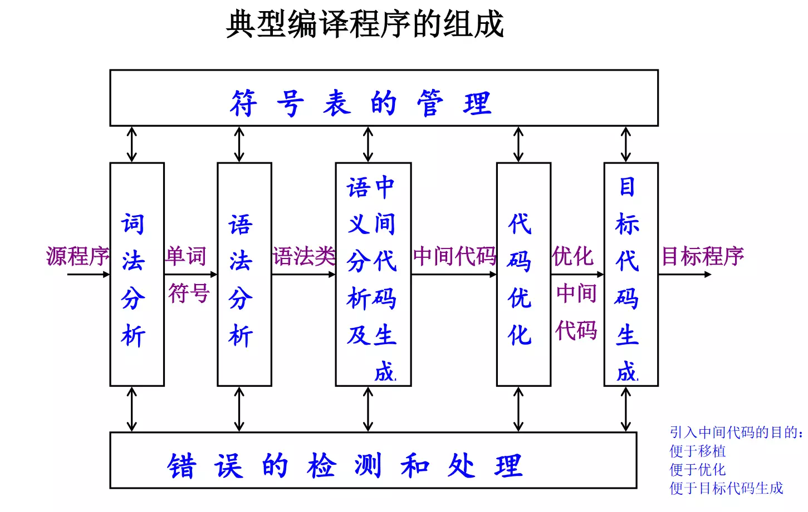

#### 符号表的管理

符号表是用于保存源程序中所使用的每个用户定义的标识符的属性的数据结构,以便进行语法分析、中间代码生成和目标代码生成。

- 标识符：变量名、函数名、过程名等
- 属性：标识符的存贮分配、类型、作用域等，如果是函数和过程名还有参数的个数、类型、参数传递方式、函数的返回值等。
- 合理地设计和使用表格是编译程序构造的一个重要问题，便于建立和查找。

#### 错误的检测和处理

编译的各个阶段都能检测到源程序中的错误，而且在检测一个错误后，必须立即对该错误进行处理，以便使编译工作能继续进行下去，继续对源程序中可能存在的其他错误进行检测（局部化法）。

- 通常在语法和语义分析阶段能处理由编译程序检测出的大部分错误
- 一个好的编译程序应能最大限度的发现源程序中的各种错误，并使其影响尽可能小。

#### 遍

遍是处理数据的一个完整周期，指对源程序或源程序的中间形式从头到尾扫描一次，并作有关的加工处理，生成新的源程序中间形式或目标代码这一过程。

- 可以将编译程序的五个阶段整体作为一遍;
- 也可将五个阶段每个作为一遍;
- 如何分遍，有许多因素具体决定；

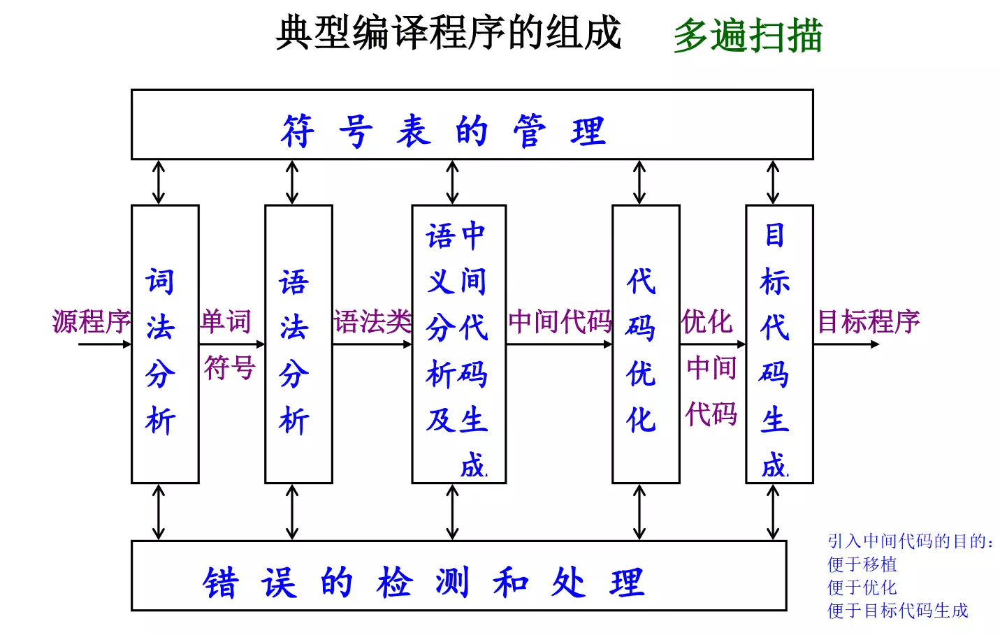


## 2. 上下文无关文法和语言

### 文法和语言的形式定义

#### 规则（产生式）A→B

有序对（U，x） 记为U→x或U::=x，其中 U是符号 （有的文法也可为符号串），x 是有穷符号串，表示: U定义为x

例1：S->abc

例2：<条件语句> ->if (<表达式>) <语句> ∣ if (<表达式>) <语句> else <语句>

#### 文法 G[Z]

规则的非空有穷集合，其中Z是开始符号（识别符号），至少在一条规则的左部出现。

#### 字汇表 V

规则左右部中所有符号组成的集合；

- 非终结符号： 规则左部出现的符号，组成非终结符号集合Vn
  - 非终结符号以< >括起，但当是大写字母是时常省略
- 终结符号： 规则中不属于Vn的符号，组成终结符号集合Vt，V=Vn ∪ Vt

#### 文法的四元组表示 $G = (V_n, V_t , P, Z)$

其中

* $V_n$ 为**非终结符号集**（Nonterminal）

* $V_t$ 为**终结符号集**（Terminal）

* $P$ 为**规则的集合**

* $Z$ 为**文法的开始符号**

规则中有相同的左部时：`V->x, V->y, ... , V->z`  可以写成：`V ->x|y|...|z` （`|` 表示或）

#### 句型

设有文法G[Z]，如果有 `Z=*>x , x∈V*`，则称x是文法G的一个句型。
凡是由开始符号（识别符号）推导出来的字汇表V上的终结和非终结符号组成的符号串w称为句型.

#### 句子

如有Z=+>x（或Z=\*>x）且x∈Vt*，则称x是文法G的一个句子。由Z推导出的终结符号组成的符号串为句子。

#### 语言 L(G[Z])

文法G[Z]产生的所有句子的集合，称文法G[Z]所定义的语言，记为 L(G[Z])={x|x∈Vt*且Z=+>x}

> 例：语言$L={a_mb_n ,m>=0,n>=0}$，试写出文法。
>
> 解：分析 S->AB，A表示 $a_m$，B表示 $b_n$ 
> A->aA|ε 或者 A-> Aa|ε 	递归规则
> B->bB|ε 或者 B-> Bb|ε 	递归规则
> 得文法 G[S]:S->AB, A->aA|ε, B->bB|ε

### 句型（句子）的分析


#### 自上而下推导

- 最左推导：在任一步推导 `v=>w` 中，都对符号串 `v` 的最左非终结符号进行替换，称最左推导。
- 最右推导（又名规范推导）：在任一步推导 `v=>w` 中，都对符号串 `v` 的最右非终结符号进行替换，称最右推导。
- 规范句型：由规范推导所得的句型

#### 自下而上规约

- 最左归约（又名规范规约）：规范推导的逆过程，称规范归约。
  - LL(1) 是最左推导，简单优先分析、算符分析都是最右推导，LR(k)系列是最左规约


#### 短语、简单短语和句柄

- 短语：有文法 G[Z]，$ω=xuy$ 是一句型，$x,y∈V*$ ，如有 $Z=*>xUy$，且 $U=+>u, U∈Vn, u∈V+$，称 $u$ 是一个相对于非终结符号U句型ω的短语。

- 简单短语：有文法 G[Z]，$ω=xuy$ 是一句型，如有 $Z=*>xUy$，且 $U=>u, U∈Vn, u ∈V+$，称 $u$ 是一个相对于非终结符号 U 句型 ω 的简单短语。

- 句柄：句型**最左边的简单短语**为该句型的句柄。

#### 子树与短语、句柄

可以通过树来寻找短语、简单短语、句柄

- 短语：子树的末端结点形成的符号串.
- 这个短语相对的句型：整个树的末端结点.
- 非终结符号：子树的根
- 简单子树:只有一层分支的子树
- 简单短语:简单子树的末端结点形成的符号串.
- 归约：语法树由下向上生长,通过规则（A->α）替换到达开始符号的过程

#### 语法树和文法的二义性证明

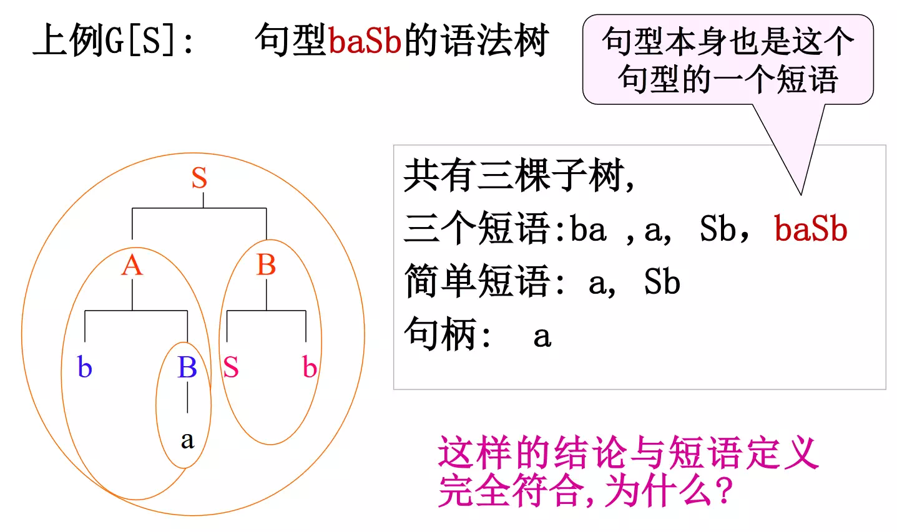

##### 二义性问题证明

如果文法G的某一个句子**存在两棵或两棵以上不同的语法树**，则称句子是**二义性**的。
如果一文法含有二义性的句子，则称该文法是二义性的，否则该文法是无二义性的。

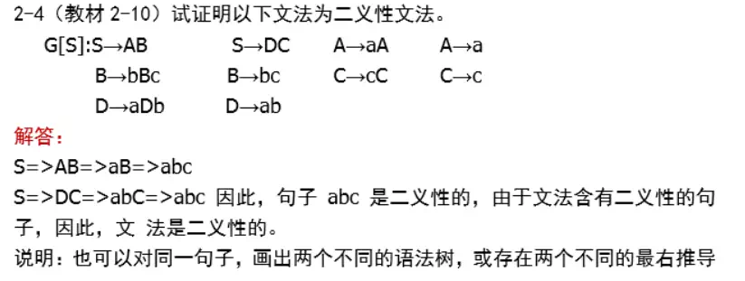

- 无二义性文法**最左归约**归约的是当前句型的句柄。
- 根据语法树的形成过程， 对句型的分析可采用自上而下（推导）和自下而上（归约）两种分析方法。

### 文法的递归性定义（直接和间接）

文法的递归性指，对文法中任一非终结符，若能建立一个推导过程，在推导所得的符号串中又出现了该非终结符本身，则文法是递归性的，否则是无递归性的。

- 若文法中有推导 $A ⇒+ A …$ 称文法左递归。
  - **自顶向下**规约分析需要**消除直接和间接左递归**
- 若文法中有推导 $A ⇒+… A$ 称文法右递归。
- 若文法中有推导 $A ⇒+… A …$ 称文法递归

### 文法的其它表示法

主要是 BNF 表示和语法图

#### 文法的化简与改造

- 无用产生式就是**形如 $U→U$ 的规则**
  - 设 `G=(Vn, Vt, P, S)` 是一文法，G中的符号x∈Vn∪Vt是有用的，则x必满足
        ① 存在α、β∈V\*，有S=\*>αxβ
        ② 存在ω∈Vt\* 使αxβ=\*>ω~~~~
    称符号x是有用的，否则x是无用的。
  - 俗称“上着天下着地”
  - 无用产生式：产生式的左部或右部含有无用符号。
- 文法的实用限制是：**不含无用产生式，不含有害规则**
  - 原因：无用产生式不必要、有害规则引起二义性
    例：
    G1[S]：S->0S1|01     	G1无二义性文法
    G2[S]：S->0S1|01|S     G2二义性文法
    L(G1)=L(G2)={0^n^1^n^|n>=1}

#### 无用符号和无用产生式的消除

##### 算法2.1——找能推出终结符号串的非终结符号集合

文法 `G=(Vn,Vt,P,S)`（假定L(G)≠Φ），得到等价文法G1=(Vn①,Vt,P①,S)，对于每个X∈Vn①，都有w1∈Vt\*,满足X=\*>w1;**（每个 X∈Vn① 都能推出终结符号串）**

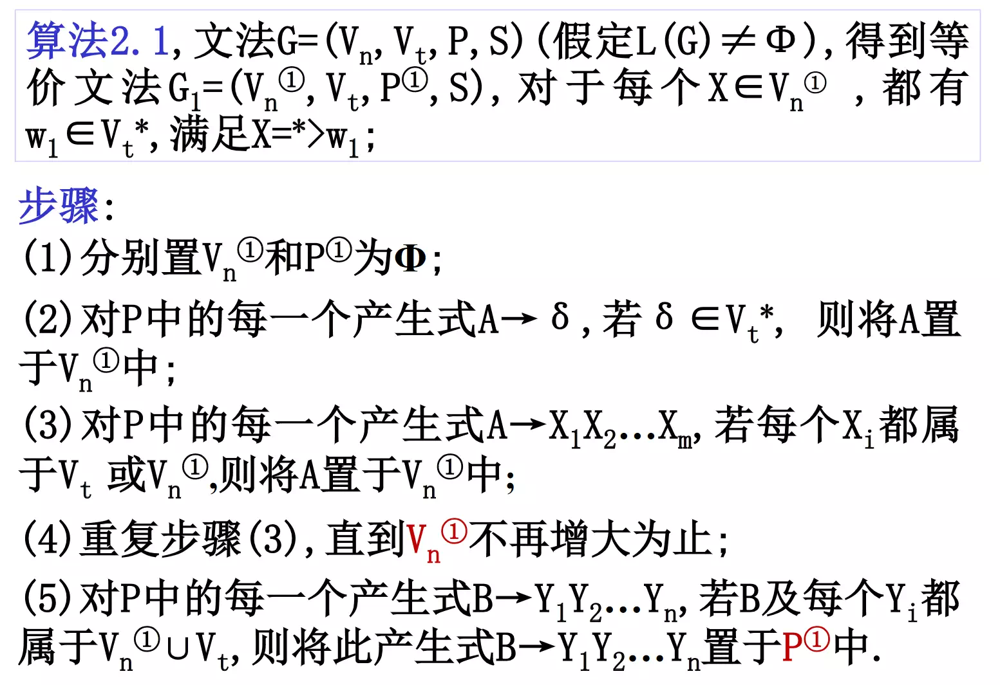

##### 算法2.2—— 筛选出可达符号集

文法G=(Vn,Vt,P,S)(假定L(G)≠Φ)，得到等价文法G′=(Vn′,Vt′,P′,S)，对于任一x∈V′，都存在α、β∈(V′)\*,有S=\*>αx，x∈Vt′∪Vn

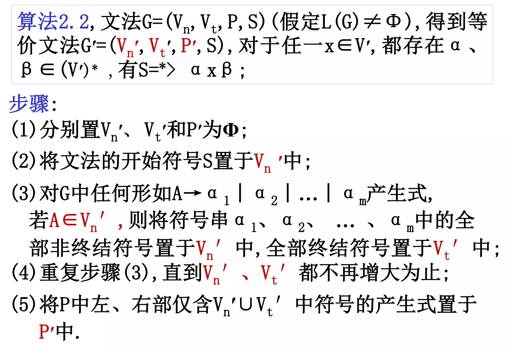

消除步骤:

1. 对文法G,执行算法2.1得到文法G1;
2. 对文法G1,执行算法2.2得到文法G′,为所求.

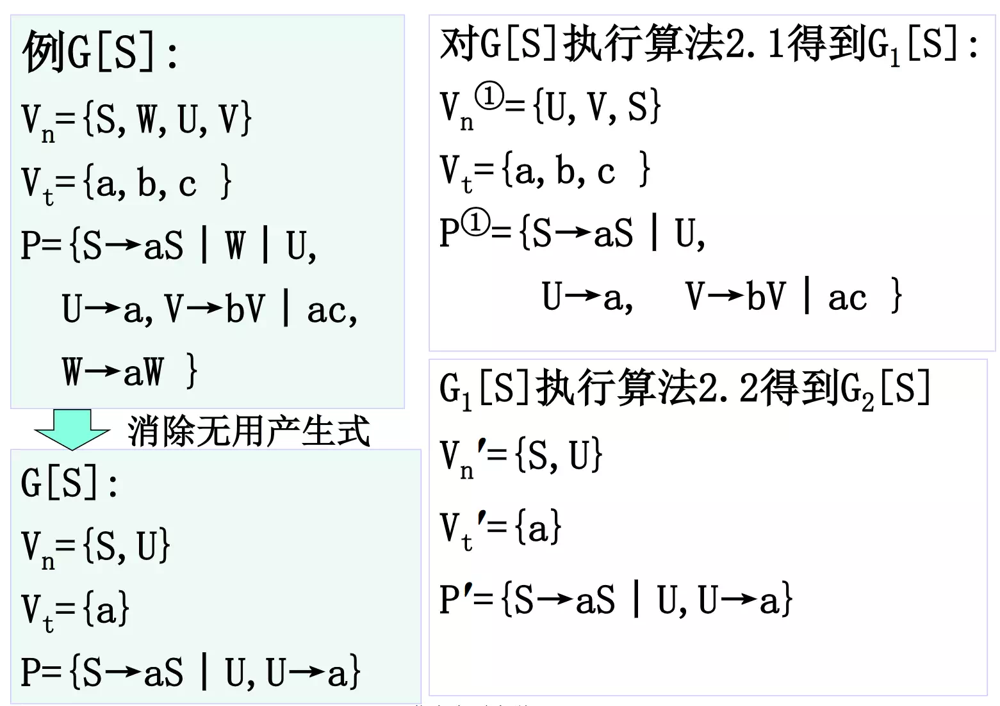

#### ε-产生式的消除

如某L(G)中不含ε，可消除G中的全部ε-产生式；

如某L(G)中含ε，肯定不能消除G中的全部ε-产生式；

消除步骤：

* 先用算法2.3找出G中满足A=\*>ε的所有A，构成集合W; 
  * 若ε不属于L(G)：用算法2.4 构造不含ε产生式的等价文法G′[S] 
  * 若ε属于L(G)：用算法2.5 构造仅含S①->ε产生式的等价文法G1(S①)
    * 算法2.5也分两种情况讨论：①S不出现在原文法产生式右部和 ②出现在原文法产生式右部

##### 算法2.3  - 找所有有限步导出ε的产生式左部

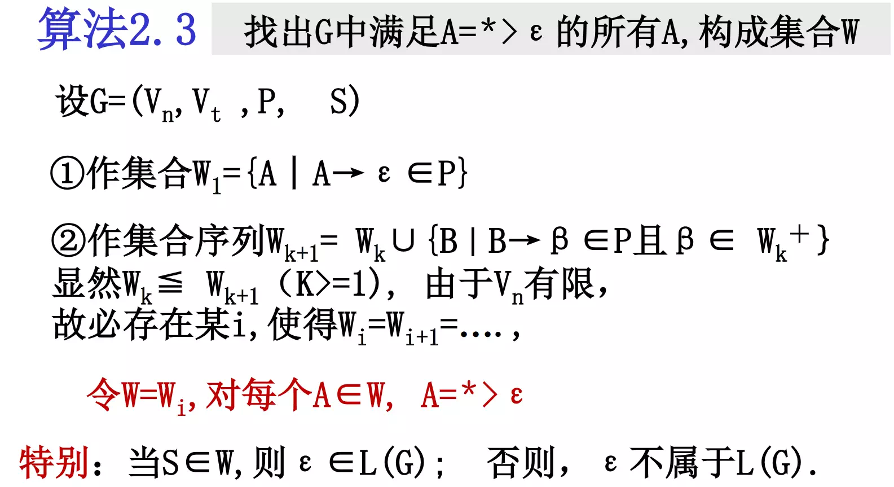

##### 算法2.4 - ε不属于L(G)的情况

若存在产生式 B→a0B1...Bkak∈P，aj∈(VUT)*，Bi∈V1，则以Bi或者空代替Bi

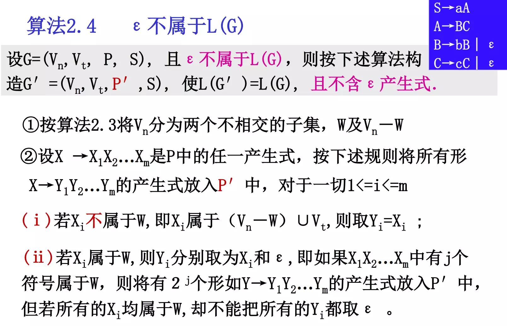

##### 算法2.5 - S不出现在原文法产生式右部的情况

需要引入 S→S | ε

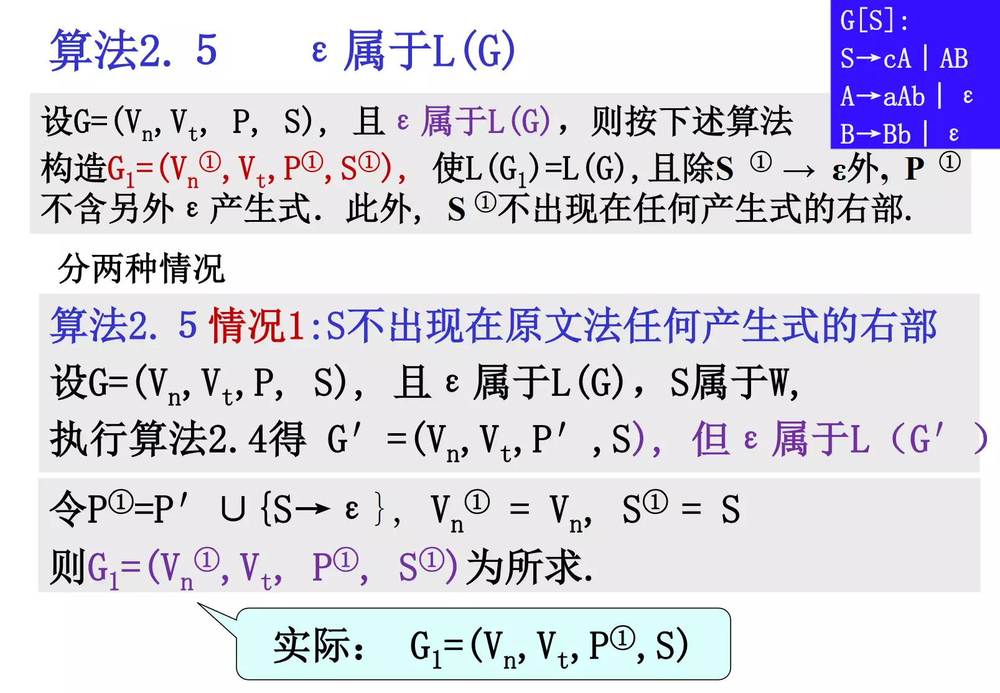

##### 算法2.5 - S出现在原文法产生式右部的情况

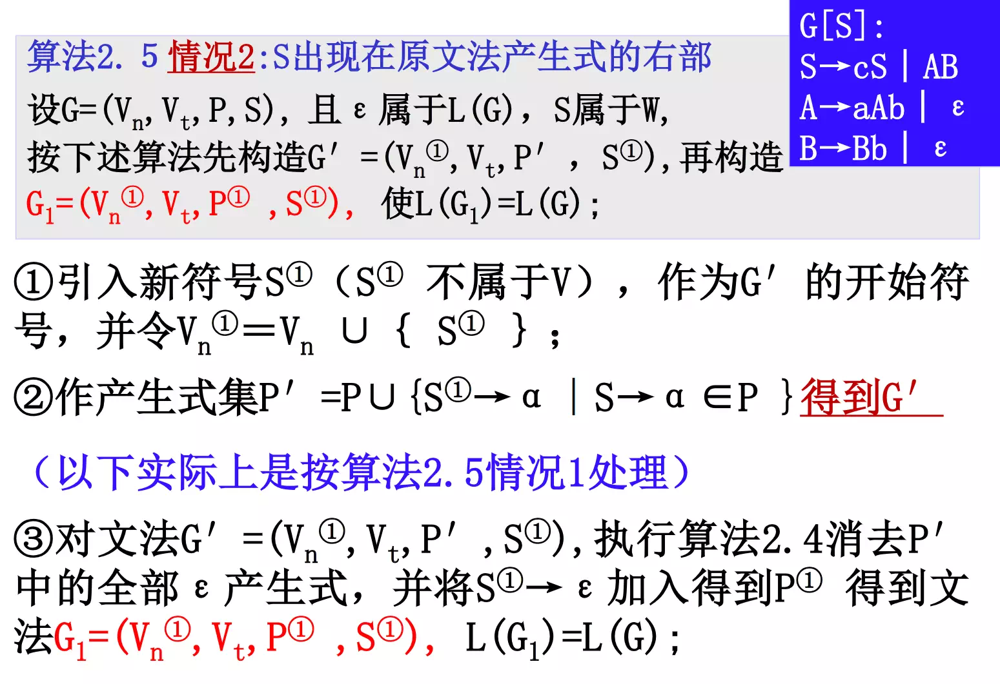

#### 单产生式的消除

单产生式类似 A→B，假定文法G中已经不含ε-产生式，执行算法2.6就能得到不含单产生式的文法G′

##### 算法2.6 - 遍历非终结符号

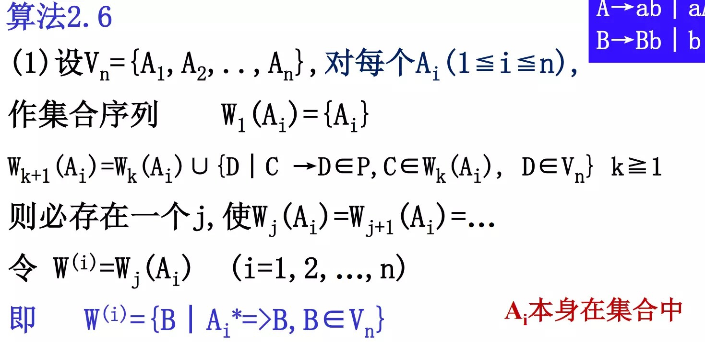

### 文法和语言的Chomsky分类

回顾：文法的四元组表示 $G = (V_n, V_t , P, Z)$

* $V_n$ 为**非终结符号集**

* $V_t$ 为**终结符号集**

* $P$ 为**规则的集合**

* $Z$ 为**文法的开始符号** 

乔姆斯基根据文法中 $P$ 的不同，将文法分为四类，每一种文法对应一种语言

#### 0型文法（递归可枚举文法）

文法G中规则呈 `α->β` ，其中 α∈V+，β∈V*
也称短语结构文法（PSG），图灵机能识别的语言为0型语言L0

#### 1型文法（上下文有关文法）

1型文法文法G中规则呈 `α1Aα2->α1βα2` ，其中 α1，α2∈V*，A∈Vn，β∈V+
也称上下文有关文法(CSG)，对应线性界限自动机，确定的语言为1型语言L1，也称上下文有关语言

#### 2型文法（上下文无关文法）——描述语法类

文法G中规则呈 `A->β` ，其中 A∈Vn，β∈V+ (或V*)
也称上下文无关文法(CFG)，对应下推自动机识别，确定的语言为2型语言L2或上下文无关语言
2型文法在语法分析中用于描述语法类

#### 3型文法（左线性和右线性正则文法）——描述单词符号

文法G中规则呈 `A->aB或A->a` 其中 A、Ｂ∈Vn，a∈Vt，称G为右线形正则文法
可以由**有限状态自动机**识别

## 3. 词法分析

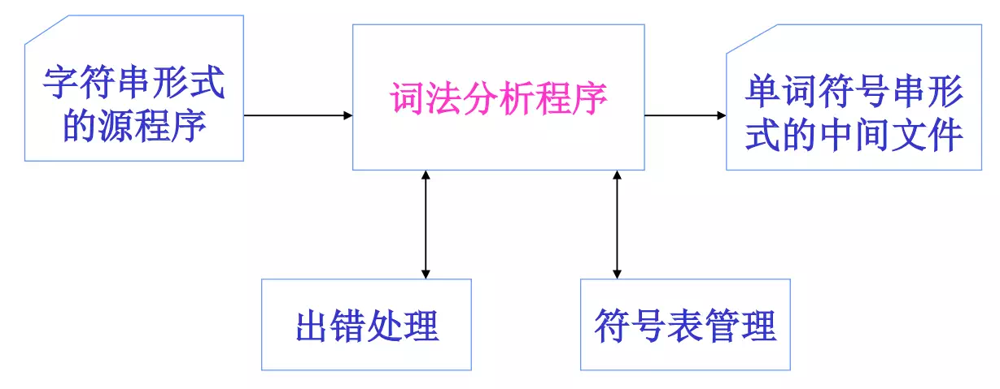

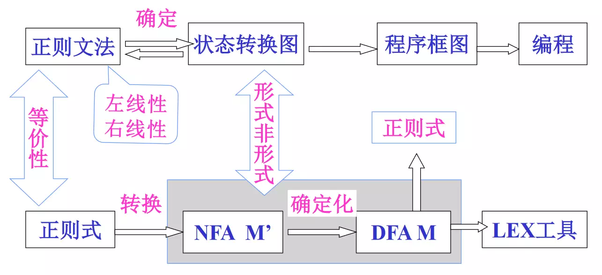


### 词法分析程序的输入和输出

#### 词法分析器

- 输入：符号串形式的源程序
- 输出：单词符号串

##### 实现方式

- 将词法分析作为单独的一遍，特点：
  1. 大部分编译时间花在扫描字符上，独立出来便于集中处理.
  2. 单词的词法规则简单，可建立特别适用于这种文法的有效技术，实现词法分析的自动生成.
  3. 整个编译程序结构简单，清晰，产生中间文件
- 也可以将词法分析作为一个独立的子程序，供语法分析程序调用，特点：
  1. 语法分析调用时，返回一个单词符号。
  2. 无中间文件，编译效率高

#### 单词符号的识别

##### 单词符号的种类

1. 保留字：如 `if`, `for`, `while`, `do` 等用户不能使用
2. 标识符：由用户定义变量名、函数名等
3. 无符号整数：如 `125`
4. 单字符分界符：`+`, ` -`, ` *`, ` / `, ` ；`, ` `, ` `, ` （ `, ` ）`, ` ：`, `>`, `<`, `=` 等等
5. 双字符分界符： `// `, `  /* `, `  * * `, `  >=`, `<=`, `<>`, `==`, `++`, `--` 等等

##### 识别标识符的若干策略和约定

约定：

1. 标识符中的字符个数超过最大允许长度，截去尾部。
2. 不超过最大长度的标识符，则按“尽可能长”的原则匹配。

#### 超前搜索技术

超前搜索技术也叫超前读字符，仅向前读取字符，和判别该字符是什么，不作处理，当判明后再回过来处理已读过的字符。

#### 词法分析的二元式输出

$(TokenType, Token)$形式

### 正则文法和状态转换图

需要掌握：

1. 由正则文法画出状态转换图
2. 由状态转换图识别输入串
3. 由状态转换图写出正则文法（左线性、右线性）

#### 状态图

状态图是一个由正则文法确定的有限的方向图，结点对应状态，含有一个初始状态和若干个终止状态。

#### 由正则文法画出状态转换图

**右线性文法**是**最右推导过程**，**左线性文法**是**最左归约过程**；

##### 右线性文法的状态图

右线性文法的规则呈 $A→aB$ 或 $A→a$ 其中 $A,B∈V_n , a∈V_t$ 

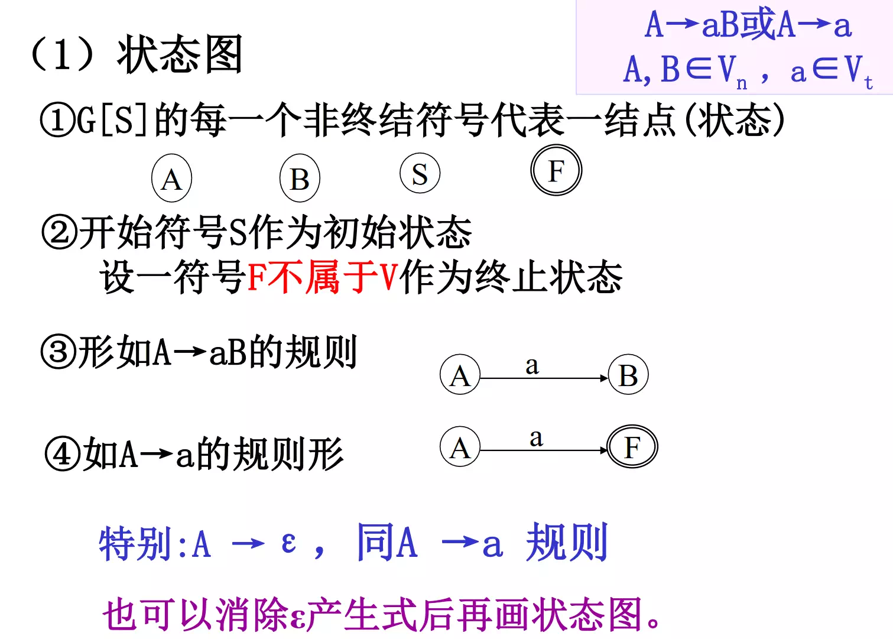

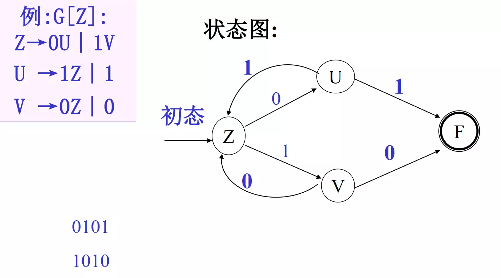

##### 左线性文法的状态图

左线性文法的规则呈：$A→Ba$ 或 $A→a$ 其中 $A,B∈V_n, a∈V_t$

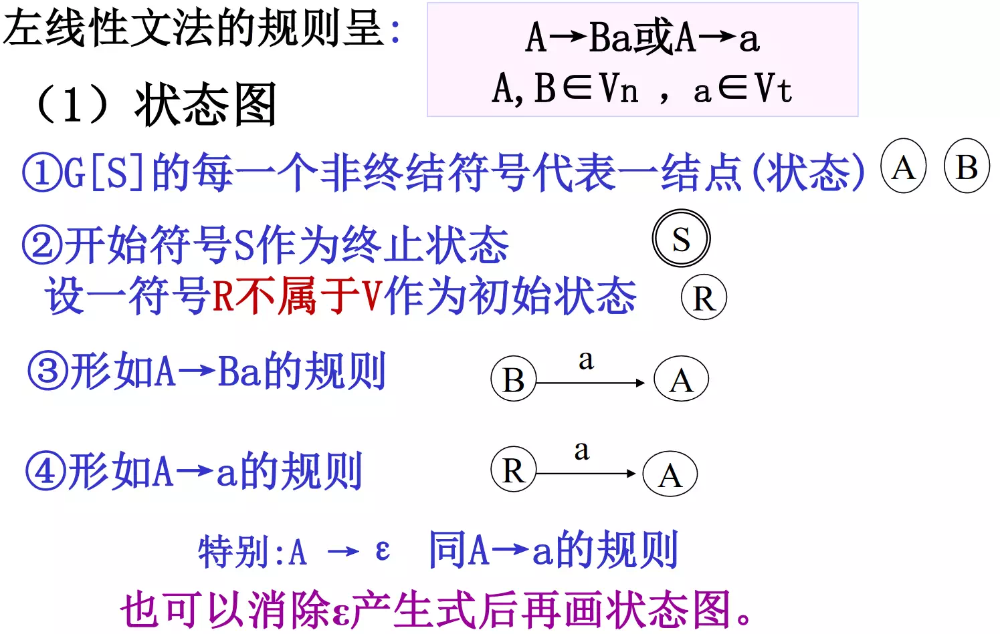

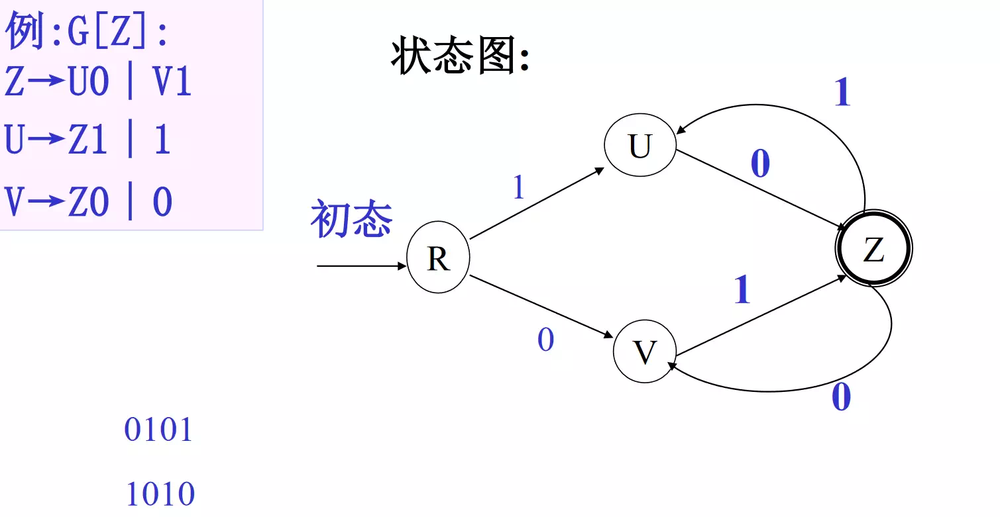

#### 状态图识别输入串

在状态图上行走识别句子(单词符号)

字符串 ω =a1a2a3......an 是文法的句子(单词符号)的条件：

1. 识别到字符串最后一个字符
2. 最终进入终止状态

否则，ω 不是文法的句子(单词符号)

### 正则表达式和有限自动机

#### 确定的有限自动机（DFA M）

DFA 由以下五个元素组成：$DFAM=(K, Σ, f, S_0, Z)$

- $K$：状态的集合（有限个状态）
- $Σ$：允许输入的字符的集合 Vt
- $f$：状态转换函数，单值函数 $K×Σ→K$
- $S_0$：初始状态
- $Z$：终止状态集

#### 非确定的有限自动机（NFA M′）

NFA 由以下五个元素组成：$NFAM′=(K′, Σ, f′, S_0′, Z′)$

- $K'$'：状态的集合（有限个状态）
- $Σ$：允许输入的字符的集合 Vt
- $f'$：状态转换函数，多值函数，$K’×Σ→{2^{k}}’$ (K的所有子集的集合)，$f(Si,a)=\{ Sk,St，... \}$
- $S_0'$：初始状态
- $Z'$：终止状态集

#### DFA 与 NFAMˊ 的等价性

##### **状态 q 的ε闭包 ε\_closure(q)** （q ∈K′）定义

1. $q∈ε\_closure(q)$
2. $q→\{ε\}$ 到达的状态均属于 $ε\_closure(q)$ 

##### 状态集 P 的 ε 闭包 ε\_closure(P) （P属于K′）定义

1. 若 $q∈P$，则 $q∈ε\_closure(P)$
2. 若 $q∈P$，$q→\{ε\}$ 到达的状态均属于 $ε\_closure(p)$ 

##### 读 ε 不动作的NFA和读 ε 动作的NFA的确定化

建一个状态为行，非终结符为列的表，第一行填入 $q_0$ （初态的 e 闭包）
重复广度优先搜索，通过各列非终结符能到达的原状态集计算 $q_i$，如果 $q_i$ 未出现过就新增一行

##### DFA 的最小化

设有 $DFA=(K, Σ, f, S_0, Z)$，最小化算法为重复地依次取每个状态计算其通过各个终结符号路径能到达的状态集

#### 正则表达式和正规集

正则式：描述单词符号

正规集：正规式描述的语言

- `*` 表示 0 次及以上自重复
- `+` 表示 1 次及以上自重复

#### 正则式的递归定义

设有字汇表V , 则:

- ε，Ø，a（a∈Vt）都是正则表达式，正规集{ε}, Ø, {a}
- `e1` 和 `e2` 是正则式,正规集分别为 `L1` 和 `L2` 
  则 `e1|e2` 是正则式,正规集为 `L1∪L2` 
  `e1·e2` 是正则式,正规集为 `L1L2` 
  `e1*` 是正则式, 正规集为 `L1*` 
  - 注: `*`, `·` , `|` 的优先级依次降低

两个正则式表示相同的语言称为相等，如`(a|b)*=(a*|b*)*` 

结合律 `(ab)c=a(bc)`, `(a|b)|c=a|(b|c)`  

交换律 `a|b=b|a` 

分配律 `a(b|c)=ab|ac`, `(a|b)c=ac|bc` 

其他 `r|r=r`, `r*=(r|ε)*=ε|r r*` 

#### 由正则文法构造相应的正则式

求出以 `{ }` 、 `|` 、 `.` 表示的文法的语言就是正则式，用 `=` 代替 `->`，用 `+`  代替 `|` 求出联立方程组的解

- **论断 3.1**：方程组 `X=rX+t` 有形如 `X=r*t` 的解
- **论断 3.2**：方程组 `X=Xr+t` 有形如 `X=tr*` 的解

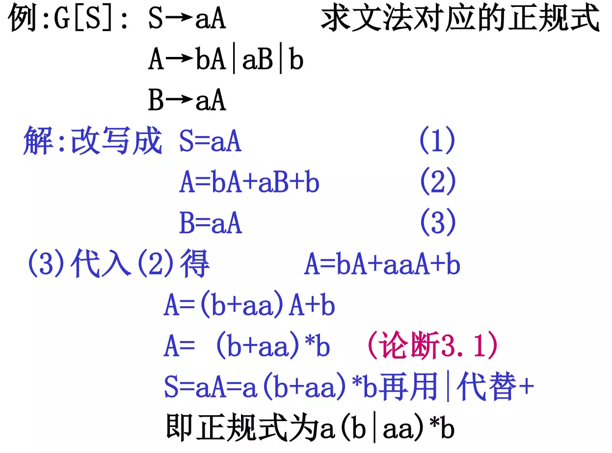

### 词法分析程序的设计

以下内容主要是词法分析程序的自动生成

> 正则文法→状态转换图→程序框图→编写程序
>

#### LEX 工具

美国Bell实验室用C语言研制的一个UNIX操作系统下的词法分析程序自动生成工具。（LEXical compiler）

#### LEX 源程序 

正则式描述的单词符号

形式：`{正则式辅助定义式} %% {识别规则} %% {辅助函数部分}`

1. **正则式辅助定义式** `Di->Ri`
   其中：
   ① Ri 是正则表达式，Di 是其简名
   ② Ri 中只能出现 Vt 中字符及 D1，D2，... , Di-1

2. **识别规则**
   `P1 {A1}
   P2 {A2}
   ：
   Pn {An}`
   其中：
   ① Pi    是定义在 Vt 及 {D1，D2，...Dn} 上的正则式，也称词形.
   ② {Ai}  为与 Pi 对应的语义动作（一段程序），识别出词形Pi后，词法分析器应采取的动作.

3. **辅助函数部分**
   给出用户所需要的其他操作，是对识别规则的补充，识别规则中某些动作需要调用的过程，如不是C的库函数，则要给出具体的定义。
   说明：
   ① 识别规则是 LEX 的核心，完全决定了词法分析器的功能，该分析器只能识别词形为 Pi 的单词符号。
   ② LEX 是借助其宿主语言C完成工作的。

#### LEX 的实现

##### **工作过程**

正则表达式→NFAMˊ→DFAM

1. 由每条 Pi 构造一 NFA Mi′
2. 将各 Mi′ 合并成一新的 NFA Mi′ 加入 ε 弧
3. 将 NFA Mi′ 确定化为 DFA M

##### **词法分析器(DFA M)**

LEX.yy.c 包括两部分：状态转换矩阵、总控程序 `yylex()` 

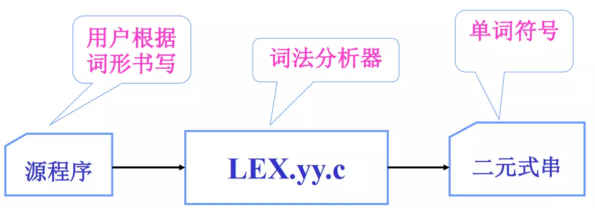

##### **处理二义性问题的两个原则**

例：【while：P5(while ) , P6(letter(letter︱digit)*)】，【<=：P8(<) , P9(<=)】

原则:

1. 最长匹配原则：能匹配最多字符的规则优先，选 <= P9
2. 优先匹配原则：满足最长匹配的情况下,一个字符串可与若干Pi匹配，则Pi在前的优先，选 while P5

## 4. 语法分析——自上而下的语法分析

准备工作是需要先消除左递归和回溯，才能用自顶向下语法分析。

### 消除左递归

要求：文法不含 `A->A` 和 `A->ε`

原理：`S->Aβ|γ`,  `A->Sα`，转换成 `S->Sαβ|γ`，间接左递归替换成直接左递归再消除

#### 直接左递归的消除

例：对于 `U->Ua|b` 有 2 种方法消除左递归

1. 用扩充的 BNF 符号表示，得 `U->b{a}` 
2. 引入新的非终结符号（提取公因子 `U'->{a}` ）得 `U->bU'`    `U'->aU'|ε`

#### 间接左递归的消除

概括就是先提取公因子再按直接左递归处理

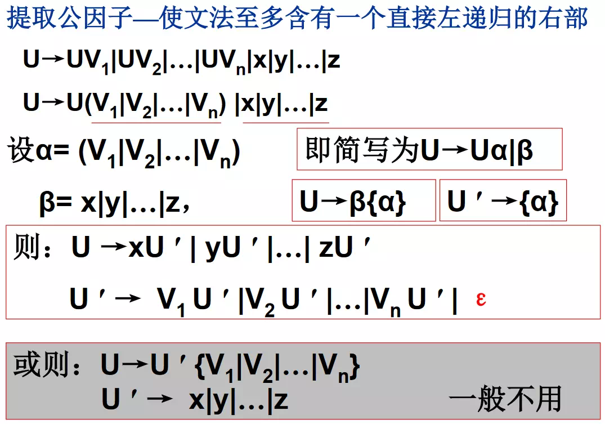

### 消除回溯

实际上不是消除，是改写文法避免回溯；

若 S 为文法的开始符号，则 `#∈Follow(S)` 

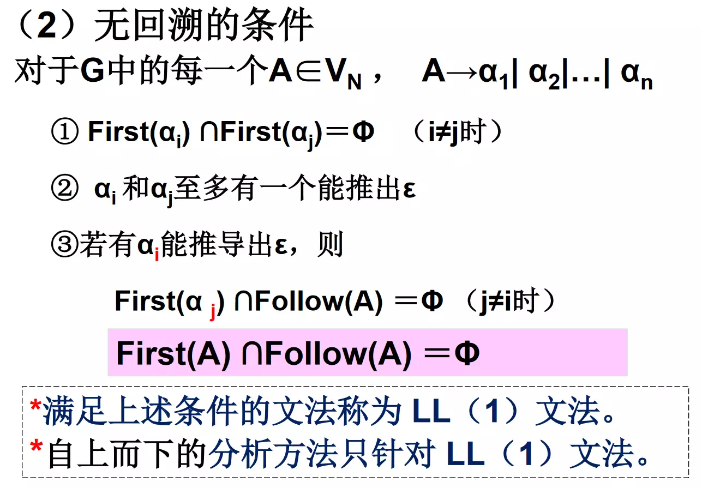

#### 构造 FIRST 集合和 FOLLOW 集合

用对有限集合的反复遍历直到不再增大，代替无穷展开，`#` 就是文法末尾的标记，作业考试认为可加可不加；

> 此处图片来自 [国防科技大学的《编译原理》课件](https://www.bilibili.com/video/BV1DJ411M7eV) 

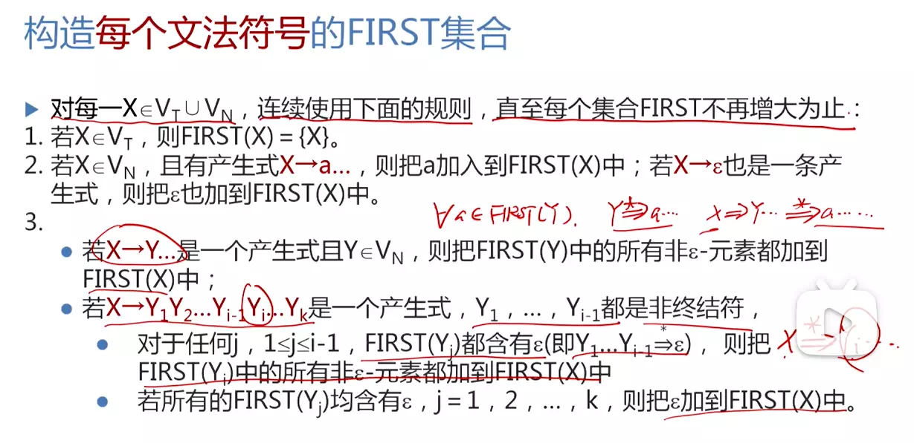

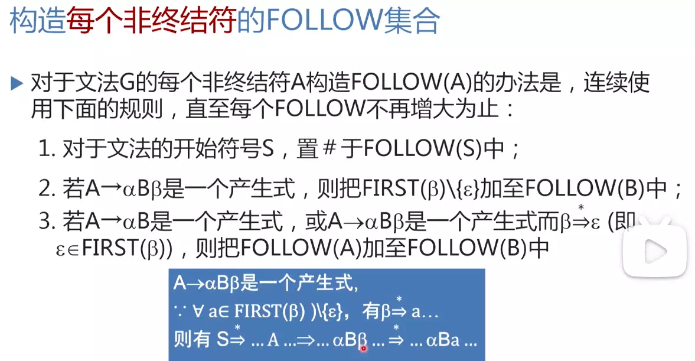

消除左递归和回溯后，就可以进行**无左递归无回溯的自顶向下分析**

### 递归下降分析

可参考 [LeetCode 的 385. 迷你语法分析器](https://leetcode-cn.com/problems/mini-parser/) 

先求出 FIRST 和 FOLLOW 集合

基本思想：每个非终结符号完成相应功能，每一次推导都是可预测的，存在递归规则。

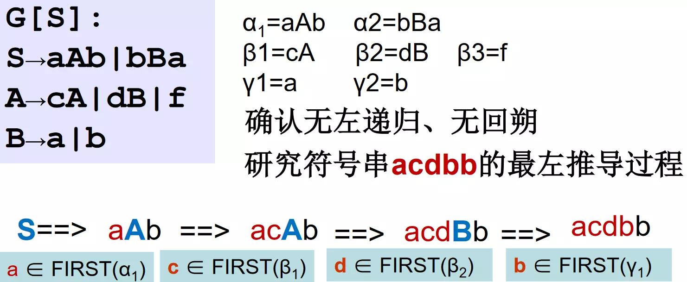

### LL(1)文法

化简的、无左递归、无回朔的文法

### LL(1)分析法

对 LL(1) 文法使用，用分析表、分析栈和总控程序实现

- `L`：自左（Left）向右扫描源程序
- `L`：产生一个最左推导（LeftMost）
- `1`：只向前看一个输入符号便能确定当前应选择的规则

#### 逻辑结构

- 分析表M：包含文法的全部信息
- 分析栈：用于存放分析过程中的文法符号(V中）
- 总控程序：控制分析过程（不同的文法可用一个)

#### 分析表 $M[A,a]$

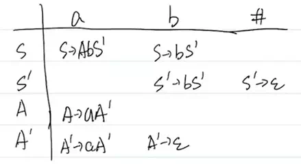

- A：处于分析栈中
- a：处于输入串中
- $M[A,a]$：分析栈中A面临输入符号a时应采取的动作

|      | a      | ...  |
| ---- | ------ | ---- |
| A    | M[A,a] | ...  |
| ...  | ...    | ...  |

## 4. 语法分析——自下而上的语法分析

### 简单优先分析

简单优先文法

需要满足 2 个条件：

1. 文法中任意两种符号之间存在一种优先关系或不存在优先关系；
2. 任意两个不同的产生式没有相同的右部

#### 简单优先关系定义

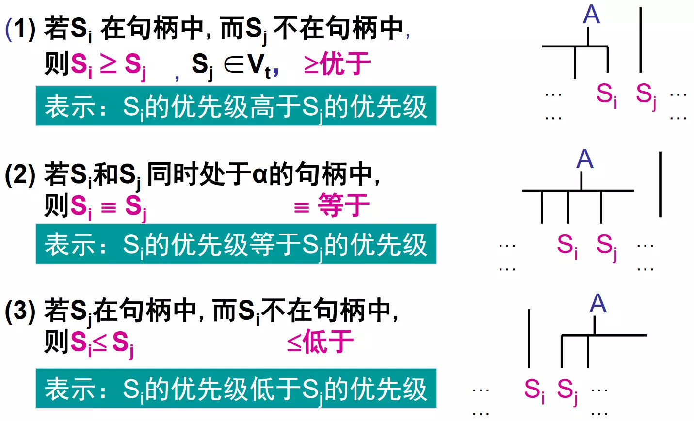


#### 构造简单优先关系矩阵

今年**考试不考矩阵构造**，但要求掌握**从表达式求解优先关系**；

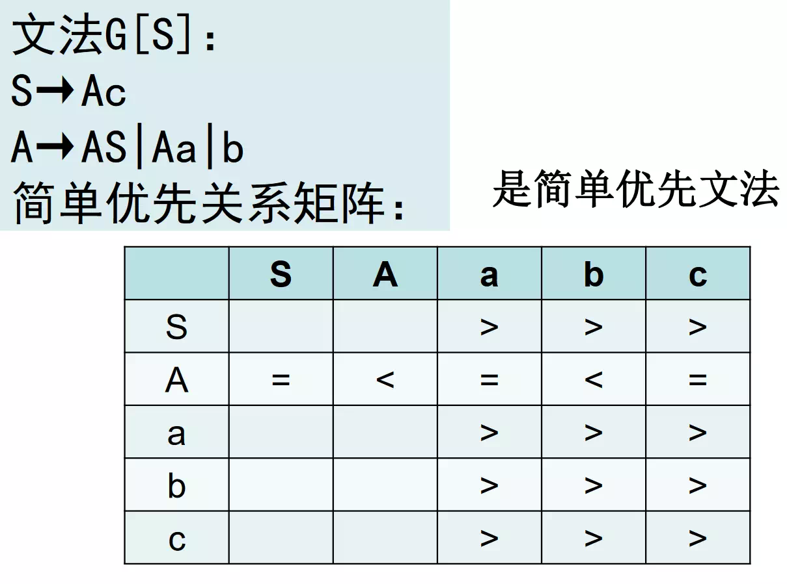

- 定义4.2（关系LEAD) 当且仅当 G中存在形如 `A->B.....` 的产生式时，有 `A LEAD B`；
  					`A=+>B.....` 时，有 `A LEAD+ B`. 
- 定义4.3（关系LAST) 当且仅当 G中存在形如 `A->......B` 的产生式时，有 `A LAST B`；
  					`A=+>......`B 时，有 `A LAST+ B`. 

- 定义4.4	设R为一关系，R的转置 `TRANSPOSE(R)` 定义为当且仅当 `aRb` 时，`b TRANSPOSE(R) a`. 


定理：在同一字母表上的两个关系的乘积，可用表示这两个关系的布尔矩阵的乘积给出.

定理：设有一n个符号的字母表S，R是S上的一个关系，而B是一个表示R的n×n布尔矩阵，那么B+=B+BB+BBB+......+Bn	其中 B+ 表示 R 的传递闭包 R+.

#### 句柄的确定

对简单优先文法的任何规范句型 $x1x2...xn$ 而言，句柄是该句型中满足以下 3 个条件的
最左子串 $xixi+1...x i+k$

1. $x_{i-1} < x_i$ 
2. $x_i = x_{i+1}=...=x_{i+k}$ 
3. $x_{i+k} > x_{i+k+1}$ 

### 算符优先分析

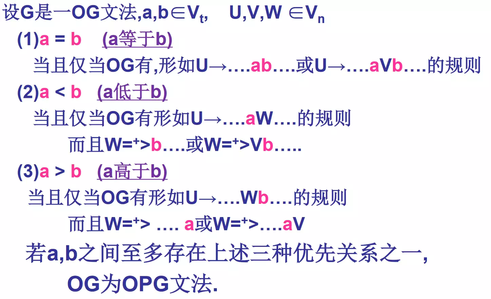

#### 算符优先矩阵

- 素短语：一个短语，它至少包含有一个终结符号，并且除它自身之外，不再包含其它任何更小的素短语。

- 最左素短语：句型最左边的那个素短语。

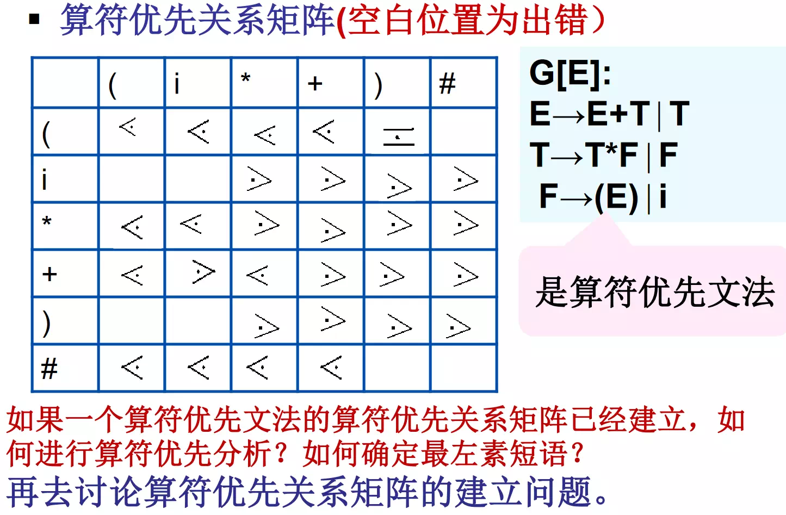

#### 句柄

算符优先分析要寻找的句柄就是**最左素短语**。

#### FIRSTVT 和 LASTVT 集合

- **求任意非终结符 U 的 FIRSTVT（U）集合的方法**
  - 若产生式 `U->aL` 或 `U->QaL` 则 `a∈FIRSTVT(U)`  直取
  - 若 `a∈FIRSTVT(Q)` 且有产生式 `U->QL`，则 `a∈FIRSTVT(U)` 俘获
- **求任意非终结符 U 的 LASTVT（U）集合的方法**
  - 若产生式 `U->La` 或 `U->LaQ` 则 `a∈LASTVT(U)` 直取
  - 若 `a∈LASTVT(Q)` 且有产生式 `U->LaQ`，则 `a∈LASTVT(U)` 俘获
- FIRSTVT 集和 LASTVT 集的解题技巧：最简单的规则表达式（含终结符）的优先

#### 构造算符优先矩阵

1. 首先构造 FIRSTVT 和 LASTVT 集合
2. 加一个 #S# （# < FIRSTVT(S)， LASTVT(S) > #）
   1. 对于 $a < b$ 是从左向右填 $a$ 所在行
   2. 对于 $a > b$ 是从上往下填 $a$ 所在列

#### 优先函数的构造程序

##### Bell 方法

1. 对每个 $a∈V_t$ (包括#)，构造两个结点 $fa, ga$
2. 对于优先关系矩阵的关系
   遇 $a > b$ 或 $a = b$，则画一条从 $fa$ 到 $gb$ 的有向弧
   遇 $a < b$ 或 $a = b$，则画一条从 $gb$ 到 $fa$ 的有向弧
3. 对每一结点赋值，值为从该结点出发，所能到达的结点个数(包含自身)
4. 赋给 $fa$ 的数为 f(a)，赋给 $gb$ 的数为 g(b)

##### Floyd 方法

f：入栈优先函数，g：比较优先函数

1. 对每一个 f 和 g 赋初值，置 `f(θ)=g(θ)=1` 

2. 迭代，即每一 (θ1, θ2)
   若 `θ1>θ2` 但 `f(θ1)<=g(θ2)`，则执行 `f(θ1)=g(θ2)+1`；
   若 `θ1<θ2` 但 `f(θ1)>=g(θ2)`，则执行 `g(θ2)=f(θ1)+1`；
   若 `θ1=θ2` 但 `f(θ1)!=g(θ2)`，则令 `f(θ1)` 和 `g(θ2)` 中的最小者等于最大者；
3. 重复直至过程收敛为止

### LR(k) 分析法


LR(0)有效项目集规范族C构造
LR(0)文法(不含冲突项目)
LR(0)分析法（分析过程）
LR(0)分析表构造
SLR(1)文法（含冲突项目，冲突可解决）
SLR(1)分析法(冲突解决办法)
SLR(1)分析表构造
含冲突项目，冲突不可解决，不是SLR（1）文法

### LR(k) 分析法

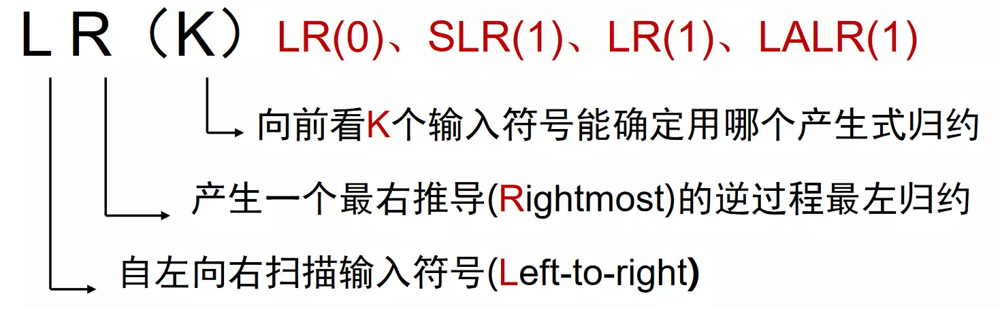

> 此处图片和写法来自 [编译原理—混子速成期末保过\_哔哩哔哩\_bilibili](hhttps://www.bilibili.com/video/BV1ft4y1X7p6?p=4) 

能分析的文法：LR(0) < SLR(1) < LR(1) < LALR(1) 

#### 活前缀、可归前缀、有效项目定义

**项目**：右部某位置添加了圆点点 · 的产生式，称为 LR(0) 项目

1. 规约项目 `A->a·`
2. 接受项目 `S->a#·`
3. 移进项目 `A->a·xb`
4. 待约项目 `A->a·Bb`

**项目集**：所有等价项目，每个项目集闭包对应一个自动机状态 

**可归前缀**：形式为 `αβ[p]`，其中 `α∈V∗`，p 为规则序号，β 为第 p 条规则右部，`B->β`

**活前缀**：对于最右推导过程 `S->α1->α2->......->αm=x`，若 `αi=φBt` 且 `B->β, φ∈V*, t∈Vt*`
则存在最右推导 `φBt->φβt`，令 `φβ=u1u2.......urui ∈V`，则 `u1u2.......ui` (1≤i≤r)为句型 `φβt` 的活前缀

### LR(0) 分析法

**LR(0) 文法**：项目集中无移进-归约冲突（既含有移进项目，又含有归约项目），无归约-归约冲突，则是 LR(0) 文法

#### 构造 DFA 的准备工作

1. 先改写成唯一初态的**拓广文法**（前面加一个 `S'->S`)
2. 构造**有效项目集**规范族 C （这个过程建议意会，别抠概念了）
3. 画出识别全部活前缀的DFA

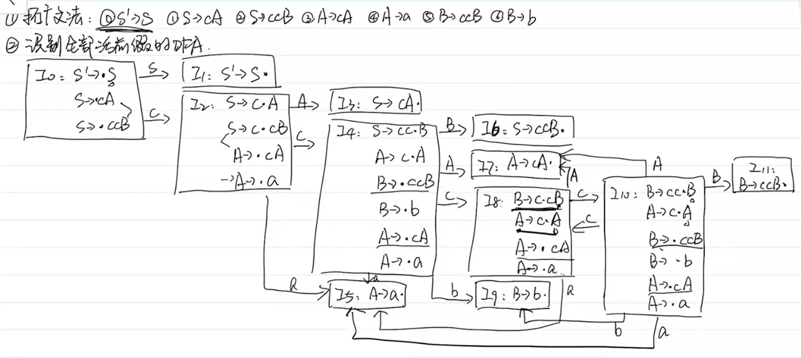

#### **LR(0) 分析表**

- ##### ACTION

  - $S_n$：移进，遇到该终结符移到状态 n
  - $r_n$： 归约，该状态 n 为归约项目，此行都填上 $r_n$ （n 是文法中第几个产生式的排序）
  - $acc$：接受项目，# 处填 $acc$ 
  - 空白：出错

- ##### GOTO

  - n：经过此非终结符得到的状态 n 

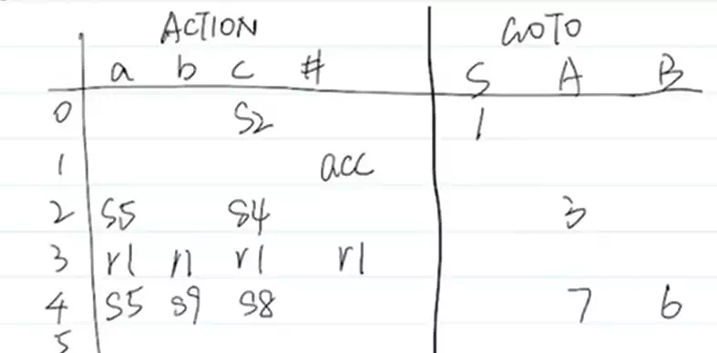

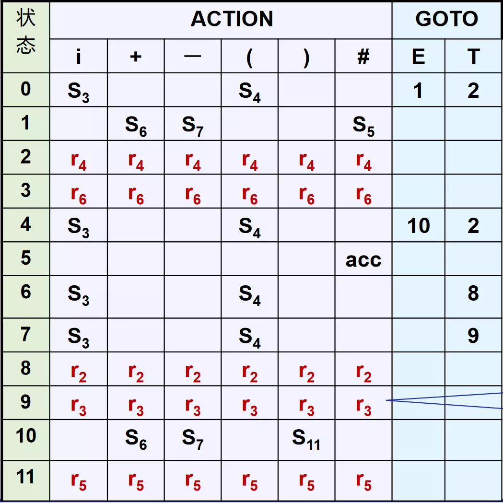

### SLR(1) 分析法

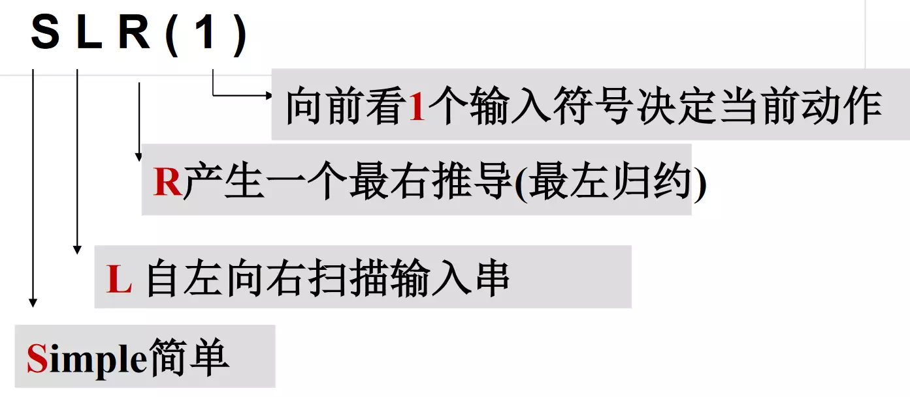

分析方法：移进~归约，包括对偶栈、分析表、总控程序，SLR(1) 分析表构造  = LR(0) 分析表 + SLR(1) 分析法

适用于含有冲突项目（LR(0)分析法无法解决）的文法，SLR(1) 解决冲突的办法就是向前再看1个输入符号

#### 判断是否为 SLR(1) 文法

$\{经过的符号\}∩各个非终结符的Follow(A)$ 为空集 

#### SLR(1) 分析表构造

1. 拓广文法 G′ 
2. 对 G′ 构造 LR(0) 有效项目集族 C 和 Go 函数
3. 若 `GO(Ci, a)=Cj`，a∈Vt, 置 `ACTION(i,a)=Sj`
4. 若 `A->α·∈Ci` 且 `a∈FOLLOW(A)`, a∈Vt，置 `ACTION(i,a)=rj`  (A → α为第 j个产生式)
5. 若 `S->δ·∈ Ck`  (S为拓广文法开始符号，置 `ACTION(k,#)=acc`
6. 若 `GO(Ci,A)=Cj`  A∈Vn，置 `GOTO(i,A)=j ` 

例：对于文法 G[S] 

> S → E
> E → E+T | E-T | T	
> T → i | (E)

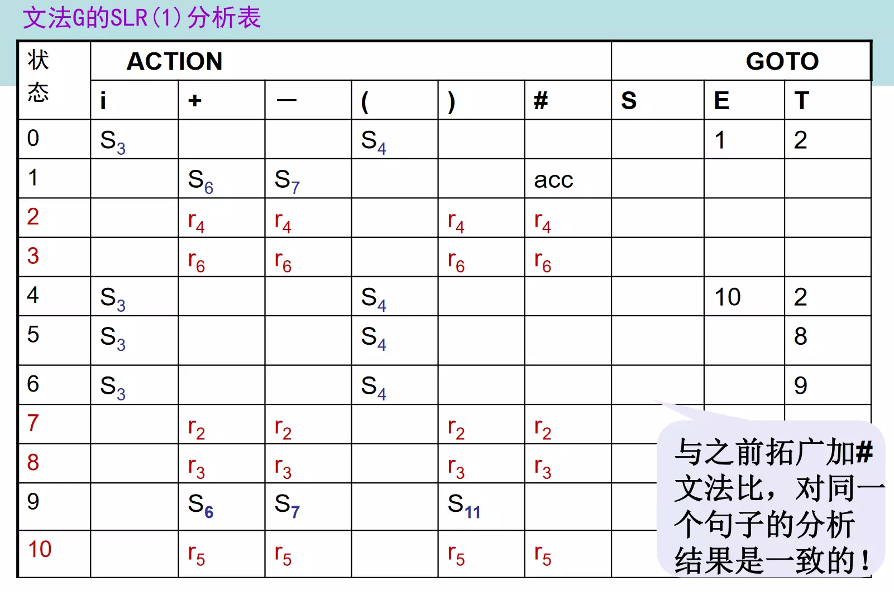

例：文法 G[S]

> S → A [1]
> A → V=E[2]
> E → E+T[3]∣T[4]
> T → T*F[5]∣F[6]
> F → (E)[7] ∣i[8]
> V → i [9]

答：`C0={S→.A, A→.V=E, V→.i}
C1={S→A.} 
C2={A→V.=E} 
C3={V→i.}
C4={A→V=.E,E→.E+T,E→.T, T→.T*F,T→.F,F→.(E),F →.i}
C5={A→V=E.,E→E.+T} 
C6={E →T.,T→T.*F}
C7={T→F.}
C8={F→(.E),E→.E+T,E→.T, T→.T*F,T →.F,F→.(E),F→. i}
C9={F→i.}
C10={E→E+.T, T→.T*F,T→.F,F→.(E),F→ i}
C11={T→T*.F,F→.(E),F→ i}
C12={E→(E.),E→E.+T} 
C13={E→E+T. ,T→T.*F}
C14={T→T*F.} 
C15={F→(E).}`  

SLR(1) 分析表：

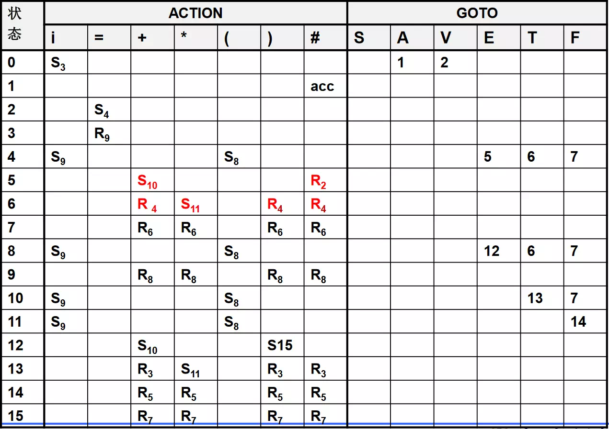

## 5. 语法制导翻译及中间代码生成

### 语义分析和语法制导翻译概述

- 任务：保证目标程序与源程序的语义等同
- 功能：生成某种中间代码或实际的目标代码
- 中间代码：含义明确，结构简单的记号系统，与具体的硬件无关，不是目标代码，确非常容易转成目标代码。
- 语法制导翻译：一个翻译文法包含一个上下文无关文法和一系列语义规则（语义动作或语义子程序），这些语义规则附在文法的每个产生式上，在语法分析的同时执行这些语义规则，生成中间代码，实现语法制导翻译。

- 自上而下的语法分析：一个产生式用于推导时执行语义动作
- 自下而上的语法分析：一个产生式用于归约时执行语义动作，自下而上的语法分析有时需改写文法才能及时完成语义动作

### 波兰翻译文法和属性翻译文法

波兰翻译文法：翻译文法中每个产生式右部中的全部语义动作均出现在所有文法符号的右边。

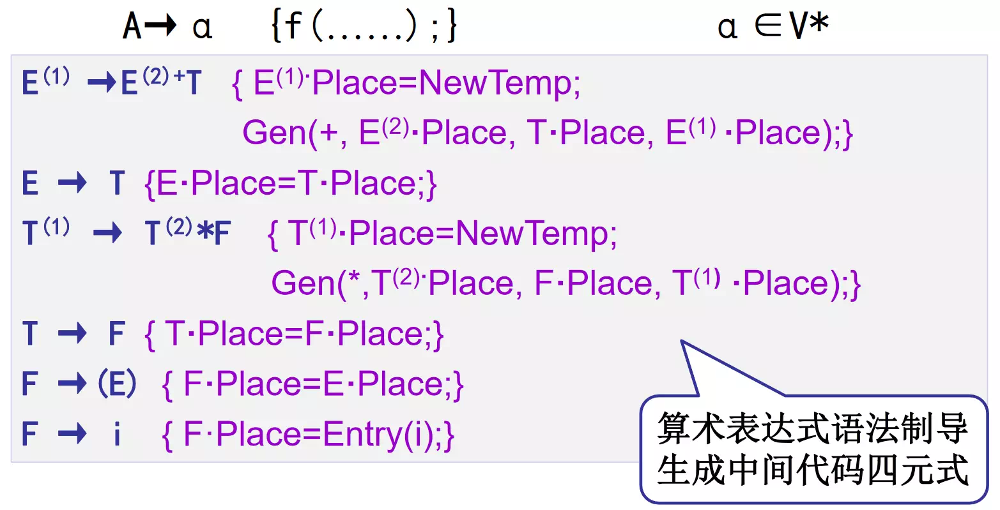

属性翻译文法：在一个属性翻译文法中，对应于每个产生式 `A->α` 都有一套与之相关的语义规则，每条语义规则的形式为 `b=f(C1 , C2 ..., Ck)`，其中 f 是一个函数；

1. `b` 是 A 的一个综合属性
2. `C1, C2 ..., Ck` 是产生式右边文法符号的属性

或者

1. `b` 是产生式右边某个文法符号的一个继承属性
2. `C1, C2 ..., Ck` 是 A 或者产生式右边任何文法符号的属性；

在这 2 种情况下都说属性 `b` 依赖于 `C1 , C2 ..., Ck` 

属性可以计算和传递，综合属性用于“自下而上”传递，继承属性用于“自上而下”传递；

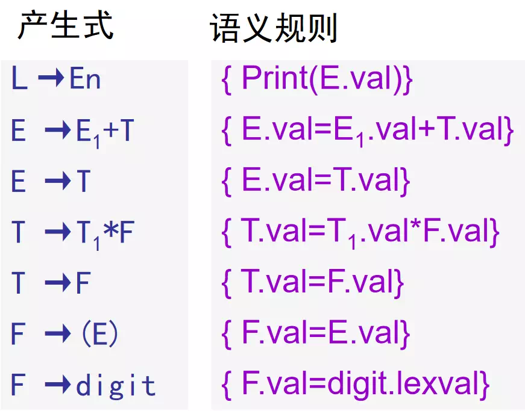

### 中间代码的形式

#### 逆波兰表示

后缀式 `e1e2......ekθ`，其中 `θ` 是 k 目运算符；运算量在前，运算符在后，无括号；

1. 自左向右扫描后缀式
2. 遇到运算量进栈
3. 遇到k目运算符则作用于栈顶的k项
4. 用运算结果代替这k项

#### 三元式

表示形式 `(op, ARG1, ARG2)`，其中：`op` 为运算符，`ARG1` ，`ARG2` 为第一/二运算量指向符号表的某一位置或三元式表自身的某一项；

1. 表达式及各种语句都可以表示成三元式

2. 三元式出现的顺序为表达式的计值顺序

3. 一目运算任选 `ARG1` 或 `ARG2`

#### 间接三元式

在三元式的基础上，间接码表按运算的先后顺序列出有关的三元式在三元式表中的位置

| 一般三元式                                                   | 间接三元式                                                   |
| ------------------------------------------------------------ | ------------------------------------------------------------ |
| 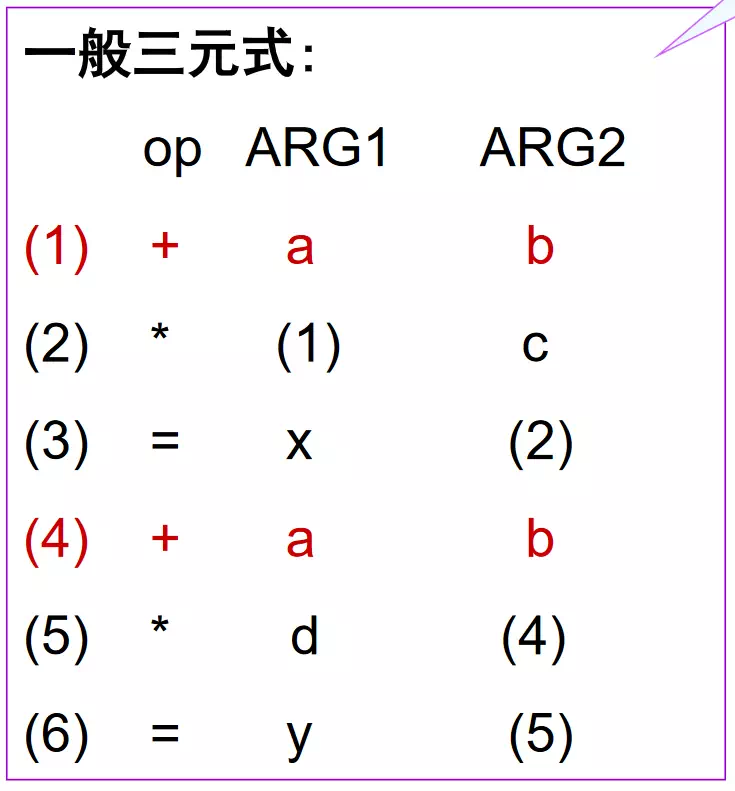 | 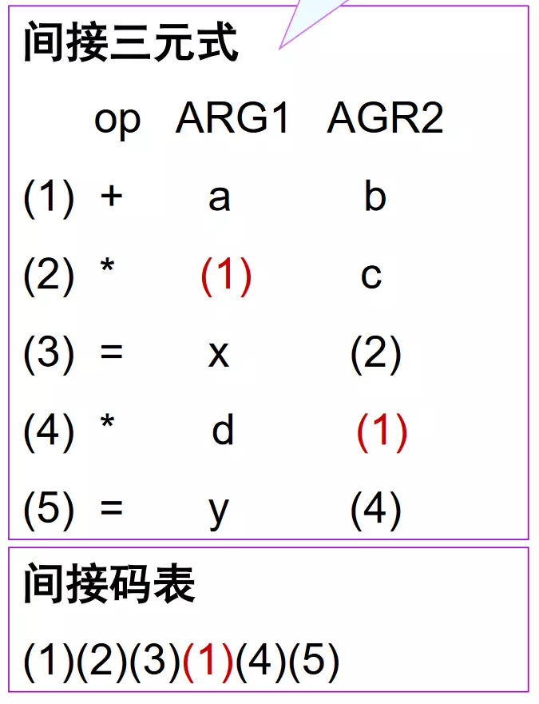 |

#### 四元式

表示形式 `(op,ARG1,ARG2,RESULT)` 其中 `ARG1`, `ARG2`,  `RESULT` (运算结果) 是用户定义的变量或引进的临时变量，指向符号表的入口位置

1. 一目运算用 `ARG1`
2. 四元式出现的顺序与表达式的计值顺序一致，可以写成类似 `result := arg1 op arg2` 的形式
3. 临时变量可以象变量名一样填入符号表
4. 四元式之间通过临时变量联系，易于优化

#### 抽象语法树

把文法规则中的本质抽象出来，非本质部分去掉所得的文法为抽象语法，与抽象语法对应的语法树称为抽象语法树。

| 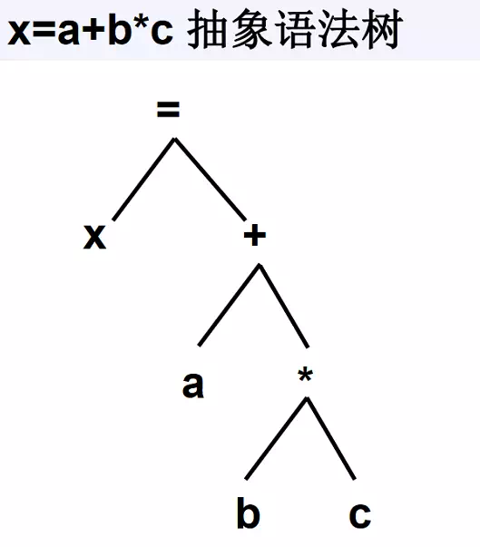 | 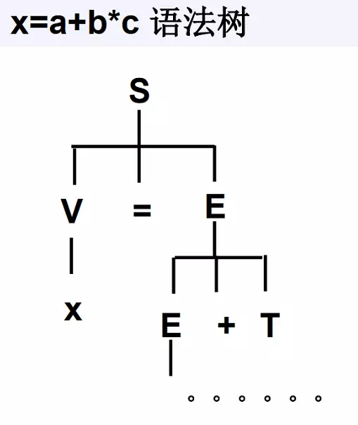 |
| ------------------------------------------------------------ | ------------------------------------------------------------ |

### 语句的语法制导翻译

#### 基本思想

语句：各种语句均有语义动作

1. 可执行语句----生成四元式
2. 不可执行语句(声明语句）---填写符号表

语句翻译的构思要点

1. 确定语句的目标代码结构
2. 确定中间代码
3. 添加语义动作

数据结构：符号表，四元式表，临时变量表

#### 赋值语句和表达式到四元式的翻译

1. `NewTemp` 函数：每次调用产生一个新的临时变量 `T1`, `T2`, `...`
2. `E·Place`（或 `T·Place`, `F·Place`）：与非终结符号 `E`（或 T, F）相关的语义变量。
   表示存放 `E` 值的变量名（用户）在符号表的地址、或一个整数码临时变量 `Ti`。
3. `Gen(op, ARG1, ARG2, RESULT)` 函数：把四元式填入四元式表中。
4. `Entry(id)` 函数：查找标识符 `id` 在符号表中的位置。

#### 条件控制语句布尔式到四元式的翻译

布尔式的四元式序列形式定义

1. `(jnz, A, _, p)`：若 `A` 为真，转第 p 个四元式
2. `(jez, A, _, p)`：若 `A` 为假，转第 p 个四元式
3. `(jθ, A1, A2, p)`：若 `A1 θ A2` 的关系为真，转第 p 个四元式
4. `(j, _, _, p)`：无条件转第 p 个四元式

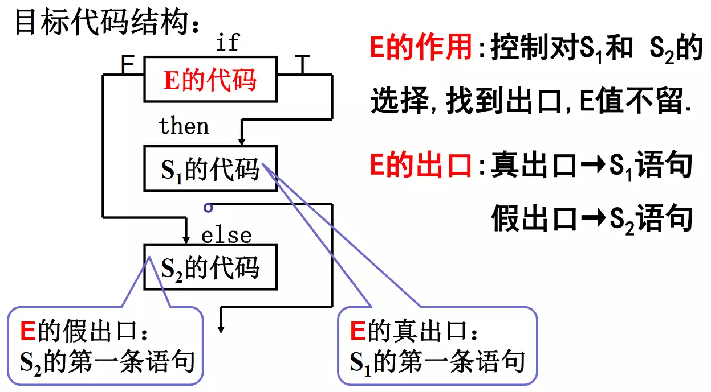


#### 确定真假出口的方法

建议观看 [编译原理—混子速成期末保过\_哔哩哔哩\_bilibili](https://www.bilibili.com/video/BV1ft4y1X7p6?p=5) 

| 3 种条件运算关系                                             |
| ------------------------------------------------------------ |
| 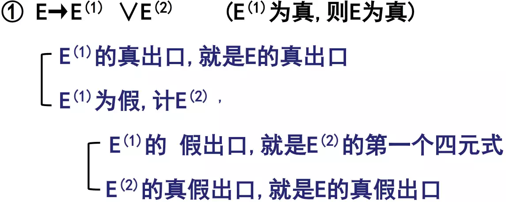 |
|  |
| 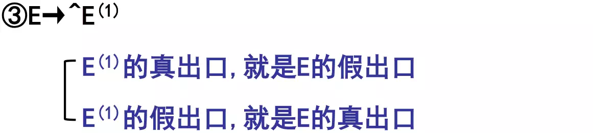 |

#### 确定目标地址的方法

四元式第4个位置不能确定时先填0

多看作业5的订正

| 建议对例题过程意会，不要硬啃定义                             |
| :----------------------------------------------------------- |
| 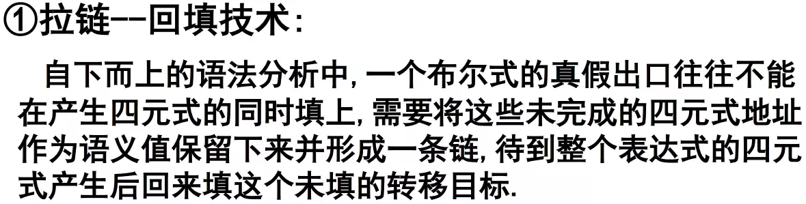 |
| 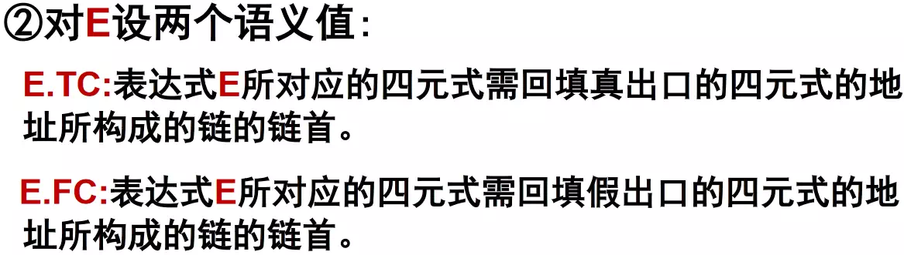 |

## 9. 目标代码生成

目标代码生成即把中间代码变换成目标代码的过程。

目标代码有以下三种形式：

1. 能立即执行的机器语言代码（地址定位）。
2. 待装配的机器语言模块（可重定位）。
   当需要执行时由链接装入程序把它们和某些运行程序连接起来，转换成能执行的机器语言代码。
3. 汇编语言代码，尚须经过汇编程序汇编，转换成可执行的机器语言代码。

### 基本块

程序可以被划分为多个基本块。

基本块是指程序中一顺序执行的语句（四元式）序列，只有一个入口和一个出口，入口就是第一个语句，出口就是最后一个语句，只能从其入口进入执行，出口退出。

### 基本块划分算法

适用于程序和四元式，三元式序列

1. 求出程序中各个基本块的入口语句，它们是：
   (1) 程序的第一个语句，或
   (2) 能由转移语句转移到的语句，或
   (3) 紧跟在转移语句后面的语句.
2. 对以上求出的每一入口语句，构造其所属的代码块（即找出口语句）由该入口语句到：
   (1) 下一入口语句（不包括该入口语句）或到
   (2) 转移语句（包括该转移语句）或到
   (3) 停语句（包括该停语句）之间的语句序列组成。
3. 凡未被纳入某一基本块的语句，都是程序中控制流无法到达的语句，可从程序中删除。

适用于程序和中间代码

### 四元式的翻译方法

| 四元式                                                  | 含义                     | 对应的 8086 汇编语句                                   |
| ------------------------------------------------------- | ------------------------ | ------------------------------------------------------ |
| `(Program, Prog_id, _ ,_)`<br/> `(main, Prog_id, _, _)` | 主程序的开始             | MAIN SEGMENT: <br/>ASSUME CS: MAIN, DS: MAIN, SS: MAIN |
| `(sys, —, —, —)`                                        | 程序的结束               | 终止程序的运行, 返回 OS                                |
| `(+, A, B, T)`                                          | T=A+B                    | MOV AX, A;<br/>ADD AX, B;<br/>MOV T, AX;               |
| `(=, B, —, A)`                                          | A=B                      | MOV AX, B;<br/>MOV A, AX;                              |
| `(jnz, A, —, P)`                                        | if (A != 0)  then goto P | MOV AX, A;<br/>CMP AX, 0;<br/>JNZ P′;                  |
| `(J, —, —, P)`                                          | goto P                   | JMP P′;                                                |
| `(Jrop, A, B, P)`                                       |                          | MOV AX, A;<br/>CMP AX, B;<br/>JROP P′;                 |

### 基本块内四元式的引用信息和活跃信息建立

基本块代码生成需要引入两个概念：基本块内变量的引用信息、活跃信息。

假定所有的用户定义的变量都看作是出基本块后的活跃变量，所有的临时变量均看作是出基本块后的非活跃变量。

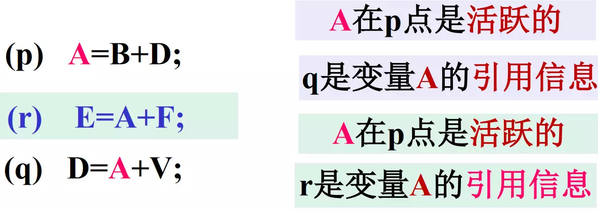

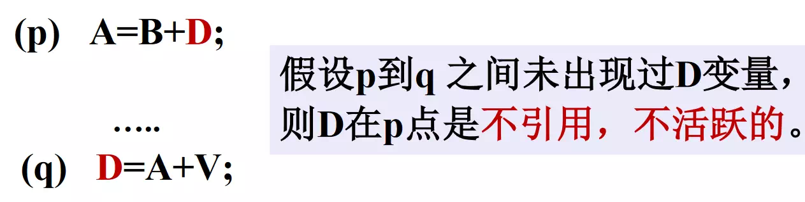

引用信息、活跃信息（活跃变量）的定义：从整个程序范围内，如果变量 A 在某点 P 的值（P 是四元式的编号）在从 P 可达的某四元式 q 中被引用，则称变量 A 在 P 点是**活跃**的，并称四元式q是变量A的**引用信息**。

#### 引用信息链和活跃信息链

为四元式表中的每个变量设置引用信息栏和活跃信息栏，在符号表中也增设引用信息栏和活跃信息栏，用于暂存各变量的引用与活跃信息，临时变量也如此。

| 四元式表                                                     | 符号表                                                       |
| ------------------------------------------------------------ | ------------------------------------------------------------ |
| 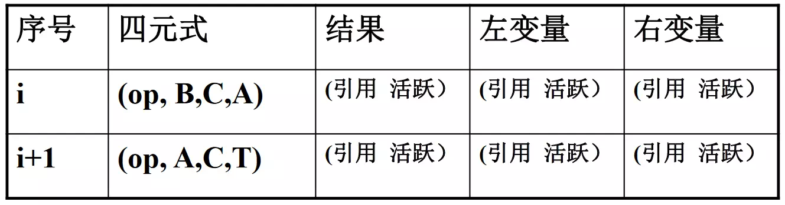 | 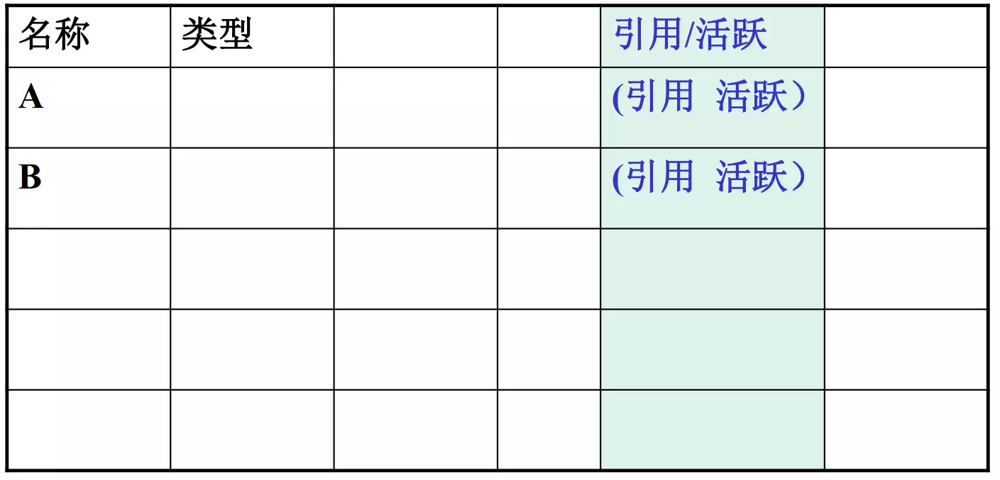 |

1. 从基本块出口向入口方向逐个扫描每个四元式，根据每个变量的引用和定值情况建立各变量的引用和活跃信息链。

2. 用（U，L）表示引用（U）与活跃（L）信息。
   四元式编号表示下一个引用位置，用 Y 表示活跃，用 N 表示不引用或不活跃;
   如：（N，N），（N，Y），（i，Y）
   符号表初始化：用户定义的变量（N, Y)，临时变量（N, N）
3. 用 FIRST 和 LAST 分别表示基本块的入口、出口语句号。

4. 计算基本块各变量引用信息和算法 NEXT-USE 如下（设四元式（ OP，B，C，A））

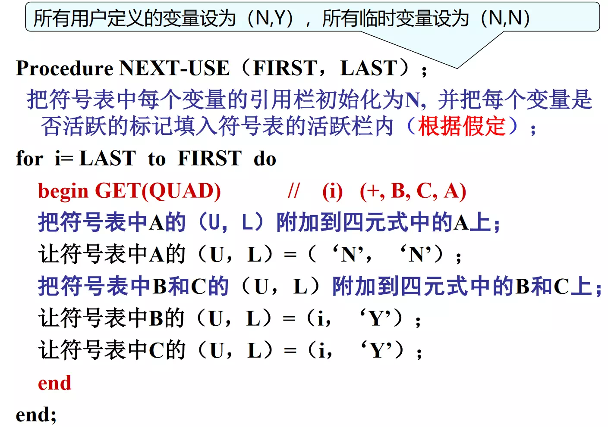

#### 寄存器的分配算法

1. VAR 栏表示把寄存器分配给哪个变量或哪些变量
2. MEM 栏表示占用R的 哪几个变量的值又在内存中

| R    | VAR  | MEM  |
| ---- | ---- | ---- |
| AX   |      |      |
| BX   |      |      |
| CX   |      |      |
| DX   |      |      |

为变量A分配寄存器的算法应遵循以下原则：

1. 如果B已在寄存器R中(VAR(R)),且以后不再引用(查四元式i的附加信息，B(N，N)为“非引用”和“非活跃”)，或A和B同名，则选择R。(因为最后R中存的是A)。

2. 从空闲寄存器中选一R。

3. 从已分配寄存器中选取一个R，查MEM(R)，条件是：
   1. 占用R的变量，其值同时也在内存中；
   2. 占用R的变量，其值未在内存中，但值将在最远的将来才会使用(查四元式的附加信息)，生成一条存数指令(MOVM，R)，把R中内容存入M单元。

#### 目标代码的生成算法

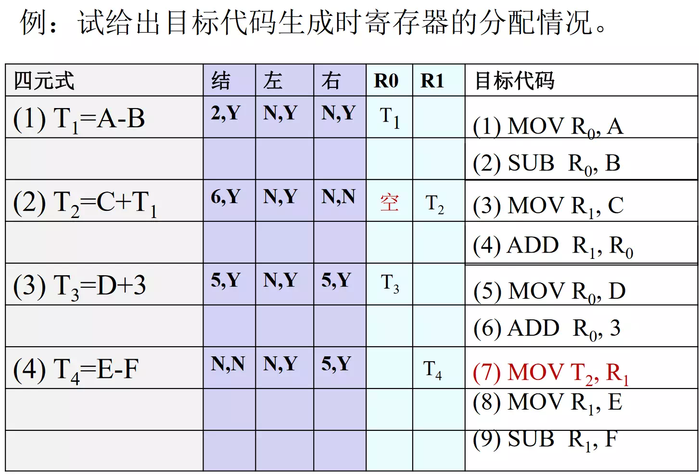

算法 GENOBJ 的一般描述如下

- 输入：QUAD中的四元式 i： A=B OP C

- 输出：四元式i的目标代码，并将其存入目标文件OBJ


```c
PROCEDURE GENOBJ(QUAD);
BEGIN /*QUAD中的四元式 形式 i：A=B OP C */
GETREG（QUAD,R）// 利用寄存器分配原则为A分配到寄存器R
	IF ADDR（B）≠ R THEN
		begin EMIT (MOV R, ADDR(B));
		EMIT(OP R, ADDR(C));
	end
	ELSE
		begin EMIT (OP R, ADDR(C));
		DELETE( B, R);//删除B在寄存器中的相关信息,R分配给A
	end
	FILL(A,R);//A占用R
	for 每个Rk≠R do DELETE(A,Rk);
		for 每个Rk do
			begin if B(i)=(N,N) then Delete (B,Rk)
			if C(i)=(N ,N) then Delete (C,Rk)
		end
	end
```

### 基本块的 DAG 表示

由基本块构造 DAG 的算法：

1. 删除公共子表达式；
2. 删除无用赋值；
3. 改变计算次序；

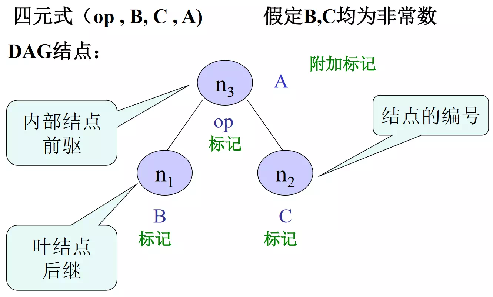


#### 由基本块构造 DAG 的算法

假设DAG各结点信息将用某种适当的数据结构来存放（例如：链表），并设有一个标识符与结点的对应表，
`NODE(A)`是描述这种对应关系的函数。

设过程  `NODE(A)=null` 	  // DAG上无标记或附加标记为A的结点
			或 `NODE(A)=ni`			// DAG上有标记或附加标记为A的结点ni

按照给定的四元式依次**自底向上**，对基本块的每一条四元式 `A = B op C` 执行算法

1. 若 `NODE(B)=null`，则建立 `NODE(B)=ni`

2. 若 `NODE(C)=null`，则建立 `NODE(C)=nj`

3. 查找 DAG 中有无结点，若无则建立结点n，若有则设此结点为n，查公共子表达式

   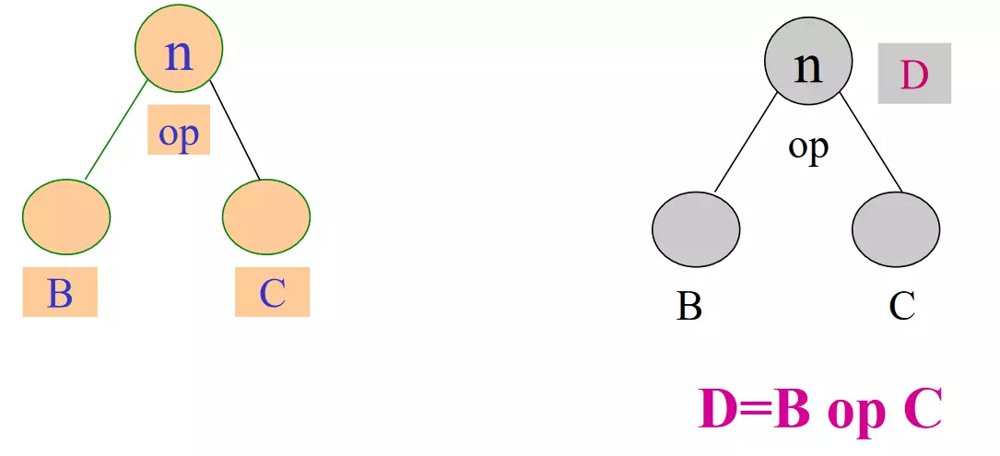

4. 若 `NODE(A)=null`，则令 `NODE(A)=n` 

   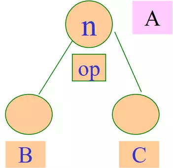

5. 否则，若 `NODE(A)=K` ，且 `NODE(A)` 不是叶，无前驱，则从k上删去A；

   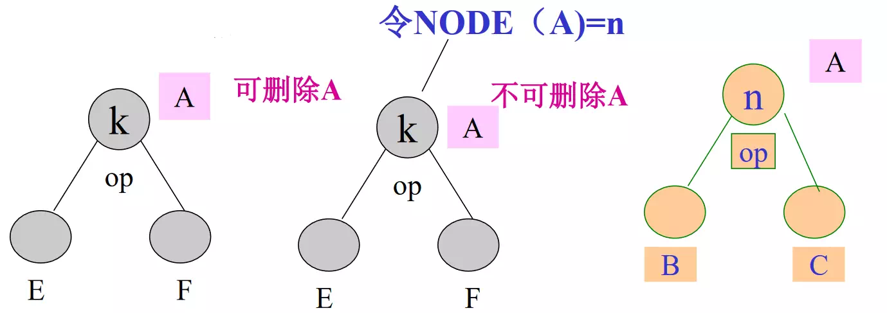

#### DAG 中结点的重构算法

设DAG中有N个内部结点，T是一个线形表，共有N项

```c
for k=1 to N 
	T[k]=null;	// 初始化为空

i=N;
while (存在未列入T的内部结点) 
begin (选一未列入T但其全部前驱均列入T、或无前驱的内部结点n);
    T[i]=n; 
	i=i-1; // 把n列入T中 
    while n的最左子结点m不为叶结点且其全部前驱入T中 
        begin 
        T[i]=m; 
		i=i-1;
        n=m;
	end
end
```

例：

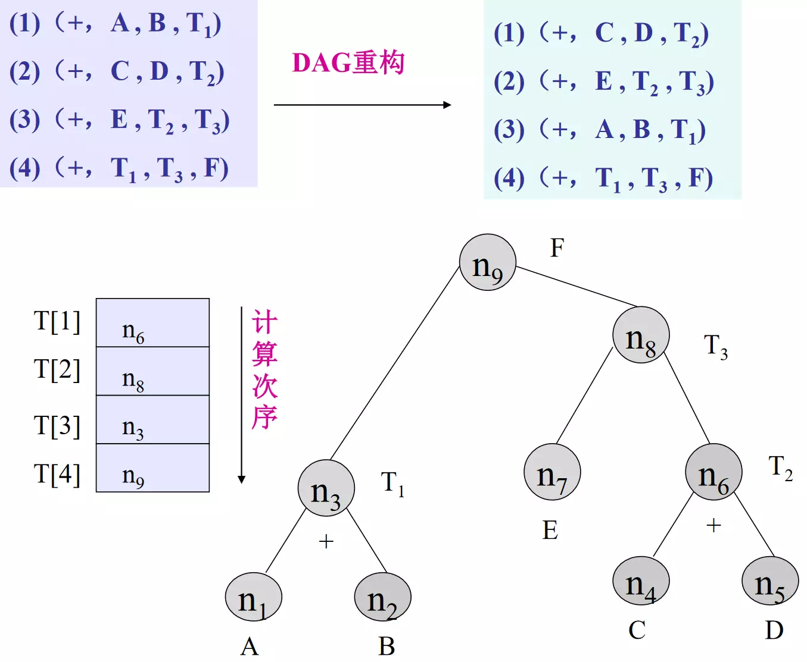

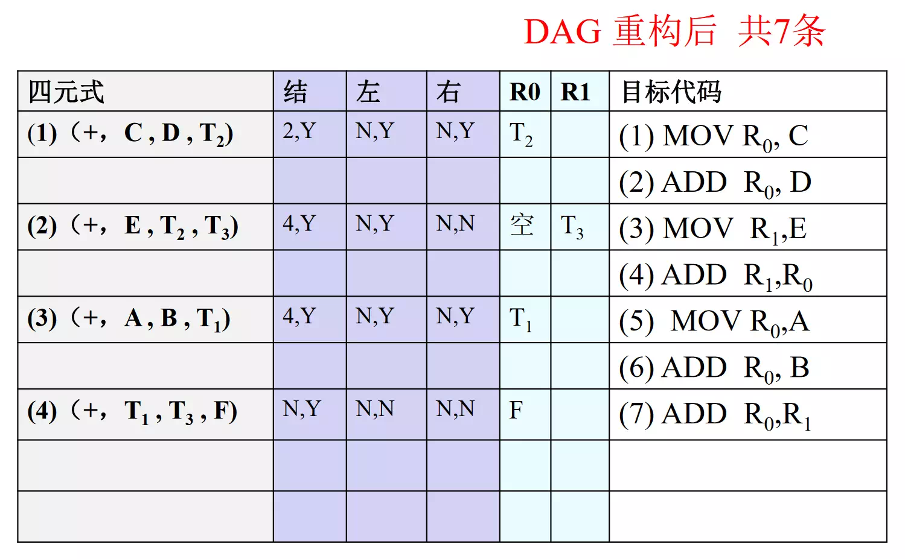
