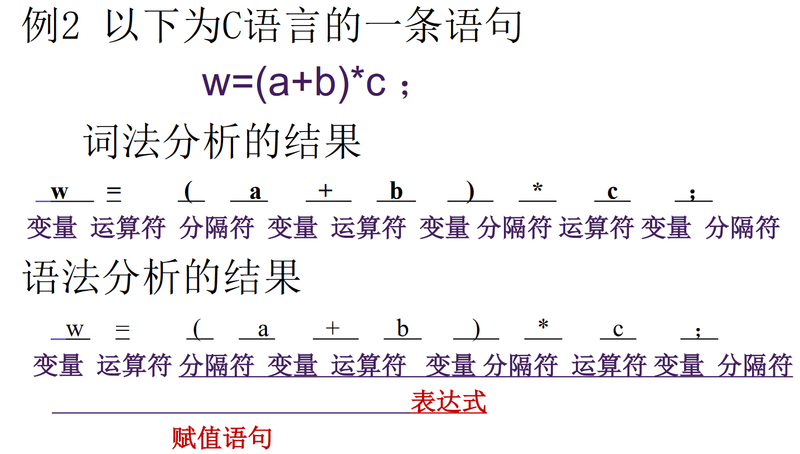
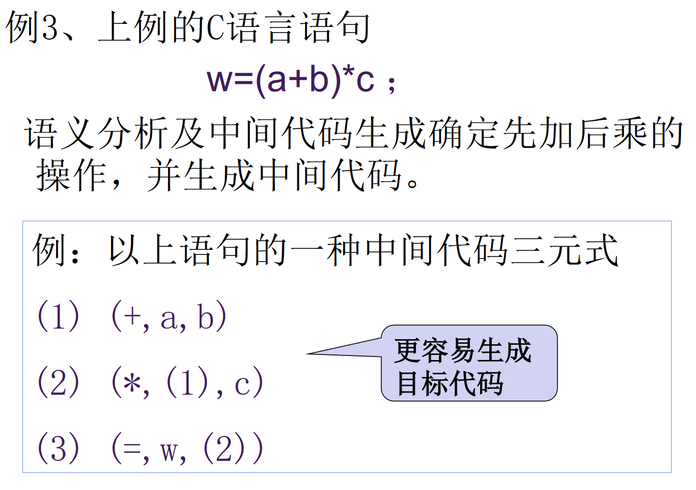
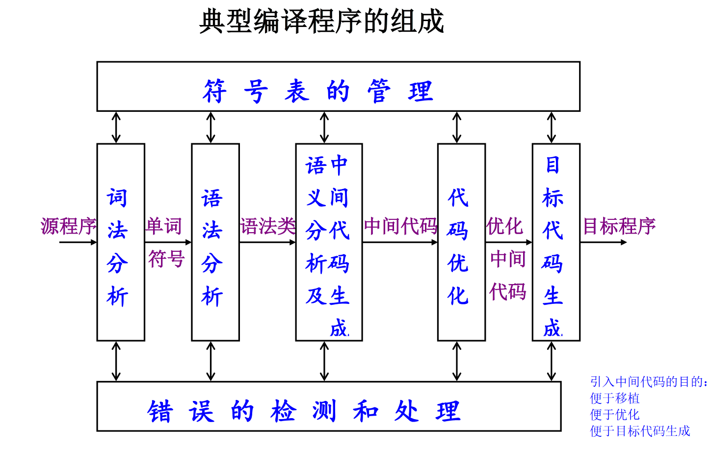
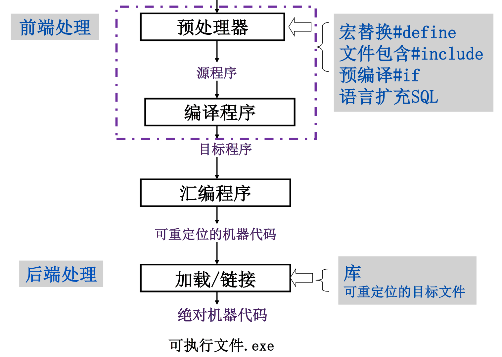

# 编译原理笔记

## 编译程序，汇编程序，解释程序

编译程序是一个与源语言和计算机有关的概念。

- 不同的源语言有不同的编译程序
- 同一种源语言可以有不同的编译程序（高级语言或汇编语言书写）

源程序的执行分为两个阶段：编译阶段（链接）和运行阶段，编译阶段生成的目标程序不是机器代码程序，而是符号汇编程序，源程序的执行分三个阶段：编译阶段、汇编阶段和运行阶段。

1. 翻译程序：把用甲语言书写的程序翻译成与之等价的用乙语言书写的程序.其中甲语言称为该翻译程序的源语言.乙语言称为该翻译程序的目标语言.用源语言书写的程序称为源程序.用目标语言书写的程序称为目标程序.
2. 编译程序：如果翻译程序的源语言是高级语言，目标语言是低级语言（机器语言或汇编语言），这种翻译程序称为编译程序。
3. 汇编程序：如果翻译程序的源语言是汇编语言，目标语言是机器语言，这种翻译程序称为汇编程序。
4. 解释程序：按源程序的动态顺序逐句地进行分析解释并执行直至结束。
   解释程序边翻译边执行，不生成目标程序。交互式的工作方式，便于调试，但执行效率低，执行时也要解释。
   编译程序生成目标程序，链接形成可执行文件运行，所有翻译工作在运行之前完成，执行效率高。

## 编译过程

### 编译过程的五个阶段

典型的编译过程分以下五个阶段：

- 词法分析
- 语法分析
- 语义分析及中间代码生成
- 中间代码优化
- 目标代码生成、目标代码优化

#### 词法分析

词法分析的主要任务是将符号串形式的源程序进行扫描，并分解为与具有独立意义的最小语法单位，单词符号

- 词法分析依据的规则是词法规则。
- 单词符号：常量、变量名、关键字、保留字、运算符等。
- 每一类单词符号可用一整数表示，或其它方式。
- 词法分析应指出单词符号的词法错误，如非法字符、不符合词法规则等。

#### 语法分析

语法分析的主要任务是从词法分析取得单词符号串形式的源程序，并将一个或多个单词组合为语言的各种语法类。

- 语法分析依据的是语言的语法规则。
- 语法类：表达式、语句 、子程序等。
- 语法分析应指出语句的语法错误，如错误表达式

#### 语义分析及中间代码生成

语义分析的主要任务是确定源程序的意义 (语义) ，对不同的语法类进行初步的翻译工作，包括静态语义检查和中间代码的生成。语义分析依据的是语言的语义规则。

- 语义分析和语法分析是不同的概念，但在实际完成编译工作时，两者又是紧密结合的，一般同时完成

- 静态语义检查：对每种语法范畴进行静态语义检查（变量是否定义，类型检查）。
- 中间代码生成：进行初步的翻译，生成中间代码（Intermediate Representation，一种结构简单含义明确的记号系统）
  - 这种记号系统的特点是既独立于具体的硬件，又和计算机的指令系统有某种程度的联系或相似之处，很容易将中间代码转变成机器指令。

#### 中间代码优化

中间代码优化(Optimizer)的主要任务是对中间代码进行算法的等价变换，以期得到高效的目标代码。

- 高效是指时间和空间的高效；
- 代码优化可以在目标代码生成之前进行，也可以在目标代码生成之后进行；
- 代码优化要付出编译代价；
- 编译优化技术目前比较活跃，也比较难。

#### 代码生成

代码生成的主要任务是将源程序的中间代码形式根据具体的机器硬件系统转换成机器语言或汇编语言。

- 并非所有的编译程序都需要这五个阶段。
- 完整的编译程序还包括符号表的管理和出错处理。

### 编译程序的组成

#### 符号表的管理

符号表是用于保存源程序中所使用的每个用户定义的标识符的属性的数据结构,以便进行语法分析、中间代码生成和目标代码生成。

- 标识符：变量名、函数名、过程名等
- 属性：标识符的存贮分配、类型、作用域等，如果是函数和过程名还有参数的个数、类型、参数传递方式、函数的返回值等。
- 合理地设计和使用表格是编译程序构造的一个重要问题，便于建立和查找。

#### 错误的检测和处理

编译的各个阶段都能检测到源程序中的错误，而且在检测一个错误后，必须立即对该错误进行处理，以便使编译工作能继续进行下去，继续对源程序中可能存在的其他错误进行检测（局部化法）。

- 通常在语法和语义分析阶段能处理由编译程序检测出的大部分错误
- 一个好的编译程序应能最大限度的发现源程序中的各种错误，并使其影响尽可能小。

#### 遍

处理数据的一个完整周期。指对源程序或源程序的中间形式从头到尾扫描一次，并作有关的加工处理，生成新的源程序中间形式或目标代码这一过程。

- 可以将编译程序的五个阶段整体作为一遍;
- 也可将五个阶段每个作为一遍;
- 如何分遍，有许多因素具体决定；

## 上下文无关文法和语言

### 文法和语言的表示

语言的定义可采用下列三种方法：

1. 枚举法——把该语言的所有句子列出放在一集合内（有限个句子时）
2. 有限条规则——描述语言的全部句子（有限或无限个句子），即文法表示
3. 装置——检验和识别句子（有限或无限个句子），即自动机

#### 字母表和符号串的基本概念和术语

字母表： 元素的非空有穷集合，元素称符号。

例:∑={0,1}，∑={a,b}

符号串：字母表中的符号所组成的任何有穷序列

特别： 空符号串ε （不包含任何符号）

### 字母表∑上的符号串的递归定义

（1）ε是∑上的符号串

（2）若x是∑上的符号串，且a∈∑，则xa或ax是∑ 上的符号串；特别：ε x = x ε= x

（3）若y是∑上的符号串，当且仅当y可由（1）和（2）产生

#### 符号串的前缀、后缀和子串

前缀：设x是一符号串，从x的尾部删去若干个（包括0个）符号之后所剩余下的部分称为x的前缀；
若x的前缀不是x本身，则称为x的真前缀。

后缀：设x是一符号串，从x的头部删去若干个（包括0个）符号之后所剩余下的部分称为x的后缀；
若x的后缀不是x本身，则称为x的真后缀。

子串：从一个符号串中删去它的一个前缀和一个后缀之后所剩下的部分称为此符号串的子串。
若x的子串不是x本身，则称为x的真子串

符号串的长度：符号串所含符号的个数。

连接：设有符号串x,y，把y的符号写在x的符号之后所得的符号串，叫做x与y的连接，记xy

方幂：设有符号串x，则x的n次自身连接称为x的n次方幂，记为xn；特别的，x^0^ = ε

