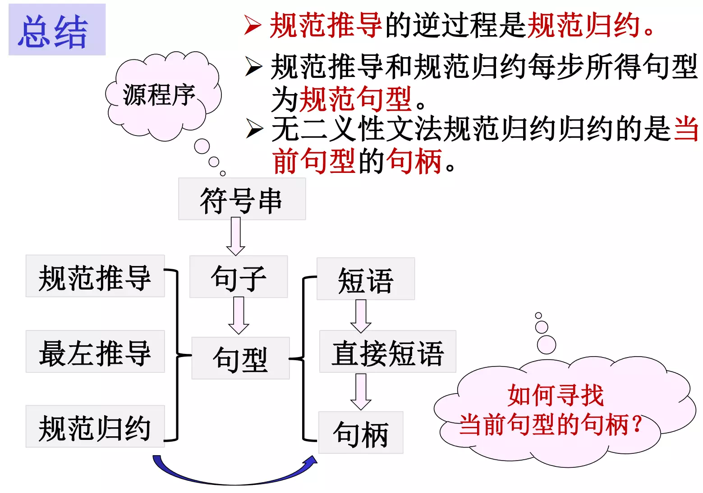

# 编译原理笔记

## 编译程序，汇编程序，解释程序

编译程序是一个与源语言和计算机有关的概念。

- 不同的源语言有不同的编译程序
- 同一种源语言可以有不同的编译程序（高级语言或汇编语言书写）

源程序的执行分为两个阶段：编译阶段（链接）和运行阶段，编译阶段生成的目标程序不是机器代码程序，而是符号汇编程序，源程序的执行分三个阶段：编译阶段、汇编阶段和运行阶段。

1. 翻译程序：把用甲语言书写的程序翻译成与之等价的用乙语言书写的程序.其中甲语言称为该翻译程序的源语言.乙语言称为该翻译程序的目标语言.用源语言书写的程序称为源程序.用目标语言书写的程序称为目标程序.
2. 编译程序：如果翻译程序的源语言是高级语言，目标语言是低级语言（机器语言或汇编语言），这种翻译程序称为编译程序。
3. 汇编程序：如果翻译程序的源语言是汇编语言，目标语言是机器语言，这种翻译程序称为汇编程序。
4. 解释程序：按源程序的动态顺序逐句地进行分析解释并执行直至结束。
   解释程序边翻译边执行，不生成目标程序。交互式的工作方式，便于调试，但执行效率低，执行时也要解释。
   编译程序生成目标程序，链接形成可执行文件运行，所有翻译工作在运行之前完成，执行效率高。

## 1. 编译过程

### 编译过程的五个阶段

典型的编译过程分以下五个阶段：

- 词法分析
- 语法分析
- 语义分析及中间代码生成
- 中间代码优化
- 目标代码生成、目标代码优化

#### 词法分析

词法分析的主要任务是将符号串形式的源程序进行扫描，并分解为与具有独立意义的最小语法单位，单词符号

- 词法分析依据的规则是词法规则。
- 单词符号：常量、变量名、关键字、保留字、运算符等。
- 每一类单词符号可用一整数表示，或其它方式。
- 词法分析应指出单词符号的词法错误，如非法字符、不符合词法规则等。

#### 语法分析

语法分析的主要任务是从词法分析取得单词符号串形式的源程序，并将一个或多个单词组合为语言的各种语法类。

- 语法分析依据的是语言的语法规则。
- 语法类：表达式、语句 、子程序等。
- 语法分析应指出语句的语法错误，如错误表达式

#### 语义分析及中间代码生成

语义分析的主要任务是确定源程序的意义 (语义) ，对不同的语法类进行初步的翻译工作，包括静态语义检查和中间代码的生成。语义分析依据的是语言的语义规则。

- 语义分析和语法分析是不同的概念，但在实际完成编译工作时，两者又是紧密结合的，一般同时完成

- 静态语义检查：对每种语法范畴进行静态语义检查（变量是否定义，类型检查）。

- 中间代码生成：进行初步的翻译，生成中间代码（Intermediate Representation，一种结构简单含义明确的记号系统）
  
  - 这种记号系统的特点是既独立于具体的硬件，又和计算机的指令系统有某种程度的联系或相似之处，很容易将中间代码转变成机器指令。

#### 中间代码优化

中间代码优化(Optimizer)的主要任务是对中间代码进行算法的等价变换，以期得到高效的目标代码。

- 高效是指时间和空间的高效；
- 代码优化可以在目标代码生成之前进行，也可以在目标代码生成之后进行；
- 代码优化要付出编译代价；
- 编译优化技术目前比较活跃，也比较难。

#### 代码生成

代码生成的主要任务是将源程序的中间代码形式根据具体的机器硬件系统转换成机器语言或汇编语言。

- 并非所有的编译程序都需要这五个阶段。
- 完整的编译程序还包括符号表的管理和出错处理。

### 编译程序的组成

#### 符号表的管理

符号表是用于保存源程序中所使用的每个用户定义的标识符的属性的数据结构,以便进行语法分析、中间代码生成和目标代码生成。

- 标识符：变量名、函数名、过程名等
- 属性：标识符的存贮分配、类型、作用域等，如果是函数和过程名还有参数的个数、类型、参数传递方式、函数的返回值等。
- 合理地设计和使用表格是编译程序构造的一个重要问题，便于建立和查找。

#### 错误的检测和处理

编译的各个阶段都能检测到源程序中的错误，而且在检测一个错误后，必须立即对该错误进行处理，以便使编译工作能继续进行下去，继续对源程序中可能存在的其他错误进行检测（局部化法）。

- 通常在语法和语义分析阶段能处理由编译程序检测出的大部分错误
- 一个好的编译程序应能最大限度的发现源程序中的各种错误，并使其影响尽可能小。

#### 遍

处理数据的一个完整周期。指对源程序或源程序的中间形式从头到尾扫描一次，并作有关的加工处理，生成新的源程序中间形式或目标代码这一过程。

- 可以将编译程序的五个阶段整体作为一遍;
- 也可将五个阶段每个作为一遍;
- 如何分遍，有许多因素具体决定；

## 2. 上下文无关文法和语言

### 文法和语言的表示

语言的定义可采用下列三种方法：

1. 枚举法——把该语言的所有句子列出放在一集合内（有限个句子时）
2. 有限条规则——描述语言的全部句子（有限或无限个句子），即文法表示
3. 装置——检验和识别句子（有限或无限个句子），即自动机

#### 字母表和符号串的基本概念和术语

字母表： 元素的非空有穷集合，元素称符号。

例:∑={0,1}，∑={a,b}

符号串：字母表中的符号所组成的任何有穷序列

特别： 空符号串ε （不包含任何符号）

### 字母表 ∑ 上的符号串的递归定义

1. ε是∑上的符号串

2. 若x是∑上的符号串，且a∈∑，则xa或ax是∑ 上的符号串；特别：ε x = x ε= x

3. 若y是∑上的符号串，当且仅当y可由 1. 和 2. 产生

#### 符号串的前缀、后缀和子串

- 前缀：设x是一符号串，从x的尾部删去若干个（包括0个）符号之后所剩余下的部分称为x的前缀；
  若x的前缀不是x本身，则称为x的真前缀。

- 后缀：设x是一符号串，从x的头部删去若干个（包括0个）符号之后所剩余下的部分称为x的后缀；
  若x的后缀不是x本身，则称为x的真后缀。

- 子串：从一个符号串中删去它的一个前缀和一个后缀之后所剩下的部分称为此符号串的子串。
  若x的子串不是x本身，则称为x的真子串

- 符号串的长度：符号串所含符号的个数。

- 连接：设有符号串x,y，把y的符号写在x的符号之后所得的符号串，叫做x与y的连接，记xy

- 方幂：设有符号串x，则x的n次自身连接称为x的n次方幂，记为x^n^；特别的，x^0^ = ε

- 对于符号串（符号）集合A与B
  
  - 和： A+B={w|w ∈A或w ∈B}
  - 积： AB={xy|x∈A且y ∈B}

- 正闭包：设Ａ={b , c}，则A的正闭包 A^+^ ={b , c} ∪{bb,bc,cb,cc} ∪ ... ... 
  
  - A^+^ = {b , c, bb，bc，cb，cc, bbb，bbc ，bcb ，bcc ，cbb ，bcb ，ccb ， ccc ...... }

### 文法的形式定义

#### 规则（产生式）

有序对（U，x） 记为U→x或U::=x，其中 U是符号 （有的文法也可为符号串），x 是有穷符号串，表示: U定义为x

例：S → abc

例：<条件语句> →if (<表达式>) <语句> ∣ if (<表达式>) <语句> else <语句>

#### 文法 G[Z]

规则的非空有穷集合，其中Z是开始符号（识别符号），至少在一条规则的左部出现。

#### 字汇表 V

规则左右部中所有符号组成的集合；

- 非终结符号： 规则左部出现的符号，组成非终结符号集合Vn
  - 非终结符号以< >括起，但当是大写字母是时常省略
- 终结符号： 规则中不属于Vn的符号，组成终结符号集合Vt，V=Vn ∪ Vt

#### 文法的四元组表示 $G = (V_n, V_t , P, Z)$

其中

* $V_n$ 为**非终结符号集**

* $V_t$ 为**终结符号集**

* $P$ 为**规则的集合**

* $Z$ 为**文法的开始符号**

规则中有相同的左部时：

V→ x，V → y，...，V → z  可以写成：V →x|y|...|z （`|` 表示或）

### 语言的形式定义

#### 句型

设有文法G[Z]，如果有Z=\*>x , x ∈V*，则称x是文法G的一个句型。凡是由开始符号（识别符号）推导出来的字汇表V上的终结和非终结符号组成的符号串w称为句型.

#### 句子

如有Z=+>x（或Z=\*>x）且x∈Vt*，则称x是文法G的一个句子。由Z推导出的终结符号组成的符号串为句子。

#### 语言 L(G[Z])

文法G[Z]产生的所有句子的集合，称文法G[Z]所定义的语言，记为 L(G[Z])={x|x∈Vt*且Z=+>x}

例：语言L={ambn ,m>=0,n>=0}，试写出文法。

解：分析 S→AB，A表示a^m^，B表示b^n^
A→aA|ε 或者 A→ Aa|ε 递归规则
B→bB|ε 或者 B→ Bb|ε 递归规则
得文法 G[S]:S→AB, A→aA|ε, B→bB|ε

### 句型的分析

#### 规范推导和规范归约

- 最左(右)推导：在任一步推导v=>w中，都对符号串v的最左（右）非终结符号进行替换，称最左（右）推导。

- 规范推导：即最右推导

- 规范句型：由规范推导所得的句型

- 规范归约：规范推导的逆过程，称规范归约或最左归约。

#### 短语、简单短语和句柄

- 短语：文法G[Z], ω=xuy是一句型,x,y∈V* ，如有 Z=*>xUy,且U=+>u, U∈Vn, u ∈V+，称u是一个相对于非终结符号U句型ω的短语。

- 简单短语：文法G[Z], ω=xuy是一句型，如有 Z=*>xUy，且U=>u, U∈Vn, u ∈V+，称u是一个相对于非终结符号U句型ω的简单短语。

- 句柄：句型**最左边的简单短语**为该句型的句柄。

#### 子树与短语、句柄

可以通过树来寻找短语、简单短语、句柄

- 短语：子树的末端结点形成的符号串.
- 这个短语相对的句型：整个树的末端结点.
- 非终结符号：子树的根
- 简单子树:只有一层分支的子树
- 简单短语:简单子树的末端结点形成的符号串.
- 归约：语法树由下向上生长,通过规则（A→α）替换到达开始符号的过程

#### 总结

- 二义性问题：如果文法G的某一个句子**存在两棵或两棵以上不同的语法树**，则称句子是二义性的.
  如果一文法含有二义性的句子，则称该文法是二义性的，否则该文法是无二义性的.
- 无二义性文法最左归约归约的是当前句型的句柄。
- 根据语法树的形成过程， 对句型的分析可采用自上而下（推导）和自下而上（归约）两种分析方法。

### 文法的化简与改造

#### 文法的实用限制

- 无用产生式就是**形如 $U→ U$ 的规则**
  - 设G=（Vn，Vt，P，S）是一文法，G中的符号x∈Vn∪Vt是有用的，则x必满足
        ① 存在α、β∈V\*，有S=\*>αxβ
        ② 存在ω∈Vt\* 使αxβ=\*>ω~~~~
    称符号x是有用的，否则x是无用的。
  - 俗称“上着天下着地”
  - 无用产生式：产生式的左部或右部含有无用符号。
- 文法的实用限制是：**不含无用产生式，不含有害规则**
  - (原因 ①不必要    ②引起二义性)
    例：G1[S]：S→0S1|01     G1无二义性文法
    G2[S]：S→0S1|01|S     G2二义性文法
    L(G1)=L(G2)={0^n^1^n^|n>=1}

#### 无用符号和无用产生式的消除

算法2.1：满足②存在ω∈Vt\*使αxβ=\*>ω（x∈Vt∪Vn）

算法2.2：满足①存在α、β∈V\*，有S=\*>αxβ（x∈Vt∪Vn）

##### 算法2.1 - 找能推出终结符号串的非终结符号集合

文法G=(Vn,Vt,P,S)（假定L(G)≠Φ），得到等价文法G1=(Vn①,Vt,P①,S)，对于每个X∈Vn①，都有w1∈Vt\*,满足X=\*>w1;**（每个 X∈Vn① 都能推出终结符号串）**

##### 算法2.2 - 筛选出可达符号集

文法G=(Vn,Vt,P,S)(假定L(G)≠Φ)，得到等价文法G′=(Vn′,Vt′,P′,S)，对于任一x∈V′，都存在α、β∈(V′)\*,有S=\*>αx，x∈Vt′∪Vn

消除步骤:

1. 对文法G,执行算法2.1得到文法G1;
2. 对文法G1,执行算法2.2得到文法G′,为所求.

#### ε-产生式的消除

如某L(G)中不含ε，可消除G中的全部ε-产生式；

如某L(G)中含ε，肯定不能消除G中的全部ε-产生式；

消除步骤：

* 先用算法2.3找出G中满足A=\*>ε的所有A，构成集合W; 
  * 若ε不属于L(G)：用算法2.4 构造不含ε产生式的等价文法G′[S] 
  * 若ε属于L(G)：用算法2.5 构造仅含S①→ε产生式的等价文法G1(S①)
    * 算法2.5也分两种情况讨论：①S不出现在原文法产生式右部和 ②出现在原文法产生式右部

##### 算法2.3  - 找所有有限步导出ε的产生式左部

##### 算法2.4 - ε不属于L(G)的情况

若存在产生式 B→a0B1...Bkak∈P，aj∈(VUT)*，Bi∈V1，则以Bi或者空代替Bi

##### 算法2.5 - S不出现在原文法产生式右部的情况

需要引入 S→S | ε

##### 算法2.5 - S出现在原文法产生式右部的情况

#### 单产生式的消除

单产生式类似 A→B

设G=(Vn,Vt , P, S)是一文法,假定G中不含ε-产生式，执行算法2.6得到不含单产生式的文法G′

##### 算法2.6 - 遍历非终结符号

### 文法的其它表示方法

主要是BNF表示和语法图

### 文法和语言的Chomsky分类

回顾：文法的四元组表示 $G = (V_n, V_t , P, Z)$

* $V_n$ 为**非终结符号集**

* $V_t$ 为**终结符号集**

* $P$ 为**规则的集合**

* $Z$ 为**文法的开始符号** 

乔姆斯基根据文法中 $P$ 的不同，将文法分为四类，每一种文法对应一种语言

#### 0型文法(短语结构文法)

文法G中规则呈 `α→β` α∈V+，β∈V*
也称短语结构文法（PSG），对应图灵机确定的语言为0型语言L0

#### 1型文法(上下文有关文法)

1型文法文法G中规则呈 `α1Aα2→α1βα2` 其中 α1，α2∈V*，A∈Vn，β∈V+
也称上下文有关文法(CSG)，对应线性界限自动机，确定的语言为1型语言L1，也称上下文有关语言.

#### 2型文法(上下文无关文法)描述语法类

文法G中规则呈 `A→β` 其中 A∈Vn，β∈V+ (或V*)
也称上下文无关文法(CFG)，对应下推自动机识别，确定的语言为2型语言L2或上下文无关语言.
2型文法在语法分析中用于描述语法类

#### 3型文法(正则文法(左线性和右线性))描述单词符号

文法G中规则呈 `A→aB或A→a` 其中 A、Ｂ∈Vn，a∈Vt，称G为右线形正则文法.

## 3.  词法分析

### 设计扫描器时应考虑的问题

#### 词法分析器

##### 功能

输入：符号串形式的源程序
输出：单词符号串

##### 实现方式

- 将词法分析作为单独的一遍

- 特点：
  1. 大部分编译时间花在扫描字符上，独立出来便于集中处理.
  2. 单词的词法规则简单，可建立特别适用于这种文法的有效技术，实现词法分析的自动生成.
  3. 整个编译程序结构简单，清晰，产生中间文件

- 也可以将词法分析作为一个独立的子程序，供语法分析程序调用

- 特点：
  1. 语法分析调用时，返回一个单词符号。
  2. 无中间文件，编译效率高

#### 源程序输入和预处理

预处理——可构造预处理子程序（输入缓冲区）

作用：消除无用空白、回车、注释行、区分标号区、宏替换等.

功能：词法分析器调用时，在输入缓冲区内处理出确定长的字符串放入扫描缓冲区.

##### 扫描缓冲区

扫描缓冲区的结构：两个半区，两个指示器，互补使用

- 起点指示器（读字符指示器） 
  - 指向当前正在识别的单词的开始位置
- 扫描指示器（超前读字符指示器）
  - 用于向前搜索以寻找单词的终点
- 两个半区互补使用：规定单词的长度不能超过半区的长度。

#### 单词符号的内部表示

单词符号的种类
1. 保留字：如 `if`, `for`, `while`, `do` 等用户不能使用
2. 标识符：由用户定义变量名、函数名等
3. 无符号整数：如 `125`
4. 单字符分界符：`+`, ` -`, ` *`, ` / `, ` ；`, ` `, ` `, ` （ `, ` ）`, ` ：`, `>`, `<`, `=` 等等
5. 双字符分界符： `// `, `  /* `, `  * * `, `  >=`, `<=`, `<>`, `==`, `++`, `--` 等等

#### 识别标识符的若干策略和约定

约定：
1. 标识符中的字符个数超过最大允许长度，截去尾部。
2. 不超过最大长度的标识符，则按“尽可能长”的原则匹配。

##### 单词符号的识别——超前搜索技术

超前搜索技术（超前读字符）：是仅向前读取字符，和判别该字符是什么，不作处理；
当判明后再回过来处理已读过的字符

### 正则文法和状态转换图

#### 状态图

状态图是一个由正则文法确定的有限的方向图，
结点对应状态,含有一个初始状态和若干个终止状态.

##### 右线性文法的状态图

右线性文法的规则呈 A→aB 或 A→a 	A,B∈V~n~ , a∈V~t~ 

状态图的使用：识别句子(单词符号)

字符串ω =a1a2a3......an是文法的句子(单词符号)的条件：
1. 识别到字符串最后一个字符
2. 最终进入终止F状态

否则，ω不是文法的句子(单词符号)

##### 左线性文法的状态图

左线性文法的规则呈：A→Ba或A→a	A,B∈V~n~ ，a∈V~t~

**右线性文法**是**最右推导过程**，**左线性文法**是**最左归约过程**；

### 有限自动机

#### 确定的有限自动机（DFA）

有限自动机的功能是**识别句子**

一个 DFA 由五个元素组成：$DFAM=(K, ∑, f, S_0, Z)$

其中

- K：状态的集合（有限个状态）

- ∑： 允许输入的字符的集合 Vt

- f： 状态转换函数，单值函数 $K×∑→K$，$f(S_i,a)=S_j$

- S~0~： 初始状态 S~0~∈K

- Z： 终止状态集 K包含于Z

#### 非确定的有限自动机（NFA）

一个 NFA M′ 由五个元素组成：$NFA M′=(K′,Σ,f′,S_0′ ,Z′)$

其中

- K′：状态的集合（有限状态）

- Σ：允许输入的字符集合 Vt

- f′：状态转换函数，多值函数，$K′×Σ →2k’$ (K的所有子集的集合)，$f(S_i,a)={S_k,S_t，...}$

- S~0~′：初始状态 S~0~∈K′

- Z′：终止状态集K′包含于Z

##### DFA M 与 NFA M′ 的等价性

#### 定义

##### **状态q的ε闭包 ε\_closure(q)** （q ∈K′）

1. q∈ε\_closure(q)
2. q→{ε} 到达的状态均属于ε\_closure(q)

##### 状态集P的ε闭包 ε\_closure(P) （P属于K′）

1. 若q∈P,则 q∈ε\_closure(P)
2. 若q∈P, q→{ε} 到达的状态均属于ε\_closure(p)

#### 正则式和 NFA M‘ 互相转换

#### 读ε动作的NFA M ′的确定化方法（子集法）

设有一 NFA M′=(K′,∑∪{ε},f′,S0,Z′)，现构造一∑上的 DFA M=( K,∑,f,q0,Z)，使L(M′)=L(M)
1. `q0= ε_closure(S0)`，q0 ∈ K

2. 对K中任一尚未标记的状态 `qi={Si1,Si2,...,Sim}`，Sik ∈K′

  ① 标记 `qi` (加入K中，画在状态图中，填入状态转换矩阵）

  ② 对于每一a∈∑，置 `T= f'({Si1,Si2,...,Sim}, a);`  `qj= ε_closure(T);`

  ③ 若 `qj` 不在 K 中,则将 `qj` 作为一未加标记的状态加入K中，`f(qi,a)= qj`，添加到M上

3. 重复步骤 `2.` ，直到K中不再含有未标记的状态为止。

4. 若某一 `qj∩Z’!=Ø`，则 `qj ∈Z`

#### 读ε动作的NFA M ′的最小化方法

- 将DFA M的状态集分割成一些不相交的子集；
- 使任何不同子集的状态是可区别的；
- 同一子集的任何两个状态都是等价的；
- 每一个子集选出一个代表，消去其它等价状态

1. 将状态集k的**终态**和**非终态**分开,分成两个子集，形成基本划分Π＝｛Z, K-Z}

2. 令某时Π＝｛I1,I2,...,Im},并且属于不同子集的状态是可区分的。
   再划分某个Ii＝｛S1,S2,...,Sk}，若有a∈Σ，若f(Ii,a)不全包含在现行Π的某一子集中，则将Ii一分为二。
   - 如f(Si,a)=Ri，f(Sj,a)=Rj，且Ri ∈Ik，Rj ∈ It
     则将Ii划分成 `Ii1={Si|Si∈Ii, 且Si经a弧到Ri}`，`Ii2=It-Ii1`

3. 重复上述过程，直到Π不再增大为止。
   每一子集中的状态都是等价的，不同子集中的状态都是可区分的。

### 正则表达式和正规集

正则式：描述单词符号

正规集：正规式描述的语言

`*` 表示0次及以上自重复

`+` 表示1次及以上自重复

#### 正则式的递归定义

设有字汇表V , 则: (VT就是∑)

- ε，Ø，a（a∈Vt）都是正则表达式，正规集{ε}, Ø, {a}
- `e1` 和 `e2` 是正则式,正规集分别为 `L1` 和 `L2` 
  则 `e1|e2` 是正则式,正规集为 `L1∪L2` 
  `e1·e2` 是正则式,正规集为 `L1L2` 
  `e1*` 是正则式, 正规集为 `L1*` 
  - 注: `*`, `·` , `|` 的优先级依次降低

两个正则式表示相同的语言称为相等，如`(a|b)*=(a*|b*)*` 

结合律 `(ab)c=a(bc)`, `(a|b)|c=a|(b|c)`  

交换律 `a|b=b|a` 

分配律 `a(b|c)=ab|ac`, `(a|b)c=ac|bc` 

其他 `r|r=r`, `r*=(r|ε)*=ε|r r*` 

#### 由正则文法构造相应的正则式

求出以 `{ }` 、 `|` 、 `.` 表示的文法的语言就是正则式，用=代替→, 用+代替|求出联立方程组的解

论断3.1：方程组 `X=rX+t` 有形如 `X=r*t` 的解

论断3.2：方程组 `X=Xr+t` 有形如 `X=tr*` 的解

### 词法分析程序的实现
