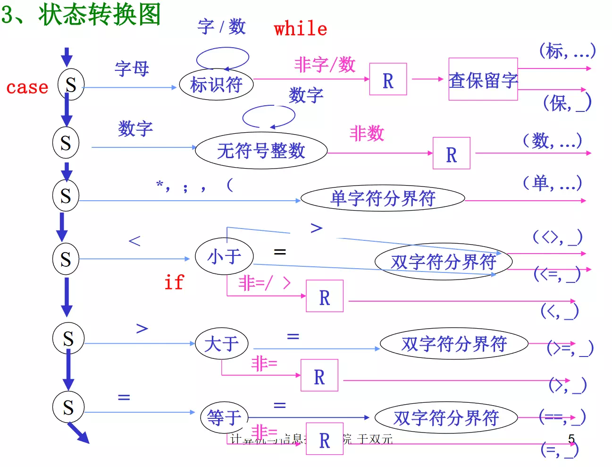
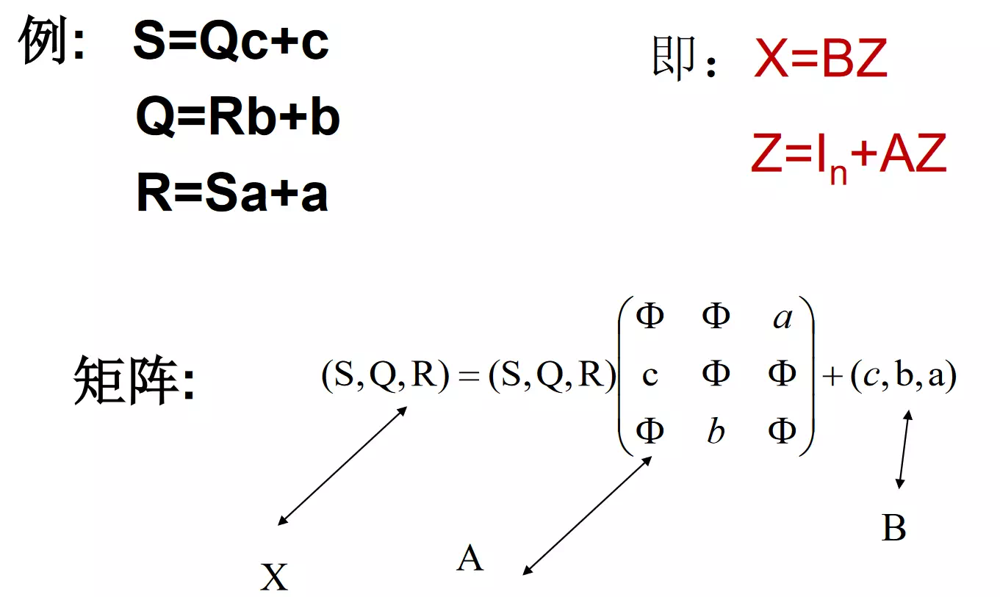
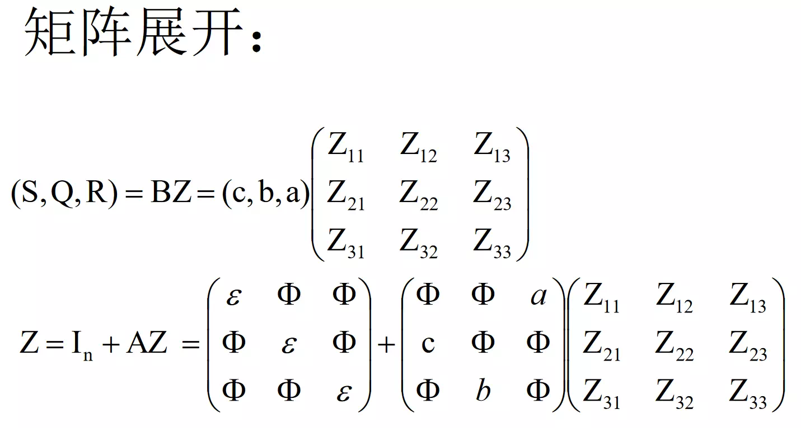
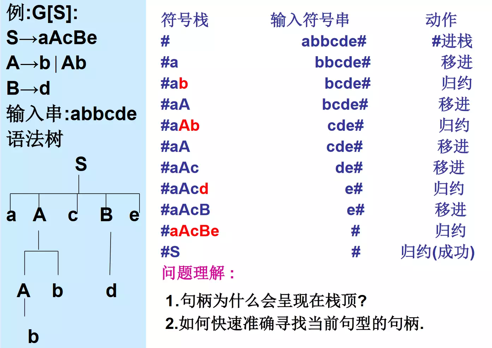
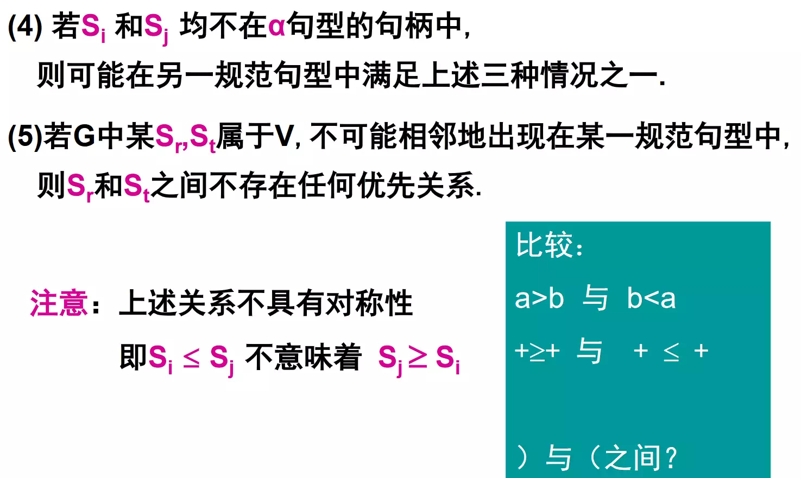
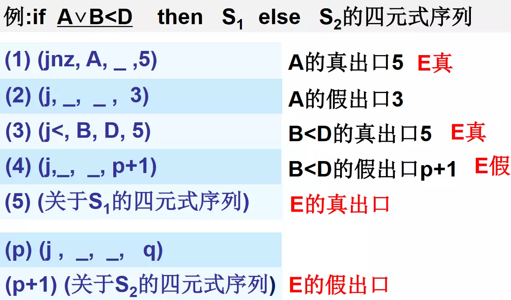
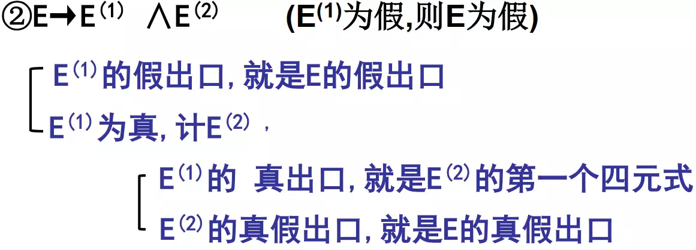

# 编译原理笔记

## 编译程序，汇编程序，解释程序

编译程序是一个与源语言和计算机有关的概念。

- 不同的源语言有不同的编译程序
- 同一种源语言可以有不同的编译程序（高级语言或汇编语言书写）

源程序的执行分为两个阶段：编译阶段（链接）和运行阶段，编译阶段生成的目标程序不是机器代码程序，而是符号汇编程序，源程序的执行分三个阶段：编译阶段、汇编阶段和运行阶段。

1. 翻译程序：把用甲语言书写的程序翻译成与之等价的用乙语言书写的程序.其中甲语言称为该翻译程序的源语言.乙语言称为该翻译程序的目标语言.用源语言书写的程序称为源程序.用目标语言书写的程序称为目标程序.
2. 编译程序：如果翻译程序的源语言是高级语言，目标语言是低级语言（机器语言或汇编语言），这种翻译程序称为编译程序。
3. 汇编程序：如果翻译程序的源语言是汇编语言，目标语言是机器语言，这种翻译程序称为汇编程序。
4. 解释程序：按源程序的动态顺序逐句地进行分析解释并执行直至结束。
   解释程序边翻译边执行，不生成目标程序。交互式的工作方式，便于调试，但执行效率低，执行时也要解释。
   编译程序生成目标程序，链接形成可执行文件运行，所有翻译工作在运行之前完成，执行效率高。

## 1. 编译过程

### 编译过程的五个阶段

典型的编译过程分以下五个阶段：

- 词法分析
- 语法分析
- 语义分析及中间代码生成
- 中间代码优化
- 目标代码生成、目标代码优化

#### 词法分析

词法分析的主要任务是将符号串形式的源程序进行扫描，并分解为与具有独立意义的最小语法单位，单词符号

- 词法分析依据的规则是词法规则。
- 单词符号：常量、变量名、关键字、保留字、运算符等。
- 每一类单词符号可用一整数表示，或其它方式。
- 词法分析应指出单词符号的词法错误，如非法字符、不符合词法规则等。

#### 语法分析

语法分析的主要任务是从词法分析取得单词符号串形式的源程序，并将一个或多个单词组合为语言的各种语法类。

- 语法分析依据的是语言的语法规则。
- 语法类：表达式、语句 、子程序等。
- 语法分析应指出语句的语法错误，如错误表达式

#### 语义分析及中间代码生成

语义分析的主要任务是确定源程序的意义 (语义) ，对不同的语法类进行初步的翻译工作，包括静态语义检查和中间代码的生成。语义分析依据的是语言的语义规则。

- 语义分析和语法分析是不同的概念，但在实际完成编译工作时，两者又是紧密结合的，一般同时完成

- 静态语义检查：对每种语法范畴进行静态语义检查（变量是否定义，类型检查）。

- 中间代码生成：进行初步的翻译，生成中间代码（Intermediate Representation，一种结构简单含义明确的记号系统）
  
  - 这种记号系统的特点是既独立于具体的硬件，又和计算机的指令系统有某种程度的联系或相似之处，很容易将中间代码转变成机器指令。

#### 中间代码优化

中间代码优化(Optimizer)的主要任务是对中间代码进行算法的等价变换，以期得到高效的目标代码。

- 高效是指时间和空间的高效；
- 代码优化可以在目标代码生成之前进行，也可以在目标代码生成之后进行；
- 代码优化要付出编译代价；
- 编译优化技术目前比较活跃，也比较难。

#### 代码生成

代码生成的主要任务是将源程序的中间代码形式根据具体的机器硬件系统转换成机器语言或汇编语言。

- 并非所有的编译程序都需要这五个阶段。
- 完整的编译程序还包括符号表的管理和出错处理。

### 编译程序的组成

#### 符号表的管理

符号表是用于保存源程序中所使用的每个用户定义的标识符的属性的数据结构,以便进行语法分析、中间代码生成和目标代码生成。

- 标识符：变量名、函数名、过程名等
- 属性：标识符的存贮分配、类型、作用域等，如果是函数和过程名还有参数的个数、类型、参数传递方式、函数的返回值等。
- 合理地设计和使用表格是编译程序构造的一个重要问题，便于建立和查找。

#### 错误的检测和处理

编译的各个阶段都能检测到源程序中的错误，而且在检测一个错误后，必须立即对该错误进行处理，以便使编译工作能继续进行下去，继续对源程序中可能存在的其他错误进行检测（局部化法）。

- 通常在语法和语义分析阶段能处理由编译程序检测出的大部分错误
- 一个好的编译程序应能最大限度的发现源程序中的各种错误，并使其影响尽可能小。

#### 遍

处理数据的一个完整周期。指对源程序或源程序的中间形式从头到尾扫描一次，并作有关的加工处理，生成新的源程序中间形式或目标代码这一过程。

- 可以将编译程序的五个阶段整体作为一遍;
- 也可将五个阶段每个作为一遍;
- 如何分遍，有许多因素具体决定；

## 2. 上下文无关文法和语言

### 文法和语言的表示

语言的定义可采用下列三种方法：

1. 枚举法——把该语言的所有句子列出放在一集合内（有限个句子时）
2. 有限条规则——描述语言的全部句子（有限或无限个句子），即文法表示
3. 装置——检验和识别句子（有限或无限个句子），即自动机

#### 字母表和符号串的基本概念和术语

字母表： 元素的非空有穷集合，元素称符号。

例:∑={0,1}，∑={a,b}

符号串：字母表中的符号所组成的任何有穷序列

特别： 空符号串ε （不包含任何符号）

### 字母表 ∑ 上的符号串的递归定义

1. ε是∑上的符号串

2. 若x是∑上的符号串，且a∈∑，则xa或ax是∑ 上的符号串；特别：ε x = x ε= x

3. 若y是∑上的符号串，当且仅当y可由 1. 和 2. 产生

#### 符号串的前缀、后缀和子串

- 前缀：设x是一符号串，从x的尾部删去若干个（包括0个）符号之后所剩余下的部分称为x的前缀；
  若x的前缀不是x本身，则称为x的真前缀。

- 后缀：设x是一符号串，从x的头部删去若干个（包括0个）符号之后所剩余下的部分称为x的后缀；
  若x的后缀不是x本身，则称为x的真后缀。

- 子串：从一个符号串中删去它的一个前缀和一个后缀之后所剩下的部分称为此符号串的子串。
  若x的子串不是x本身，则称为x的真子串

- 符号串的长度：符号串所含符号的个数。

- 连接：设有符号串x,y，把y的符号写在x的符号之后所得的符号串，叫做x与y的连接，记xy

- 方幂：设有符号串x，则x的n次自身连接称为x的n次方幂，记为x^n^；特别的，x^0^ = ε

- 对于符号串（符号）集合A与B
  
  - 和： A+B={w|w ∈A或w ∈B}
  - 积： AB={xy|x∈A且y ∈B}

- 正闭包：设Ａ={b , c}，则A的正闭包 A^+^ ={b , c} ∪{bb,bc,cb,cc} ∪ ... ... 
  
  - A^+^ = {b , c, bb，bc，cb，cc, bbb，bbc ，bcb ，bcc ，cbb ，bcb ，ccb ， ccc ...... }

### 文法的形式定义

#### 规则（产生式）

有序对（U，x） 记为U→x或U::=x，其中 U是符号 （有的文法也可为符号串），x 是有穷符号串，表示: U定义为x

例：S->abc

例：<条件语句> ->if (<表达式>) <语句> ∣ if (<表达式>) <语句> else <语句>

#### 文法 G[Z]

规则的非空有穷集合，其中Z是开始符号（识别符号），至少在一条规则的左部出现。

#### 字汇表 V

规则左右部中所有符号组成的集合；

- 非终结符号： 规则左部出现的符号，组成非终结符号集合Vn
  - 非终结符号以< >括起，但当是大写字母是时常省略
- 终结符号： 规则中不属于Vn的符号，组成终结符号集合Vt，V=Vn ∪ Vt

#### 文法的四元组表示 $G = (V_n, V_t , P, Z)$

其中

* $V_n$ 为**非终结符号集**

* $V_t$ 为**终结符号集**

* $P$ 为**规则的集合**

* $Z$ 为**文法的开始符号**

规则中有相同的左部时：

V-> x，V->y，...，V->z  可以写成：V ->x|y|...|z （`|` 表示或）

### 语言的形式定义

#### 句型

设有文法G[Z]，如果有Z=\*>x , x ∈V*，则称x是文法G的一个句型。凡是由开始符号（识别符号）推导出来的字汇表V上的终结和非终结符号组成的符号串w称为句型.

#### 句子

如有Z=+>x（或Z=\*>x）且x∈Vt*，则称x是文法G的一个句子。由Z推导出的终结符号组成的符号串为句子。

#### 语言 L(G[Z])

文法G[Z]产生的所有句子的集合，称文法G[Z]所定义的语言，记为 L(G[Z])={x|x∈Vt*且Z=+>x}

例：语言L={ambn ,m>=0,n>=0}，试写出文法。

解：分析 S->AB，A表示a^m^，B表示b^n^
A->aA|ε 或者 A-> Aa|ε 递归规则
B->bB|ε 或者 B-> Bb|ε 递归规则
得文法 G[S]:S->AB, A->aA|ε, B->bB|ε

### 句型的分析

#### 规范推导和规范归约

- 最左(右)推导：在任一步推导v=>w中，都对符号串v的最左（右）非终结符号进行替换，称最左（右）推导。

- 规范推导：即最右推导

- 规范句型：由规范推导所得的句型

- 规范归约：规范推导的逆过程，称规范归约或最左归约。

#### 短语、简单短语和句柄

- 短语：文法G[Z], ω=xuy是一句型,x,y∈V* ，如有 Z=*>xUy,且U=+>u, U∈Vn, u ∈V+，称u是一个相对于非终结符号U句型ω的短语。

- 简单短语：文法G[Z], ω=xuy是一句型，如有 Z=*>xUy，且U=>u, U∈Vn, u ∈V+，称u是一个相对于非终结符号U句型ω的简单短语。

- 句柄：句型**最左边的简单短语**为该句型的句柄。

#### 子树与短语、句柄

可以通过树来寻找短语、简单短语、句柄

- 短语：子树的末端结点形成的符号串.
- 这个短语相对的句型：整个树的末端结点.
- 非终结符号：子树的根
- 简单子树:只有一层分支的子树
- 简单短语:简单子树的末端结点形成的符号串.
- 归约：语法树由下向上生长,通过规则（A->α）替换到达开始符号的过程

#### 总结

- 二义性问题：如果文法G的某一个句子**存在两棵或两棵以上不同的语法树**，则称句子是二义性的.
  如果一文法含有二义性的句子，则称该文法是二义性的，否则该文法是无二义性的.
- 无二义性文法最左归约归约的是当前句型的句柄。
- 根据语法树的形成过程， 对句型的分析可采用自上而下（推导）和自下而上（归约）两种分析方法。

### 文法的化简与改造

#### 文法的实用限制

- 无用产生式就是**形如 $U->U$ 的规则**
  - 设G=（Vn，Vt，P，S）是一文法，G中的符号x∈Vn∪Vt是有用的，则x必满足
        ① 存在α、β∈V\*，有S=\*>αxβ
        ② 存在ω∈Vt\* 使αxβ=\*>ω~~~~
    称符号x是有用的，否则x是无用的。
  - 俗称“上着天下着地”
  - 无用产生式：产生式的左部或右部含有无用符号。
- 文法的实用限制是：**不含无用产生式，不含有害规则**
  - (原因 ①不必要    ②引起二义性)
    例：G1[S]：S->0S1|01     G1无二义性文法
    G2[S]：S->0S1|01|S     G2二义性文法
    L(G1)=L(G2)={0^n^1^n^|n>=1}

#### 无用符号和无用产生式的消除

算法2.1：满足②存在ω∈Vt\*使αxβ=\*>ω（x∈Vt∪Vn）

算法2.2：满足①存在α、β∈V\*，有S=\*>αxβ（x∈Vt∪Vn）

##### 算法2.1 - 找能推出终结符号串的非终结符号集合

文法G=(Vn,Vt,P,S)（假定L(G)≠Φ），得到等价文法G1=(Vn①,Vt,P①,S)，对于每个X∈Vn①，都有w1∈Vt\*,满足X=\*>w1;**（每个 X∈Vn① 都能推出终结符号串）**

##### 算法2.2 - 筛选出可达符号集

文法G=(Vn,Vt,P,S)(假定L(G)≠Φ)，得到等价文法G′=(Vn′,Vt′,P′,S)，对于任一x∈V′，都存在α、β∈(V′)\*,有S=\*>αx，x∈Vt′∪Vn

消除步骤:

1. 对文法G,执行算法2.1得到文法G1;
2. 对文法G1,执行算法2.2得到文法G′,为所求.

#### ε-产生式的消除

如某L(G)中不含ε，可消除G中的全部ε-产生式；

如某L(G)中含ε，肯定不能消除G中的全部ε-产生式；

消除步骤：

* 先用算法2.3找出G中满足A=\*>ε的所有A，构成集合W; 
  * 若ε不属于L(G)：用算法2.4 构造不含ε产生式的等价文法G′[S] 
  * 若ε属于L(G)：用算法2.5 构造仅含S①->ε产生式的等价文法G1(S①)
    * 算法2.5也分两种情况讨论：①S不出现在原文法产生式右部和 ②出现在原文法产生式右部

##### 算法2.3  - 找所有有限步导出ε的产生式左部

##### 算法2.4 - ε不属于L(G)的情况

若存在产生式 B→a0B1...Bkak∈P，aj∈(VUT)*，Bi∈V1，则以Bi或者空代替Bi

##### 算法2.5 - S不出现在原文法产生式右部的情况

需要引入 S→S | ε

##### 算法2.5 - S出现在原文法产生式右部的情况

#### 单产生式的消除

单产生式类似 A→B

设G=(Vn,Vt , P, S)是一文法,假定G中不含ε-产生式，执行算法2.6得到不含单产生式的文法G′

##### 算法2.6 - 遍历非终结符号

### 文法的其它表示方法

主要是BNF表示和语法图

### 文法和语言的Chomsky分类

回顾：文法的四元组表示 $G = (V_n, V_t , P, Z)$

* $V_n$ 为**非终结符号集**

* $V_t$ 为**终结符号集**

* $P$ 为**规则的集合**

* $Z$ 为**文法的开始符号** 

乔姆斯基根据文法中 $P$ 的不同，将文法分为四类，每一种文法对应一种语言

#### 0型文法(短语结构文法)

文法G中规则呈 `α->β` α∈V+，β∈V*
也称短语结构文法（PSG），对应图灵机确定的语言为0型语言L0

#### 1型文法(上下文有关文法)

1型文法文法G中规则呈 `α1Aα2->α1βα2` 其中 α1，α2∈V*，A∈Vn，β∈V+
也称上下文有关文法(CSG)，对应线性界限自动机，确定的语言为1型语言L1，也称上下文有关语言.

#### 2型文法(上下文无关文法)描述语法类

文法G中规则呈 `A->β` 其中 A∈Vn，β∈V+ (或V*)
也称上下文无关文法(CFG)，对应下推自动机识别，确定的语言为2型语言L2或上下文无关语言.
2型文法在语法分析中用于描述语法类

#### 3型文法(正则文法(左线性和右线性))描述单词符号

文法G中规则呈 `A->aB或A->a` 其中 A、Ｂ∈Vn，a∈Vt，称G为右线形正则文法.

## 3.  词法分析

### 设计扫描器时应考虑的问题

#### 词法分析器

##### 功能

输入：符号串形式的源程序
输出：单词符号串

##### 实现方式

- 将词法分析作为单独的一遍

- 特点：
  1. 大部分编译时间花在扫描字符上，独立出来便于集中处理.
  2. 单词的词法规则简单，可建立特别适用于这种文法的有效技术，实现词法分析的自动生成.
  3. 整个编译程序结构简单，清晰，产生中间文件

- 也可以将词法分析作为一个独立的子程序，供语法分析程序调用

- 特点：
  1. 语法分析调用时，返回一个单词符号。
  2. 无中间文件，编译效率高

#### 源程序输入和预处理

预处理——可构造预处理子程序（输入缓冲区）

作用：消除无用空白、回车、注释行、区分标号区、宏替换等.

功能：词法分析器调用时，在输入缓冲区内处理出确定长的字符串放入扫描缓冲区.

##### 扫描缓冲区

扫描缓冲区的结构：两个半区，两个指示器，互补使用

- 起点指示器（读字符指示器） 
  - 指向当前正在识别的单词的开始位置
- 扫描指示器（超前读字符指示器）
  - 用于向前搜索以寻找单词的终点
- 两个半区互补使用：规定单词的长度不能超过半区的长度。

#### 单词符号的内部表示

单词符号的种类
1. 保留字：如 `if`, `for`, `while`, `do` 等用户不能使用
2. 标识符：由用户定义变量名、函数名等
3. 无符号整数：如 `125`
4. 单字符分界符：`+`, ` -`, ` *`, ` / `, ` ；`, ` `, ` `, ` （ `, ` ）`, ` ：`, `>`, `<`, `=` 等等
5. 双字符分界符： `// `, `  /* `, `  * * `, `  >=`, `<=`, `<>`, `==`, `++`, `--` 等等

#### 识别标识符的若干策略和约定

约定：
1. 标识符中的字符个数超过最大允许长度，截去尾部。
2. 不超过最大长度的标识符，则按“尽可能长”的原则匹配。

##### 单词符号的识别——超前搜索技术

超前搜索技术（超前读字符）：是仅向前读取字符，和判别该字符是什么，不作处理；
当判明后再回过来处理已读过的字符

### 正则文法和状态转换图

#### 状态图

状态图是一个由正则文法确定的有限的方向图，
结点对应状态,含有一个初始状态和若干个终止状态.

##### 右线性文法的状态图

右线性文法的规则呈 A->aB 或 A->a 	A,B∈V~n~ , a∈V~t~ 

状态图的使用：识别句子(单词符号)

字符串ω =a1a2a3......an是文法的句子(单词符号)的条件：
1. 识别到字符串最后一个字符
2. 最终进入终止F状态

否则，ω不是文法的句子(单词符号)

##### 左线性文法的状态图

左线性文法的规则呈：A->Ba或A->a	A,B∈V~n~ ，a∈V~t~

**右线性文法**是**最右推导过程**，**左线性文法**是**最左归约过程**；

### 有限自动机

#### 确定的有限自动机（DFA）

有限自动机的功能是**识别句子**

一个 DFA 由五个元素组成：$DFAM=(K, ∑, f, S_0, Z)$

其中

- K：状态的集合（有限个状态）

- ∑： 允许输入的字符的集合 Vt

- f： 状态转换函数，单值函数 $K×∑->K$，$f(S_i,a)=S_j$

- S~0~： 初始状态 S~0~∈K

- Z： 终止状态集 K包含于Z

#### 非确定的有限自动机（NFA）

一个 NFA M′ 由五个元素组成：$NFA M′=(K′,Σ,f′,S_0′ ,Z′)$

其中

- K′：状态的集合（有限状态）

- Σ：允许输入的字符集合 Vt

- f′：状态转换函数，多值函数，$K′×Σ->2k’$ (K的所有子集的集合)，$f(S_i,a)={S_k,S_t，...}$

- S~0~′：初始状态 S~0~∈K′

- Z′：终止状态集K′包含于Z

##### DFA M 与 NFA M′ 的等价性

#### 定义

##### **状态q的ε闭包 ε\_closure(q)** （q ∈K′）

1. q∈ε\_closure(q)
2. q->{ε} 到达的状态均属于ε\_closure(q)

##### 状态集P的ε闭包 ε\_closure(P) （P属于K′）

1. 若q∈P,则 q∈ε\_closure(P)
2. 若q∈P, q->{ε} 到达的状态均属于ε\_closure(p)

#### 正则式和 NFA M‘ 互相转换

#### 读ε动作的NFA M ′的确定化方法（子集法）

设有一 NFA M′=(K′,∑∪{ε},f′,S0,Z′)，现构造一∑上的 DFA M=( K,∑,f,q0,Z)，使L(M′)=L(M)
1. `q0= ε_closure(S0)`，q0 ∈ K

2. 对K中任一尚未标记的状态 `qi={Si1,Si2,...,Sim}`，Sik ∈K′

  ① 标记 `qi` (加入K中，画在状态图中，填入状态转换矩阵）

  ② 对于每一a∈∑，置 `T= f'({Si1,Si2,...,Sim}, a);`  `qj= ε_closure(T);`

  ③ 若 `qj` 不在 K 中,则将 `qj` 作为一未加标记的状态加入K中，`f(qi,a)= qj`，添加到M上

3. 重复步骤 `2.` ，直到K中不再含有未标记的状态为止。

4. 若某一 `qj∩Z’!=Ø`，则 `qj ∈Z`

#### 读ε动作的NFA M ′的最小化方法

- 将DFA M的状态集分割成一些不相交的子集；
- 使任何不同子集的状态是可区别的；
- 同一子集的任何两个状态都是等价的；
- 每一个子集选出一个代表，消去其它等价状态

1. 将状态集k的**终态**和**非终态**分开,分成两个子集，形成基本划分Π＝｛Z, K-Z}

2. 令某时Π＝｛I1,I2,...,Im},并且属于不同子集的状态是可区分的。
   再划分某个Ii＝｛S1,S2,...,Sk}，若有a∈Σ，若f(Ii,a)不全包含在现行Π的某一子集中，则将Ii一分为二。
   - 如f(Si,a)=Ri，f(Sj,a)=Rj，且Ri ∈Ik，Rj ∈ It
     则将Ii划分成 `Ii1={Si|Si∈Ii, 且Si经a弧到Ri}`，`Ii2=It-Ii1`

3. 重复上述过程，直到Π不再增大为止。
   每一子集中的状态都是等价的，不同子集中的状态都是可区分的。

### 正则表达式和正规集

正则式：描述单词符号

正规集：正规式描述的语言

`*` 表示0次及以上自重复

`+` 表示1次及以上自重复

#### 正则式的递归定义

设有字汇表V , 则: (VT就是∑)

- ε，Ø，a（a∈Vt）都是正则表达式，正规集{ε}, Ø, {a}
- `e1` 和 `e2` 是正则式,正规集分别为 `L1` 和 `L2` 
  则 `e1|e2` 是正则式,正规集为 `L1∪L2` 
  `e1·e2` 是正则式,正规集为 `L1L2` 
  `e1*` 是正则式, 正规集为 `L1*` 
  - 注: `*`, `·` , `|` 的优先级依次降低

两个正则式表示相同的语言称为相等，如`(a|b)*=(a*|b*)*` 

结合律 `(ab)c=a(bc)`, `(a|b)|c=a|(b|c)`  

交换律 `a|b=b|a` 

分配律 `a(b|c)=ab|ac`, `(a|b)c=ac|bc` 

其他 `r|r=r`, `r*=(r|ε)*=ε|r r*` 

#### 由正则文法构造相应的正则式

求出以 `{ }` 、 `|` 、 `.` 表示的文法的语言就是正则式，用=代替->, 用+代替|求出联立方程组的解

论断3.1：方程组 `X=rX+t` 有形如 `X=r*t` 的解

论断3.2：方程组 `X=Xr+t` 有形如 `X=tr*` 的解

### 词法分析程序的实现

正则文法->状态转换图->程序框图

#### LEX 工具

美国Bell实验室用C语言研制的一个UNIX操作系统下的词法分析程序自动生成工具。（LEXical compiler）

#### LEX 源程序 

正则式描述的单词符号

形式：`{正则式辅助定义式} %% {识别规则} %% {辅助函数部分}`

1. **正则式辅助定义式** `Di->Ri`
其中：
① Ri 是正则表达式，Di 是其简名
② Ri 中只能出现 Vt 中字符及 D1，D2，... , Di-1

2. **识别规则**
`P1 {A1}
P2 {A2}
：
Pn {An}`
其中：
① Pi 是定义在 Vt 及 {D1，D2，...Dn} 上的正则式，也称词形.
② {Ai} 为与 Pi 对应的语义动作（一段程序），识别出词形Pi后，词法分析器应采取的动作.

3. **辅助函数部分**
给出用户所需要的其他操作，是对识别规则的补充，识别规则中某些动作需要调用的过程，如不是C的库函数，则要给出具体的定义。
说明：
① 识别规则是 LEX 的核心，完全决定了词法分析器的功能，该分析器只能识别词形为 Pi 的单词符号。
② LEX 是借助其宿主语言C完成工作的。

#### LEX 的实现

##### **工作过程**

1. 由每条 Pi 构造一 NFA Mi′
2. 将各 Mi′ 合并成一新的 NFA Mi′ 加入ε弧
3. 将 NFA Mi′ 确定化为 DFA M

##### **词法分析器(DFA M)**

LEX.yy.c 包括两部分：状态转换矩阵、总控程序 `yylex()` 

##### **处理二义性问题的两个原则**

例：【while：P5(while ) , P6(letter(letter︱digit)*)】，【<=：P8(<) , P9(<=)】

原则:

1. 最长匹配原则：能匹配最多字符的规则优先，选 <= P9
2. 优先匹配原则：满足最长匹配的情况下,一个字符串可与若干Pi匹配，则Pi在前的优先，选 while P5

### 词法分析总结

## 4. 语法分析 自顶向下分析推导过程

适用于LL(1)文法：

- 递归下降分析
- LL(1)分析 （从左(L)向右读入程序，最左(L)推导

#### 自顶向下分析存在的问题

1. 左递归问题：不能处理含左递归规则（直接或间接）的文法，例：`U->Ua|b` 

2. 回朔问题：当规则中含有多个后选式时需一次次试探，例： `S->cAd, A->ab︱a` 

### 消除左递归的算法

要求：文法不含 `A->A` 和 `A->ε`

原理：`S->Aβ|γ`,  `A->Sα`，转换成 `S->Sαβ|γ`

间接左递归替换成直接左递归再消除

##### 直接左递归的消除

例：`U->Ua|b` 

- 用扩充的 BNF 符号表示，得 `U->b{a}` 
- 引入新的非终结符号（提取公因子 `U'->{a}` ）得 `U->bU'   U'->aU'|ε`

##### 间接左递归的消除

##### 书上的矩阵表示法消除左递归

### 回溯的消除

实际上不是消除，是设计文法避免回溯；

若 S 为文法的开始符号，则 `# ∈ Follow(S)` 

### 构造 FIRST 集合和 FOLLOW 集合

用对有限集合的反复遍历直到不再增大，代替无穷展开； 

`#` 就是文法末尾的标记

> 此处图片来自 [国防科技大学的《编译原理》课件](https://www.bilibili.com/video/BV1DJ411M7eV) 

- ##### 消除左递归和回溯后，就可以进行无左递归无回溯的自顶向下分析

- 如果文法为 LL(1) 文法：
  - 递归下降分析：高级语言实现
  - LL(1) 分析法：用一个分析表、分析栈和总控程序实现

### 递归下降分析

可参考 [385. 迷你语法分析器](https://leetcode-cn.com/problems/mini-parser/) 

基本思想：每个非终结符号完成相应功能，每一次推导都是可预测的，存在递归规则。

### LL(1)分析法

用分析表、分析栈和总控程序实现

- `L`：自左（Left）向右扫描源程序
- `L`：产生一个最左推导（LeftMost）
- `1`：只向前看一个输入符号便能确定当前应选择的规则

#### 逻辑结构

- 分析表M：包含文法的全部信息
- 分析栈：用于存放分析过程中的文法符号(V中）
- 总控程序：控制分析过程（不同的文法可用一个)

#### 分析表 M[A,a]

- A：处于分析栈中
- a：处于输入串中
- M[A,a]：分析栈中A面临输入符号a时应采取的动作

|      | a      | ...  |
| ---- | ------ | ---- |
| A    | M[A,a] | ...  |
| ...  | ...    | ...  |

## 4. 语法分析 自底向上分析归约过程

- **简单优先分析**
  - 适用于简单优先文法
- **算符优先分析**
  - 适用于算符优先文法
- **LR 分析法**
  - 适用于 LR 类文法

### 一般分析方法

思路：移进-归约（ Shift-Reduce) 最左归约，利用一个符号栈来记录分析的历史和指示分析下一步动作

动作：

1. 移进：将输入串中的一个符号移进栈里；
2. 归约：当栈顶呈现句柄时用相应的规则替换；
3. 接受：宣布分析成功，此时栈顶只有一开始符号；
4. 出错：栈顶内容与输入串相悖，分析无法进行；

寻找句柄的方法：

1. **简单优先分析法——简单优先文法**
   最左归约,解决算术（逻辑）表达式的分析
2. **算符优先分析法——算符优先文法**
   “最左归约”，解决算术（逻辑）表达式的分析
3. **LR分析法——LR(0)文法、SLR(1)文法、LR(1)文法**
   最左归约，可分析无二义性上下文无关文法

### 简单优先关系

#### 简单优先关系矩阵构造

定义4.2（关系LEAD) 当且仅当 G中存在形如 `A->B.....` 的产生式时，有 `A LEAD B`；
					`A=+>B.....` 时，有 `A LEAD+ B`. 

定义4.3（关系LAST) 当且仅当 G中存在形如 `A->......B` 的产生式时，有 `A LAST B`；
					`A=+>......`B 时，有 `A LAST+ B`. 

定义4.4	设R为一关系，R的转置 `TRANSPOSE(R)` 定义为当且仅当 `aRb` 时，`b TRANSPOSE(R) a`. 

定理：在同一字母表上的两个关系的乘积，可用表示这两个关系的布尔矩阵的乘积给出.

定理：设有一n个符号的字母表S，R是S上的一个关系，而B是一个表示R的n×n布尔矩阵，那么B+=B+BB+BBB+......+Bn	其中 B+ 表示 R 的传递闭包 R+.

### 算符优先分析

素短语：是这样一个短语，它至少包含有一个终结符号，并且除它自身之外，不再包含其它任何更小的素短语。

最左素短语：句型最左边的那个素短语。

#### 构造 FIRSTVT 和 LASTVT 集合

- **求任意非终结符 U 的 FIRSTVT（U）集合的方法**
  - 若产生式 `U->aL` 或 `U->QaL` 则 `a∈FIRSTVT(U)`  直取
  - 若 `a∈FIRSTVT(Q)` 且有产生式 `U->QL`，则 `a∈FIRSTVT(U)` 俘获
- **求任意非终结符 U 的 LASTVT（U）集合的方法**
  - 若产生式 `U->La` 或 `U->LaQ` 则 `a∈LASTVT(U)` 直取
  - 若 `a∈LASTVT(Q)` 且有产生式 `U->LaQ`，则 `a∈LASTVT(U)` 俘获
- FIRSTVT 集和 LASTVT 集的解题技巧：最简单的规则表达式（含终结符）的优先

#### 构造算符优先矩阵

< 是从左向右填行，> 是从上往下填列，再加一个 #S# （# < FIRSTVT(S)， LASTVT(S) > #）

#### Bell方法

1. 对每 a∈Vt (包括#),使之对应两个结点 fa, ga

2. 对于优先关系矩阵的关系
   a >或=b 画一条从fa到gb的有向弧
   a <或=b 画一条从gb到fa的有向弧

3. 对每一结点赋一个数,其值为从该结点出发，所能到达的结点个数(包含自身)，赋给fa的数为f(a)，赋给gb的数为g(b)

#### Floyd 方法

f：入栈优先函数，g：比较优先函数

1. 对每一个 f 和 g 赋初值，置 `f(θ)=g(θ)=1` 

2. 迭代，即每一 (θ1, θ2)
   若 `θ1>θ2` 但 `f(θ1)<=g(θ2)`，则执行 `f(θ1)=g(θ2)+1`；
   若 `θ1<θ2` 但 `f(θ1)>=g(θ2)`，则执行 `g(θ2)=f(θ1)+1`；
   若 `θ1=θ2` 但 `f(θ1)!=g(θ2)`，则令 `f(θ1)` 和 `g(θ2)` 中的最小者等于最大者；
3. 重复直至过程收敛为止

### LR 分析法

> 此处图片和写法来自 [编译原理—混子速成期末保过\_哔哩哔哩\_bilibili](hhttps://www.bilibili.com/video/BV1ft4y1X7p6?p=4) 

能分析的文法：LR(0) < SLR(1) < LR(1) < LALR(1)

### LR(0) 分析法

**项目**：右部某位置有圆点点 · 的产生式，称为 LR(0) 项目

1. 规约项目 `A->a·`
2. 接受项目 `S->a#·`
3. 移进项目 `A->a·xb`
4. 待约项目 `A->a·Bb`

**项目集**：所有等价项目，每个项目集闭包对应一个自动机状态 

**可归前缀**：形式为 `αβ[p]`，其中 `α∈V∗`，p 为规则序号，β 为第 p 条规则右部，`B->β`

**活前缀**：对于最右推导过程 `S->α1->α2->......->αm=x`，若 `αi=φBt` 且 `B->β, φ∈V*, t∈Vt*`
则存在最右推导 `φBt ->φβt`，令 `φβ=u1u2.......urui ∈V`，则 `u1u2.......ui` (1≤i≤r)为句型 `φβt` 的活前缀

**LR(0) 文法**：项目集中无移进-归约冲突（既含有移进项目，又含有归约项目），无归约-归约冲突，则是 LR(0) 文法

#### 构造 DFA 的准备工作

1. 先改写成唯一初态的**拓广文法**（前面加一个 `S'->S`)
2. 然后识别全部活前缀的DFA

#### **LR(0) 分析表**

- ##### ACTION

  - $S_n$：移进，遇到该终结符移到状态 n
  - $r_n$： 归约，该状态 n 为归约项目，此行都填上 $r_n$ （n 是文法中第几个产生式的排序）
  - $acc$：接受项目，# 处填 $acc$ 
  - 空白：出错

- ##### GOTO

  - n：经过此非终结符得到的状态 n 

### SLR(1) 分析法

分析方法：移进-归约，包括对偶栈+分析表+总控程序，SLR(1) 分析表构造  = LR(0) 分析表 + SLR(1) 分析法

适用于含有冲突项目（LR(0)分析法无法解决）的文法，SLR(1) 解决冲突的办法就是向前再看1个输入符号

#### 判断是否为 SLR(1) 文法

`{经过的符号}∩各个非终结符的Follow(A)` 为空集 

#### SLR(1) 分析表构造

1. 拓广文法 G′ 
2. 对 G′ 构造 LR(0) 有效项目集族 C 和 Go 函数
3. 若 `GO(Ci, a)=Cj`，a∈Vt, 置 `ACTION(i,a)=Sj`
4. 若 `A->α·∈Ci` 且 `a∈FOLLOW(A)`, a∈Vt，置 `ACTION(i,a)=rj`  (A → α为第 j个产生式)
5. 若 `S->δ·∈ Ck`  (S为拓广文法开始符号，置 `ACTION(k,#)=acc`
6. 若 `GO(Ci,A)=Cj`  A∈Vn，置 `GOTO(i,A)=j ` 

例：对于文法 G[S] 

> S → E
> E → E+T | E-T | T	
> T → i | (E)

例：文法 G[S]

> S → A [1]
> A → V=E[2]
> E → E+T[3]∣T[4]
> T → T*F[5]∣F[6]
> F → (E)[7] ∣i[8]
> V → i [9]

答：`C0={S→.A, A→.V=E, V→.i}
C1={S→A.} 
C2={A→V.=E} 
C3={V→i.}
C4={A→V=.E,E→.E+T,E→.T, T→.T*F,T→.F,F→.(E),F →.i}
C5={A→V=E.,E→E.+T} 
C6={E →T.,T→T.*F}
C7={T→F.}
C8={F→(.E),E→.E+T,E→.T, T→.T*F,T →.F,F→.(E),F→. i}
C9={F→i.}
C10={E→E+.T, T→.T*F,T→.F,F→.(E),F→ i}
C11={T→T*.F,F→.(E),F→ i}
C12={E→(E.),E→E.+T} 
C13={E→E+T. ,T→T.*F}
C14={T→T*F.} 
C15={F→(E).}`  

SLR(1) 分析表：

## 5. 语义分析和中间代码生成

### 语义分析和语法制导翻译概述

- 任务：保证目标程序与源程序的语义等同
- 功能：生成某种中间代码或实际的目标代码
- 中间代码：含义明确，结构简单的记号系统，与具体的硬件无关，不是目标代码，确非常容易转成目标代码。
- 语法制导翻译：一个翻译文法包含一个上下文无关文法和一系列语义规则（语义动作或语义子程序），这些语义规则附在文法的每个产生式上，在语法分析的同时执行这些语义规则，生成中间代码，实现语法制导翻译。

- 自上而下的语法分析：一个产生式用于推导时执行语义动作
- 自下而上的语法分析：一个产生式用于归约时执行语义动作，自下而上的语法分析有时需改写文法才能及时完成语义动作

### 波兰翻译文法和属性翻译文法

波兰翻译文法：翻译文法中每个产生式右部中的全部语义动作均出现在所有文法符号的右边。

属性翻译文法：在一个属性翻译文法中，对应于每个产生式 `A->α` 都有一套与之相关的语义规则，每条语义规则的形式为 `b=f(C1 , C2 ..., Ck)`，其中 f 是一个函数；

1. `b` 是 A 的一个综合属性
2. `C1, C2 ..., Ck` 是产生式右边文法符号的属性

或者

1. `b` 是产生式右边某个文法符号的一个继承属性
2. `C1, C2 ..., Ck` 是 A 或者产生式右边任何文法符号的属性；

在这 2 种情况下都说属性 `b` 依赖于 `C1 , C2 ..., Ck` 

属性可以计算和传递，综合属性用于“自下而上”传递，继承属性用于“自上而下”传递；

### 中间代码的形式

#### 逆波兰表示

后缀式 `e1e2......ekθ`，其中 `θ` 是 k 目运算符；运算量在前，运算符在后，无括号；

1. 自左向右扫描后缀式
2. 遇到运算量进栈
3. 遇到k目运算符则作用于栈顶的k项
4. 用运算结果代替这k项

#### 三元式

表示形式 `(op, ARG1, ARG2)`，其中：`op` 为运算符，`ARG1` ，`ARG2` 为第一/二运算量指向符号表的某一位置或三元式表自身的某一项；

1. 表达式及各种语句都可以表示成三元式

2. 三元式出现的顺序为表达式的计值顺序

3. 一目运算任选 `ARG1` 或 `ARG2`

#### 间接三元式

在三元式的基础上，间接码表按运算的先后顺序列出有关的三元式在三元式表中的位置

|  |  |
| ------------------------------------------------------------ | ------------------------------------------------------------ |

#### 四元式

表示形式 `(op,ARG1,ARG2,RESULT)` 其中 `ARG1`, `ARG2`,  `RESULT` (运算结果) 是用户定义的变量或引进的临时变量，指向符号表的入口位置

1. 一目运算用 `ARG1`
2. 四元式出现的顺序与表达式的计值顺序一致，可以写成类似 `result := arg1 op arg2` 的形式
3. 临时变量可以象变量名一样填入符号表
4. 四元式之间通过临时变量联系，易于优化

#### 抽象语法树

把文法规则中的本质抽象出来，非本质部分去掉所得的文法为抽象语法，与抽象语法对应的语法树称为抽象语法树。

|  |  |
| ------------------------------------------------------------ | ------------------------------------------------------------ |

### 自下而上分析法：语句的语法制导翻译

#### 基本思想

语句：各种语句均有语义动作

1. 可执行语句----生成四元式
2. 不可执行语句(声明语句）---填写符号表

语句翻译的构思要点
1. 确定语句的目标代码结构
2. 确定中间代码
3. 添加语义动作

数据结构：符号表，四元式表，临时变量表

### 赋值语句和表达式到四元式的翻译

1. `NewTemp` 函数：每次调用产生一个新的临时变量 `T1`, `T2`, `...`
2. `E·Place`（或 `T·Place`, `F·Place`）：与非终结符号 `E`（或 T, F）相关的语义变量。
   表示存放 `E` 值的变量名（用户）在符号表的地址、或一个整数码临时变量 `Ti`。
3. `Gen(op, ARG1, ARG2, RESULT)` 函数：把四元式填入四元式表中。
4. `Entry(id)` 函数：查找标识符 `id` 在符号表中的位置。

### 条件控制语句布尔式到四元式的翻译

布尔式的四元式序列形式定义

1. `(jnz, A, _, p)`：若 `A` 为真，转第 p 个四元式
2. `(jez, A, _, p)`：若 `A` 为假，转第 p 个四元式
3. `(jθ, A1, A2, p)`：若 `A1 θ A2` 的关系为真，转第 p 个四元式
4. `(j, _, _, p)`：无条件转第 p 个四元式

#### 确定真假出口的方法

建议观看 [编译原理—混子速成期末保过\_哔哩哔哩\_bilibili](https://www.bilibili.com/video/BV1ft4y1X7p6?p=5) 

| 3 种条件运算关系                                             |
| ------------------------------------------------------------ |
|  |
|  |
|  |

#### 确定目标地址的方法

| 建议对例题过程意会，不要硬啃定义                             |
| ------------------------------------------------------------ |
|  |
|  |

