# 计算机体系结构笔记

期末考试开卷，但是是英文试卷，平时50%，期末50%

## Chapter 1. 计算机体系结构的基本原理

### 多级层次结构

计算机体系结构是程序员所看到的计算机的属性即概念性结构与功能特性；

* 具有相同计算机系统结构的计算机可以采用不同的计算机组织。例如相同的指令系统可以顺序执行，也可以重叠执行。
* 一种计算机组织可以采用不同的计算机实现。
* 随着计算机技术的迅速发展，计算机系统结构，组织和硬件之间的界限变得越来越模糊。

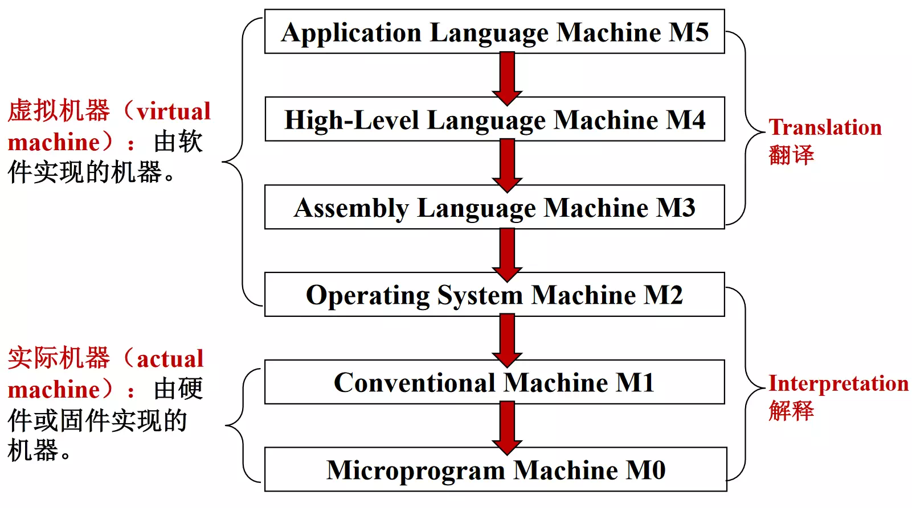

### 性能评估

#### 衡量性能的标准

- 用户的角度：程序运行时间短 Computer user consider: a computer is faster when a program runs in less time. 
  
  - Response time (响应时间)： the time between the start and the completion of an event—also referred to as execution time (执行时间).

- 计算机中心的角度：在一小时内能做更多工作 Computer center manager consider: a computer is faster when  it completes more jobs in an hour. 
  
  - Throughput (吞吐量): the total amount of work done in a given time.

#### 测量性能的方法

##### 响应时间（Response time）

计算机完成某一任务所花费的全部时间（latency），包括磁盘访问（disk accesses）、存储器访问（memory accesses）、输入输出（input/output activities）、操作系统开销（operating system overhead）等。

在计算机内存中间同时存放几道相互独立的程序（multiprogramming），相互穿插运行，因此一般不必要单单减少某个程序的执行时间（elapsed time）。

CPU时间是CPU执行所给定的程序所花费的时间，不包括含I/O等待时间以及运行其他程序的时间。

##### 用户CPU时间（User CPU time）

用户程序所耗费的CPU时间。

##### 系统CPU时间（System CPU time）

用户程序运行期间操作系统耗费的时间。

#### 选择程序来评估性能

1. 真实应用（Real applications）

2. 核心程序（Kernels）

3. 玩具测试基准（Toy benchmarks）

4. 合成测试基准（Synthetic benchmarks）

### 量化设计准则

#### 大概率事件优先原则

对于大概率事件（最常见的事件），赋予它优先的处理权和资源使用权，以获得全局的最优结果。

#### 阿姆达尔定律

加快某部件执行速度所获得的系统性能提高（加速比）与该部件在系统中的总执行时间的比例有关。

​                                             **$系统加速比 = \frac{改进后系统性能}{改进前系统性能} = \frac{改进前总执行时间}{改进后总执行时间}$** 

- 下图的 $Fraction_{enhanced}$（简写 $F_e$）是**可改进比例**，指可改进部分在原系统执行时间中所占的比例； 
- $Speedup_{enhanced}$（简写 $S_e$）是**部件加速比**，指可改进部分改进后的性能提高； 
- 阿姆达尔定律表示为 $S_{overall} = \frac{T0}{Te} = \frac{1}{(1-Fe)+ \frac{Fe}{Se}}$ ； 

- 需要注意的是 Fe 是**时间比时间**的比例；

#### CPU性能方程

计算机运行基于固定频率的时钟信号（clock periods, clocks, cycles, clock cycles），主频=1÷时钟周期，因此

$CPU时间 = 完成这一任务的时钟周期数 × 每个时钟周期时间$ 或  $CPU时间 = \frac{完成这一任务的时钟周期数}{主频}$ 

常用方程的形式是 CPU 时间 = 指令条数 × 每条指令时钟周期数 × 每个时钟周期时间

 = IC(Instruction Count) × CPI(Cycles Per Instruction) × CC(Clock cycle time)

#### 访问的局部性原理

程序倾向于重用刚用过的数据和指令，90%的时间运行于10%的程序上
因此，可根据最近访问预测未来会用到哪些指令和数据。

程序局部性包括：

1. 程序的时间局部性：程序即将用到的信息很可能就是目前正在使用的信息。
2. 程序的空间局部性：程序即将用到的信息很可能与目前正在使用的信息在空间上相邻或者临近。

### 按指令集和数据流分类

##### 单指令流单数据流 (SISD, single instruction stream over a single data stream)

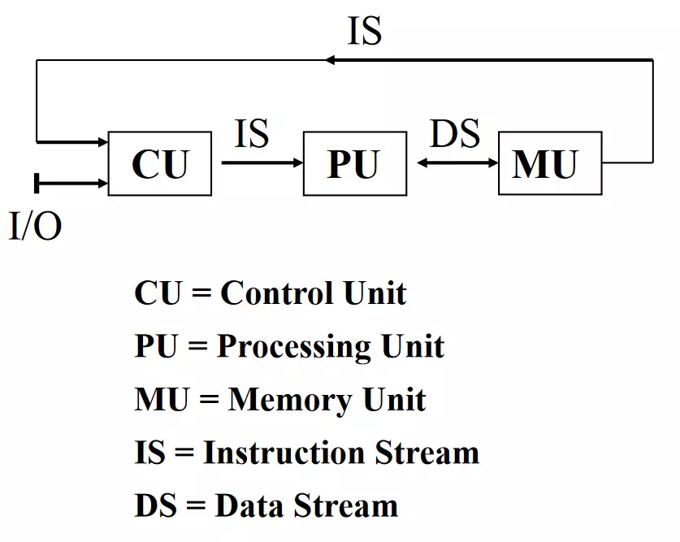

##### 单指令流多数据流 (SIMD, single instruction stream over multiple data stream)

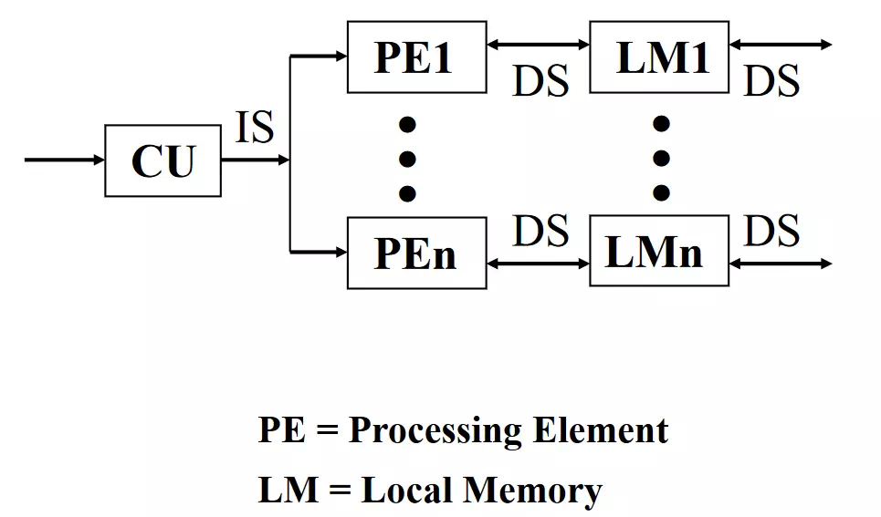

##### 多指令流多数据流 (MIMD, multiple instruction over multiple data streams)

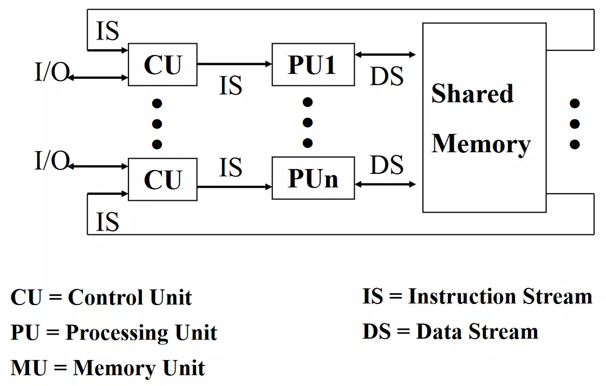

##### 多指令流单数据流 (MISD, multiple instruction streams and a single data stream) 

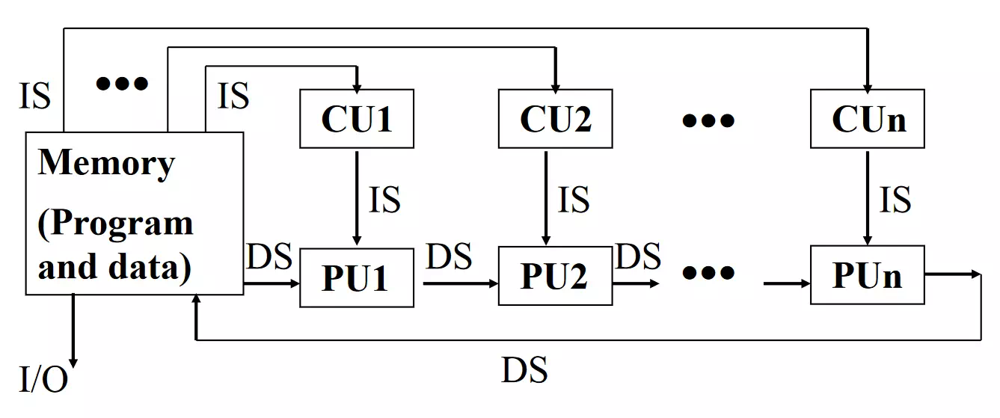

## Chapter 2. 指令集体系结构

- 指令集：计算机所有指令的集合。一条指令由操作码与地址码构成。
  
  - 指令的操作十分简单，其操作由操作码编码表示。
  
  - 每个操作需要的操作数个数为0-3个不等。

- 操作数是一些存储单元的地址；
  
  - 典型的存储单元通常有：主存、寄存器、堆栈和累加器。

- 操作数地址隐含表示或显式表示。

指令集是计算机体系结构的重要部分（直接挂钩 CPI 和 IC），定义CPU的功能，也是程序员控制CPU的手段

### 计算机指令集结构分类

* 在CPU中操作数的存储方法；
* 指令中显式表示的操作数个数；
* 操作数的寻址方式；
* 指令集所提供的操作类型；
* 操作数的类型和大小。

**CPU内部存储单元的类型是最基本的区别**：

* 堆栈型指令集结构（Stack architecture）
  
  * 操作数隐式放在堆栈结构的栈顶

* 累加器型指令集结构（Accumulator architecture）
  
  * 操作数中至少一个隐式放在累加器中

* **通用寄存器型指令集结构**（**GPR**，**G**eneral-**P**urpose **R**egister architectures）
  
  * 或者是寄存器，或者是存储器位置

总结：

| 指令集结构类型 | 优点                    | 缺点                                            |
| ------- | --------------------- | --------------------------------------------- |
| 堆栈型     | 是一种表示计算的简单模型； 指令短小 | 不能随机访问堆栈，从而很难生成有效代码。 同时，由于堆栈是瓶颈，所以很难被高效地实现 |
| 累加器型    | 减小了机器的内部状态；指令短小       | 由于累加器是唯一的暂存器，存储器通信开销最大                        |
| 寄存器型    | 易于生成高效的目标代码（所以是最常用）   | 所有操作数均需命名且显式表示，指令比较长                          |

**根据两种寄存器类型分**：

1. 寄存器-存储器体系结构：操作数可以来自存储器

2. 寄存器-寄存器体系：所有操作数都是来自寄存器、只有load与store能够访问存储器

3. 存储器-存储器体系结构：目前现实中没有

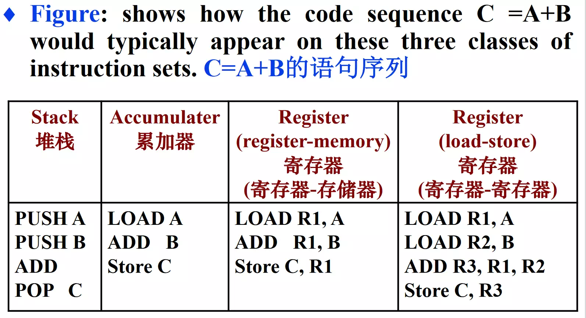

总结：

| 寄存器类型    | 优点                                                                       | 缺点                                                                                                     |
| -------- | ------------------------------------------------------------------------ | ------------------------------------------------------------------------------------------------------ |
| 寄存器-寄存器型 | 简单，指令字长固定，是一种简单的代码生成模型，各种指令的执行时钟周期数相近。 **SPARC, MIPS, PowerPC属于这个类型** | 和指令中含有对存储器操作数访问的结构相比，指令条数多（要使用load/store），因而其目标代码较大                                                    |
| 寄存器-存储器型 | 可以直接对存储器操作数进行访问，容易对指令进行编码，且其目标代码较小 **8086属于这个类型**                     | 指令中的操作数类型不同。在一条指令中同时对一个寄存器操作数和存储器操作数进行编码，将限制指令所能够表示的寄存器个数。由于指令的操作数可以存储在不同类型的存储器单元，所以每条指令的执行时钟周期数也不尽相同。 |
| 存储器-存储器型 | 是一种最紧密的编码方式，无需“浪费”寄存器保存变量。                                               | 指令字长多种多样。每条指令的执行时钟周期数也大不一样，对存储器的频繁访问将导致存储器访问瓶颈问题。                                                      |

### 内存地址的解释

#### 大端序和小端序

例：Suppose you have the 32-bit hexadecimal value 87654321 stored as a 32-bit word in byte-addressable memory at byte location 480, 481, 482, and 483.
a) What will be arranged in memory 480~483 according to Little Endian and Big Endian?
b) In which bytes order to Intel 80x86 systems store multibyte values?

答：8086是小端序；

 87654321H的表示：

| 存放顺序 | 480H | 481H | 482H | 483H |
| -------- | ---- | ---- | ---- | ---- |
| 大端序   | 87H  | 65H  | 43H  | 21H  |
| 小端序   | 21H  | 43H  | 65H  | 87H  |

##### 记住取数取的是首地址

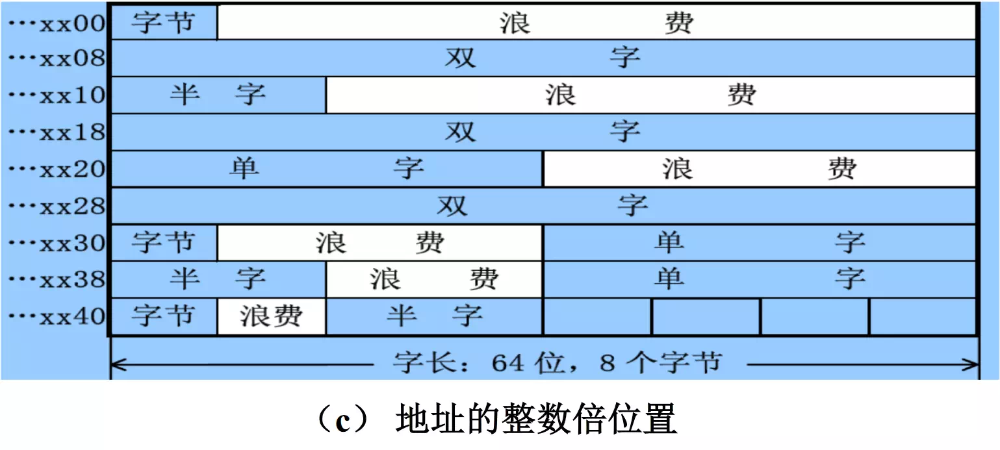

### 对齐的定义

An access to an object of size s bytes at byte address A is aligned if **A mod s = 0**

### 寻址模式

寻址模式：指令按照什么方式寻找（访问）到所需要的操作数或信息。

在通用寄存器型指令集中，一般是利用寻址方式指明指令中的操作数是一个常数、一个寄存器操作数，拟或是一个存储器操作数。

寻址实际上是**从形式地址到实际地址的转换**。形式地址由指令描述，实际地址也称为有效地址，有效地址指明的是存储器单元的地址或寄存器地址。

#### 寻址方式

1. 寄存器寻址（Register）

2. 立即数寻址（Immediate or literals）

3. 偏移寻址（Displacement）

4. 寄存器间接寻址（Register deferred or indirect）

5. 索引寻址（Indexed）

6. 直接寻址或绝对寻址（Direct or absolute）

7. 存储器间接寻址（Memory indirect or memory deferred）

8. 自增寻址（Auto increment）

9. 自减寻址（Auto decrement）

10. 缩放寻址（Scaled）

#### 操作码表示

1. 哈夫曼编码（想想离散数学）

2. 定长编码（所有操作码长度同样为n位）

3. 拓展码（按使用频率差距最大分成几组）

#### 寻址模式

1. 变成操作码的一部分

2. 为每个操作数设置地址描述符

### 指令集操作

十种最常用的指令占了96%，应当快速实现这些简单指令

#### 控制流指令

1. 条件转移（Conditional branches） 

2. 跳转（Jumps）

3. 过程调用（Procedure calls）

4. 过程返回（Procedure returns） 

#### 控制流指令的寻址模式

最常用方法：一旦转移成功，在当前PC counter上加上一个偏移量，作为目标地址

#### 条件转移的选项

大多数比较是简单的等式和不等式检测，以及与零比较

| 分支条件表示                                       | 优点             | 缺点                                           |
| -------------------------------------------- | -------------- | -------------------------------------------- |
| 条件码（Condition code，CC）：在程序的控制下，由ALU操作设置特殊的位  | 可以自由设置分支条件     | 必须从一条指令将分支条件信息传送到分支指令，所以CC是额外状态，条件码限制了指令执行顺序 |
| 条件寄存器（Condition register）：根据比较结果测试条件寄存器      | 简单             | 占用了一个寄存器                                     |
| 比较分支（Compare and branch）：比较操作是分支指令的一部分，比较受限制 | 一条指令完成了两条指令的功能 | 分支指令的操作增多 当采用流水线时，该指令的操作可能太多，在一拍内做不完      |

#### 过程调用选项

过程调用和返回包括控制转移和可能的一些状态保存。

##### 调用者保存（Caller saving）

在一个调用者调用别的过程时，必须保存**调用者所要保存的寄存器**，以备调用结束返回后，能够再次访问调用者

##### 被调用者保存（Callee saving）

**被调用的过程必须保存它要用的寄存器**，保证不会破坏过程调用者的程序执行环境，并在过程调用结束返回时，恢复这些寄存器的内容

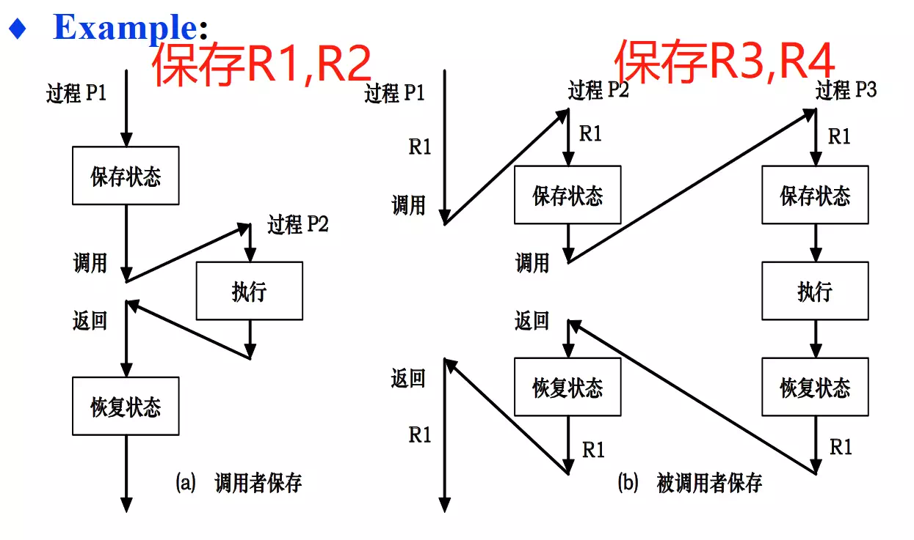

### RISC 与 CISC 技术

##### CISC（Complex Instruction Set Computers）复杂指令集计算机

- CISC的目标：汇编语言程序量小，这通过硬件来实现。强化指令功能，实现软件功能向硬件功能转移

- CISC结构指令系统的复杂性给VLSI设计增加了很大负担，不利于单片集成。

- CISC结构的指令系统中，许多复杂指令需要很复杂的操作，因而运行速度慢。

- 在CISC结构的指令系统中，由于各条指令的功能不均衡性，不利于采用先进的计算机体系结构技术（如流水技术）来提高系统的性能。

##### RISC（Reduced Instruction Set Computer）精简指令集计算机

- 指令简单，因此运行非常快

- 需要更少的晶体管，设计和制造更便宜

### DLX 架构

一种RISC的实现

- 具有一个简单的Load/Store指令集

- 注重指令流水效率（pipelining efficiency）

- 简化指令的译码

- 指令长度32位，有32个32位通用寄存器R0-R31，32个32位浮点寄存器（FPRs）F0-F31

#### DLX 指令格式

##### I 类型指令

| Opcode (6) | Rs1(5) | Rd (5) | Immediate (16) |
| ---------- | ------ | ------ | -------------- |

- Load: destination = Regs[Rs1] + Immediate
- Store: destination = Regs[Rs1] + Immediate
- All immediates: Regs[Rd] ← Regs[Rs1] op immediate
- Conditional branch instructions: Rs1 is register , Rd unused
- Jump register, jump and link register: Rd = 0, Rs1 =destination, immediate = 0

例：`LW R1, 100(R2); Regs[R1]<-Mem[100+Regs[R2]]` 

#####  R 类型指令

| Opcode (6)|Rs1 (5)|Rs2 (5)|Rd (5)|Func (11) |
| ---------- | ------ | ------ | -------------- |-|

- 两个源寄存器 Rs1, Rs2，一个目的寄存器 Rd
- 寄存器-寄存器ALU操作
- 函数对数据的
  操作进行编码：加，减，...
- 对特殊寄存器的读/写和移动

例：`Add R1, R2, R3; Regs[R1] ←Regs[R2]+Regs[R3]` 

##### J 类型指令

| Opcode(6) | Offset added to PC(26) |
| --------- | ---------------------- |

- 跳转，跳转并链接
- 从异常处自陷和返回

### RISC-V 体系结构

- 32个64位的通用寄存器（GPRs），寄存器x0的内容恒为全0
- f0, f1, ... , f31 32个浮点寄存器（FPRs），单精度浮点数表示(32个)，双精度浮点数表示(16个)
- 存储器访问必须用 load 和 store 
- 32 位指令和 7 位操作码

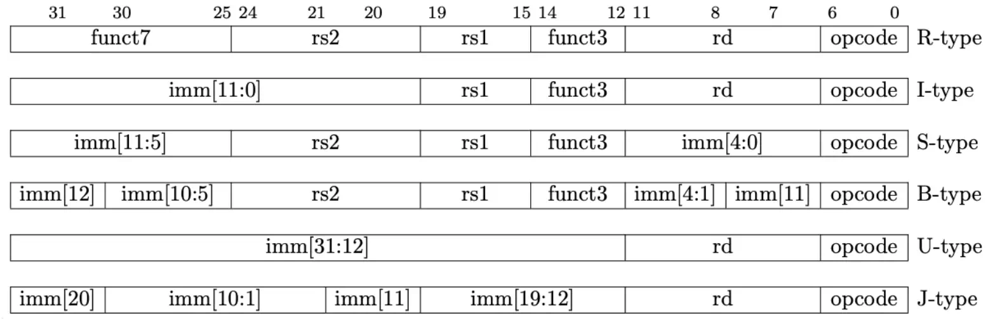

#### RISC-V 指令格式

##### R 类型指令

| funct (7) | Rs2 (5) | Rs1 (5) | funct (3) | Rd (5) | opcode (7) |
| --------- | ------- | ------- | --------- | ------ | ---------- |

- opcode：指定它是什么指令
- funct (7) 和 funct (3)：表示要进行的操作

##### I 类型指令 

| imm (12) | Rs1 (5) | funct (3) | Rd (5) | opcode (7) |
| -------- | ------- | --------- | ------ | ---------- |

- 和R类型指令的不同是前12位为立即数
- 立即数的范围是[-2048, +2047]

##### S 类型指令

| imm (7) | Rs2 (5) | Rs1(5) | funct (3) | imm (5) | opcode (7) |
| ------- | ------- | ------ | --------- | ------- | ---------- |

##### B 类型指令

| imm (1) | imm(6) | Rs2(5) | Rs1(5) | funct (3) | imm (4) | imm (1) | opcode |
| ------- | ------ | ------ | ------ | --------- | ------- | ------- | ------ |

##### U 类型指令

| imm (20) | rd(5) | opcode (7) |
| -------- | ----- | ---------- |

##### J 类型指令

| imm (1) | imm (10) | imm (1) | imm (8) | rd(5) | opcode (7) |
| ------- | -------- | ------- | ------- | ----- | ---------- |

## Chapter 3. 流水线

### 目录/小结

- 3.1 什么是流水线
  - 流水线是一种执行技术，在执行过程中多条指令重叠执行。
  - 不同步骤并行完成不同指令的不同部分。
  - 最简版本：`IF取指 -> ID指令译码 -> EX执行 -> MEM访存 -> WB写回`
- 3.2 DLX 的基本流水线
  - 从一个阶段传递到下一个阶段的值必须放在流水线寄存/锁存器中。
- 3.3 管道化的主要障碍
  - 相关（冒险）：阻碍下一条指令执行的情况，会降低流水线性能。
- 3.4 结构和数据相关
- 3.5 控制相关
  - 避免数据相关：转发、暂停、编译器重排指令
  - 避免控制相关：冻结/清空流水线、预测转移成功、预测转移失败、延迟分支
- 3.6 扩展 DLX 流水线以处理多周期操作
  - 长延迟流水线中的相关
- 3.7 动态调度克服数据相关
  - Tomasulo 算法
- 3.8 动态硬件预测减少分支惩罚 
  - 转移预测缓冲器BPB、转移目标缓冲器BTB
- 3.9 利用多发射技术
  - 让 CPI 小于 1

#### 流水线的功能

- 流水线不能缩短单个任务耗时，但可以提高吞吐量
- 流水线速度受限于最慢的流水站的速度（洗衣店例子）
- 流水线中多个任务并行处理

#### 概念

- 流水线的吞吐量（Throughput）：指令退出流水线的频率
- 机器周期（Machine cycle）：指令在流水线上移动一步的时间
- 加速比：$S=\frac{T_{unpipeline}}{T_{pipeline}}$ 

### DLX 的一种简单实现

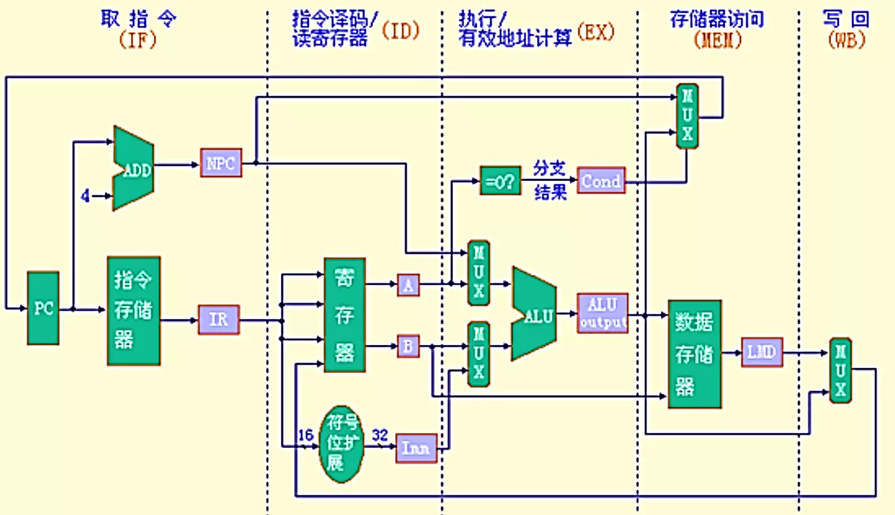

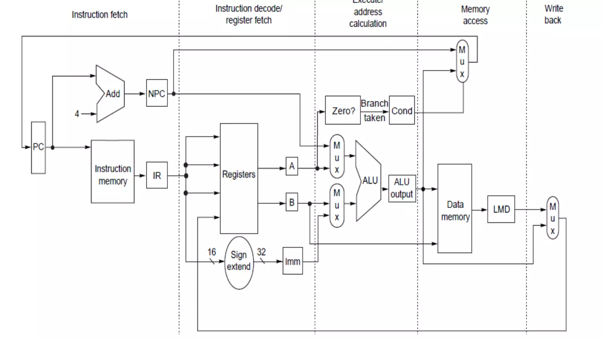

#### 1. 取指令（Instruction fetch cycle，IF）

功能：根据PC值从存储器中取出指令，并将指令送入指令寄存器IR

PC值增加4，指向顺序的下一条指令

IR中的指令将被执行

将下一条指令的地址放入临时寄存器NPC中

#### 2. 指令译码/读寄存器（Instruction decode/register fetch cycle，ID）

功能：取数同时指令译码，读IR寄存器，按照寄存器号读寄存器文件

**改进的 DLX 在这个阶段提前计算跳转地址**

将读出结果放入两个临时寄存器A和B中

对IR寄存器中内容的低16位进行符号扩展，然后将符号扩展之后的立即值保存在临时寄存器Imm中

#### 3. 执行/有效地址计算（Execution/effective address cycle，EX）

功能：根据指令类型进行四种操作之一：存储器访问，寄存器-寄存器ALU，寄存器-立即数ALU，分支操作

没有指令会在计算数据地址、目标地址的同时还对数据进行操作

#### 4. 访存/分支操作完成（Memory access/branch completion cycle，MEM）

功能：从数据存储器中读

只有load、store和branch指令在这个周期活跃

寄存器引用

分支操作

#### 5. 写回（Write-back cycle，WB）

功能：将数据写到寄存器中 

### DLX 的流水线（待补充）

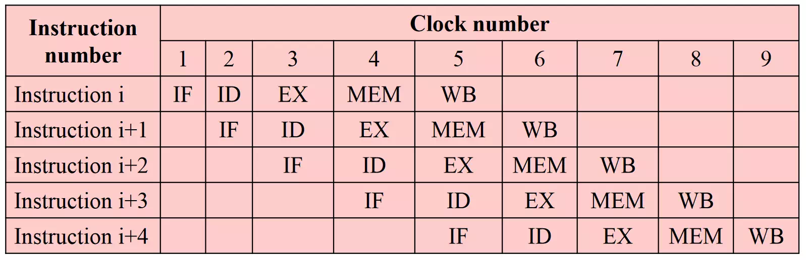

流水线改进的是吞吐量：

- 仅仅增加了吞吐量, 但没有降低每条指令的运行时间

- 由于控制开销, 每条指令运行时间稍微增加

- 吞吐量增加，程序运行更快

### 流水线的相关（冒险）

流水线中的相关是指相邻或相近的两条指令因存在某种关联，后一条指令不能在原先指定的时钟周期开始执行。

1. **结构相关**：指令在重叠执行过程中，硬件资源无法满足指令重叠执行的要求，发生资源冲突
2. **数据相关**：一条指令需要用到前面指令的结果，因此无法与产生结果的指令重叠执行
3. **控制相关**：流水线遇到分支指令、或其它会改变PC值的指令，发生PC转移

#### 结构相关

用暂停的方法解决；

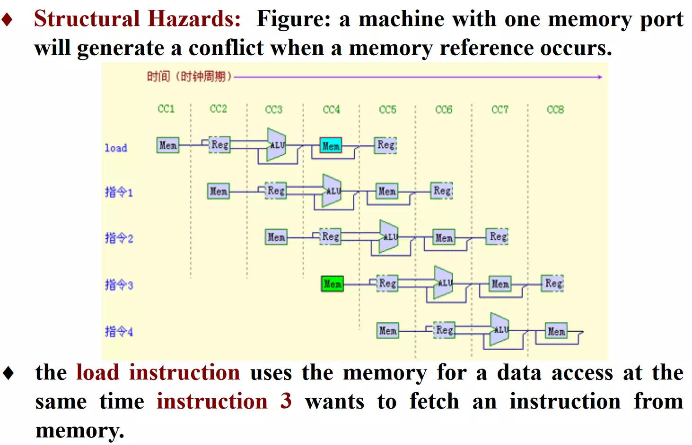

#### 数据相关

当指令在流水线中重叠执行时，流水线有可能改变指令读/写操作数的顺序，使之不同于它们在非流水实现时的顺序，这将导致数据相关

解决思路：**使用转发（定向）技术**、暂停、编译器调度

将计算结果从其产生的地方**直接送到真正需要它的地方**，就可以避免暂停。

- 寄存器文件EX/MEM中的ALU运算结果总是回送到ALU的输入寄存器

- 从定向通路得到输入数据的ALU操作不必从源寄存器中读取操作数

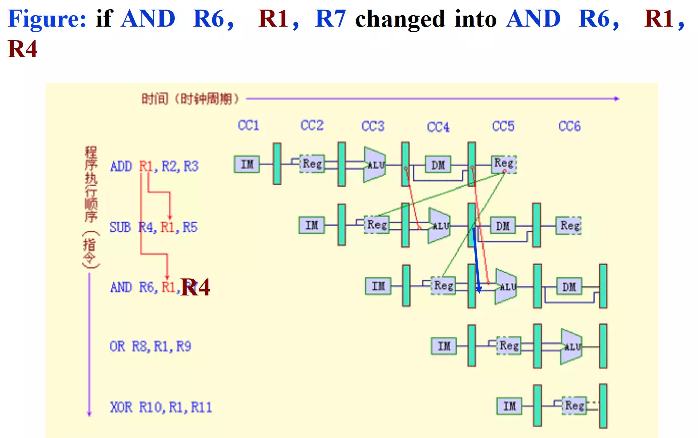

1. **RAW (read after write) 先写后读**：x 试图在 y 写入源代码之前读取它，导致 x 错误地获取了旧值
2. **WAW (write after write) 写后再写**：x 尝试在 y 写入操作数之前写入操作数；写入操作最终以错误的顺序执行，将 y 写入的值而不是 x 写入的值留在目标中。
3. **WAR (write after read) 先读后写**：x 试图在 y 读取目标之前就写入目标，导致 y 错误地获取了新值

编译器可以通过重新排列代码的顺序来消除这种暂停，即流水线调度（或指令调度）

#### 控制相关

控制相关可能比数据冒险造成的性能损失更大，转移如果成功，PC 直到 MEM 结束(更新完地址)才改变

一旦 ID 段检测到分支指令，就暂停执行其后的指令，直到分支指令达到 Mem 段，确定新的PC为止

解决思路：冻结或清空管道，转移预测，延迟分支

##### 转移预测

1. 在流水线中尽早判断分支转移是否成功
2. 转移成功时，尽早计算出转移目标地址

##### 降低流水线中的转移造成的惩罚

1. **冻结或排空流水线**：在流水线中停住或删除分支后的指令，直至知道转移目标地址
2. **预测分支转移失败**：流水线继续照常流动，如果分支转移成功，将分支指令后的指令转换为空操作，并从分支目标处开始取指令执行；否则照常执行
3. **预测分支转移成功**：始终假设分支成功，直接从分支目标处取指令执行
   但是，对于 DLX 流水线，<u>在预测转移结果时，转移目标地址还没算出来</u>，所以没有性能提升
4. **延迟分支**：分支开销为 n 的分支指令后紧跟有 n 个延迟槽，流水线遇到分支指令时，按正常方式处理，顺带执行延迟槽中的指令，从而减少分支开销

### 扩展 DLX 处理多周期操作

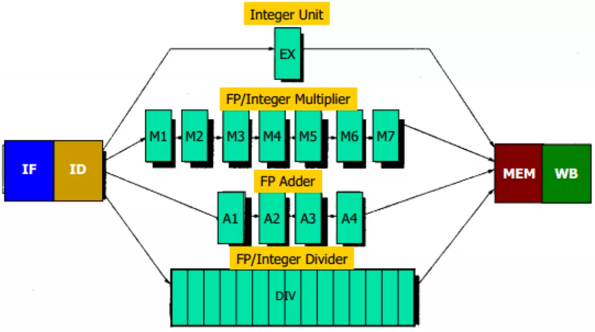

#### 长延迟流水线的冒险和前送

- 除法单元未充分流水化，可能导致结构冲突，需要检测，并使指令发射停顿

- 指令运行时间不同，会导致同一个周期有多个寄存器写操作，形成结构冲突

- 指令不再按序到达 WB，可能导致 WAW 冒险。寄存器读总在 ID 发生，所以不会有 WAR 冒险

- 操作的长延迟，导致 RAW 冲突更频繁。

- 早解决：在 ID 阶段跟踪写端口的使用，并在发射之前阻塞指令

  - 如果检测到处于 ID 的指令与早先发射的指令在同一周期使用寄存器文件，则该指令阻塞一个周期
  - 跟踪操作用移位寄存器实现，每个周期移一位
  - 优点：在 ID 阶段就完成互锁检测和阻塞插入
  - 成本：要加入移位寄存器和写冲突逻辑
- 到时候再解决：在冲突指令要进入 MEM 或 WB 时阻塞之
  - 优先考虑具有最长潜伏期的指令，这些指令最有可能引起其他指令阻塞
  - 优点：到 MEM 或 WB 才检测冲突，因此容易实现
  - 缺点：使流水线控制复杂化，因为可从两个地方插入阻塞

#### DLX 浮点流水线的性能

- 静态调度
  - 没有冒险/可以前送，则发射
  - 否则阻塞直至依赖关系解除
  - 编译器技术
- 动态调度
  - 能处理在编译时不知道的依赖关系，简化了编译器
  - 使在一个流水线上编译的代码，在另一个流水线上也能高效运行

### Tomasulo 算法

在不改变体系结构的条件下尽可能提高计算机性能；

例：用调度解决名相关

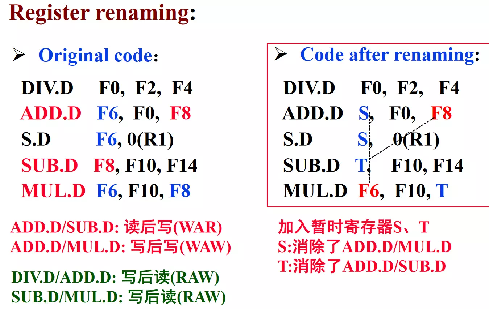

Tomasulo 算法借助 **保留站（Reservation station）**对**寄存器**进行重命名，电路图结构如下图所示，使用了一个 **共享数据总线（CDB，common data bus）**将已计算出的值广播给所有需要这个值作为指令源操作数的保留站

1. 只要操作数可用，保留站就取来并缓冲，从而避免从寄存器取操作数
2. 悬挂的指令指定为其提供操作数的保留站
3. 由于保留站比寄存器多，所以能消除编译器不能消除的冒险
3. 浮点操作在发射时从指令单元进入队列，所有来自 FP 单元或 load 单元的结果都经过 CDB 去往 FP 寄存器文件以及保留站和 store 缓冲器

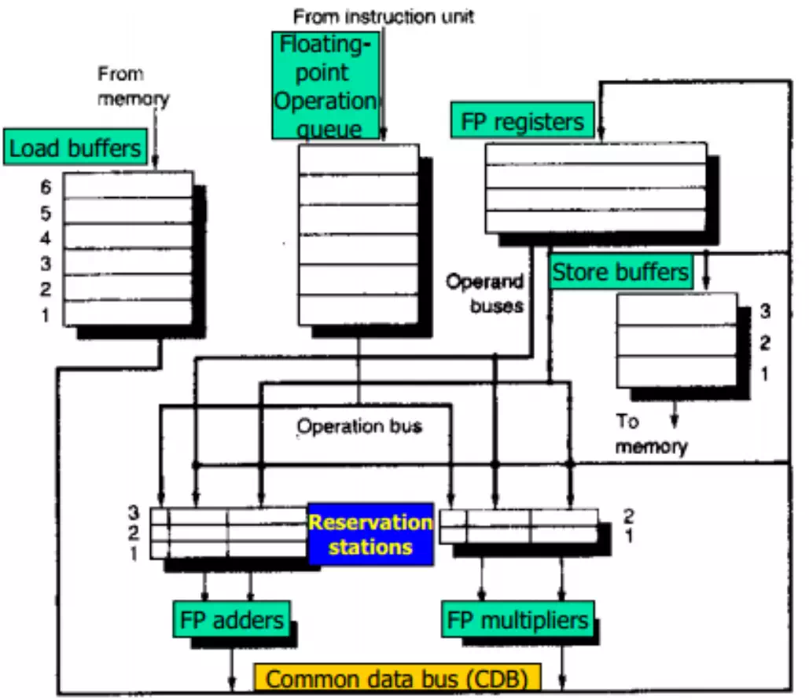

#### 保留站

保留站的信息包括：

1. 指令：已经发射的和正在一个功能单元等待执行的
2. 操作数：已经被计算的，或操作数的来源
3. 检测和解决冒险的信息

Load 缓冲器：装载尚未完成的 load 的结果

Store 缓冲器：装载尚未完成的 store 的目标地址，再等待操作数

#### 保留站的 6 个字段

- $Op$：对源操作数 $S1$ 和 $S2$ 进行的操作

- $Qj$, $Qk$：即将产生相应源操作数的保留站
  - 零表示源操作数已经可用，在 $Vj$ 或 $Vk$ 中存放，或者是不需要的
- $Vj$, $Vk$：源操作数的值，对于 $j, k$ 同一个时刻 $Vi$ 或 $Qi$ 域只能有一个有效

- $Busy$：表示该保留站及其功能单元被占用

#### 寄存器的字段

- $Qi$：保留站的编号，结果存储在这个寄存器或存储器中。
  - 如果 $Qi$ 是空或零, 则当前没有指令要计算出值并存到该寄存器或缓冲器；
  - 否则，该寄存器的内容就是需要的值；

#### store 缓冲区的字段

- $Qi$：保留站的编号，操作的结果应该存储在这个寄存器或内存中
- $Vi$：包含要存储的值
- $Busy$：指示缓冲区何时可用
- $Address$：数据地址

#### load 缓冲区的字段

- $Busy$：指示缓冲区何时可用
- $Address$：数据地址

#### 指令的 3 个状态

- **发射（issue）**
  - 若是 FP 操作，且有空的保留站，就发射；
  - 若操作数在寄存器中，就将其送到保留站；
  - 如果是 load 或 store，若有缓冲器空间，就发射；
  - 如果没有空的保留站或空的缓冲器，则有结构相关，指令阻塞，直至有保留站或缓冲器被释放；
  - 这个步骤进行**寄存器重命名**以**解决 WAR 和 WAW 冲突**
- **执行（execute）**
  - 如果有操作数还不能用，就监视 CDB，等待它被计算完；
  - 如果有操作数被计算出来，就放入到相应的保留站中；
  - 当操作数都计算出来，就在功能单元中执行该操作；
  - **检测 RAW 冒险**（由于在操作数可用之前延迟指令的执行，避免了 RAW）；
- **写结果（write result）**
  - 当计算出结果，就将其写到 CDB 上广播给所有需要它的保留站和 store 缓冲器中；

例：

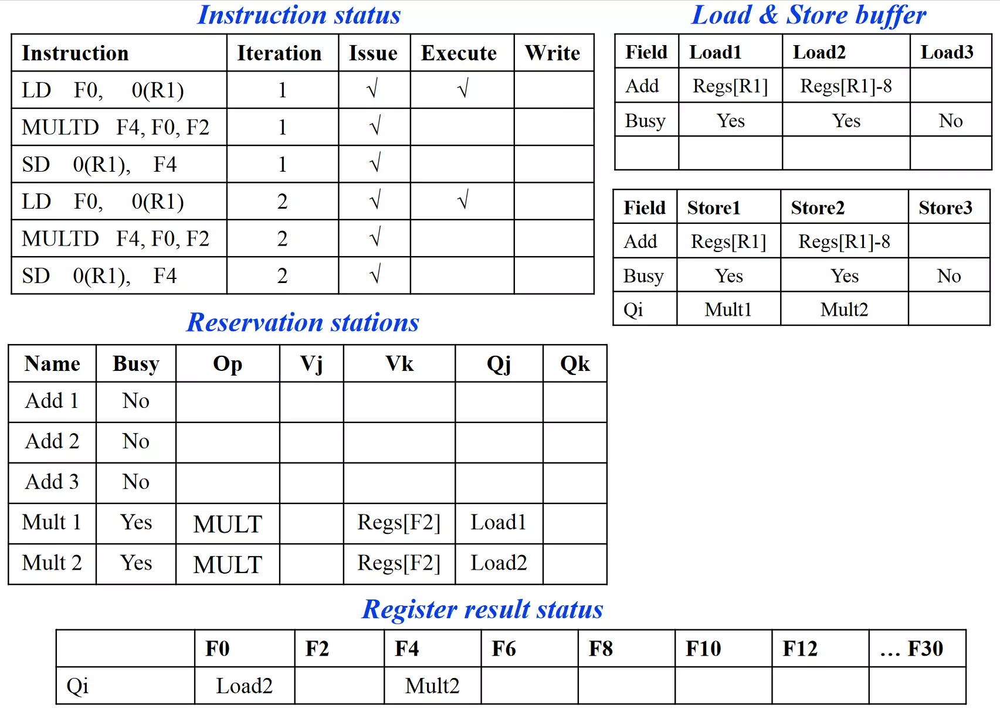

### 动态硬件预测分支转移

#### 转移预测缓冲器（BPB，Branch Prediction Buffers）

最简单的动态转移预测方案

本质是一块内存，索引为分支指令地址的下半部分索引。

- 指令在 IF 阶段进入这个缓冲区
- 对减少分支延迟很有用
- 对简单 DLX 流水线没有帮助

| 1 比特预测方案，错 1 次就改变预测                            | 2 比特预测方案，错 2 次才改变预测                            |
| ------------------------------------------------------------ | ------------------------------------------------------------ |
| 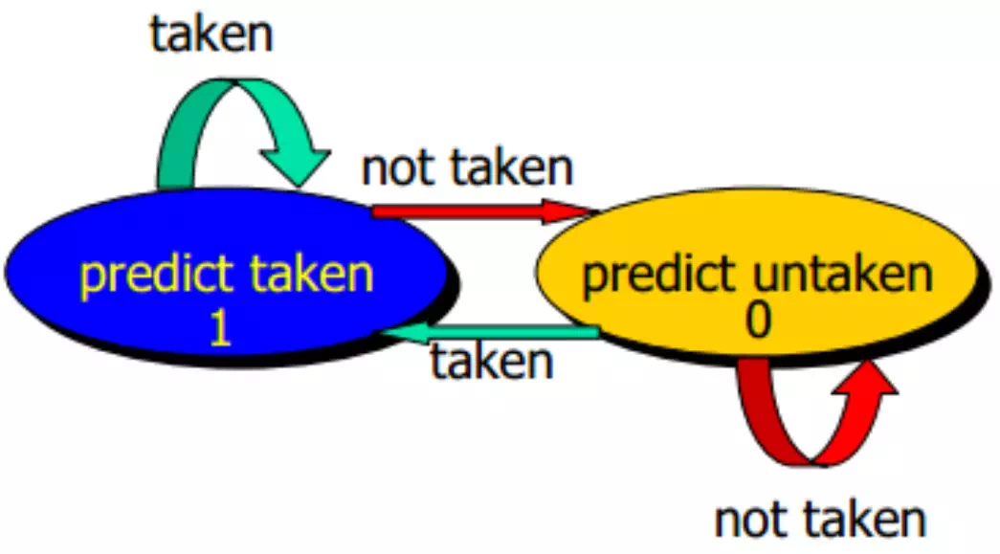 | 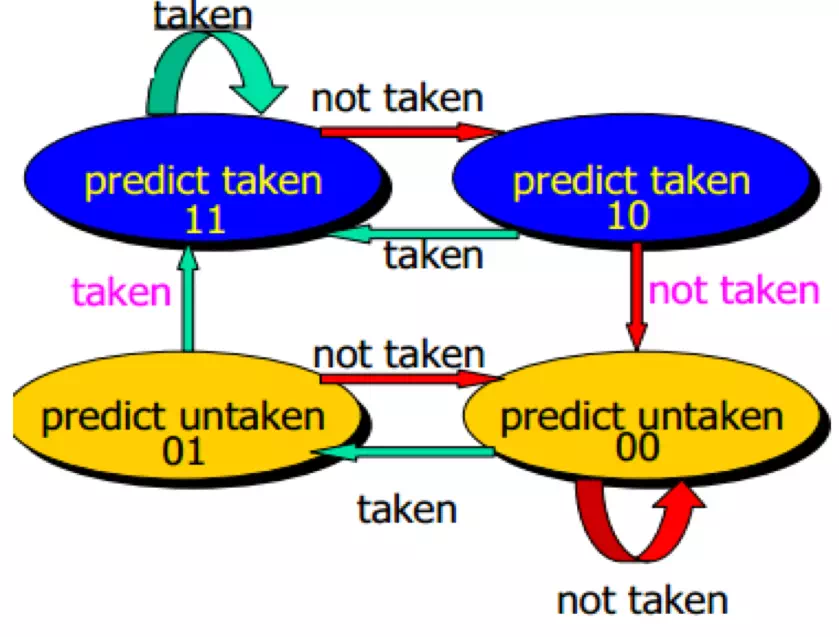 |

例：`ADDI R1, R0, #10
Loop: SUBI R3, R1, #1
	SUBI R1, R1, #1
	BNEZ R1, Loop`  

1 比特预测方案：2 次预测失败

2 比特预测方案：1 次预测失败

| 该分支的预测位 | 预测，如果最后一个分支没有采取跳转 | 预测，如果最后一个分支采取跳转 |
| -------------- | ---------------------------------- | ------------------------------ |
| NT/NT          | Not taken                          | Not taken                      |
| NT/T           | Not taken                          | Taken                          |
| T/NT           | Taken                              | Not taken                      |
| T/T            | Taken                              | Taken                          |

#### 转移目标缓冲器（BTB，Branch Target Buffers）

为进一步降低转移惩罚，需要在 **IF 阶段**末就知道取指地址

需要知道：还没有解码的指令是不是转移指令；如果是，PC 下次执行是什么。

本质是存储所预测的转移后下条指令的地址的缓存

- 只需存储预测为成功的转移，如果预测不成功，就原样执行
- 取来指令的PC与存储在第一列的一组地址（是已知的转移地址）进行匹配

- 如果匹配一个，则正被取指的指令就被预测为一个成功的转移，第二个域就包含着转移后的下一个PC，取指立即在那里进行

- 第三个域可选，可用于额外的预测状态位
- 错误预测惩罚为2个周期

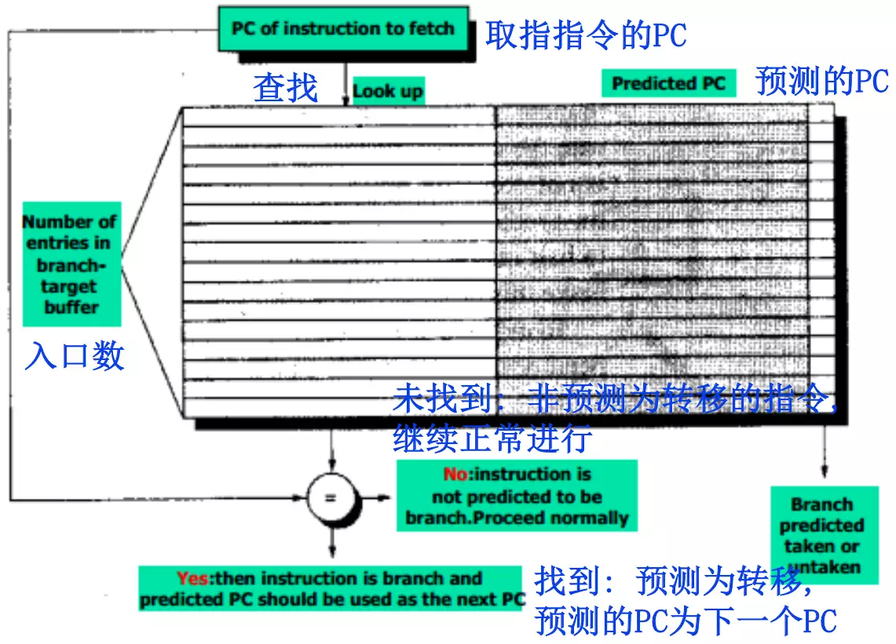

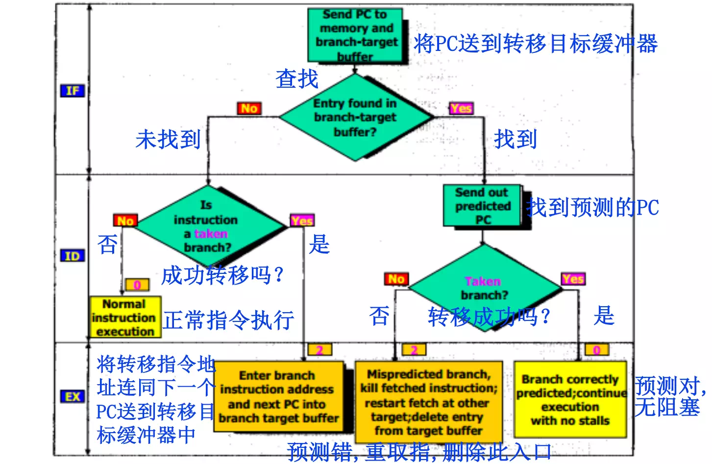

### 多指令流出处理器

#### 超标量处理器（superscalar processors）

以 DLX 超标量为例：

- 每个周期发射不同数量的指令
  - 硬件可在单周期发射1到8条指令
  - 指令之间必须独立，并满足一些约束
- 可用编译器进行静态调度，或者采用 Tomasulo 进行动态调度

#### 超长指令字处理器（VLIW processors）

- 发射固定数量的指令，把多条指令操作打包成一个超长指令(固定指令包)
- 用调度器进行静态调度
  - 编译器负责选择能一起发射的指令，不需要硬件

## Chapter 4. 存储器层次

把速度不同空间大小不同的存储单元按层次结构排序，使其对外表现容量大、速度快、价格低；

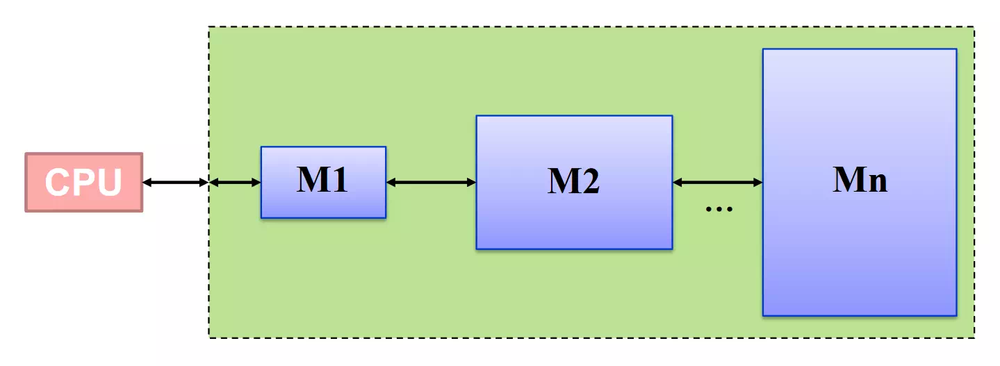

理论依据：访问的**局部性原理**，若一个数据项被访问，则它很可能很快被再次访问，其临近地址的数据也很可能很快被访问。

- 最靠近处理器的层次是其它更低层次的子集，所有数据都存储在最低层次
- 数据只能在相邻层次间拷贝
- 上层比下层容量小，但速度快
- 层次中信息的最小单位，称为块（block）

### 基本概念

- 命中（Hit）需要的数据出现在高层某块中

- 缺失（Miss）数据在高层未找到. 需要访问底层来寻找包含所需数据的块

- 命中率（Hit rate）数据在高层找到的比率

- 缺失率（Miss rate）数据在高层找不到的比率
- 命中时间（Hit time）访问高层的时间，包括确定该访问是命中还是缺失所需时间
- 缺失惩罚（Miss penalty）用低层块替换高层块，再加上将块送到处理器所需时间

例：两层存储体系 $M_1, M_2$。$M_1$ 命中率 $H_1$，$M_1$ 命中时间 $T_{A1}$，$M_2$ 命中时间 $T_M$ ，求平均访问时间 $T_A$

答：$T_A＝T_{A1}＋(1－H_1 )T_M$ 或 $T_A＝T_{A1}＋F×T_M$ 

### 缓存的基础

#### 直接映像缓存

单字块 cache 定位查找

多字块 cache 定位查找

index 位 / tag 位 / cache 位大小

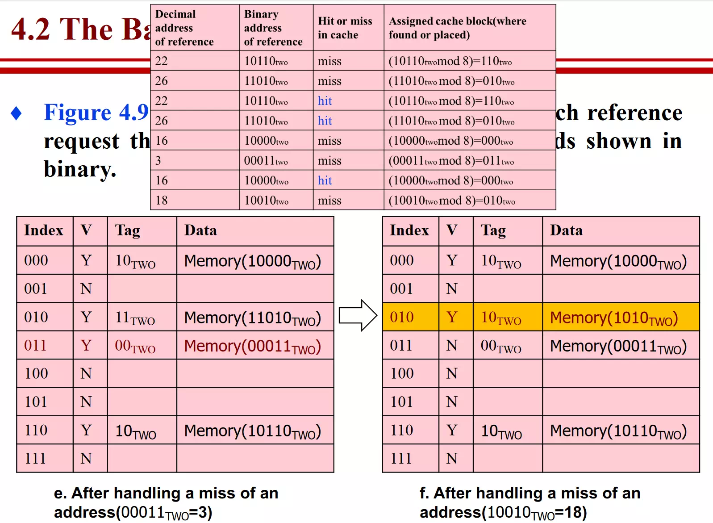

1. 地址的低部分用来选择cache入口

2. Cache 的 tag 与地址高部分比较，用来确定该 cache 入口是否对应于所需的地址

3. Cache 有 2^10^ 个字，块大小为一个字。10 位用来索引 cache，剩下的 32-10-2=20 位就用来与tag比较

4. 如果tag与高20位相等，则命中，能取得数据到CPU，否则缺失。

做题要求需要**会计算位数和Cache大小**。

> 例：How many total bits are required for a direct-mapped cache with 64KB of data and 1-word blocks, assuming a 32-bit address?
>
> 答：$64KB=16K-words = 2^{14} words$, and with a block size of 1 word, 2^14^ blocks. 
> Each entry has 32 bits of data plus a tag, which is 32-14-2 bits, plus a valid bit. 
> Thus the total cache size is: 2^14^ 个字(块), 每个入口有32位数据, 加上tag(32-14-2)位, 再加上 1 位 valid 
> 计算结果：$2^{14}×(32 + (32-14-2)+1)=2^{14}×49=784Kbits=98KB$ 

#### 处理 Cache 缺失

##### 检测出缺失时

通过从memory取数据来解决问题

在发生指令缓存缺失时应采取的步骤：

1. 阻塞CPU，冻结所有寄存器的内容，指令送cache
2. 将原始PC值（当前PC-4）发送到存储器。
3. 指示主存储器进行读操作，并等待存储器完成访问。
4. 将内存中的数据放在条目的数据部分，地址的高位写入tag位，vaild置位，写缓存
5. 从cache中重新找到指令，重新取值，从头重新执行。

##### 读取

要求每个cache的读和写需要不同的控制信号

步骤：

1. 将地址送到cache，如果是读指令地址来自PC, 如果是访问数据地址来自ALU(对于访问数据)
2. 若命中: 得到所需要的字；
3. 若缺失: 将地址送到存储器，取到数据再写入cache

##### 写入

需要解决的问题是内存的值将与缓存中的值不同。假设在一条存储指令中，我们只把数据写进了数据缓存，没有改变主内存。

两种解决方法：

1. 写直达法（Write-through）：总是将数据同时写入内存和缓存。
2. 写回法（Write-back）：写cache，不写入主存，当cache数据被替换出去时再写回主存

DECStation 3100 如何处理写入步骤：

1. 用地址的第15-2位索引cache。
2. 将地址的第31-16位写进tag，将数据字写进数据部分，置位vaild位。
3. 写入主存。

##### 改进：缺失时取多个块

发生缺失时把相邻的块都放入缓存，原理是空间局部性

#### 多路选择器

有一个额外的块索引字段被用来控制多路选择器，它从索引的四个字中选择要求的字。

缓存中 tag 和 vaild 的总数会减少，因为每个 tag 和 vaild 对应四个字。

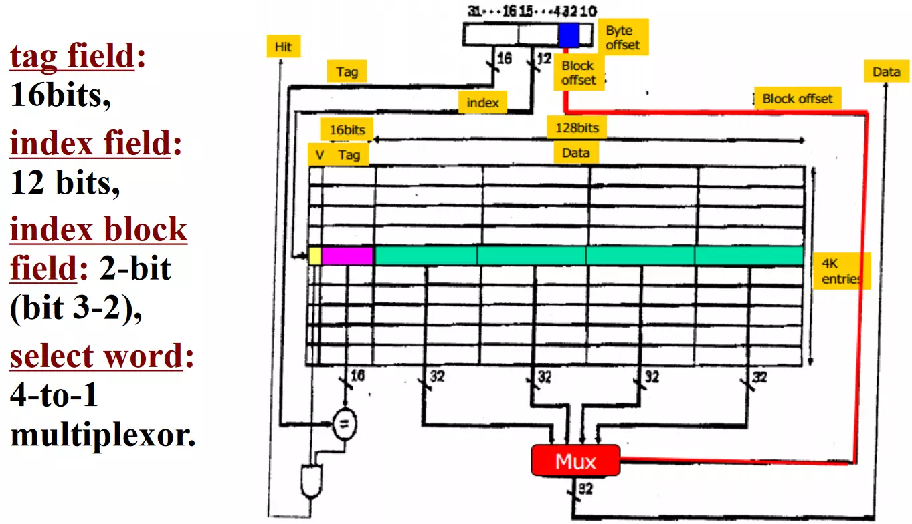

#### 设计存储系统来支持Cache

##### 更高的内存带宽

虽然降低取第一个字的时间是困难的，但可通过提高存储器到cache的带宽来降低缺失惩罚。

允许使用更大的块大小的同时，仍能保持与较小区块类似的低失误惩罚。

### 测量和提高缓存性能

降低两个存储块竞争一个Cache位置的概率

直接映像
组相连
全相连

向层次结构中再增加额外的层次，多级Cache

初级Cache要最小化命中时间
二级Cache要最大化命中率，不用在意访问时间

### 虚拟内存

Cache TLB 页表的区分

情况有没有可能发生的PPT

### 内存层次的通用框架

