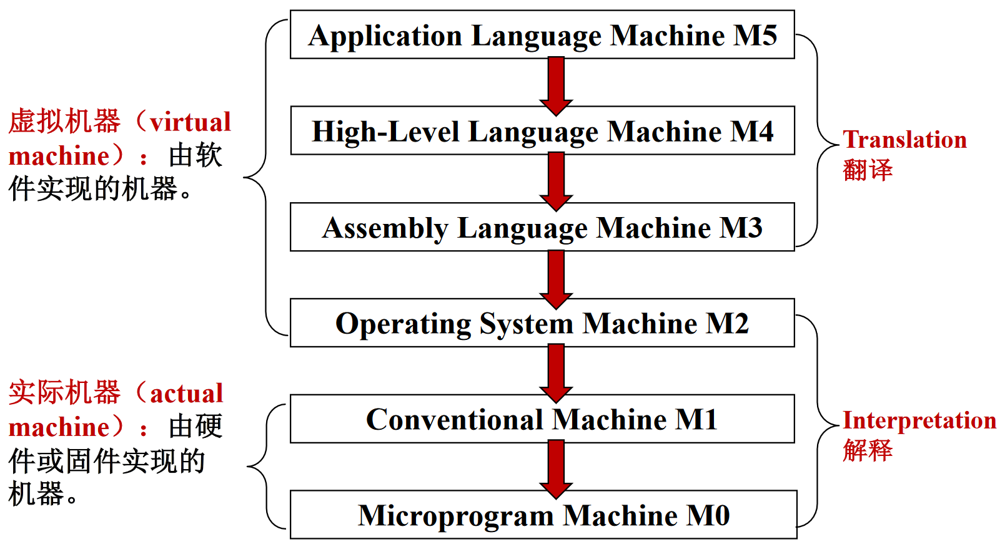
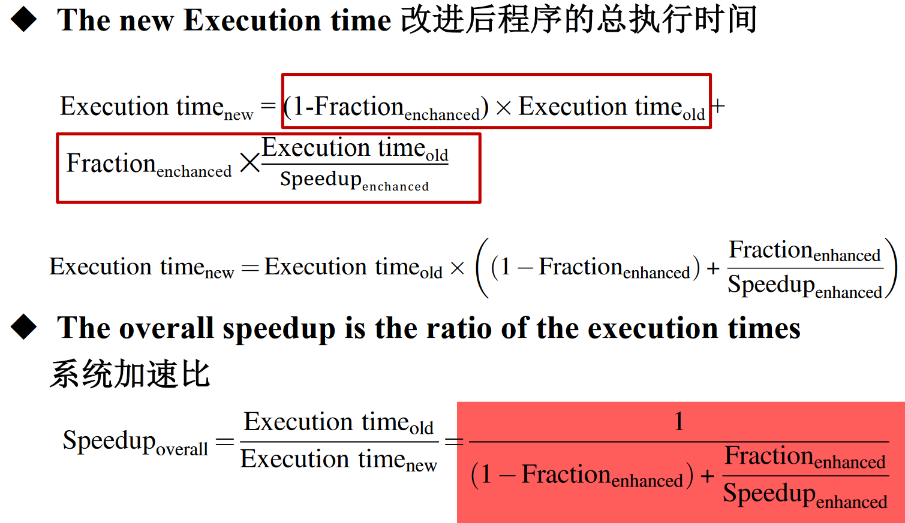

# 计算机体系结构笔记

期末考试开卷，但是是英文试卷，平时50%，期末50%

## Chapter 1. 计算机体系结构的基本原理

### 多级层次结构

计算机体系结构是程序员所看到的计算机的属性即概念性结构与功能特性；

* 具有相同计算机系统结构的计算机可以采用不同的计算机组织。例如相同的指令系统可以顺序执行，也可以重叠执行。
* 一种计算机组织可以采用不同的计算机实现。
* 随着计算机技术的迅速发展，计算机系统结构，组织和硬件之间的界限变得越来越模糊。

### 性能测量

待补充

### 量化设计准则

#### 大概率事件优先原则

对于大概率事件（最常见的事件），赋予它优先的处理权和资源使用权，以获得全局的最优结果。

#### 阿姆达尔定律

加快某部件执行速度所获得的系统性能提高（加速比）与该部件在系统中的总执行时间的比例有关。

​										 	**$系统加速比 = \frac{改进后系统性能}{改进前系统性能} = \frac{改进前总执行时间}{改进后总执行时间}$** 

- 下图的 $Fraction_{enhanced}$（简写 $F_e$）是**可改进比例**，指可改进部分在原系统执行时间中所占的比例； 
- $Speedup_{enhanced}$（简写 $S_e$）是**部件加速比**，指可改进部分改进后的性能提高； 
- 阿姆达尔定律表示为 $S_{overall} = \frac{T0}{Te} = \frac{1}{(1-Fe)+ \frac{Fe}{Se}}$ ； 

#### CPU性能方程

#### 访问的局部性原理
