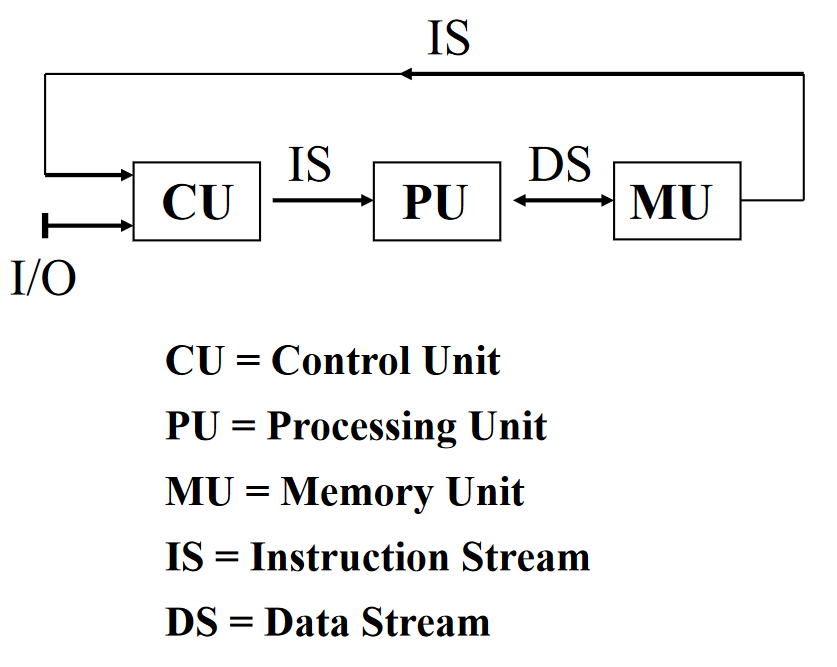
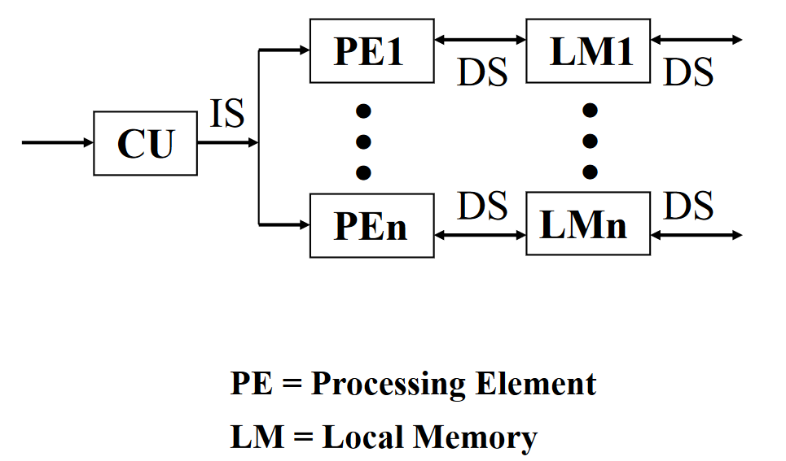
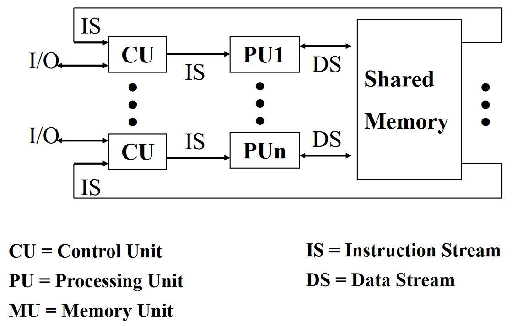
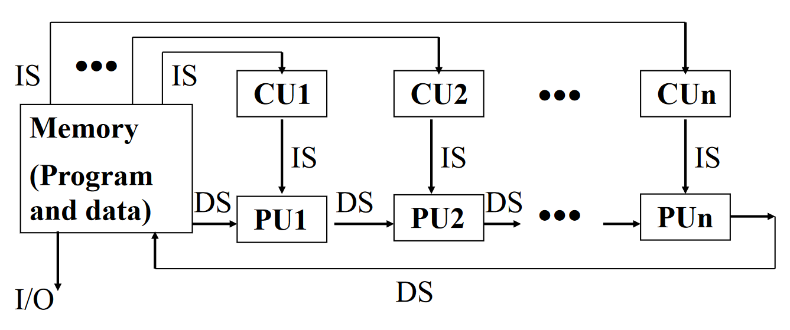

# 计算机体系结构笔记

期末考试开卷，但是是英文试卷，平时50%，期末50%

## Chapter 1. 计算机体系结构的基本原理

### 多级层次结构

计算机体系结构是程序员所看到的计算机的属性即概念性结构与功能特性；

* 具有相同计算机系统结构的计算机可以采用不同的计算机组织。例如相同的指令系统可以顺序执行，也可以重叠执行。
* 一种计算机组织可以采用不同的计算机实现。
* 随着计算机技术的迅速发展，计算机系统结构，组织和硬件之间的界限变得越来越模糊。

### 性能测量

待补充

### 量化设计准则

#### 大概率事件优先原则

对于大概率事件（最常见的事件），赋予它优先的处理权和资源使用权，以获得全局的最优结果。

#### 阿姆达尔定律

加快某部件执行速度所获得的系统性能提高（加速比）与该部件在系统中的总执行时间的比例有关。

​										 	**$系统加速比 = \frac{改进后系统性能}{改进前系统性能} = \frac{改进前总执行时间}{改进后总执行时间}$** 

- 下图的 $Fraction_{enhanced}$（简写 $F_e$）是**可改进比例**，指可改进部分在原系统执行时间中所占的比例； 
- $Speedup_{enhanced}$（简写 $S_e$）是**部件加速比**，指可改进部分改进后的性能提高； 
- 阿姆达尔定律表示为 $S_{overall} = \frac{T0}{Te} = \frac{1}{(1-Fe)+ \frac{Fe}{Se}}$ ； 

- 需要注意的是 Fe 是**时间比时间**的比例；

#### CPU性能方程 

计算机运行基于固定频率的时钟信号（clock periods, clocks, cycles, clock cycles），主频=1÷时钟周期，因此

$CPU时间 = 完成这一任务的时钟周期数 × 每个时钟周期时间$ 或  $CPU时间 = \frac{完成这一任务的时钟周期数}{主频}$ 

常用方程

CPU 时间 = 指令条数(IC, Instruction Count) × 每条指令时钟周期数(CPI, Cycles Per Instruction) × 每个时钟周期时间(CC, Clock cycle time) 

#### 访问的局部性原理

程序倾向于重用刚用过的数据和指令，90%的时间运行于10%的程序上
因此，可根据最近访问预测未来会用到哪些指令和数据。

程序局部性包括：

1. 程序的时间局部性：程序即将用到的信息很可能就是目前正在使用的信息。
2. 程序的空间局部性：程序即将用到的信息很可能与目前正在使用的信息在空间上相邻或者临近。

### 按指令集和数据流分类

单指令流单数据流 (SISD, single instruction stream over a single data stream) 

单指令流多数据流 (SIMD, single instruction stream over multiple data stream) 

多指令流多数据流 (MIMD, multiple instruction over multiple data streams) 

多指令流单数据流 (MISD, multiple instruction streams and a single data stream) 

