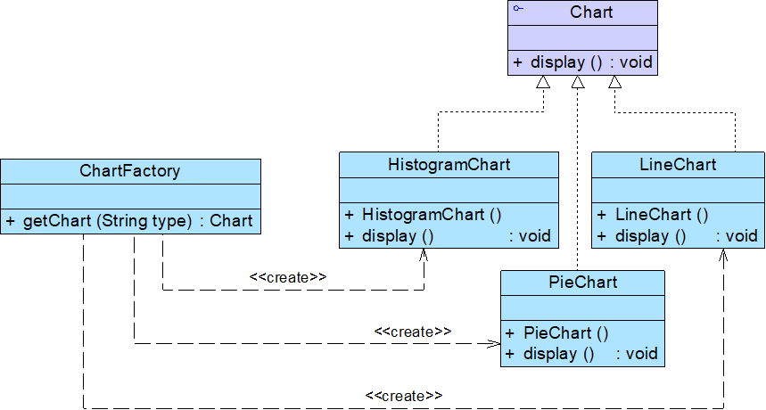
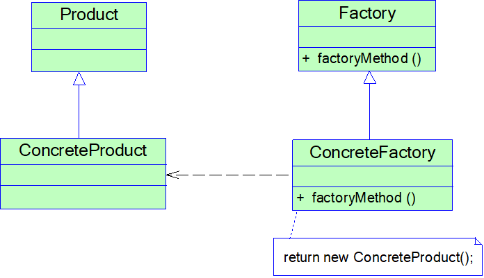
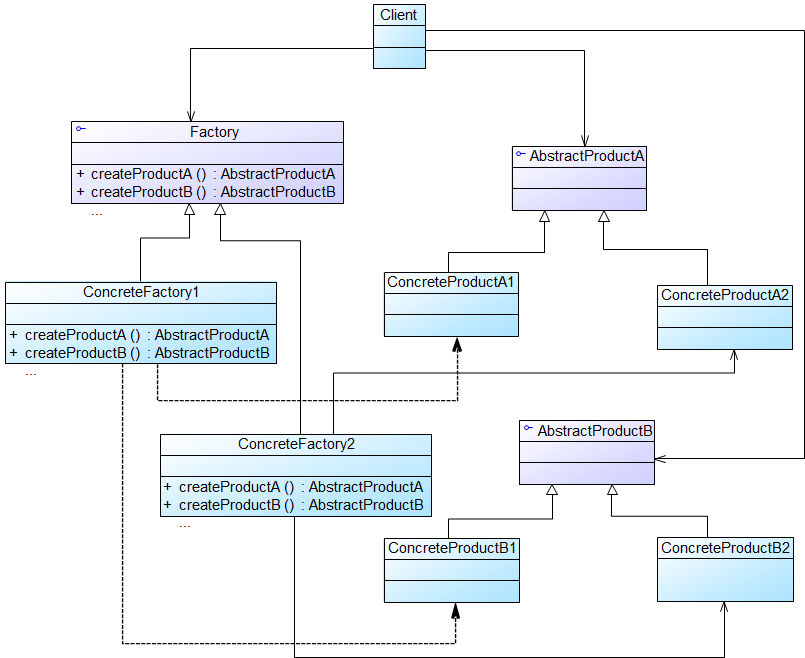

# 设计模式笔记

设计模式是在特定环境下为解决某一通用软件设计问题提供的一套定制的解决方案，该方案描述了对象和类之间的相互作用。


## 面向对象设计原则概述

|设计原则名称|定义|使用频率|
|------------------------------------------------------------|------------------------------------------------------------|------------|
|单一职责原则(SingleResponsibilityPrinciple, SRP)|一个对象应该只包含单一的职责，并且该职责被完整地封装在一个类中|★★★★☆|
|开闭原则(Open-ClosedPrinciple, OCP)|软件实体应当对扩展开放，对修改关闭|★★★★★|
|里氏代换原则(LiskovSubstitutionPrinciple, LSP)|所有引用基类的地方必须能透明地使用其子类的对象|★★★★★|
|依赖倒转原则(DependenceInversionPrinciple, DIP)|高层模块不应该依赖低层模块，它们都应该依赖抽象。抽象不应该依赖于细节，细节应该依赖于抽象|★★★★★|
|接口隔离原则(InterfaceSegregationPrinciple, ISP)|客户端不应该依赖那些它不需要的接口|★★☆☆☆|
|合成复用原则(CompositeReusePrinciple, CRP)|优先使用对象组合，而不是继承来达到复用的目的|★★★★☆|
|迪米特法则(LawofDemeter, LoD)|每一个软件单位对其他的单位都只有最少的知识，而且局限于那些与本单位密切相关的软件单位|★★★☆☆|


||创建型模式|结构型模式|行为型模式|
|---------------------|------------------------------------------------------------|------------------------------------------------------------|------------------------------------------------------------|
|类模式|工厂方法模式|（类）适配器模式|解释器模式<br/>模板方法模式|
|对象模式|抽象工厂模式<br>建造者模式<br/>原型模式<br/>单例模式|（对象）适配器模式<br/>桥接模式<br/>组合模式<br/>装饰模式<br/>外观模式<br/>享元模式<br/>代理模式|职责链模式<br/>命令模式<br/>迭代器模式<br/>中介者模式<br/>备忘录模式<br/>观察者模式<br/>状态模式<br/>策略模式<br/>访问者模式|


## 创建型模式(Creational Pattern)

- 关注对象的创建过程
- 创建型模式对类的实例化过程进行了抽象，能够将软件模块中对象的创建和对象的使用分离，对用户隐藏了类的实例的创建细节
- 创建型模式描述如何将对象的创建和使用分离，让用户在使用对象时无须关心对象的创建细节，从而降低系统的耦合度，让设计方案更易于修改和扩展

|名称|定义|难度|频率|
|------------------------------------------------|------------------------------------------------------------|-----|-----|
|简单工厂模式(SimpleFactoryPattern)|定义一个工厂类，它可以根据参数的不同返回不同类的实例，被创建的实例通常都具有共同的父类。|★★☆☆☆|★★★☆☆|
|工厂方法模式(FactoryMethodPattern)|定义一个用于创建对象的接口，但是让子类决定将哪一个类实例化。工厂方法模式让一个类的实例化延迟到其子类。|★★☆☆☆|★★★★★|
|抽象工厂模式(AbstractFactoryPattern)|提供一个创建一系列相关或相互依赖对象的接口，而无须指定它们具体的类。|★★★★☆|★★★★★|
|建造者模式(BuilderPattern)|将一个复杂对象的构建与它的表示分离，使得同样的构建过程可以创建不同的表示。|★★★★☆|★★☆☆☆|
|原型模式(PrototypePattern)|使用原型实例指定待创建对象的类型，并且通过复制这个原型来创建新的对象。|★★★☆☆|★★★☆☆|
|单例模式(SingletonPattern)|确保一个类只有一个实例，并提供一个全局访问点来访问这个唯一实例。|★☆☆☆☆|★★★★☆|


### 简单工厂模式

在简单工厂模式中用于创建实例的方法通常是静态(static)方法，因此又被称为静态工厂方法(Static Factory Method)模式
要点：如果需要什么，只需要传入一个正确的参数，就可以获取所需要的对象，而无须知道其创建细节



#### 模式优点

- 实现了对象创建和使用的分离
- 客户端无须知道所创建的具体产品类的类名，只需要知道具体产品类所对应的参数即可
- 通过引入配置文件，可以在不修改任何客户端代码的情况下更换和增加新的具体产品类，在一定程度上提高了系统的灵活性

#### 模式缺点

- 工厂类集中了所有产品的创建逻辑，职责过重，一旦不能正常工作，整个系统都要受到影响
- 增加系统中类的个数（引入了新的工厂类），增加了系统的复杂度和理解难度
- 系统扩展困难，一旦添加新产品不得不修改工厂逻辑
- 由于使用了静态工厂方法，造成工厂角色无法形成基于继承的等级结构，工厂类不能得到很好地扩展


### 工厂模式

简称为工厂模式(Factory Pattern)，又可称作虚拟构造器模式(Virtual Constructor Pattern)或多态工厂模式(Polymorphic Factory Pattern)

工厂父类负责定义创建产品对象的公共接口，而工厂子类则负责生成具体的产品对象

目的是将产品类的实例化操作延迟到工厂子类中完成，通过工厂子类来确定究竟应该实例化哪一个具体产品类



客户端代码

```java
Factory factory = new ConcreteFactory(); 	// 可通过配置文件和反射机制实现
Product product = factory.factoryMethod();	// 注意指针都是基类的指针
```

#### 模式优点

- 工厂方法用来创建客户所需要的产品，同时还向客户隐藏了哪种具体产品类将被实例化这一细节
- 能够让工厂自主确定创建何种产品对象，而如何创建这个对象的细节则完全封装在具体工厂内部
- 在系统中加入新产品时，完全符合开闭原则

#### 模式缺点

- 系统中类的个数将成对增加，在一定程度上增加了系统的复杂度，会给系统带来一些额外的开销
- 增加了系统的抽象性和理解难度
- 适用环境
- 客户端不知道它所需要的对象的类（客户端不需要知道具体产品类的类名，只需要知道所对应的工厂即可，具体产品对象由具体工厂类创建）
- 抽象工厂类通过其子类来指定创建哪个对象


> ### 补充：Java 反射
>
> ```java
> //通过类名生成实例对象并将其返回
> Class c=Class.forName(“java.lang.String");
> Object obj=c.newInstance();
> return obj;
> ```
>
> 相当于新建了一个 String 实例


### 抽象工厂模式

又称为工具(Kit)模式

区别于工厂模式，抽象工厂模式中的具体工厂不只是创建一种产品，它负责创建一族产品

当一个工厂等级结构可以创建出分属于不同产品等级结构的一个产品族中的所有对象时，抽象工厂模式比工厂方法模式更为简单、更有效率



#### 开闭原则的倾斜

- 增加产品族：对于增加新的产品族，抽象工厂模式很好地支持了开闭原则，只需要增加具体产品并对应增加一个新的具体工厂，对已有代码无须做任何修改
- 增加新的产品等级结构：对于增加新的产品等级结构，需要修改所有的工厂角色，包括抽象工厂类，在所有的工厂类中都需要增加生产新产品的方法，违背了开闭原则

#### 模式优点

- 隔离了具体类的生成，使得客户端并不需要知道什么被创建
- 当一个产品族中的多个对象被设计成一起工作时，它能够保证客户端始终只使用同一个产品族中的对象
  增加新的产品族很方便，无须修改已有系统，符合开闭原则

#### 模式缺点

- 增加新的产品等级结构麻烦，需要对原有系统进行较大的修改，甚至需要修改抽象层代码，这显然会带来较大的不便，违背了开闭原则
