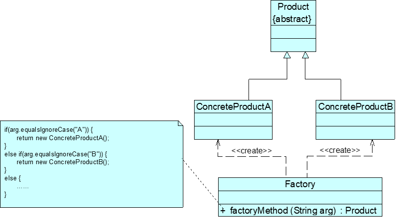

# 设计模式笔记

设计模式是在特定环境下为解决某一通用软件设计问题提供的一套定制的解决方案，该方案描述了对象和类之间的相互作用。

||创建型模式|结构型模式|行为型模式|
|---------------------|------------------------------------------------------------|------------------------------------------------------------|------------------------------------------------------------|
|类模式|工厂方法模式|（类）适配器模式|解释器模式 模板方法模式|
|对象模式|抽象工厂模式 建造者模式 原型模式 单例模式|（对象）适配器模式 桥接模式 组合模式 装饰模式 外观模式 享元模式 代理模式|职责链模式 命令模式 迭代器模式 中介者模式 备忘录模式 观察者模式 状态模式 策略模式 访问者模式|

## 创建型模式(Creational Pattern)

- 关注对象的创建过程
- 创建型模式对类的实例化过程进行了抽象，能够将软件模块中对象的创建和对象的使用分离，对用户隐藏了类的实例的创建细节
- 创建型模式描述如何将对象的创建和使用分离，让用户在使用对象时无须关心对象的创建细节，从而降低系统的耦合度，让设计方案更易于修改和扩展

|名称|定义|难度|频率|
|------------------------------------------------|------------------------------------------------------------|-----|-----|
|简单工厂模式(SimpleFactoryPattern)|定义一个工厂类，它可以根据参数的不同返回不同类的实例，被创建的实例通常都具有共同的父类。|★★☆☆☆|★★★☆☆|
|工厂方法模式(FactoryMethodPattern)|定义一个用于创建对象的接口，但是让子类决定将哪一个类实例化。工厂方法模式让一个类的实例化延迟到其子类。|★★☆☆☆|★★★★★|
|抽象工厂模式(AbstractFactoryPattern)|提供一个创建一系列相关或相互依赖对象的接口，而无须指定它们具体的类。|★★★★☆|★★★★★|
|建造者模式(BuilderPattern)|将一个复杂对象的构建与它的表示分离，使得同样的构建过程可以创建不同的表示。|★★★★☆|★★☆☆☆|
|原型模式(PrototypePattern)|使用原型实例指定待创建对象的类型，并且通过复制这个原型来创建新的对象。|★★★☆☆|★★★☆☆|
|单例模式(SingletonPattern)|确保一个类只有一个实例，并提供一个全局访问点来访问这个唯一实例。|★☆☆☆☆|★★★★☆|

### 简单工厂模式

