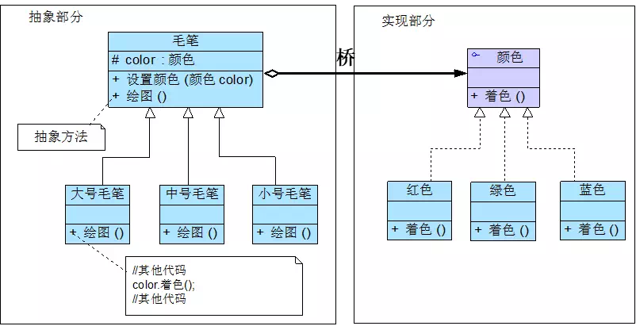
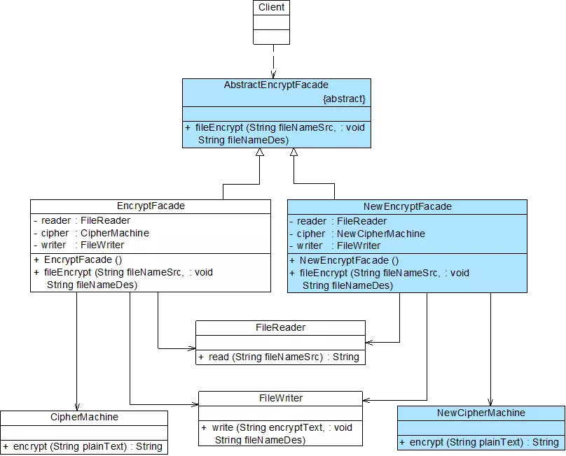
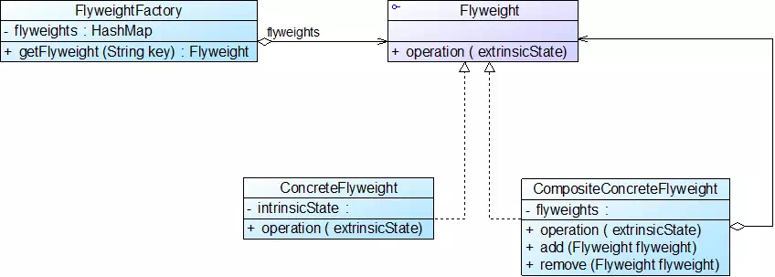

# 设计模式笔记

设计模式是在特定环境下为解决某一通用软件设计问题提供的一套定制的解决方案，该方案描述了对象和类之间的相互作用。

## 面向对象设计原则概述

| 设计原则名称                                     | 定义                                                         | 使用频率 |
| ------------------------------------------------ | ------------------------------------------------------------ | -------- |
| 单一职责原则(SingleResponsibilityPrinciple, SRP) | 一个对象应该只包含单一的职责，并且该职责被完整地封装在一个类中 | ★★★★☆    |
| 开闭原则(Open-ClosedPrinciple, OCP)              | 软件实体应当对扩展开放，对修改关闭                           | ★★★★★    |
| 里氏代换原则(LiskovSubstitutionPrinciple, LSP)   | 所有引用基类的地方必须能透明地使用其子类的对象               | ★★★★★    |
| 依赖倒转原则(DependenceInversionPrinciple, DIP)  | 高层模块不应该依赖低层模块，它们都应该依赖抽象。抽象不应该依赖于细节，细节应该依赖于抽象 | ★★★★★    |
| 接口隔离原则(InterfaceSegregationPrinciple, ISP) | 客户端不应该依赖那些它不需要的接口                           | ★★☆☆☆    |
| 合成复用原则(CompositeReusePrinciple, CRP)       | 优先使用对象组合，而不是继承来达到复用的目的                 | ★★★★☆    |
| 迪米特法则(LawofDemeter, LoD)                    | 每一个软件单位对其他的单位都只有最少的知识，而且局限于那些与本单位密切相关的软件单位 | ★★★☆☆    |

按行为给设计模式分类：

|          | 创建型模式                                           | 结构型模式                                                   | 行为型模式                                                   |
| -------- | ---------------------------------------------------- | ------------------------------------------------------------ | ------------------------------------------------------------ |
| 类模式   | 工厂方法模式                                         | （类）适配器模式                                             | 解释器模式<br/>模板方法模式                                  |
| 对象模式 | 抽象工厂模式<br>建造者模式<br/>原型模式<br/>单例模式 | （对象）适配器模式<br/>桥接模式<br/>组合模式<br/>装饰模式<br/>外观模式<br/>享元模式<br/>代理模式 | 职责链模式<br/>命令模式<br/>迭代器模式<br/>中介者模式<br/>备忘录模式<br/>观察者模式<br/>状态模式<br/>策略模式<br/>访问者模式 |

## 创建型模式

- 关注对象的创建过程
- 创建型模式对类的实例化过程进行了抽象，能够将软件模块中对象的创建和对象的使用分离，对用户隐藏了类的实例的创建细节
- 创建型模式描述如何将对象的创建和使用分离，让用户在使用对象时无须关心对象的创建细节，从而降低系统的耦合度，让设计方案更易于修改和扩展

| 名称                                 | 定义                                                         | 难度  | 频率  |
| ------------------------------------ | ------------------------------------------------------------ | ----- | ----- |
| 简单工厂模式(SimpleFactoryPattern)   | 定义一个工厂类，它可以根据参数的不同返回不同类的实例，被创建的实例通常都具有共同的父类。 | ★★☆☆☆ | ★★★☆☆ |
| 工厂方法模式(FactoryMethodPattern)   | 定义一个用于创建对象的接口，但是让子类决定将哪一个类实例化。工厂方法模式让一个类的实例化延迟到其子类。 | ★★☆☆☆ | ★★★★★ |
| 抽象工厂模式(AbstractFactoryPattern) | 提供一个创建一系列相关或相互依赖对象的接口，而无须指定它们具体的类。 | ★★★★☆ | ★★★★★ |
| 建造者模式(BuilderPattern)           | 将一个复杂对象的构建与它的表示分离，使得同样的构建过程可以创建不同的表示。 | ★★★★☆ | ★★☆☆☆ |
| 原型模式(PrototypePattern)           | 使用原型实例指定待创建对象的类型，并且通过复制这个原型来创建新的对象。 | ★★★☆☆ | ★★★☆☆ |
| 单例模式(SingletonPattern)           | 确保一个类只有一个实例，并提供一个全局访问点来访问这个唯一实例。 | ★☆☆☆☆ | ★★★★☆ |

### 简单工厂模式

在简单工厂模式中用于创建实例的方法通常是静态(static)方法，因此又被称为静态工厂方法(Static Factory Method)模式
要点：如果需要什么，只需要传入一个正确的参数，就可以获取所需要的对象，而无须知道其创建细节


#### 模式优点

- 实现了对象创建和使用的分离
- 客户端无须知道所创建的具体产品类的类名，只需要知道具体产品类所对应的参数即可
- 通过引入配置文件，可以在不修改任何客户端代码的情况下更换和增加新的具体产品类，在一定程度上提高了系统的灵活性

#### 模式缺点

- 工厂类集中了所有产品的创建逻辑，职责过重，一旦不能正常工作，整个系统都要受到影响
- 增加系统中类的个数（引入了新的工厂类），增加了系统的复杂度和理解难度
- 系统扩展困难，一旦添加新产品不得不修改工厂逻辑
- 由于使用了静态工厂方法，造成工厂角色无法形成基于继承的等级结构，工厂类不能得到很好地扩展

### 工厂模式

简称为工厂模式(Factory Pattern)，又可称作虚拟构造器模式(Virtual Constructor Pattern)或多态工厂模式(Polymorphic Factory Pattern)

工厂父类负责定义创建产品对象的公共接口，而工厂子类则负责生成具体的产品对象

目的是将产品类的实例化操作延迟到工厂子类中完成，通过工厂子类来确定究竟应该实例化哪一个具体产品类


客户端代码

```java
Factory factory = new ConcreteFactory();     // 可通过配置文件和反射机制实现
Product product = factory.factoryMethod();    // 注意指针都是基类的指针
```

#### 模式优点

- 工厂方法用来创建客户所需要的产品，同时还向客户隐藏了哪种具体产品类将被实例化这一细节
- 能够让工厂自主确定创建何种产品对象，而如何创建这个对象的细节则完全封装在具体工厂内部
- 在系统中加入新产品时，完全符合开闭原则

#### 模式缺点

- 系统中类的个数将成对增加，在一定程度上增加了系统的复杂度，会给系统带来一些额外的开销
- 增加了系统的抽象性和理解难度
- 适用环境
- 客户端不知道它所需要的对象的类（客户端不需要知道具体产品类的类名，只需要知道所对应的工厂即可，具体产品对象由具体工厂类创建）
- 抽象工厂类通过其子类来指定创建哪个对象

> ### 补充：Java 反射
>
> ```java
> //通过类名生成实例对象并将其返回
> Class c=Class.forName(“java.lang.String");
> Object obj=c.newInstance();
> return obj;
> ```
>
> 相当于新建了一个 String 实例

### 抽象工厂模式

又称为工具(Kit)模式

区别于工厂模式，抽象工厂模式中的具体工厂不只是创建一种产品，它负责创建一族产品

当一个工厂等级结构可以创建出分属于不同产品等级结构的一个产品族中的所有对象时，抽象工厂模式比工厂方法模式更为简单、更有效率


#### 开闭原则的倾斜

- 增加产品族：对于增加新的产品族，抽象工厂模式很好地支持了开闭原则，只需要增加具体产品并对应增加一个新的具体工厂，对已有代码无须做任何修改
- 增加新的产品等级结构：对于增加新的产品等级结构，需要修改所有的工厂角色，包括抽象工厂类，在所有的工厂类中都需要增加生产新产品的方法，违背了开闭原则

#### 模式优点

- 隔离了具体类的生成，使得客户端并不需要知道什么被创建
- 当一个产品族中的多个对象被设计成一起工作时，它能够保证客户端始终只使用同一个产品族中的对象
  增加新的产品族很方便，无须修改已有系统，符合开闭原则

#### 模式缺点

- 增加新的产品等级结构麻烦，需要对原有系统进行较大的修改，甚至需要修改抽象层代码，这显然会带来较大的不便，违背了开闭原则

### 建造者模式


```java
Builder b = new ConcreteBuilder();
Director d = new Director(b);
Product p = d.construct();
```

#### 模式优点

- 客户端不必知道产品内部组成的细节，将产品本身与产品的创建过程解耦，使得相同的创建过程可以创建不同的产品对象
- 每一个具体建造者都相对独立，与其他的具体建造者无关，因此可以很方便地替换具体建造者或增加新的具体建造者，扩展方便，符合开闭原则
- 可以更加精细地控制产品的创建过程

#### 模式缺点

- 建造者模式所创建的产品一般具有较多的共同点，其组成部分相似，如果产品之间的差异性很大，不适合使用建造者模式，因此其使用范围受到一定的限制
- 如果产品的内部变化复杂，可能会需要定义很多具体建造者类来实现这种变化，导致系统变得很庞大，增加了系统的理解难度和运行成本

### 原型模式


#### 模式适用环境

- 创建新对象成本较大，新对象可以通过复制已有对象来获得，如果是相似对象，则可以对其成员变量稍作修改
- 系统要保存对象的状态，而对象的状态变化很小
- 需要避免使用分层次的工厂类来创建分层次的对象
- Ctrl + C + Ctrl + V

#### 模式优点

- 简化对象的创建过程，通过复制一个已有实例可以提高新实例的创建效率
- 扩展性较好
- 提供了简化的创建结构，原型模式中产品的复制是通过封装在原型类中的克隆方法实现的，无须专门的工厂类来创建产品
- 可以使用深克隆的方式保存对象的状态，以便在需要的时候使用，可辅助实现撤销操作

#### 模式缺点

- 需要为每一个类配备一个克隆方法，而且该克隆方法位于一个类的内部，当对已有的类进行改造时，需要修改源代码，违背了开闭原则
- 在实现深克隆时需要编写较为复杂的代码，而且当对象之间存在多重的嵌套引用时，为了实现深克隆，每一层对象对应的类都必须支持深克隆，实现起来可能会比较麻烦

### 单例模式


确保一个类**只有一个实例**，并提供一个**全局访问点**来访问这个唯一实例。

如何保证？

1. 全局变量：可以确保对象随时都可以被访问，但不能防止创建多个对象
2. 让类自身负责创建和保存它的唯一实例，并保证不能创建其他实例，它还提供一个访问该实例的方法

```java
public class Singleton {
    private static Singleton instance=null;  // 静态私有成员变量

    // 私有构造函数
    private Singleton() {    
        // ...
    }

    // 静态公有工厂方法，返回唯一实例
    public static Singleton getInstance() {
        if(instance==null)
            instance=new Singleton();    
        return instance;
    }
}

// 客户端调用，从外部不能调用它的构造函数
Singleton s = Singleton.getInstance();
```

#### 饿汉式单例与懒汉式单例

```java
// 饿汉式，一开始就初始化
public class EagerSingleton { 
    private static final EagerSingleton instance = new EagerSingleton(); 
    private EagerSingleton() { } 
 
    public static EagerSingleton getInstance() {
        return instance; 
    }
}

// 懒汉式，用到的时候才初始化，但线程不安全需要加锁
public class LazySingleton { 
    private static LazySingleton instance = null; 
    private LazySingleton() { } 
    public static LazySingleton getInstance() { 
        if (instance == null) {
            instance = new LazySingleton(); 
        }
        return instance; 
    }
}

// 加锁的懒汉式
public class LazySingleton { 
    private volatile static LazySingleton instance = null; 
    private LazySingleton() { } 
    public static LazySingleton getInstance() { 
        // 第一重判断
        if (instance == null) {
            // 锁定代码块
            synchronized (LazySingleton.class) {
                // 第二重判断
                if (instance == null) {
                    instance = new LazySingleton(); //创建单例实例
                }
            }
        }
        return instance; 
    }
}
```

#### 模式优点

- 提供了对唯一实例的受控访问
- 可以节约系统资源，提高系统的性能
- 允许可变数目的实例（多例类）

#### 模式缺点

- 扩展困难（缺少抽象层）
- 单例类的职责过重
- 由于自动垃圾回收机制，可能会导致共享的单例对象的状态丢失

## 结构型模式

### 适配器模式


#### 模式优点

* 将目标类和适配者类解耦，通过引入一个适配器类来重用现有的适配者类，无须修改原有结构

* 增加了类的透明性和复用性，提高了适配者的复用性，同一个适配者类可以在多个不同的系统中复用

* 灵活性和扩展性非常好

  * 类适配器模式：置换一些适配者的方法很方便

  * 对象适配器模式：可以把多个不同的适配者适配到同一个目标，还可以适配一个适配者的子类

#### 模式缺点

* 类适配器模式：

  * 一次最多只能适配一个适配者类，不能同时适配多个适配者；

  * 适配者类不能为最终类；

  * 目标抽象类只能为接口，不能为类

* 对象适配器模式：在适配器中置换适配者类的某些方法比较麻烦

#### 模式适用环境

* 系统需要使用一些现有的类，而这些类的接口不符合系统的需要，甚至没有这些类的源代码
* 创建一个可以重复使用的类，用于和一些彼此之间没有太大关联的类，包括一些可能在将来引进的类一起工作

### 桥接模式



#### 模式优点

* 分离抽象接口及其实现部分

* 可以取代多层继承方案，极大地减少了子类的个数

* 提高了系统的可扩展性，在两个变化维度中任意扩展一个维度，不需要修改原有系统

* 符合开闭原则

#### 模式缺点

* 会增加系统的理解与设计难度，由于关联关系建立在抽象层，要求开发者一开始就针对抽象层进行设计与编程

* 正确识别出系统中两个独立变化的维度并不是一件容易的事情

#### 模式适用环境

* 需要在抽象化和具体化之间增加更多的灵活性，避免在两个层次之间建立静态的继承关系
* 抽象部分和实现部分可以以继承的方式独立扩展而互不影响
* 一个类存在两个（或多个）独立变化的维度，且这两个（或多个）维度都需要独立地进行扩展
* 不希望使用继承或因为多层继承导致系统类的个数急剧增加的系统

### 组合模式


#### 模式优点

* 可以清楚地定义分层次的复杂对象，表示对象的全部或部分层次，让客户端忽略了层次的差异，方便对整个层次结构进行控制
* 客户端可以一致地使用一个组合结构或其中单个对象，不必关心处理的是单个对象还是整个组合结构，简化了客户端代码
* 增加新的容器构件和叶子构件都很方便，符合开闭原则
* 为树形结构的面向对象实现提供了一种灵活的解决方案

#### 模式缺点

* 在增加新构件时很难对容器中的构件类型进行限制

#### 模式适用环境

* 在具有整体和部分的层次结构中，希望通过一种方式忽略整体与部分的差异，客户端可以一致地对待它们
* 在一个使用面向对象语言开发的系统中需要处理一个树形结构
* 在一个系统中能够分离出叶子对象和容器对象，而且它们的类型不固定，需要增加一些新的类型

### 装饰模式


#### 模式优点

- 对于扩展一个对象的功能，装饰模式比继承更加灵活，不会导致类的个数急剧增加

- 可以通过一种动态的方式来扩展一个对象的功能，通过配置文件可以在运行时选择不同的具体装饰类，从而实现不同的行为

- 可以对一个对象进行多次装饰

- 具体构件类与具体装饰类可以独立变化，用户可以根据需要增加新的具体构件类和具体装饰类，且原有类库代码无须改变，符合开闭原则

#### 模式缺点

- 使用装饰模式进行系统设计时将产生很多小对象，大量小对象的产生势必会占用更多的系统资源，在一定程度上影响程序的性能

- 比继承更加易于出错，排错也更困难，对于多次装饰的对象，调试时寻找错误可能需要逐级排查，较为烦琐

#### 模式适用环境

- 在不影响其他对象的情况下，以动态、透明的方式给单个对象添加职责

- 当不能采用继承的方式对系统进行扩展、或者采用继承不利于系统扩展和维护时，可以使用装饰模式

### 外观模式



#### 模式优点

* 它对客户端屏蔽了子系统组件，减少了客户端所需处理的对象数目，并使得子系统使用起来更加容易
* 它实现了子系统与客户端之间的松耦合关系，这使得子系统的变化不会影响到调用它的客户端，只需要调整外观类即可
* 一个子系统的修改对其他子系统没有任何影响，而且子系统的内部变化也不会影响到外观对象

#### 模式缺点

* 不能很好地限制客户端直接使用子系统类，如果对客户端访问子系统类做太多的限制则减少了可变性和灵活性
* 如果设计不当，增加新的子系统可能需要修改外观类的源代码，违背了开闭原则

#### 模式适用环境

* 要为访问一系列复杂的子系统提供一个简单入口
* 客户端程序与多个子系统之间存在很大的依赖性
* 在层次化结构中，可以使用外观模式的定义系统中每一层的入口，层与层之间不直接产生联系，而是通过外观类建立联系，降低层之间的耦合度

### 享元模式

避免系统中出现**大量相同或相似的对象**，同时又不影响客户端程序通过面向对象的方式对这些对象进行操作

1. 将具有相同内部状态的对象存储在享元池中，享元池中的对象是可以实现共享的
2. 需要的时候将对象从享元池中取出，即可实现对象的复用
3. 通过向取出的对象注入不同的外部状态，可以得到一系列相似的对象，而这些对象在内存中实际上只存储一份

复合享元模式：



#### 模式优点

- 可以减少内存中对象的数量，使得相同或者相似的对象在内存中只保存一份，从而可以节约系统资源，提高系统性能
- 外部状态相对独立，而且不会影响其内部状态，从而使得享元对象可以在不同的环境中被共享

#### 模式缺点

- 使得系统变得复杂，需要分离出内部状态和外部状态，这使得程序的逻辑复杂化
- 为了使对象可以共享，享元模式需要将享元对象的部分状态外部化，而读取外部状态将使得运行时间变长

#### 模式适用环境

- 一个系统有大量相同或者相似的对象，造成内存的大量耗费
- 对象的大部分状态都可以外部化，可以将这些外部状态传入对象中
- 在使用享元模式时需要维护一个存储享元对象的享元池，而这需要耗费一定的系统资源，因此，在需要多次重复使用享元对象时才值得使用享元模式

### 代理模式


#### 模式优点——逐个分析

- 远程代理：可以将一些消耗资源较多的对象和操作移至性能更好的计算机上，提高了系统的整体运行效率
- 虚拟代理：通过一个消耗资源较少的对象来代表一个消耗资源较多的对象，可以在一定程度上节省系统的运行开销
- 缓冲代理：为某一个操作的结果提供临时的缓存存储空间，以便在后续使用中能够共享这些结果，优化系统性能，缩短执行时间
- 保护代理：可以控制对一个对象的访问权限，为不同用户提供不同级别的使用权限

#### 模式缺点

- 由于在客户端和真实主题之间增加了代理对象，因此有些类型的代理模式可能会造成请求的处理速度变慢（例如保护代理）

- 实现代理模式需要额外的工作，而且有些代理模式的实现过程较为复杂（例如远程代理）

#### 模式适用环境

- 当客户端对象需要访问远程主机中的对象时可以使用远程代理
- 当需要用一个消耗资源较少的对象来代表一个消耗资源较多的对象，从而降低系统开销、缩短运行时间时可以使用虚拟代理
- 当需要为某一个被频繁访问的操作结果提供一个临时存储空间，以供多个客户端共享访问这些结果时可以使用缓冲代理
- 当需要控制对一个对象的访问，为不同用户提供不同级别的访问权限时可以使用保护代理
- 当需要为一个对象的访问（引用）提供一些额外的操作时可以使用智能引用代理

## 行为型模式

### 职责链模式


#### 模式优点

- 使得一个对象无须知道是其他哪一个对象处理其请求，降低了系统的耦合度
- 可简化对象之间的相互连接
- 给对象职责的分配带来更多的灵活性
- 增加一个新的具体请求处理者时无须修改原有系统的代码，只需要在客户端重新建链即可

#### 模式缺点

- 不能保证请求一定会被处理
- 对于比较长的职责链，系统性能将受到一定影响，在进行代码调试时不太方便
- 如果建链不当，可能会造成循环调用，将导致系统陷入死循环

#### 模式适用环境

- 有多个对象可以处理同一个请求，具体哪个对象处理该请求待运行时刻再确定
- 在不明确指定接收者的情况下，向多个对象中的一个提交一个请求
- 可动态指定一组对象处理请求

### 命令模式


#### 模式优点

- 降低系统的耦合度
- 新的命令可以很容易地加入到系统中，符合开闭原则
- 可以比较容易地设计一个命令队列或宏命令（组合命令）
- 为请求的撤销(Undo)和恢复(Redo)操作提供了一种设计和实现方案

#### 模式缺点

- 使用命令模式可能会导致某些系统有过多的具体命令类（针对每一个对请求接收者的调用操作都需要设计一个具体命令类）

#### 模式适用环境

- 系统需要将请求调用者和请求接收者解耦，使得调用者和接收者不直接交互
- 系统需要在不同的时间指定请求、将请求排队和执行请求
- 系统需要支持命令的撤销(Undo)操作和恢复(Redo)操作
- 系统需要将一组操作组合在一起形成宏命令

### 解释器模式


#### 模式优点

- 易于改变和扩展文法
- 可以方便地实现一个简单的语言
- 实现文法较为容易（有自动生成工具）
- 增加新的解释表达式较为方便

#### 模式缺点

- 对于复杂文法难以维护
- 执行效率较低

#### 模式适用环境

- 可以将一个需要解释执行的语言中的句子表示为一棵抽象语法树
- 一些重复出现的问题可以用一种简单的语言来进行表达
- 一个语言的文法较为简单
- 执行效率不是关键问题

### 迭代器模式

访问一个聚合对象中的元素但又不需要暴露它的内部结构


#### 模式优点

- 支持以不同的方式遍历一个聚合对象，在同一个聚合对象上可以定义多种遍历方式
- 简化了聚合类
- 由于引入了抽象层，增加新的聚合类和迭代器类都很方便，无须修改原有代码，符合开闭原则

#### 模式缺点

- 在增加新的聚合类时需要对应地增加新的迭代器类，类的个数成对增加，这在一定程度上增加了系统的复杂性
- 抽象迭代器的设计难度较大，需要充分考虑到系统将来的扩展。在自定义迭代器时，创建一个考虑全面的抽象迭代器并不是一件很容易的事情

#### 模式适用环境

- 访问一个聚合对象的内容而无须暴露它的内部表示
- 需要为一个聚合对象提供多种遍历方式
- 为遍历不同的聚合结构提供一个统一的接口，在该接口的实现类中为不同的聚合结构提供不同的遍历方式，而客户端可以一致性地操作该接口

### 中介者模式


#### 模式优点

- 简化了对象之间的交互，它用中介者和同事的一对多交互代替了原来同事之间的多对多交互，将原本难以理解的网状结构转换成相对简单的星型结构
- 可将各同事对象解耦
- 可以减少子类生成，中介者模式将原本分布于多个对象间的行为集中在一起，改变这些行为只需生成新的中介者子类即可，这使得各个同事类可被重用，无须直接对同事类进行扩展

#### 模式缺点

- 在具体中介者类中包含了大量的同事之间的交互细节，可能会导致具体中介者类非常复杂，使得系统难以维护

#### 模式适用环境

- 系统中对象之间存在复杂的引用关系，系统结构混乱且难以理解
- 一个对象由于引用了其他很多对象并且直接和这些对象通信，导致难以复用该对象
- 想通过一个中间类来封装多个类中的行为，又不想生成太多的子类

### 观察者模式


软件系统：一个对象的状态或行为的变化将导致其他对象的状态或行为也发生改变，它们之间将产生联动

观察者模式：定义了对象之间一种一对多的依赖关系，让一个对象的改变能够影响其他对象
发生改变的对象称为观察目标，被通知的对象称为观察者
一个观察目标可以对应多个观察者

#### MVC(Model-View-Controller)架构

- 模型(Model)，视图(View)和控制器(Controller)
- 模型可对应于观察者模式中的观察目标，而视图对应于观察者，控制器可充当两者之间的中介者
- 当模型层的数据发生改变时，视图层将自动改变其显示内容

#### 模式优点

- 可以实现表示层和数据逻辑层的分离
- 在观察目标和观察者之间建立一个抽象的耦合
- 支持广播通信，简化了一对多系统设计的难度
- 符合开闭原则，增加新的具体观察者无须修改原有系统代码，在具体观察者与观察目标之间不存在关联关系的情况下，增加新的观察目标也很方便

#### 模式缺点

- 将所有的观察者都通知到会花费很多时间
- 如果存在循环依赖时可能导致系统崩溃
- 没有相应的机制让观察者知道所观察的目标对象是怎么发生变化的，而只是知道观察目标发生了变化

#### 模式适用环境

- 一个抽象模型有两个方面，其中一个方面依赖于另一个方面，将这两个方面封装在独立的对象中使它们可以各自独立地改变和复用
- 一个对象的改变将导致一个或多个其他对象发生改变，且并不知道具体有多少对象将发生改变，也不知道这些对象是谁
- 需要在系统中创建一个触发链

